__华润水泥（封开）有限公司大旺塘矿山地下水治理专项水文地质勘察报告__

____

__华润水泥（封开）有限公司大旺塘矿山地下水治理专项水文地质勘察报告__

工程编号：K062601

勘察阶段：专项勘察

__项目负责人__

__：__

林科龙

__报告编写组__

__：__

董东、李腾、陈彩红、吉晋锋、华国强、张正、任国帅、张言、徐量

__审核人__

__：__

尹太闯

__审定人__

__：__

李晓珍

__总工程师__

__：__

何世达

__法定代表人__

__：__

张祥明

中南勘察基础工程有限公司

2026年 4月

__目录__

[第一章 绪论	1](#_Toc9699)

[第一节 目的任务	1](#_Toc31844)

[第二节 矿业权设置	5](#_Toc22701)

[第三节 以往工作评述	11](#_Toc10912)

[第四节 本次工作概况	14](#_Toc11730)

[第二章 区域概况	23](#_Toc28876)

[第一节 地理位置	23](#_Toc23323)

[第二节 地形地貌	24](#_Toc30636)

[第三节 气象水文	25](#_Toc28656)

[第四节 区域地质	27](#_Toc15341)

[第五节 区域水文地质	32](#_Toc7565)

[第三章 水文地质勘探工作	36](#_Toc15382)

[第一节 水文地质调查	36](#_Toc6572)

[第二节 水文地质物探	40](#_Toc2822)

[第三节 水文地质钻探	73](#_Toc14230)

[第四节 水文地质试验	83](#_Toc4923)

[第五节 水文地球化学及同位素分析	110](#_Toc29378)

[第四章 矿区水文地质条件	124](#_Toc31095)

[第一节 矿区地质	124](#_Toc16235)

[第二节 矿区水文地质	131](#_Toc16775)

[第三节 矿区充水条件分析	176](#_Toc22717)

[第四节 矿区水文地质勘查类型	178](#_Toc11822)

[第五章 矿段涌突水影响因素评价	179](#_Toc16781)

[第一节 涌突水影响因素分析	179](#_Toc23946)

[第二节 含水层富水性评价与分区	182](#_Toc5050)

[第六章 矿坑涌水量预测	190](#_Toc28003)

[第一节 水文地质概念模型	190](#_Toc23464)

[第二节 水文地质比拟法预测矿坑涌水量	193](#_Toc3917)

[第三节 解析法预测矿坑涌水量	201](#_Toc26736)

[第四节 数值法预测矿坑涌水量	204](#_Toc29317)

[第五节 预测成果分析	215](#_Toc32443)

[第七章 工程地质与地质环境条件	217](#_Toc23014)

[第一节 工程地质条件	217](#_Toc2925)

[第二节 地质环境条件	231](#_Toc9844)

[第八章 矿区防治水建议	236](#_Toc7290)

[第一节 矿山防治水原则	236](#_Toc9034)

[第二节 矿山防治水措施	237](#_Toc22946)

[第九章 矿区水资源综合利用及供水建议	239](#_Toc1520)

[第一节 水资源综合利用	239](#_Toc17393)

[第二节 供水建议	241](#_Toc28259)

[第十章 结论与建议	243](#_Toc31266)

[第一节 勘查类型	243](#_Toc19538)

[第二节 主要成果	244](#_Toc29033)

[第三节 存在问题	247](#_Toc31586)

[第四节 下步建议	248](#_Toc19751)

# 绪论

## 目的任务

### 项目来源

华润水泥（封开）有限公司，成立于2007年，为华润建材科技旗下规模最大的生产基地，入选国家级绿色工厂，产品主要覆盖粤港澳大湾区及华南市场。

大旺塘矿山位于封开县河儿口镇，2010年由华润水泥（封开）有限公司（简称“华润封开公司”）经招拍挂竞得，次年取得采矿许可证后进入开采阶段，目前采场最低开采标高\+50m。2025年，根据合理开发利用需要，考虑周边环境影响，大旺塘矿区经过分割保留调整后，新设立采矿权并挂牌出让，华润封开公司中标。新矿权设计采场最低标高为\+5m，低于当地最低侵蚀基准面，未来开采过程中\+65m至\+5m段属于凹陷型开采，其矿床开采技术条件与山坡露天开采存在差异，特别是在矿区地下水防治工作领域。

为了保障矿山开采条件及开采安全，保护利用矿区水资源，华润封开公司拟进行大旺塘矿山地下水治理专项工作，特设立“大旺塘矿山地下水治理专项水文地质勘察及治理方案初步设计服务”项目。经招标确定，中南勘察基础工程有限公司负责承担该项目实施工作。

### 目的任务

主要目的：详细查明矿区\+50m至\+5m标高范围内的水文地质条件，重点查明岩溶发育特征、富水性、导水性及隔水层分布，评估地下水动力条件变化对岩溶结构的潜在影响。

同时，重点分析在矿床开拓过程中可能诱发岩溶塌陷、突涌水等地质灾害的水文地质与工程地质因素。旨在为矿床\+50至\+5m标高的矿坑防治水工作提供科学依据，并为有效防止岩溶塌陷、减少突涌水风险制定针对性防控措施。

主要任务：

（1）查明采区（约1200亩）开采影响范围内其地下水类型、埋藏分布、水质、流向、流速、补径排条件及动态变化、涌水通道，还需要查明涌水来源，预测矿山开采每个台段的涌水量，查明岩溶发育情况等特征，完成专项水文地质勘察报告。具体为矿区水文地质条件：矿区含水层、隔水层分布、厚度、岩性；溶洞、裂隙、管道、暗河位置、规模、连通性；地下水补给、径流、排泄条件。地下水动态与水位：各含水层地下水位埋深，水位标高；采场周边、边坡、底部地下水压力，水头高度；雨季、旱季水位变化，是否存在承压水。地表水与地下水水力关系、矿坑涌水量预测、环境地质与工程地质条件等内容。

（2）评估突水灾害危险性：对矿床水资源综合利用进行评价；提出含水层保护建议；预测可能出现的主要地质环境问题，提出防治措施。

（3）治理方案初步设计：完成专项勘查工作、取得成果之后提交地下水治理方案、措施建议，治理深度按超过矿山最低开采标高（\+5m台段）以下不小于10m控制，如钻孔、物探揭露溶洞深度超出最低开采标高以下10m时，设计帷幕深度应适当加深以满足治水效果；初步设计应能为后续治理招标工作提供具体工程量清单，同时满足后续治理施工勘察、治理设计与施工等招标要求，以及满足矿山安全设施设计及环境影响评价编制需求。

（4）在矿区开展物探测量工作，查明矿区内及开采边界附近断层、破碎带、溶洞等规模及其特征。

（5）开展水文地质工程地质钻探和抽水试验工作，进一步查明矿区\+5m标高以上主要含水层、含水构造带的水文地质特征，获取\+5m标高以上含水层的水文地质参数，为深部矿坑涌水量的估算提供依据。

（6）通过水样的采集和检测工作，进一步查明矿区深部地下水的水化学特征，为矿区水资源的综合利用提供依据。

（7）开展综合分析研究工作，编制提交《华润水泥（封开）有限公司大旺塘矿山地下水治理专项水文地质勘察报告》，为矿山整体安全设施设计提供依据。

### 工作依据

#### 法律法规

1. 《中华人民共和国矿产资源法》（2024年修订）；
2. 《地下水管理条例》（国务院令 第748号）；
3. 《地质灾害防治条例》（国务院令 第394号）；
4. 《中华人民共和国矿山安全法》（2009年修正）；
5. 《中共中央办公厅 国务院办公厅关于进一步加强矿山安全生产工作的意见》（国公〔2023〕26号）；
6. 《关于加强非煤矿山安全生产工作的指导意见》（矿安〔2022〕4号）；
7. 《国家矿山安全监察局关于进一步加强非煤矿山安全生产行政许可工作的通知》（矿安〔2024〕70号）。

#### 技术标准

1. 《矿区水文地质工程地质勘查规范》（GB/T 12719\-2021）；
2. 《固体矿产地质勘查规范总则》（GB/T 13908\-2020）；
3. 《矿区地下水含水层破坏危害程度评价规范》（GB/T 42362\-2023）；
4. 《工程勘察通用规范》（GB 55017\-2021）；
5. 《石灰石矿山工程勘察技术规范》（GB 50955\-2013）；
6. 《全球导航卫星系统（GNSS）测量规范》（GB/T 18314\-2024）；
7. 《供水水文地质勘察标准》（GB 50027\-2024）；
8. 《地表水环境质量标准》（GB 3838\-2002）；
9. 《地下水质量标准》（GB/T 14848\-2017）；
10. 《生活饮用水卫生标准》（GB 5749\-2022）
11. 《水文地质调查规范（1:50000）》（DZ/T 0282\-2024）；
12. 《物化探工程测量规范》（DZ/T 0153\-2014）；
13. 《地下水监测井建设规范》（DZ/T 0270\-2014）；
14. 《水文水井地质钻探规程》（DZ/T 0148\-2014）；
15. 《矿区地下水监测规范》（DZ/T 0388\-2021）；
16. 《矿坑涌水量预测计算规程》（DZ/T 0342\-2020）；
17. 《固体矿产地质勘查报告编写规范》（DZ/T 0033\-2020）；
18. 《水文地质调查图件编制规范 第1部分：水文地质图（1:50000）》（DZ/T 0329\-2019）；
19. 《水利水电工程钻探规程》（SL/T 291\-2020）；
20. 《地下水环境监测技术规范》（HJ 164\-2020）；
21. 《水质 样品的保存和管理技术规定》（HJ 493\-2009）。

#### 参考资料

1. 《广东省封开县河儿口镇大旺塘矿区水泥用石灰岩矿资源储量核实报告》（中国建筑材料工业地质勘查中心广东总队，2025年6月）；
2. 《广东省封开县河儿口镇大旺塘矿区水泥用石灰岩矿资源储量分割报告》（中国建筑材料工业地质勘查中心广东总队，2025年8月）；
3. 《广东省封开县河儿口镇大旺塘矿区水泥用石灰岩矿矿产资源开发利用方案》（中国建筑材料工业地质勘查中心广东总队，2025年9月）；
4. 《广东省封开县大旺塘矿区水泥用石灰岩矿资源储量核实报告（复核）》（中建材西南勘测设计有限公司，2025年11月）；
5. 其他相关资料。

## 矿业权设置

2009年5月5日封开华润矿业有限公司获得大旺塘石场的采矿权，面积0\.3344km2，开采深度由\+249米至\+80米标高，即华润水泥（封开）有限公司现有矿权证的东北部大旺塘矿段部分（拐点H~O）；之后2010年3月肇庆市国土资源局委托中建材广东总队对封开县河儿口镇石迳村石场开展水泥用石灰岩矿详查地质工作，勘查面积0\.571km2。

勘查深度\+287m~\+55m（标高），即华润水泥（封开）有限公司现有矿权证的南部石迳村矿段（拐点A~H，O~X），经过招、拍、挂，该矿权被华润水泥（封开）有限公司获得，当地国土部门为整合矿区达到合理开发和利用的目的，将相邻矿区原大旺塘石场和石迳村石场整合为大旺塘矿区，并新发采矿权证，至此华润水泥（封开）有限公司获得整合后河儿口镇大旺塘矿区采矿权（见下图1\.2\-1）。后经多次延续变更，2022年2月，华润水泥（封开）有限公司获得现持有采矿许可证，采矿许可证号C4412002022027100153126，采矿权人华润水泥（封开）有限公司，地址：广东省肇庆市封开县长岗镇长岗工业园，矿山名称：华润水泥（封开）有限公司广东省封开县河儿口镇大旺塘矿区水泥用石灰岩矿（以下简称“华润大旺塘矿”），经济类型：港澳台投资股份有限公司，开采矿种：水泥用石灰岩，开采方式：露天开采，生产规模为988万t/a，矿区面积：1\.0374km2，有效期限11年，自2022年2月9日至2033年2月9日。矿区范围由25个拐点组成，开采标高\+284\.20m至\+50m标高。矿区拐点见表1\.2\-1。

表1\.2\-1 华润大旺塘矿现持采矿许可证范围及拐点坐标

序号

2000国家大地坐标系

序号

2000国家大地坐标系

X

Y

X

Y

1

2604364\.36

37582301\.26

14

2603038\.36

37581729\.26

2

2604288\.36

37582546\.26

15

2603119\.36

37581637\.26

3

2604114\.36

37582772\.26

16

2603116\.22

37581390\.97

4

2603962\.36

37582899\.26

17

2603207\.36

37581341\.26

5

2603770\.36

37582862\.26

18

2603478\.86

37581472\.26

6

2603756\.36

37582811\.26

19

2603666\.56

37581590\.16

7

2603622\.36

37582739\.26

20

2603690\.36

37581651\.26

8

2603608\.36

37582579\.26

21

2603689\.36

37581766\.26

9

2603486\.36

37582525\.26

22

2603947\.51

37581886\.87

10

2603254\.36

37582343\.26

23

2603941\.88

37582001\.57

11

2603238\.36

37581969\.26

24

2604067\.81

37582048\.42

12

2603103\.64

37581879\.18

25

2604219\.94

37582234\.46

13

2603060\.14

37581811\.91

开采标高：\+284\.20m~\+50\.00m，矿区面积：1\.0374km2。

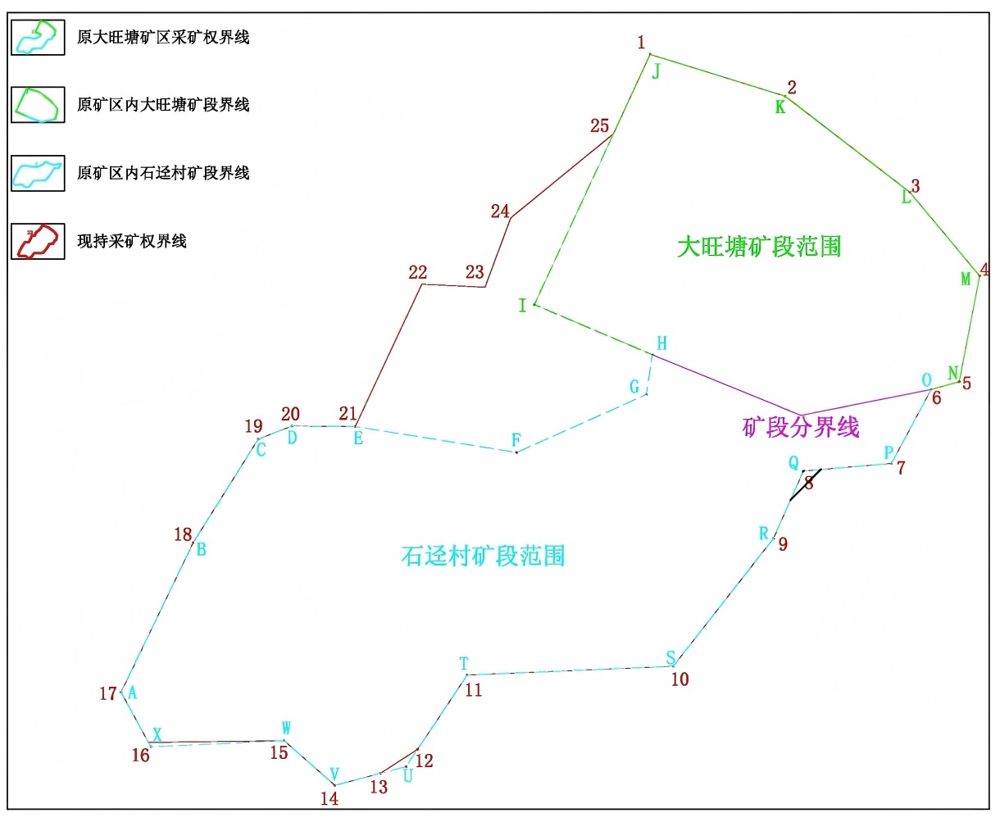

图1\.2\-1 华润大旺塘矿现持采矿许可证矿区各矿段范围叠合示意图

### 采矿权设置

#### 核实报告拟设置采矿权基本情况

根据中国建筑材料工业地质勘查中心广东总队于2025年6月编制的《广东省封开县河儿口镇大旺塘矿区水泥用石灰岩矿资源储量核实报告》，资源储量核实工作中拟设矿区范围拐点见下表1\.2\-2，拟设矿区面积为1\.3436km2，开采标高\+236\.00m至\-10\.00m。

表1\.2\-2 资源储量核实报告拟设采矿区范围及拐点坐标

序号

2000国家大地坐标系

序号

2000国家大地坐标系

X

Y

X

Y

1

2604364\.36

37582301\.26

17

2603186\.11

37582095\.41

2

2604288\.36

37582546\.26

18

2603191\.13

37582017\.02

3

2604114\.36

37582772\.26

19

2603138\.50

37581986\.44

4

2603962\.36

37582899\.26

20

2603103\.64

37581879\.18

5

2603770\.36

37582862\.26

21

2603060\.14

37581811\.91

6

2603756\.36

37582811\.26

22

2603038\.36

37581729\.26

7

2603622\.36

37582739\.26

23

2603119\.36

37581637\.26

8

2603581\.41

37582752\.11

24

2603116\.22

37581390\.97

9

2603496\.91

37582608\.43

25

2603207\.36

37581341\.26

10

2603314\.51

37582435\.91

26

2603478\.86

37581472\.26

11

2603219\.99

37582433\.57

27

2603666\.56

37581590\.16

12

2603140\.05

37582399\.10

28

2604129\.07

37581716\.43

13

2603131\.52

37582364\.63

29

2604306\.95

37581856\.01

14

2603152\.38

37582314\.99

30

2604385\.57

37581991\.39

15

2603143\.94

37582275\.44

31

2604414\.36

37582213\.58

16

2603094\.78

37582227\.12

开采标高：\+236\.00m~\-10\.00m，矿区面积：1\.3436km2。

#### 分割保留区（现拟设采矿权）

鉴于矿区周边环境情况，结合安全开采条件，拟对资源储量核实报告拟设矿区进行分割。按《广东省封开县河儿口镇大旺塘矿区水泥用石灰岩矿资源储量分割报告》，分割方案为原拟设采矿权范围向内收缩，保证现拟设采矿权范围距离南侧S266省道、西侧华润厂区、北侧砖厂、东侧高压线的边缘线大于300m，满足爆破安全警戒线范围；由于原采矿权边界收缩，导致开采终了局部边坡高度升高，为保证矿坑的边坡安全，所以在原拟设采矿权范围底部边界的基础上，向上提升了15m，将底界标高提升至\+5m标高。舍弃区平面范围为0\.5536km2，舍弃区纵向范围为标高\+5\.00~\-10\.00m。分割保留区（现拟设采矿权）面积为0\.7900km2，拟设开采标高\+236\.00m至\+5\.00m（见表1\.2\-3、图1\.2\-2）。分割后矿区地貌未发生明显变化，地形地貌整体与分割前基本一致。分割后的拟设采矿权资源量均匀分布在整个矿区范围，仅中部和南部有少量的夹石分布。截止日期2025年8月1日，保留区内（现拟设采矿权范围）（标高\+236\.00m~\+5\.00m）累计查明水泥用石灰岩资源量矿石量22802\.7×104t。历年开采动用探明资源量矿石量13981\.1×104t。保有水泥用石灰岩资源量矿石量8821\.60×104t，其中，保有控制资源量矿石量8343\.8×104t，占保有资源量的94\.58%，推断资源量矿石量477\.8×104t，占保有资源量的5\.42%。

表1\.2\-3分割保留区（现拟设采矿权）范围及拐点坐标

序号

2000国家大地坐标系

序号

2000国家大地坐标系

X

Y

X

Y

1

2603989\.58

37582735\.91

10

2603134\.28

37581546\.38

2

2603761\.45

37582753\.00

11

2603194\.38

37581533\.18

3

2603278\.26

37582330\.88

12

2603270\.08

37581582\.46

4

2603142\.5

37582171\.23

13

2603621\.60

37581615\.83

5

2603186\.11

37582095\.41

14

2603689\.36

37581766\.26

6

2603191\.13

37582017\.02

15

2603947\.51

37581886\.87

7

2603138\.50

37581986\.44

16

2603937\.47

37582091\.20

8

2603094\.57

37581831\.74

17

2604112\.12

37582245\.73

9

2603135\.11

37581609\.95

18

2604112\.12

37582651\.61

开采标高：\+236\.00m~\+5\.00m，矿区面积：0\.7900km2。

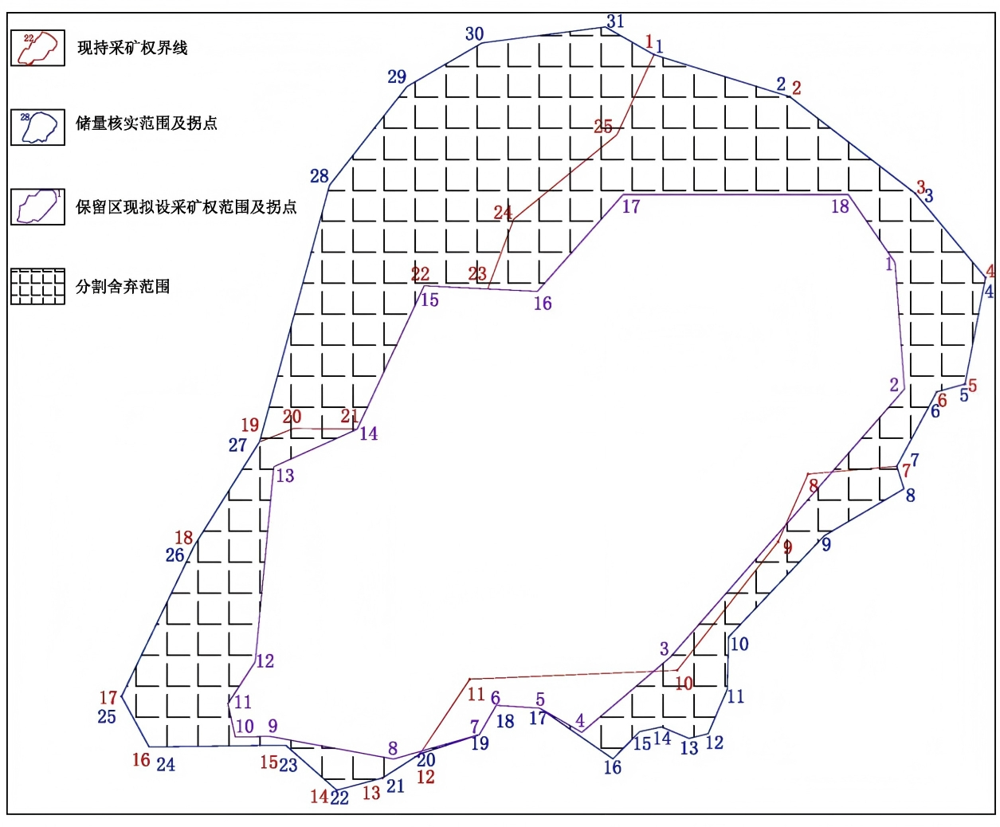

图1\.2\-2 现有采矿证、原核实拟设采矿权以及保留区范围叠合示意图

#### 拟设采矿权情况

根据封开县自然资源局的规划，拟设置采矿权范围面积0\.7900km2，开采标高\+236\.0m~\+5\.0m，拟开采矿种为：水泥用石灰岩矿，拟开采方式：露天开采。矿区共由18个拐点圈定，其拐点坐标见表1\.2\-3。拟设置采矿权范围位于现采矿权人华润水泥大旺塘矿区水泥用石灰岩矿范围内，目前该矿采矿许可证尚未到期，但现采矿权人承诺放弃该采矿权，因此拟设置采矿权挂牌前出让前应将华润大旺塘矿注销。封开县自然资源局对华润水泥大旺塘矿区水泥用石灰岩矿现有建构筑物、土地使用权以及剩余资源量等资产使用“资产包”处置方式一并出让给采矿权摘牌人。

### 矿山开发现状

截至2025年8月1日，出让矿区范围内查明保有水泥用石灰岩矿资源量8821\.6万吨（控制资源量矿石量8343\.8万吨，推断资源量矿石量477\.8万吨）。新增水泥用石灰岩保有资源量6949\.80万吨，新增综合利用夹石保有资源量1027\.25万吨。

现矿山日产量约60000t/d。破碎后采用皮带走廊运输。采场由南面进入，经多年开采，矿区现状已形成了一个近SW\-NE向长约1450m，宽约750m的采坑，目前采坑底部最低标高约\+50\.00m，矿山目前开采已形成标高为\+170m、\+150m、\+135m、\+120m、\+90m、\+80m、\+70m、\+60m、\+50m共9级开采平台，台阶坡度40°~65°，平台宽度6m~337m不等。

矿区范围标高最低为50\.07m，最高为236\.20m，最大相对高差186\.13m。矿体出露地表，开采平台平整，四周多见开采遗留下的堆石。

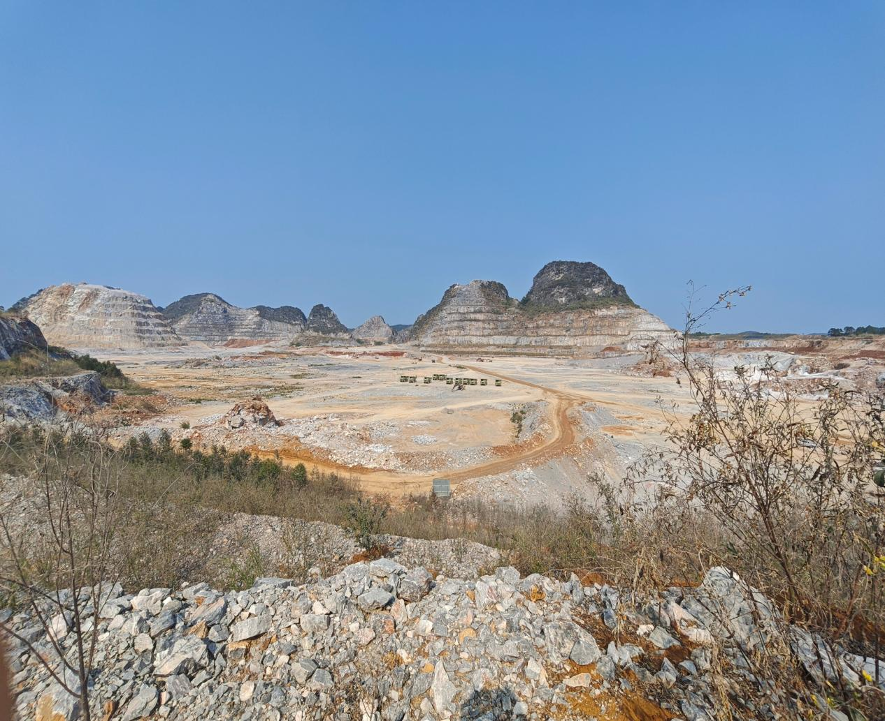

图1\.2\-3 矿区开采现状

### 矿山开发规划

根据封开县自然资源局的规划，拟设置大旺塘矿区采矿权范围面积0\.7900km2，开采标高\+236\.0m~\+5\.0m，拟开采矿种为水泥用石灰岩矿，采用露天开采方式，遵守“由上而下，分水平台阶开采”的开采顺序，开采\+50m、\+35m、\+20m、\+5m台阶的矿体，规划生产规模为988×104t/年，矿山总服务年限为11\.5年。

## 以往工作评述

### 以往工作简述

（1）1958~1960年广西壮族自治区地质局区域地质普查大队在矿区附近一带（广西境内为主）开展了1∶20万区域地质调查工作并编制出版地质图（梧州幅）及说明书。

（2）1986~1988年广西水文地质工程地质队区调分队在矿区附近一带（以广西境内为主）开展了1∶20万区域水文地质调查工作并编制出版综合水文地质图（梧州幅）及说明书。

（3）1983年，中国建筑材料工业地质勘查中心广东总队对渔涝镇及以北地区开展了水泥石灰岩矿产的调查工作，编制了调查简报。

（4）1998年4月，广东省肇庆市矿冶工业总公司钻探工程队进行封开县河儿口镇千层峰石灰岩石场地质调查，大致查明区内地层分布、构造、石灰岩矿石质量，并对当年矿山保有的储量进行概算，编写《封开县河儿口镇千层峰石灰岩石场地层调查说明书》。

（5）依托全国矿产资源潜力评价专项（2006~2013年），广东省佛山地质局经综合研究，于2011年编制完成了1∶25万构造建造图（梧州市幅）。系统梳理了包含矿区一带的地质构造和地质建造。

（6）2006年11月，广东省地质局七一九地质大队对河儿口镇千层峰（即大旺塘）石灰岩石场进行了核实工作，并提交了《封开县河儿口镇千层峰石灰岩石场资源储量核实报告》。

（7）2007年9月，中国建筑材料工业地质勘查中心广东总队对大旺塘矿区及外围开展了预查地质工作，并提交了《广东省封开县河儿口镇大旺塘矿区水泥石灰岩矿预查报告》，求得预测经济资源量（334）22622\.76万吨。

（8）2009年，中国建筑材料工业地质勘查中心广东总队在大旺塘矿区开展了资源储量核实工作，同年12月编制提交了《广东省封开县大旺塘矿区水泥用石灰岩矿资源储量核实报告》。

（9）2010年5月，中国建筑材料工业地质勘查中心广东总队在石迳村矿区开展了资源储量核实工作，编制提交了《广东省封开县石迳村矿区水泥用石灰岩矿详查报告》。完成的主要实物工作量有：1:2000地形、地质测量2\.13km2，钻探进尺1151\.70m，基本分析910个等。

（10）2016年3月，中国建筑材料工业地质勘查中心广东总队在大旺塘矿区与石迳村矿区整合的采矿权范围内开展了资源储量核实工作，编制提交了《广东省封开县河儿口镇大旺塘矿区水泥用石灰岩矿资源储量核实报告》。完成的主要实物工作量：1:2000地形修测3\.43km2，1:1000剖面测量6299m；地表刻槽1785m，取样231个；钻孔2个，总进尺163\.59m，取样42个。

（11）2020年，为调整已设采矿权标高，中国建筑材料工业地质勘查中心广东总队在采矿权范围内开展了资源储量核实工作，2021年3月提交了《广东省封开县河儿口镇大旺塘矿区水泥用石灰岩矿资源储量核实报告》。

（12）2025年，为调整采矿权范围，中国建筑材料工业地质勘查中心广东总队在拟设采矿权范围内开展了资源储量核实工作，同年7月编制提交了《广东省封开县河儿口镇大旺塘矿区水泥用石灰岩矿资源储量核实报告》。

（13）2025年4月，为基本查明大旺塘矿区水文地质工程地质条件，中国建筑材料工业地质勘查中心广东总队受华润封开公司委托，开展了水文地质、工程地质详查工作，同年7月编制提交了《广东省封开县河儿口镇大旺塘矿区水泥用石灰岩矿水文地质工程地质详细勘查报告》。完成的主要实物工作量：剖面测绘2\.3km，水文点36个，地下水位观测87次，钻孔新增9个，总进尺331m，还有抽水试验、地质物探、室内测试等工作。

（14）2025年8月，根据最终避让后拟设采矿权范围，中国建筑材料工业地质勘查中心广东总队开展了资源储量分割，编制提交了《广东省封开县河儿口镇大旺塘矿区水泥用石灰岩矿资源储量分割报告》。

（15）2025年10月，中建材西南勘测设计有限公司受华润封开公司委托，对拟挂牌出让的“大旺塘矿区”采矿权开展资源储量核实（复核）工作，编制提交了《广东省封开县大旺塘矿区水泥用石灰岩矿资源储量核实报告（复核）》。完成的主要实物工作量：1:2000地形修测1\.5km2，1:1000剖面测量3500m，1:2000地质填图和水工环调查1\.45km2，钻孔总进尺850m，钻孔采样42件，地表采样32件。

以上这些地质工作为本次调查提供了翔实可靠的基础地质资料。

### 以往工作质量评述

矿区2010年详查工作开展了1:2000地形、地质测量，完成钻探编录1151\.7m，2025年资源储量核实工作开展了1:2000地质填图，面积1\.45km2，完成工程地质编录850m，初步了解含矿层位的空间展布，初步了解矿体（层）数量、形态、规模、产状、厚度及总体分布范围，初步了解矿石类型、矿物成分、化学成分、品级及分布，初步了解夹石的数量、种类、分布、化学成分。初步了解开采技术条件，估算拟出让采矿权范围内水泥用灰岩矿潜在矿产资源。

2025年勘查工作完成水文地质、工程地质剖面测量2\.3km，钻孔编录331m，并进行了物探、抽水试验等多项工作，基本查明了在采的大旺塘矿区水泥用石灰岩矿的水文地质工程地质条件。各阶段完成的主要实物工作量见表1\.4\-1。

总体上，矿区以往所做水文地质、工程地质、环境地质方面工作较为充足，基本满足要求。

## 本次工作概况

### 勘查概况

#### 工作时间

本次勘察工作自2026年2月9日开始，至2026年3月31日结束，总历时51天。

#### 工作方法

本次勘察以1:2000地形地质图为基础底图，采用地面调查、长期观测、物探、钻探、水文地质试验、水化学与同位素分析、岩矿石物理力学性能试验等工作方法。

#### 简要经过

本次勘察工作由中南勘察基础工程有限公司组织实施，由于勘察时间紧，大部分勘察工作同时进行，项目组在工作中不断加深认识，形成最终成果，主要经过如下：

1. 准备工作（2026年2月9日至2月11日）：完成设计物探测线及钻孔位置等前期准备工作，并同步进行施工准备；
2. 野外施工（2026年2月12日至2026年3月31日）：同步开展地面调查、观测点布设、物探、钻探工作，3月6日开始进行抽水试验及压水试验，完成水化学样品采集与岩样采集，并送至专业机构检测；
3. 室内整理（2026年3月15日至2026年3月31日）：完成物探数据处理、钻孔岩芯编录、试验资料整理，以及实验室样品送检成果分析，最终形成完整的勘察成果资料。

### 勘查工作部署

#### 投入工作量

在原矿区相关地质工作的基础上，本次工作继续开展了矿区水文地质、工程地质、环境地质补充测绘、水文地质试验、水化学与同位素分析、岩矿石物理力学性能试验等工作。通过上述工作，详细查明矿区水文地质条件，其工作程度能够达到《矿区水文地质工程地质勘查规范》（GB/T 12719\-2021）勘探阶段的要求，可作为矿坑防治水工作的依据。完成主要实物工作量详见表1\.4\-1。

__表1\.4\-1完成主要实物工作量一览表__

__工作名称__

__工作项目__

__单位__

__完成工作量__

《广东省封开县石迳村矿区水泥用石灰岩矿详查报告》（2010）

1:2000地形、地质测量

km2

2\.13

钻探编录

m

1151\.70

基本分析

件

910

《广东省封开县河儿口镇大旺塘矿区水泥用石灰岩矿资源储量核实报告》（2025）

1:2000地形测量（修测）

km2

1\.5

1:1000地质剖面测量（草测）

km

3\.5

1:2000地质填图（草测）

km2

1\.45

水工环调查（草测）

km2

1\.45

钻孔编录

m

850

钻孔采样

件

69

地表采样

件

32

基本分析2项

件

101

报告编制

份

1

《广东省封开县河儿口镇大旺塘矿区水泥用石灰岩矿水文地质工程地质详细勘查报告》（2025）

水文地质、工程地质调查

剖面测绘

km

2\.3

水文点

点

36

地质点

点

178（收集）

地下水位观测次数

次

87

水文地质钻探及室内试验

钻  孔（收集/本次）

个

35/9

进 尺（收集/本次）

m

4901\.17/331\.00

钻孔编录（3个水文钻孔\+6个观测孔）

m

331

岩样

组

40

水样

组

3

矿山工程地质物探

瞬变电磁法

m/点

10480/1054

微动探测

m/点

5150/515

抽水试验

抽水孔数量

个

3

降深次数

次

6

试验测试

水样测试分析

个

3

岩石试验抗压强度试验（天然、饱和、干燥）

件

24

岩石试验抗拉强度试验

件

8

岩石试验抗剪强度试验

件

8

编制成果

广东省封开县河儿口镇大旺塘矿区水泥用石灰岩矿水文地质工程地质详细勘查报告

份

1

本次工作

工程点测量

点

66

区域水文地质

km2

50

矿区水文地质调查1/2000

km2

3

矿区工程地质调查1/2000

km2

3

矿区环境地质调查1/2000

km2

3

水文地质剖面测量1/2000

条

3

地表流量长期观测

点次

208

地下水位长期观测

点次

312

高密度电法

km

13\.86

微动

km

2\.96

钻探

m

5462\.42

编录

m

5462\.42

钻孔压水试验

段次

202

单孔抽水试验

组

6

群孔抽水试验

组

1

示踪试验

组

6

孔内成像

个

8

水质全分析

件

20

氘氧同位素分析

件

20

岩石力学性能测试

组

8

水文地质数值模拟

1

水文气象资料收集

收集矿山近30年降水量等气象资料及地表流量、水位资料。

#### 利用以往工作量

本次收集了1:2000地形地质图等基础图件，以及《广东省封开县大旺塘矿区水泥用石灰岩矿资源储量核实报告》《广东省封开县河儿口镇大旺塘矿区水泥用石灰岩矿水文地质工程地质详细勘查报告》等前期勘查成果，为本次勘察的工作量部署和数据分析提供了基础依据。

勘察主要利用《广东省封开县河儿口镇大旺塘矿区水泥用石灰岩矿水文地质工程地质详细勘查报告》的物探、钻孔成果，对比分析了以往矿区物探异常解译结果及钻孔揭露的岩溶发育特征，本次勘察物探线布设、钻孔定位及矿区水文地质条件分析充分参考了已有成果。

#### 主要资料来源

本次利用的以往资料由业主华润水泥（封开）有限公司提供。

### 勘查完成情况

#### 工作评价

##### 矿区水文地质、工程地质及环境地质调查

以比例尺1:2000的地形地质图为底图，累计完成各类调查点114处，其中包括：地表水点31处、井泉点14处、地质调查点56处、地面溶洞点9个、落水洞5个，可以满足本阶段的规范要求。

##### 地下水、地表水动态长期观测

地下水长期观测点选择矿区外围的六个监测井JC01、JC02、JC03、JC04、JC05、JC06，地表水长期观测选择矿区周围2处地表溪沟点及渔涝河上游及中游两处地表水点，主要了解地表水、地下水流量与大气降水的变化关系和地表水与地下水的补给关系。观测时间为1个水文年，观测频率为每7天观测一次，观测内容主要为流量及天气状况等，质量符合要求。

##### 物探

本次专项水文地质勘察物探工作采用了高密度电法、微动法组合技术。物探线主要沿矿区防渗墙帷幕线和岩溶发育较强烈的矿区南部布置测线，高密度电法测点定位偏差较小，电阻率数据采集合格率高，能够清晰识别出矿区边界上的岩溶裂隙带及疑似富水溶洞；微动法观测台站布设符合场地条件要求，面波反演横波速度剖面分辨率达标，准确划分了岩溶发育层位。高密度在野外布设了15条剖面，完成剖面13\.86km，测点2830点；微动测量在野外布设了3条剖面，共计完成剖面2\.96km，测点296点。物探原始记录完整、数据可靠，成果图件编制规范，异常解译与已知钻孔资料吻合度较高，为后续水文地质钻探及岩溶水资源评价提供了精准的地球物理依据，整体工作质量优良。

##### 钻探及岩芯水文地质工程地质编录

对矿区本次专项水文地质勘察所有钻孔进行岩芯水文地质、工程地质编录。具体编录内容包括岩石名称、颜色、结构构造、蚀变情况、风化程度、岩芯破碎程度、裂隙发育程度、岩石质量指标RQD、裂面地下水活动痕迹及充填情况等。质量满足规范要求。

##### 抽水试验

本次水文地质勘察共设计抽水试验7组，其中单孔抽水试验6组，群孔抽水试验1组，试验孔位布置覆盖矿区主岩溶含水层富水带及构造破碎带关键部位。本次抽水试验工作质量符合规范要求，试验成果能够准确反映矿区岩溶含水层的富水性及水文地质参数特征，可作为矿坑涌水量预测及矿床防治水设计的依据。

##### 压水试验

本次勘察共选取13个钻孔完成压水试验202段次，试验严格遵循《水利水电工程岩土渗透性原位试验规程 第1部分：钻孔压水试验》（SL/T 31\.1\-2025）执行，试验段选择覆盖了矿区主要岩溶发育带关键点位，与勘察设计方案契合。

试验设备采用额定压力2\.5MPa的双缸注浆泵，配套精度0\.4级的压力表与1000mL/min精度的流量计量装置，设备进场前均经计量校准，现场操作时每级压力稳压时间不少于8分钟，流量观测间隔1分钟，数据采集规范、记录完整，数据重复性、一致性良好，无异常跳变或失真情况，能够真实反映矿区岩溶含水层的渗透特性，可为后续水文地质参数计算及涌水量预测提供可靠依据。

##### 水化学分析样采集及送检

本次为评价矿山水资源可利用情况，详细查明矿区水环境，本次采集地表水水质分析样与氘氧同位素分析样各4件，位于矿区西侧、南侧、东侧地表溪沟及渔涝河；采集地下水水质分析样与氘氧同位素分析样各16件，位于矿区外水井点和矿区内钻孔点。

测试指标包括pH、TDS、EC、常规阴阳离子、微量元素及D、O同位素。其中，pH、温度等易变指标采用SX571型便携式pH/ORP/电导率/溶解氧测量仪野外现场测定；水样阴离子于长江大学油气地球化学与环境湖北省重点实验室采用离子色谱仪测试，阳离子及微量元素于湖北理工学院矿区环境污染控制与修复湖北省重点实验室采用电感耦合等离子体发射光谱仪（ICP\-OES）测试；D、O同位素分别送往中国地质科学院岩溶地质研究所与中国地质大学（武汉）生物地质与环境地质国家重点实验室进行测试。其分析方法和质量按有关规范要求执行，测试结果准确可靠。样品采集过程与分析成果质量符合要求。

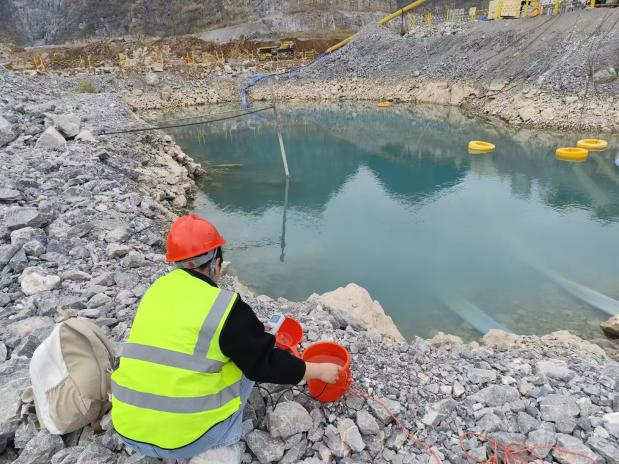

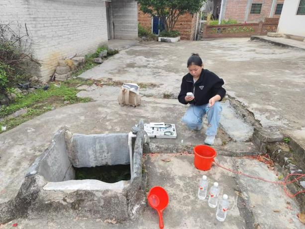

水化学样品采集照片1

水化学样品采集照片2

##### 孔内成像

本次勘察完成8个钻孔的孔内成像测试，深度覆盖42\.4~81\.1m，数据采集完整、成果可靠。

测试结果显示，SK9\-5孔岩体完整，未见明显节理裂隙；其余7个钻孔共统计构造节理295条，走向以SW向、SE向为主，倾角集中在中陡角度，节理面多呈光滑微张型，岩体整体呈较破碎~完整状态。测试段孔壁成像清晰，无失真、漏判情况，节理发育特征与区域构造背景匹配度高，可为矿区水文地质参数计算提供精准的基础依据。

##### 岩石物理力学性能测试

本次取岩样8件，岩石样按照要求送湖北省地质实验测试中心进行测试，测试单位具有计量认证资格证书，测试成果真实可靠。岩石样检测内容为：饱和吸水率（%）、饱和抗压强度（Mpa）、干抗压强度（Mpa）等，其质量按有关规范要求执行，测试结果符合要求。

##### 资料收集

本次收集了矿区附近封开站30年来本地区逐日降水量，资料可靠，满足评价要求。

矿区此前已开展了多项地质工作，为本次调查研究打下了良好的基础，提供了基础性资料。本次收集的报告有《广东省封开县大旺塘矿区水泥用石灰岩矿资源储量核实报告》《广东省封开县河儿口镇大旺塘矿区水泥用石灰岩矿水文地质工程地质详细勘查报告》，资料由业主华润水泥（封开）有限公司提供，来源可靠。

#### 取得成果

本次勘察形成了一套完整、内容翔实的成果资料，可为矿坑防治水工作提供科学依据，具体见表1\.4\-2。

表1\.4\-2 取得成果一览表

__取得成果__

__单位__

__数量__

报告

华润水泥（封开）有限公司大旺塘矿山

地下水治理专项水文地质勘察报告

份

1

附图

实际材料图

幅

1

水文地质图（含剖面图）

幅

11

工程地质图（含剖面图）

幅

11

抽水试验成果图

幅

7

水文地质钻孔柱状图

幅

66

附表

钻孔测量成果一览表

个

1

钻孔静水位一览表

个

1

钻孔抽水试验成果汇总表

个

1

压水试验成果汇总表

个

1

钻孔简易水文地质工程地质综合编录一览表

个

1

气象要素统计表

个

1

年降水量统计表（1996\-2025年）

个

1

钻孔覆盖层统计表

个

1

钻孔岩溶发育情况统计表

个

1

水质分析成果表

个

2

同位素分析成果表

个

1

岩样试验成果汇总表

个

1

大旺塘矿区抽排水记录表

个

1

地下水监测孔水位长期观测记录表

个

1

附件

水文地质钻孔岩芯编录

份

66

抽水试验数据记录及成果汇总

份

7

# 区域概况

## 地理位置

封开县位于广东省西北部，肇庆市西部，东与德庆县毗邻，南面与郁南县接壤，东北与怀集县相连，西与广西梧州市、苍梧县、贺州市交界，素有“两广门户”之称。

大旺塘矿区位于封开县东北部的河儿口镇，矿区地理坐标：东经111°47′35″~111°48′46″，北纬23°31′25″~23°32′18″，中心点坐标为北纬23°31′51″，东经111°48′10″。

矿区西侧有省道S266通过，至西南处怀郁高速S59渔涝收费站约5\.3km，直距西南部封开县城和西江约32km，交通较为便利，如图2\.1\-1所示。

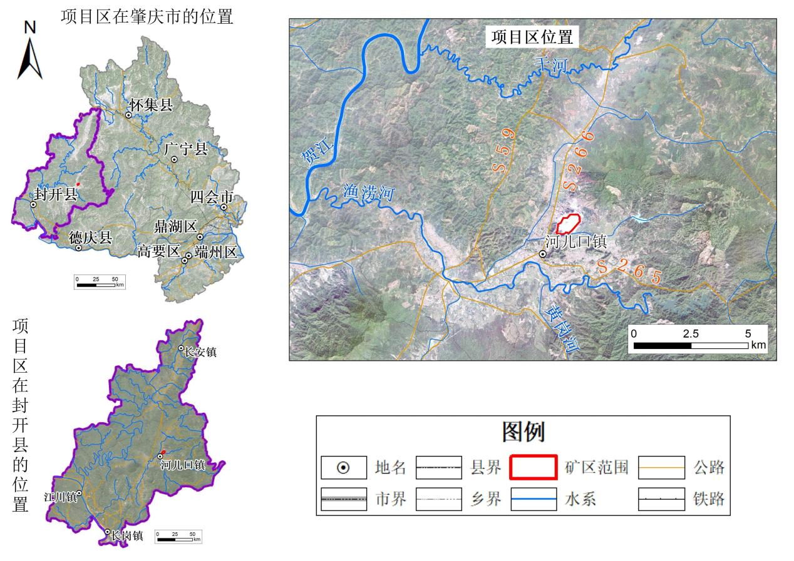

图2\.1\-1  地理位置图

## 地形地貌

封开县属山地丘陵地貌，为南岭西南山系云开山脉的东延部分。区内丘陵广布，山区偏东，高丘偏西，呈带状分布，地势自东向西，中间凹，南北低，两边向中间倾斜，形成狭长槽形地带。西江从西南部穿过县境，贺江斜贯中部于江口街道注入西江。

区内西部低山丘陵海拔多在300~700m，东部中低山海拔多在400~800m，海拔800m以上的15座山峰均集中于东部地区，以七星顶为全县最高山峰，海拔1274m。北东部长安\-南丰、莲都\-渔涝镇一带，呈长条状展布岩溶盆地，四周丘陵山地环绕，盆地内北东向散落可见灰岩残丘（孤山）。

大旺塘矿区位于河儿口盆地北端，原始地形为典型岩溶地貌，四周多为悬崖峭壁，时见突起孤峰，矿体基本裸露地表，部分为第四系覆盖，植被较少。矿区现状地形最高标高为\+236\.00m，最低为\+50\.00m，最大相对高差186\.00m，当地最低侵蚀基准面为\+50\.00m。

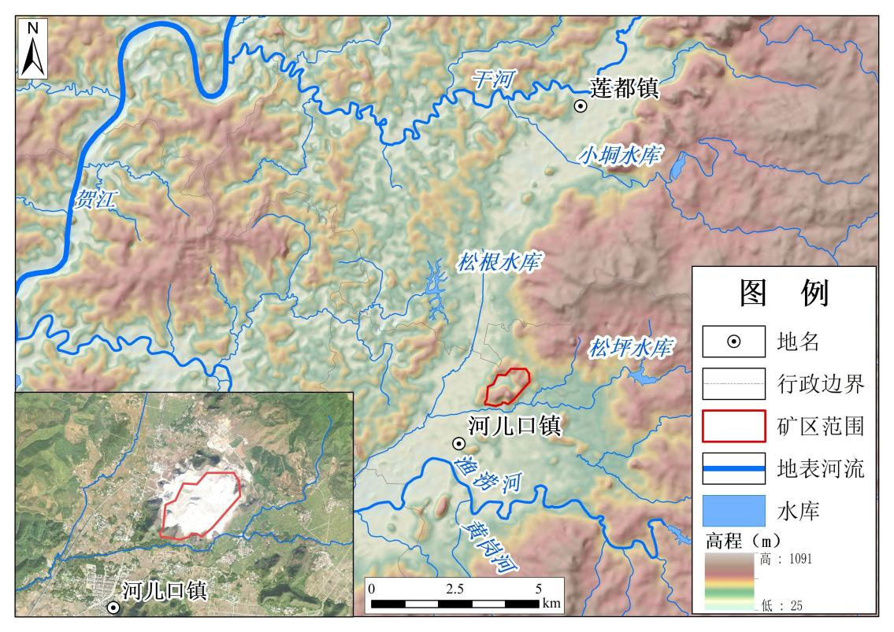

图2\.2\-1 地形地貌图

## 气象水文

### 气象

封开县地处北回归线，属亚热带季风湿润气候，受季风影响显著，具有光热充足、雨量充沛、温暖湿润、冬短夏长、无霜期长的特点。风向季节转换明显，夏季盛行偏东南风，冬季盛行偏北风，多年平均风速1\.1m/s，最大风速14\.2m/s；多年平均气温20\.9°C，极端最高气温39\.4°C，极端最低气温\-3\.4°C；全年无霜期长达320d，有霜期仅为45d；多年平均地面蒸发量750mm、水面蒸发量1150mm，年平均日照时数1754\.5h。

全县多年平均降雨量1480mm，年内分配不均，变化较大。汛期4~9月降雨量超过年降雨量的77%；每年5~7月受台风影响频繁，多集中性大雨或暴雨；10月至次年3月降雨偏少，约占全年24\.6%。如图2\.3\-1所示。

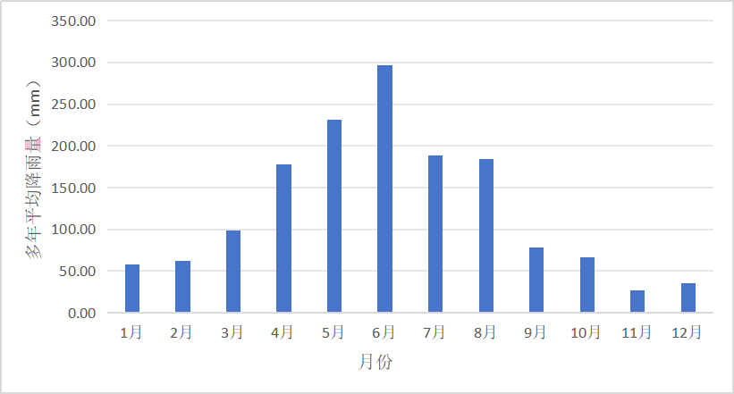

图2\.3\-1  项目区多年平均降雨量柱状图

### 水文

封开县位于西江主干流上游，西江由西往东南穿越封开县南部，县内河流均属西江一级二级支流，共有大小河流129条，河流总长408\.5km，年径流量21\.36亿m³。

西江属珠江水系，从梧州流入县内，县境内长37\.5km，向东流经郁南、德庆、肇庆、三水等地汇入珠江。西江水位变幅较大，枯水期约8~10m，洪水期约18~20m，常年可通航。贺江属西江支流，源出广西富川瑶族自治县石龙，南流入县境，至县城江口街道注入西江。江面宽约200m，水深4~10m，河流比降0\.58‰，县内落差50m，流经县内长104km，流域面积2086\.2km²。

渔涝河源于杏花老鸦迳（大平顶），从杏花镇到渔涝镇汇集黄岗河后经河口注入贺江，河长60km，流域面积626km²，河流比降4\.21‰，总落差262m。

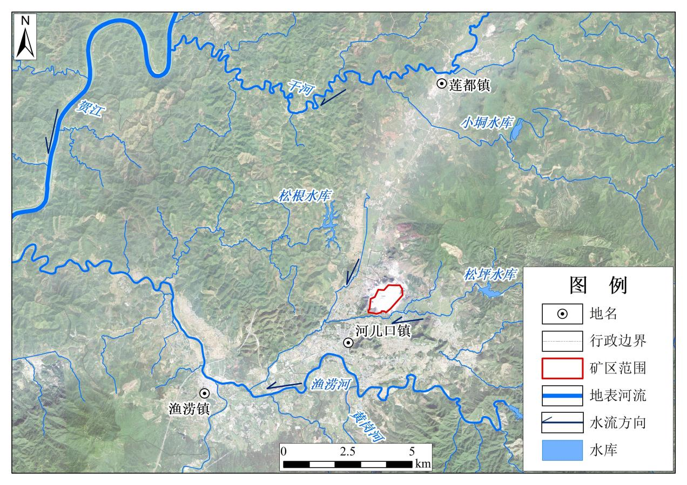

图2\.3\-2  项目区水系示意图

大旺塘矿区东侧分布一条自然形成的小河流，水流方向自北向南；矿区东侧发育一条溪沟，向西流经矿区南侧，宽约1\.5m，深约0\.25m，流量约0\.17m3/s，矿区现抽排水出水口布设于该溪沟中段，本次勘察期间，实测排水口处水位高程为54\.25m，与矿区西侧溪沟汇合，向南径流汇入渔涝河，实测渔涝河水位31\.61m。

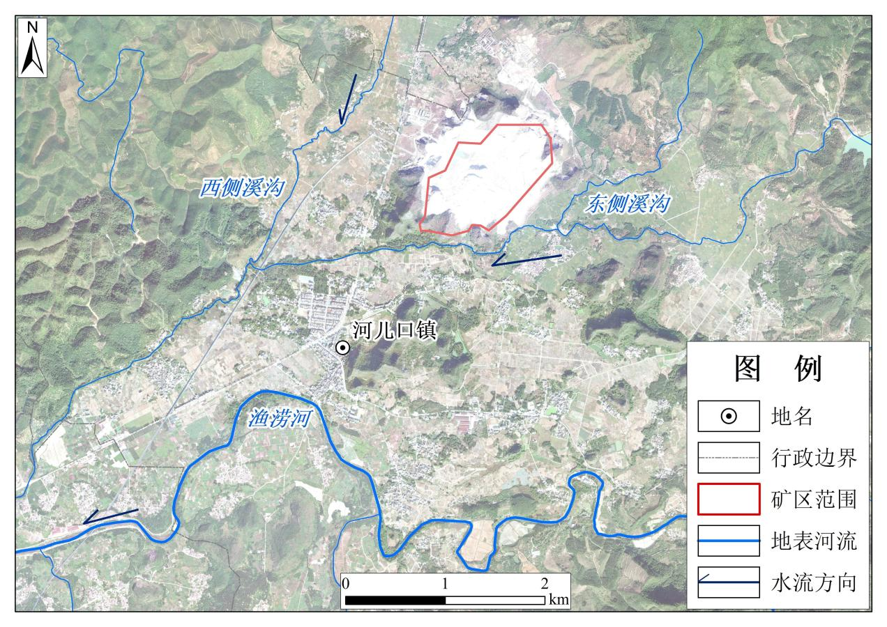

图2\.3\-3  矿区周边水系示意图

## 区域地质

### 地层岩性

根据区域地质资料，本区位于华南褶皱系云开加里东隆起带，郴州—怀集脆性逆冲断裂带南西侧，渔涝—莲都向斜的南东。区内出露地层有寒武系、泥盆系、石炭系及第四系。由老到新简述如下：

#### 寒武系八村群（∈1bc）

为区内最古老地层，分布于本区西北部大部分地区。根据岩性特征分为上、中、下三个组：

（1）下亚群\(∈1bca）：岩性为粉砂岩夹砂岩及页岩，底部为砾岩。厚度1117~1460m。地层西部倾向北东向，倾角70°左右，地层东部倾向南东向，倾角35°左右，地层北部倾向南西向，倾角24°左右。

（2）中亚群（∈1bcb ）：岩性为粉砂岩、细砂岩夹页岩，底部为含细砾石粗砂岩。厚度694~1425m。地层南部倾向北西，倾角60°左右。地层北部倾向北东，倾角50°左右。

（3）上亚群 （∈1bcc）：粉砂岩、细砂岩夹页岩，底部为粗粒砂岩。厚度840~1379m。地层整体向北西向倾，倾角50°左右。

#### 泥盆系上、中、下统（D1\-3）

泥盆系地层呈条带状北东向分布于区内中部，与下状地层为角度不整合接触。

（1）下统莲花山组（D1*l*）：岩性为石英砂岩、页岩、粉砂岩。厚度177~372m。地层倾向北西向，倾角20°左右。

（2）下统那高山岭组（D1*n*）：岩性为页岩夹白云岩及砂岩。厚度48~278m。地层倾向北西向，倾角20°左右。

（3）中统郁江组（D2*y*）：岩性为泥质粉砂岩，页岩夹细粒石英砂岩，鲕粒赤铁矿。厚度49~279m。地层倾向北西向，倾角20°左右。

（4）中统东岗岭组（D2*d*）：岩性为灰岩、含燧石灰岩、白云质灰岩及白云岩。厚度532~706m。地层倾向北西向，倾角20°左右。

（5）上统融县组（D3*r*）：灰岩、白云质灰岩夹硅质灰岩。厚度＞100m。地层倾向北西向，倾角30°左右。

#### 石炭系下统（C1）

刘家塘组（C1*lj*）：零星分布于本区中偏南部，广泛出露于矿区，岩性为浅灰~灰色、局部浅灰白色或浅灰黑色中~厚层状灰岩夹薄层状、透镜状白云质灰岩、含粉砂质灰岩及白云质灰岩，白云岩（风化面以灰黑色为特征）。厚493m，总体走向北东55°~68°，倾325°~338°，倾角14°~25°，产状较稳定。

#### 白垩系下统（K1）

区内北部、北东部边缘少量分布，不整合覆于水口群及中、下泥盆统地层之上，岩性为紫红色泥质、钙质粉砂岩、砂质、钙质页岩、砾岩及花岗质砾岩。厚度251~930m。地层倾向北东向，倾角30°。

#### 第四系（Q）

黄岗组（Qp3*hg*）：分布于渔涝南部及盆地东部山前地带，主要为石塘冰碛层、田岗冲积层，岩性红黄色砂砾、粘土，厚8~30m。

大湾镇组（Qh*dw*）：分布于莲都至渔涝河谷低洼地带，主要岩性为灰黄色砂砾、砂质粘土，厚度5~16m。

此外，区内南东部大面积出露的岩浆岩为加里东期的黑云母花岗岩和花岗闪长岩。属七星岩岩体的一部分。

### 地质构造

本区经历了加里东的强烈褶皱运动，伴随有强烈的岩浆活动；燕山运动以断裂为主，褶皱次之，亦伴生有强烈的岩浆活动；喜马拉雅早期为轻微褶皱、断裂运动，晚期以大面积升降为主。形成以北东向构造为主，近东西向、近南北向为辅的构造格局。

#### 褶皱构造

区内所见褶皱为渔涝—莲都向斜，南起于渔涝以南，北止于莲都以北，呈北北东向延长，向斜轴长度大于90km，宽1km~13km。向斜核部由石炭系等组成，两翼为泥盆系，轴面近于直立。两翼由于构造破坏，不对称，地层缺失较多。岩层较平缓，倾角一般25°左右，为较宽缓的向斜。

#### 断层构造

北北东向断层，渔涝—莲都逆冲断层，南起于渔涝以南，北止于莲都以北，呈北北东向延长，走向长度大于90km。该断层主要发育于渔涝\-莲都向斜的轴部。由于它的作用，向斜的北西翼地层近于缺失。

北西向断层，多条横切或斜切与渔涝—莲都向斜的断层。为受区域剪切应力作用而形成的高角度的平移断层。它使得该向斜的连续性和稳定性受到破坏。

#### 新构造运动

经历了喜马拉雅运动的构造分异以后，封开地区出现了小规模的岩浆侵入和地壳间歇性上升。如在第三纪至第四纪间有小规模的岩浆活动，以岩株或岩枝产出，岩性为辉长岩，本区新构造活动不强烈。

#### 地壳稳定性

区内地震动峰值加速度值为0\.05g，地震动反应谱特征周期值为0\.35s，相应地震基本烈度小于Ⅵ度，本区地壳较稳定。

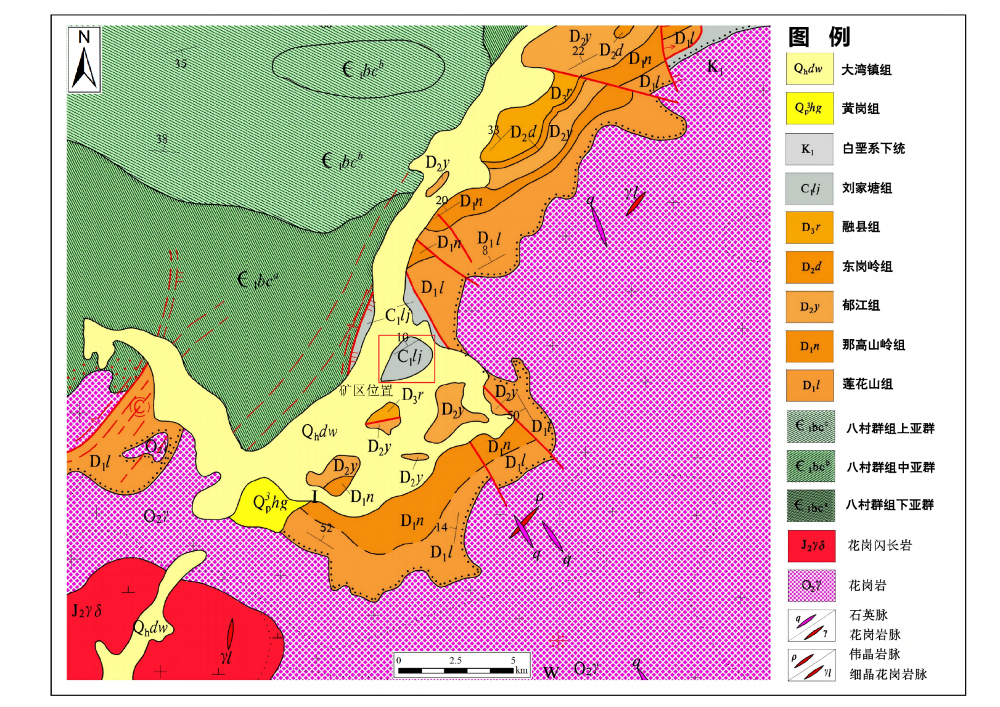

图2\.4\-1区域地质图

## 区域水文地质

### 地下水类型及含水岩组划分

根据地下水的赋存条件，水理性质及水力特征，区域地下水类型可划分为松散岩类孔隙水，碳酸盐岩岩溶水和基岩裂隙水三大类型。

#### 松散岩类孔隙水

该类型地下水分布在山间盆地区域，主要赋存于第四系冲、洪积砂砾石层或砂层中。部分区域上部覆盖不连续的粉质粘土层，水位埋深一般小于5m，以孔隙潜水为主，局部微承压，单孔涌水量小于100m3/d，水化学类型以HCO3\-Na\(Ca\)型为主，矿化度一般小于0\.3mg/L，富水性总体贫乏。

#### 碳酸盐岩类裂隙溶洞水

该类型地下水分布在渔涝莲都一带，赋存在石炭系和泥盆系灰岩、白云质灰岩、泥灰岩等地层中，按含水层出露条件，可分为覆盖型和裸露型岩溶水。单孔涌水量总体在100~1200m3/d，水化学类型以HCO3\-Ca 型为主，富水性中等~强，水量一般较丰富。

#### 基岩裂隙水

基岩裂隙水可细分为风化带网状裂隙水和构造裂隙水，风化带网状裂隙水发育在东部和东南部侵入岩岩组中，构造裂隙水则广泛分布在西部区域及盆地东侧边缘，赋存在寒武系和泥盆系中砂岩、页岩、粉砂岩地层中。风化带网状裂隙水主要为HCO3\-Ca\-Na型水占绝大部分，局部为HCO3\-Ca型水为主，个别点为CI\-HCO3\-Ca\-Na型水。构造裂隙水的水化学类型以HCO3\-Ca\-Mg型水居多，次为HCO3\-Mg\-Ca、HCO3\-Ca型水。

### 地下水补径排条件

孔隙水均分布于谷地、阶地，大气降雨为其主要补给来源。耕作区水库引水渠道和稻田灌溉水的下渗以及河水倒灌（汛期短时可能出现）也是补给源之一，此外孔隙水还接受边缘山区基岩裂隙水的侧向补给，因松散层表层透水性差的粘土、亚粘土存在以及基岩裂隙水近源排泄等特点，实际补给量有限。孔隙水一般径流途径短，就近在低洼地带以散流形式排泄。除蒸发消耗外，当砂砾层直接与下伏岩溶含水层接触时，下渗补给岩溶水也是其排泄途径之一。

岩溶水的补给来源主要是降雨补给，受降雨季节分布不均影响，枯季降雨一般不足以补充地下水排泄量，地下水位下降6~10m。雨季重新得到大量补充。岩溶地区洼地发育，溶蚀裂隙漏斗是降雨下渗的良好通道。岩溶水的地下径流主要在溶蚀裂隙中进行，一般顺岩层走向和较大裂隙带运动，浅层岩溶水一般以泉点排泄或向河流排泄。同时，受渔涝—莲都向斜、渔涝—莲都逆冲断层等构造影响，岩溶水呈现向轴部汇集，顺构造破碎带径流，参与深循环的特点，如北东向和北西向断层交汇处的渔涝戴村矿泉水，孔深200m，自流量1430m3/d。

降雨是广大基岩裂隙水的主要补给来源，该区水系发育，切割强烈，地下水排泄条件良好。大气降雨可直接从基岩裂隙或经坡残积层入渗补给地下水，另外区内山塘水库较多，地表水对地下水的补给也是一个不可忽视的因素。基岩裂隙水主要沿构造裂隙、风化裂隙、断裂及不同岩性间的层面裂隙作隙流运动，并于岸边、冲沟、坡脚等地貌部位以散流的形式就近排泄于当地的溪沟中，径流条件明显受地形地貌、地质构造因素的控制，具有径流途径短，水力坡度大（随山坡角变化），近源排泄和地表分水岭与地下分水岭一致等特点。

### 区域水文地质单元

大旺塘矿区原始地貌为盆地中孤立的峰丛岩溶地貌，位于渔涝镇—莲都向斜中段的南东翼，出露地层主要是石炭系下统刘家塘组（C1*lj*）碳酸盐岩，岩性主要为浅灰、灰色中~厚层状灰岩，夹薄层状、透镜状含白云质灰岩。矿区外围的盆地中分布第四系地层，下伏覆盖型岩溶水。由于矿产开采活动，当前矿区内岩石几乎全部裸露，矿坑最低开采标高已经临近或略低于最低侵蚀基准面，矿区浅层岩溶水呈现从四周向矿坑中部汇集的特点，并在\+50m平台以下形成较为统一的岩溶地下水等水位面。

未来凹陷型开采阶段，岩溶水是主要的涌水来源之一，划定区域水文地质单元，对后续防治水工作具有指导意义。根据现有资料和本次勘察工作，概化圈定大旺塘矿区区域岩溶水文地质单元，主要如下：

（1）矿区北部良心寨附近，存在地表分水岭，北部莲都镇和南部渔涝镇均发育东西流向河流，汇入贺江。受区域断裂褶皱带不同部位的形态控制，地表分水岭与浅层岩溶水地下分水岭近似一致。北部可沿分水岭划定为零通量边界。

（2）矿区南部渔涝河自东向西径流，矿区周边溪沟均向南和西南汇入渔涝河，该河为本区排泄基准，浅层岩溶水可向渔涝河排泄，沿河可划定为给定水头边界。

（3）矿区西部丘陵区出露寒武系砂岩，东部山地为侵入岩，赋存基岩裂隙水，具有近源排泄特点，同时受盆地西侧压扭性渔涝—莲都逆冲断层和盆地东侧泥盆系砂岩阻隔，对盆地内覆盖型岩溶水的直接补给总体有限，视为相对隔水层。沿地层界限划定为相对隔水边界。

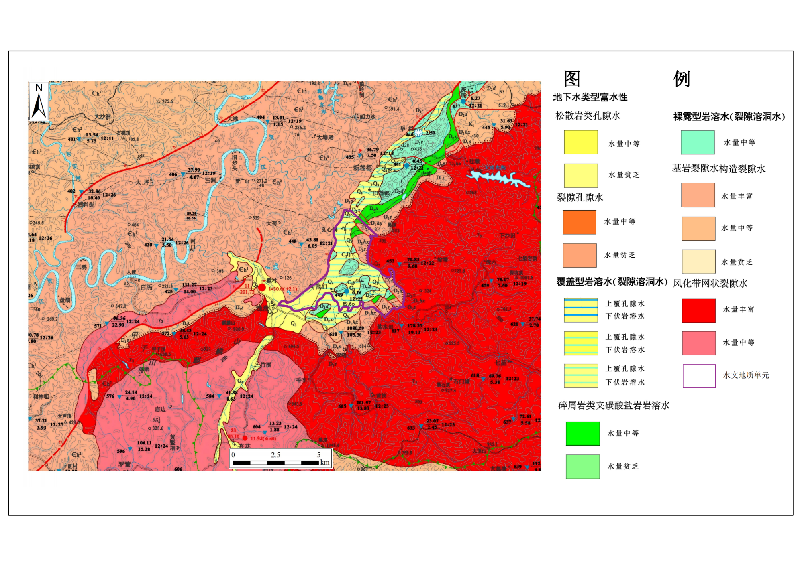

图2\.5\-1 区域水文地质单元图

# 水文地质勘探工作

## 水文地质调查

项目组于2026年2月\-2026年3月期间对大旺塘矿区水泥用石灰岩矿区域开展了水文地质调查工作，调查控制点主要集中于大旺塘矿区所属范围，矿区外围也布设有调查点控制。根据相关规范，调查项目包括地表河流、水塘、沟渠、井泉点、岩性构造、落水洞、溶洞、地面塌陷、地表岩溶发育程度、岩溶裂隙、破碎带等内容。

本次调查面积为50km2，布设调查路线4条，累计完成各类调查点114处，其中包括：地表水点31处、井泉点14处、地质调查点56处、地面溶洞点9个、落水洞5个，为后续1:5万水文地质图修测、1:2000矿段水文地质图填图提供了基础依据。

表3\.1\-1 调查工作量

类别

工作量

调查面积

50km2

调查路线

4条

地质调查点

岩性分界点

15处

岩性控制点

13处

断层控制点

12处

水文地质调查点

岩溶调查点

地面溶洞

9处

落水洞

5处

地表水点

31处

井泉点

14处

工程地质调查点

10处

环境地质调查点

6处

### 地层岩性及富水性调查

本次地层岩性及富水性调查共布设地质调查点56处可以有效控制矿区主要构造及岩溶发育情况。

矿区及周围主要岩性为刘家塘组灰白色灰岩、白云质灰岩，区内岩层节理较为发育，岩溶现象十分明显，发育小溶孔、溶洞、溶沟等。

图3\.1\-1 小溶孔、溶蚀沟照片1

图3\.1\-2 小溶孔、溶蚀沟照片2

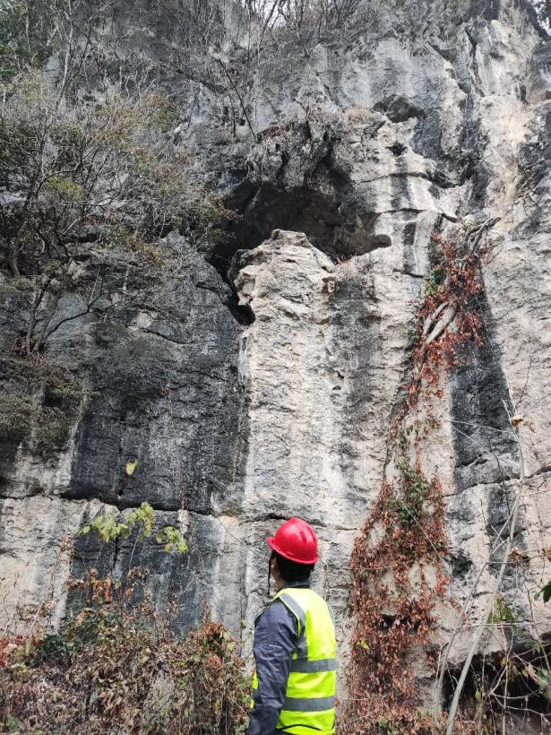

图3\.1\-3 矿区西侧外围溶洞照片1

图3\.1\-4 矿区西侧外围溶洞照片2

矿区东侧庙边村后山发育一处大溶洞，该溶洞洞口朝西北方向，洞宽约10m，洞高约2\-3m，向内逐渐扩大，形成厅堂式洞室结构，已探明洞长约80m，最宽处达15m，局部可达12m。洞体呈廊道式与厅堂式交替分布，主要沿岩层节理和断裂带方向延伸。洞壁与洞顶可见大量溶蚀沟槽、石芽和溶蚀洼地，形态不规则，洞顶局部发育有小型天坑，直径约1~2m，为地表水渗透溶蚀形成。洞壁上发育有密集的网状裂隙，多为构造裂隙经岩溶作用扩大形成，宽度一般为1~5cm，部分裂隙内可见次生方解石脉充填。洞内目前无常年性地下水流，仅在雨季有短暂水流通过，主要沿洞底沟槽流动。洞底可见多处积水洼地，水深一般为0\.1~0\.3m，水质清澈透明。

图3\.1\-5 庙边村后山大溶洞照片1

图3\.1\-6 庙边村后山大溶洞照片2

### 井泉点及地表水体调查

1\.井泉点调查

本次调查共统计井点14处，位于矿区外围居民地内，主要用于附近居民企业、村民抽取用水。井点分布具有明显的地域性：大部分井点位于矿区西北侧居民地内，少数井点分布于矿区南侧居民地内。

西北侧井群：共9处井点，集中分布于矿区西北方向约670~1700m范围内的居民区。该区域地势相对平缓，水位埋深较浅（0\.3~7\.5m）。

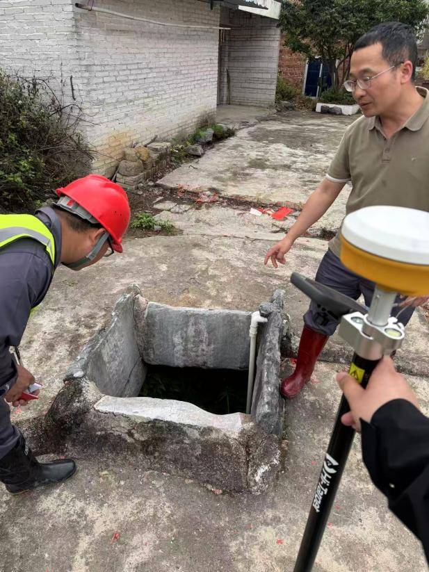

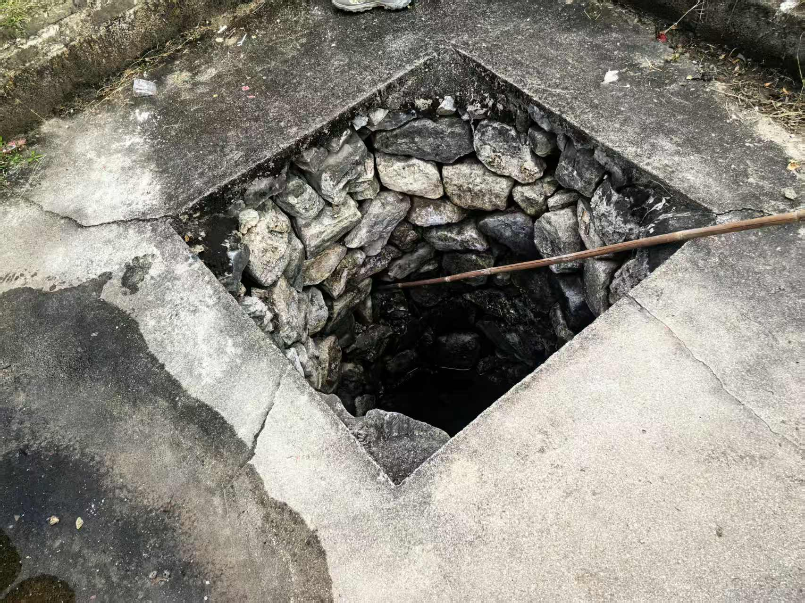

图3\.1\-7 水井照片1

图3\.1\-8 水井照片2

2\.地表水体调查

大旺塘矿区东侧分布有一条自然形成的小河流及一条灌溉渠，河流宽约7m~12m不等，灌溉渠宽约1\.1m，高度约0\.55m，水流方向均为自北向南东；灌溉渠为人工修建的混凝土沟渠，主要用于矿坑排水及农田灌溉引水，流淌途中渗透损失极小；两条河流均为独立排水系统。矿区南侧发育一条溪沟，宽约1\.5m，深约0\.25m，流速约1m/s，流向正西，流量约0\.3m2/s，矿坑疏干排水出水口设置于该冲沟中段，排水口标高为55\.33m，距矿区南侧1\.8km为渔涝河，为本区排泄基准面。

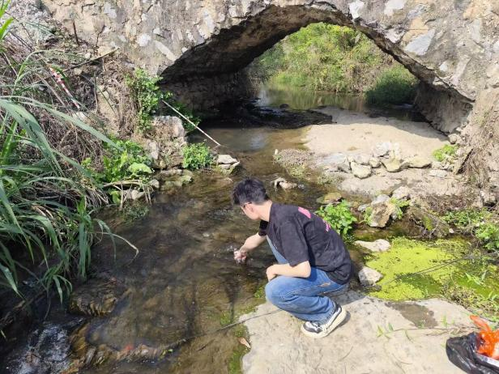

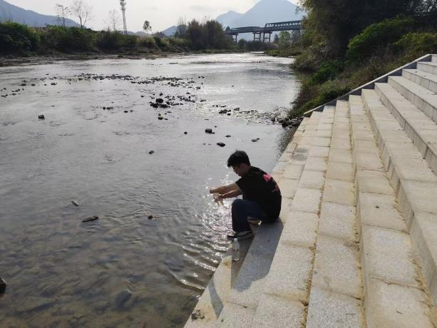

图3\.1\-9 东侧小河照片

图3\.1\-10 渔涝河照片

### 小结

根据野外调查，调查区内地表岩溶发育，见有溶沟溶槽、溶洞，特别是矿区南部的黄岩洞景区内，有古地下河发育，后经地质运动作用地层抬升，地下河悬于区域地下水水位以上，形成现有的干洞。

调查区内地下水主要为岩溶水，地下水点以水井为主，未见有泉点，水井水位呈现北高南低趋势，矿区距离渔涝河约2\.5km，地下水水位与渔涝河水位高差约15m，区域地下水整体自北向南流动，渔涝河为该区域最低排泄基准面。

## 水文地质物探

### 工作方法

#### 测地工作

测绘工作平面坐标采用CGCS2000坐标系，3°带分带，工作区中央子午线为111°，高程采用1985高程。

本次物探工程测量使用中海达TS5 pro系统（图3\.2\-1），利用千寻CORS网络信号差分定位，进行点位实地测设，并在精度满足规范要求下采集记录点位坐标信息。

利用RTK导航至设计测点的理论坐标，并在实地做标记并采集该点实际平面坐标X、Y和海拔高H。

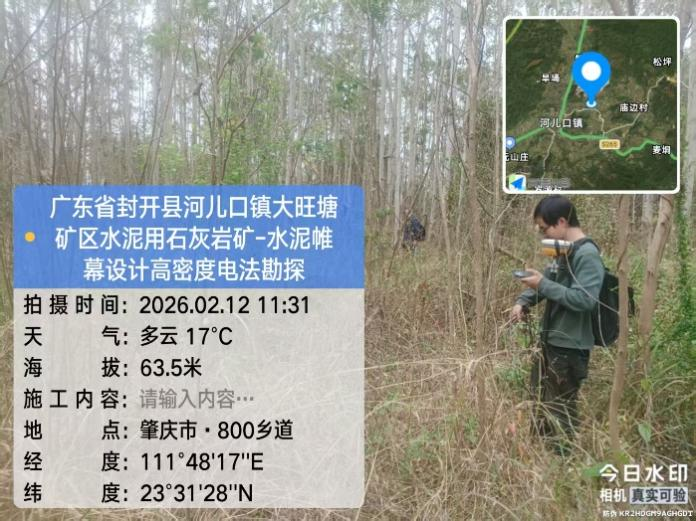

图3\.2\-1 物探工作RTK放样作业

#### 高密度电法

高密度电阻率法是以岩矿石的导电差异为基础，研究人工施加稳定电流场的作用下地中传导电流分布规律的一种地面电法勘探方法，采用一次阵列布极方式实现自动跑极和数据采集，可实现不同装置类型和不同极距的断面或立体视电阻率测量方法。

高密度电法的勘探原理，与一般电法勘探原理相同。

设地表水平，地下充满均匀各向同性半无限介质，在地面上任意两点用供电电极A、B供电，另外两点用测量电M、N测量电位差ΔUmn。A、B电极在M、N点产生的大地电阻率的计算公式为：

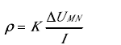

式中：K称为装置系数，它是一个与各电极间的距离有关的物理量。野外工作中，装置形式和极距一经确定，K值便可计算出来。

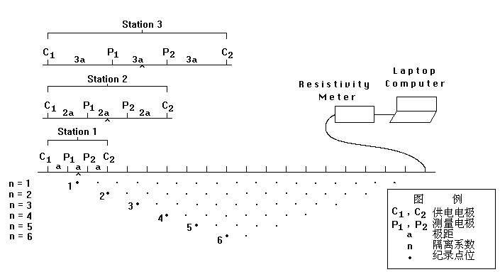

图3\.2\-2 工作原理示意图

高密度电阻率法属于常规直流电阻率法，也是以不同岩（矿）石之间导电性差异为基础。通过接地电极在地下建立人工电场，以电测仪器观测因不同导电地质体存在时，地表电场的变化，从而推断和解释地下地质体的分布或产状，达到解决地质问题的目的。高密度电法由于采用先进的计算机技术，自动存储，自动成图，工作效率较常规电法大为提高，本次勘查采用高密度电阻率法中的温纳装置和斯仑贝格装置两种工作模式。温纳装置也就是对称四极电阻率装置，A、B是供电电极，M、N为测量电极，AM=MN=NB视作一个电极间距，通过一个等电极间距对称排列装置，利用直流电场理论和均匀地下半空间电场分布规律，来研究某一深度的电阻率变化规律。随着隔离系数n的逐渐增大，电极间距也均匀拉开，探测深度也随着层层往下增大，最终由计算机自动绘制成呈倒梯形的断面彩图。工作原理如上图所示。

本次高密度勘查选用的是重庆奔腾数控生产WDA\-1型分布式高密度电法测量系统，30道分布式电缆，道间距10米（图3\.2\-3）。

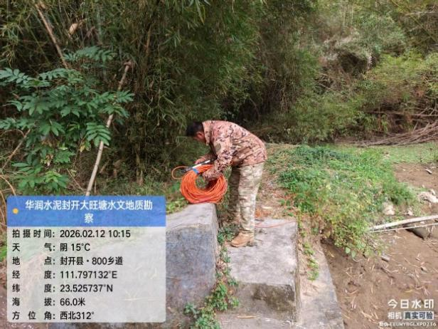 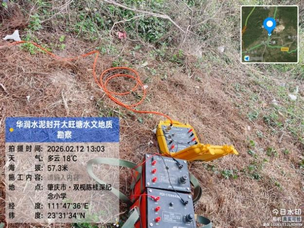

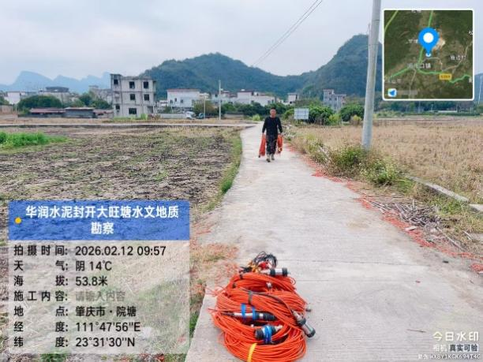 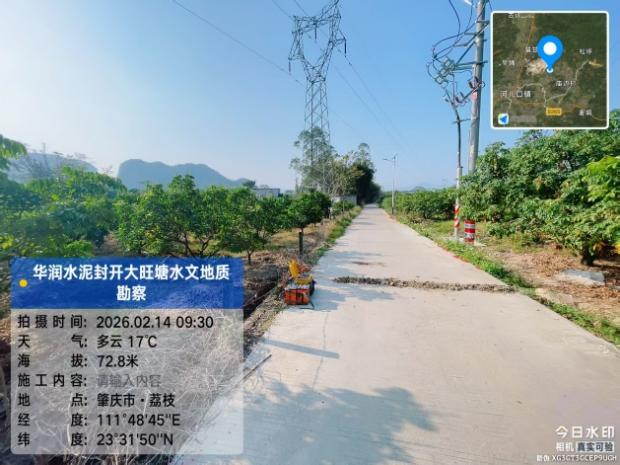

图3\.2\-3  高密度电法仪器设备及野外作业照

#### 微动测量

（1）基本原理

微动勘探的面波中携带有所通过介质的信息。利用采集处理得到的面波频散曲线，可以反演地下介质速度结构，进而反演地层的密实度及均匀性。

不同频率的一系列面波可以有相同的相速度，在同一频率下的这些波可以具有不同的相速度。任何频率下，速度最小者可称之为基阶模式。地表面波的大部分能量都集中在基阶模式中，形成的频散特征也比较简单。面波勘探时所采集的地震记录在t\-x域中无法分辨面波的各个模态，如果将记录进行傅立叶变换，在频率波数域中，由于面波各模态传播速度的差异，在时间域中叠加在一起的各模态面波信号在频率波数域中就会分开。由于面波的基阶能量最强，其余高阶模式能量弱，各模态能量团能清晰分辨，因此，在面波记录中，强能量基阶面波显示清晰。当遇到不同地层的分界面时，基阶面波传播发生波散。

基阶和高阶模式反演高频面波的研究（Richard D\.MiPPer等，2008）表明，高阶模式与基阶模式的相速度不相关联。用高精度的计算方法，基阶模式相速度可以得到可靠的S波速度。某些情况下，高阶模式相对于基阶模式在高频带具有更高的能量，意味着高阶模式能够在某些基阶模式失效的情况下发挥作用。同一波长的情况下，高阶模式能够反映更深的地下介质的信息。高阶数据能够稳定反演过程，而且能够提高反演S波速度的分辨率。

影响面波勘探精度的因素很多，其中，测量相速度和反演方法起着至关重要的作用。众所周知，精确测量面波相速度是面波勘探的基础，在此基础上，利用各种方法反演地下介质的剪切波速度，这就是面波勘探的目的。这两个过程是面波勘探中所必需的，因此，过程的精度决定了面波的勘探精度。影响面波勘探精度的还有一个因素是成果解释，即如何从频散曲线得到地下介质的层速度结构。通常采用的半波长法，是利用深度为半个波长内介质的平均速度作为这一厚度的剪切波速度。

实践已证明，该法在探测地层的密实度及均匀性都取得了较好的效果，可以利用它确定地层的埋深、均匀性和分化层的厚度。

（2）仪器设备

本次测量使用深圳面元公司生产的SMARTSOPO型高分辨地震仪（图3\.2\-4），为目前国内领先的微动测量仪器之一。

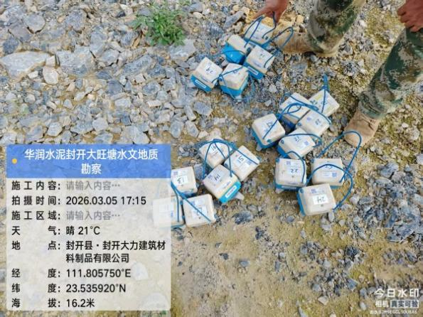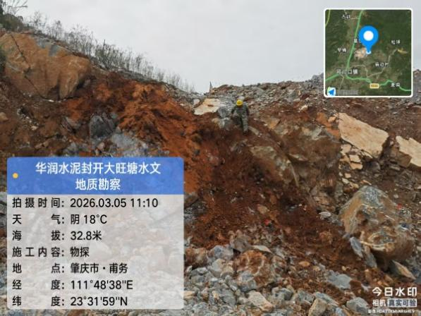

图3\.2\-4 地震仪及野外作业照

#### 野外工作方法

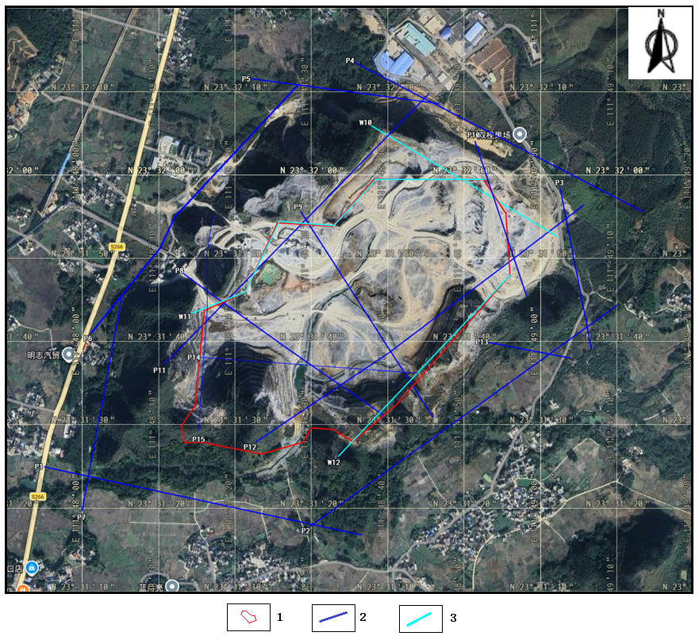

图3\.2\-5 物探测线布置图

1\-矿权范围；2\-高密度电阻率法测线及编号；3\-微动勘探测线及编号

本次物探采用高密度电法和微动两种物探方法进行测量。野外高密度电法共布设了15条剖面，剖面号为P1~P15，点距为5m，微动共布设3条，剖面号为W10~W12点距10m，分布于整个矿区范围（见图3\.2\-5）。

#### 数据处理

（1）高密度电法数据处理

1）数据整理与初步分析

每日勘探作业结束后，数据处理员及时将现场采集到的数据导入笔记本电脑，进行数据整理、备份，建立完善的数据档案，标注数据采集日期、勘探剖面、电极编号等信息，防止数据丢失。

对整理后的数据进行初步分析，剔除异常数据（如因设备故障、人为干扰导致的无效数据），对缺失数据进行补充采集（若条件允许），对异常数据进行标注，结合现场地质情况，初步判断异常数据的成因（如岩溶、地下水、断层等）。

初步计算每个勘探点的电阻率值，绘制简单的电阻率剖面图、平面等值线草图，结合现场踏勘资料，初步识别电阻率异常区域，标注异常区域的范围、埋深，为后期详细数据解译及现场勘探调整提供依据。

每日召开作业总结会，技术负责人、仪器操作员、数据处理员共同分析当日采集的数据及初步分析结果，排查数据采集过程中存在的问题，调整次日勘探参数或作业计划，确保勘探工作有序推进。

2）数据反演与解译

高密度电阻率法处理主要包括数据解编、数据编辑、加载地形、反演等。本次资料处理采用软件为RES2D高密度电阻率反演软件，根据反演成果电阻率等值线特征进行解释。

资料分析与解释是依据地下地层的物性差异。电磁法勘探是根据地下岩层电阻率差异、及其电磁波在地下传播时存在时差性，从而来观测地下视电阻率值和相位值。地下岩土层由于成因环境不同，同时受构造运动的影响，会在纵向和横向上产生视电阻率和相位上的变化；此外，岩土层电阻率值不仅与地层结构、构造、成分、成因有关，还与其岩石的颗粒大小、密度、地下水含量等因素有关。研究这些物性特征，可以推断地下地层的岩性、分布规律、断裂构造、富水性等情况。

（2）微动测量数据处理

在天然源面波法中，目前提取面波频散曲线的主要方法有三种，一种是安艺（Aki）提出的空间自相关（简称SPAC），一种是卡朋（Capon）提出的频率波数法（简称F\-K法），一种就是折射微动法（ReMi）。这三种方法均以从微动中提取信号为理论依据，利用长波微动的频散特性推断地下的速度结构。

空间自相关（SPAC）数据处理步骤如下：

1）将实测记录分成若干个数据段，剔除明显干扰大的数据段，将各数据段通过中心频率不同的窄带滤波处理，分别提取各个频率成分。

2）对各个频率成分分别计算各点之间的空间自相关系数并进行平均。

3）用不同观测自相关系数计算相速度，根据分别分布趋势拟合出相速度频散曲线。

4）建立初始速度模型。由实测相速度计算最大波长，取该波长的一半作为本次推测解释深度的下界，参照各种岩土的VS统计资料给出表层和最下层S波速度，中间层的波速在两者之间内插厘定。

5）用矩阵法正演拟合的方法求取地层速度构造，根据正演拟合结果把速度相邻的层归并为一层，同时修正模型参数，反复进行这样的拟合，使最后的层速度模型的理论频散与实测频散之差小于某一特定值。正演拟合得到地下随深度变化的S波速度分布，即地下S波速度构造。

天然源面波频率\-波数法是以稳定随机理论为基础，用最大似然法提取面波频率\-波数谱，求取面波相速度的过程。其工作流程为：各道面波信号－数字滤波－求取相似系数－计算频率\-速度功率谱－瑞雷波相速度频散曲线－反演横波速度模型。具体流程如下：

①根据计算点位置及计算道数提取剖面“一”字型阵列数据。

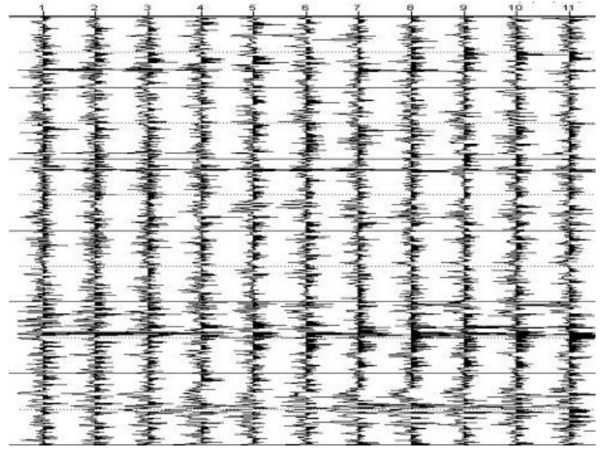

图3\.2\-6  提取阵列震动数据

②利用扩展空间自相关 SPAC 法拟合空间自相关系数与第一类零阶贝赛尔函数（图3\.2\-7）。

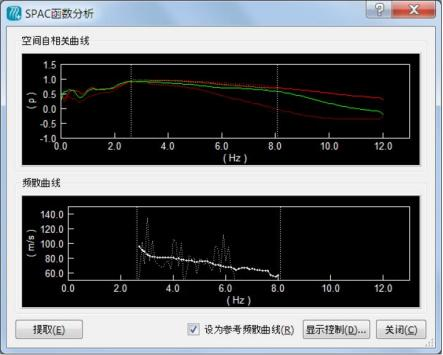

图3\.2\-7  ESPAC 拟合自相关曲线

③对于每一个特定的频率，相速度可通过拟合空间自相关系数与第一类零阶贝赛尔函数得到（图3\.2\-8）：

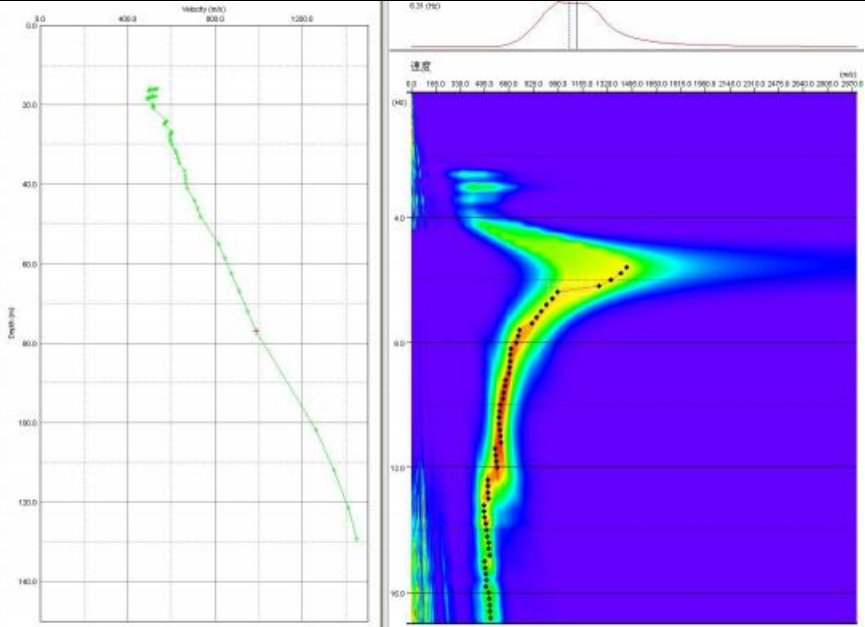

图3\.2\-8  ESPAC 法生成的频散图

计算出视 S 波速度后，可根据相速度频散曲线算得视 S 波速度随 深度的变化曲线（vs\- h 曲线），再利用光滑差值等计算处理后，即可 得到视 S 波速度的剖面图。

视 S 波速度不等于实际的S 波速度值，是拥有速度量纲的物性参 数，其变化趋势可以反映出实际的S 波速度变化，故可通过视 S 波速 度的剖面图进行地质诊断。

然后利用提取瑞雷波频散曲线反演得到地下视横波速度结构信息。常用的反演算法有半波法经验公式反演，半波法经验公式反演是一种采用经验公式对频散曲线进行反演计算的方法，探测目标剖面上对应的视 S 波速度的变化情况，以获取相应的地层构造。计算视 S 波速度半波法经验公式如下：

该方法用于剖面上岩性的相对变化而无需反演横波速度的绝对值。

式中vs 为视 S 波速度，vr 为瑞雷波相速度，ti=1/fi 为周期，对应的深度一般取半波长。

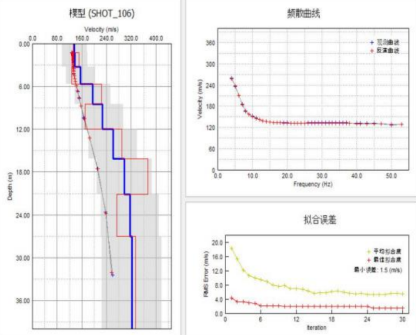

图3\.2\-9 视 S 波速度反演分层示意图

获取单测点的相速度、视横波速度及反演层参数后即可使用相关 的 GIS 类软件进行剖面成图分析及地质推断。

本次使用的处理软件为骄佳 Geogiga 9\.15 面波高级版（图3\.2\-10） 进行处理。

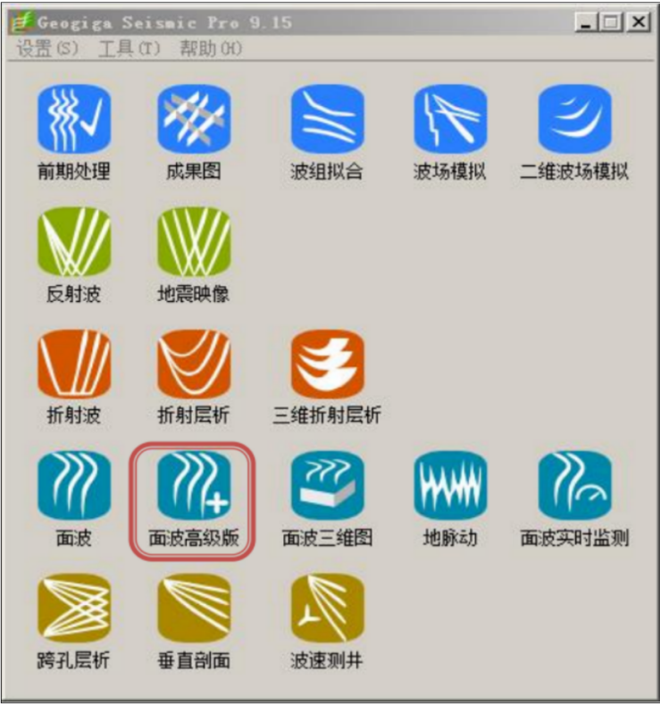

图3\.2\-10 天然源面波（微动）处理软件

### 解释依据

完成高密度电阻率法剖面15条，共计13\.86km，测点2830点，矿区内点距为5m，外围点距设为10m。高密度电阻率法剖面利用视电阻率等值线图圈定电性分异区域，并结合其他方法成果资料来进行综合性分析评价。一般情况下，视电阻率低阻区是断裂构造或裂隙发育区的反映，岩溶发育区大多为局部低阻圈闭。

本次微动测量共完成剖面3条，共计完成长度2\.93km，完成物理点296点。利用视横波速度等值线图圈定波速分异区域，依据矿区内主要地质体和岩溶发育区\-空腔的横波速度特征，并结合其他方法成果资料来进行综合性分析评价。局部变化的视横波速度区可能为局部裂隙发育引起；局部孤立的视横波速度异常可能为采空区\-空腔的反映。

### 成果解释

共计完成高密度电法剖面15条，每条测线进行温纳装置和偶极装置2次测量，温纳装置着重反映整体区域性构造及分布，而偶极装置则对局部细节有更明显的反应，现对各剖面进行解释。

#### P1线高密度成果解释

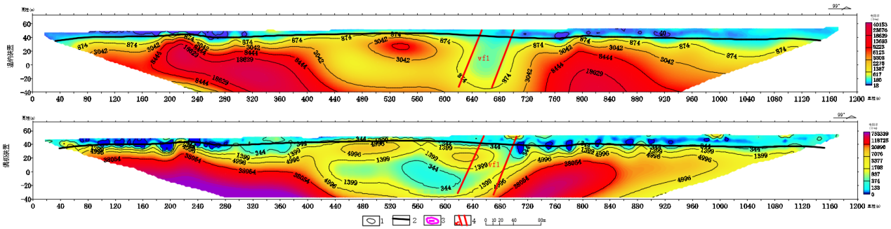

图3\.2\-11  P1物探剖面图

1\-电阻率等值线；2\-推断岩土分界面；3\-推断岩溶发育区；4\-推断构造破碎带或裂隙发育带

P1位于采区西南部，剖面长度1200m，方向为99°。由图3\.2\-11可以看出，纵向上剖面电阻率均逐渐递增，横向上剖面电阻率存在一定分异性，整体电阻率范围为0\-50000Ω\*m。第四系覆盖层厚度约为5\-20m，其中里程630\-680m段存在一贯通状低阻异常，推测该异常为构造破碎带或裂隙发育带引起并将其命名为wf1，倾向小里程方向，倾角约70°。

#### P2线高密度成果解释

P2位于采区中东部，剖面长度1400m，方向为54°。由图3\.2\-12可以看出，纵向上剖面电阻率均逐渐递增，横向上剖面电阻率存在一定分异性，整体电阻率范围为0~42000Ω\*m，第四系覆盖层厚度约为2\-13m，该剖面共圈定6处孤立的低阻异常区，命名为YC2\-1~YC2\-6,推测由岩溶发育区引起，异常区厚度约4\-9m不等。

剖面中里程910\-970m、1210\-1230m和1230\-1260m段均存在一贯通状低阻异常，推测该异常为构造破碎带或裂隙发育带引起并将其命名为wf6、wf2和wf3，wf6倾向小里程方向，倾角约72°；wf2倾向小里程方向，倾角约56°；wf3倾向大里程方向，倾角约31°。

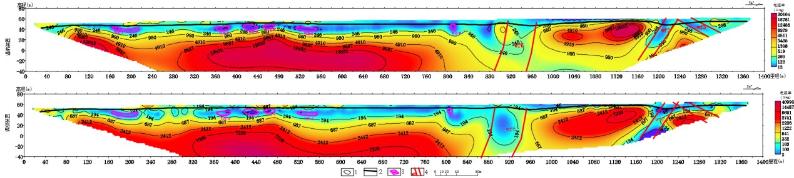

图3\.2\-12  P2物探剖面图

1\-电阻率等值线；2\-推断岩土分界面；3\-推断岩溶发育区；4\-推断构造破碎带或裂隙发育带

#### P3线高密度成果解释

P3剖面位于采区东部，剖面长度为600m，方向为349°。由图3\.2\-13可以看出，纵向上剖面电阻率均逐渐递增，横向上剖面电阻率受地层因素影响存在一定分异性，整体电阻率范围为10~30000Ω\*m，推测为完整地层，第四系覆盖层厚度约为0~19m。

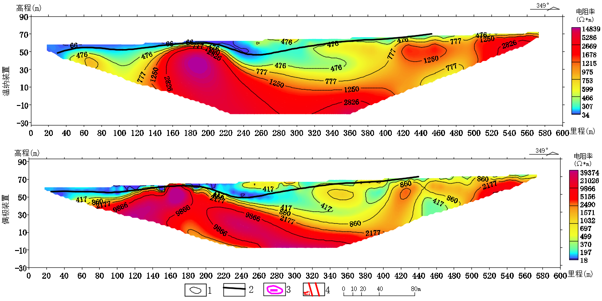

图3\.2\-13  P3综合物探剖面图

1\-电阻率等值线；2\-推断岩土分界面；3\-推断岩溶发育区；4\-推断构造破碎带或裂隙发育带

#### P4线高密度成果解释

P4位于采区东北部，剖面长度1200m，方向为117°。由图3\.2\-14可以看出，纵向上剖面电阻率均逐渐递增，横向上剖面电阻率存在一定分异性，整体电阻率范围为0~32000Ω\*m，第四系覆盖层厚度约为0~11m，该剖面共圈定1处孤立的低阻异常区，命名为YC4\-1，推测由岩溶发育区引起，异常区厚度约10m。

剖面中里程470~490m段存在一贯通状低阻异常，推测该异常为构造破碎带或裂隙发育带引起并将其命名为wf9，wf9倾向大里程方向，倾角约81°。

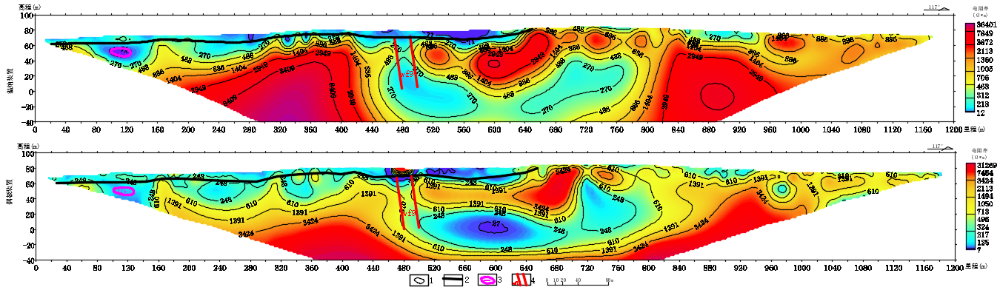

图3\.2\-14  P4综合物探剖面图

1\-电阻率等值线；2\-推断岩土分界面；3\-推断岩溶发育区；4\-推断构造破碎带或裂隙发育带

#### P5线高密度成果解释

P5位于采区北部，剖面长度700m，方向为97°。由图3\.2\-15可以看出，纵向上剖面电阻率均逐渐递增，横向上剖面电阻率存在一定分异性，整体电阻率范围为10~9×105Ω\*m，第四系覆盖层厚度约为5~17m，该剖面共圈定1处孤立的低阻异常区，命名为YC5\-1，推测由岩溶发育区引起，异常区厚度约8m。

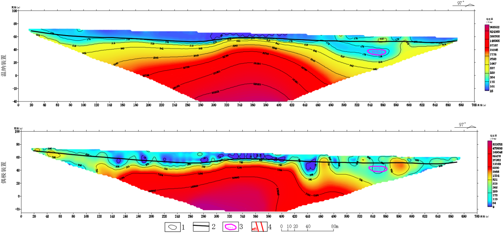

图3\.2\-15  P5综合物探剖面图

1\-电阻率等值线；2\-推断岩土分界面；3\-推断岩溶发育区；4\-推断构造破碎带或裂隙发育带

#### P6线高密度成果解释

P6位于采区西北部，剖面长度1200m，方向为97°。由图3\.2\-16可以看出，纵向上剖面电阻率均逐渐递增，横向上剖面电阻率存在一定分异性，整体电阻率范围为10~5×104Ω\*m，第四系覆盖层厚度约为4~8m，其中里程360~390m段存在一贯通状低阻异常，推测该异常为构造破碎带或裂隙发育带引起并将其命名为wf7，倾向小里程方向，倾角约72°。

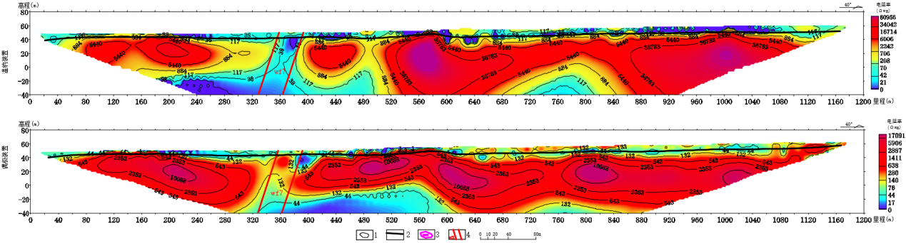

图3\.2\-16  P6综合物探剖面图

1\-电阻率等值线；2\-推断岩土分界面；3\-推断岩溶发育区；4\-推断构造破碎带或裂隙发育带

#### P7线高密度成果解释

P7位于采区中东部，剖面长度800m，方向为10°。由图3\.2\-17可以看出，纵向上剖面电阻率均逐渐递增，横向上剖面电阻率存在一定分异性，整体电阻率范围为0~5×105Ω\*m，第四系覆盖层厚度约为4~12m，该剖面圈定1处孤立的低阻异常区，命名为YC7\-1，推测由岩溶发育区引起，异常区厚度约15m。

剖面中里程410~440m段存在一贯通状低阻异常，推测该异常为构造破碎带或裂隙发育带引起并将其命名为wf10，wf10倾向大里程方向，倾角约77°。

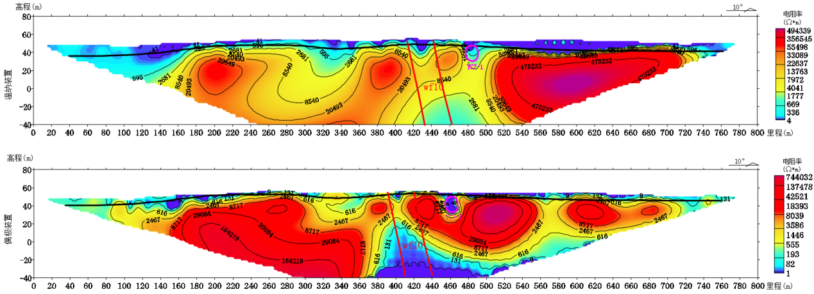

图3\.2\-17  P7综合物探剖面图

1\-电阻率等值线；2\-推断岩土分界面；3\-推断岩溶发育区；4\-推断构造破碎带或裂隙发育带

#### P8线高密度成果解释

P8位于采区中南部，剖面长度800m，方向为125°。由图3\.2\-18可以看出，纵向上剖面电阻率均逐渐递增，横向上剖面电阻率存在一定分异性，整体电阻率范围为0~1×105Ω\*m，剖面位于矿区开采面，该剖面圈定12处孤立的低阻异常区，命名为YC8\-1~YC8\-12，推测由岩溶发育区引起，异常区厚度约6~22m不等。

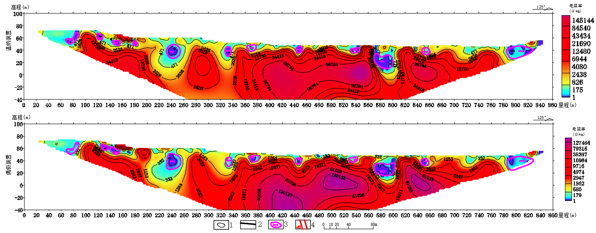

图3\.2\-18  P8综合物探剖面图

1\-电阻率等值线；2\-推断岩土分界面；3\-推断岩溶发育区；4\-推断构造破碎带或裂隙发育带

#### P9线高密度成果解释

P9位于采区中部，剖面长度900m，方向为147°。由图3\.2\-19可以看出，纵向上剖面电阻率均逐渐递增，横向上剖面电阻率存在一定分异性，整体电阻率范围为0~3×105Ω\*m，剖面位于矿区开采面，该剖面圈定4处孤立的低阻异常区，命名为YC9\-1~YC9\-4，推测由岩溶发育区引起，异常区厚度约11~26m不等。后经钻孔SK10\-2验证，埋深约19~36m处存在多层岩溶发育区（钻孔柱状图见图3\.2\-20），与物探结果YC19\-2处相吻合。

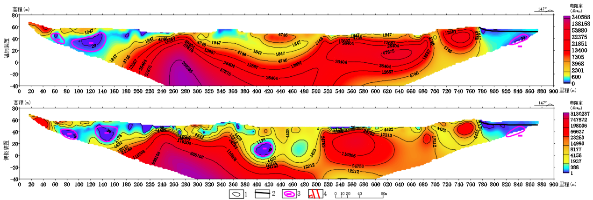

图3\.2\-19  P9综合物探剖面图

1\-电阻率等值线；2\-推断岩土分界面；3\-推断岩溶发育区；4\-推断构造破碎带或裂隙发育带

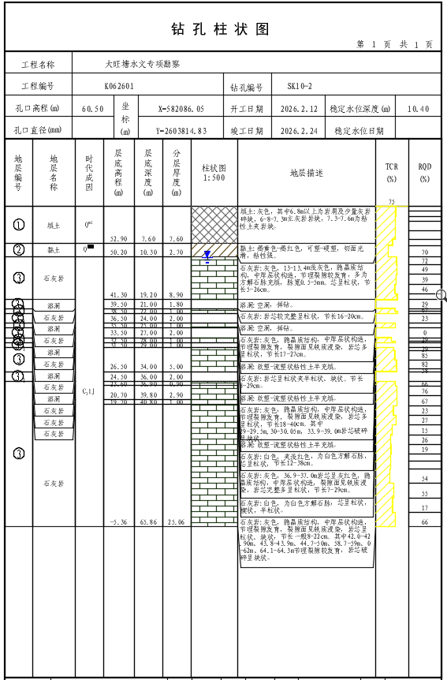

图3\.2\-20  SK10\-2钻孔柱状图

#### P10线高密度成果解释

P10位于采区中北部，剖面长度650m，方向为161°。由图3\.2\-21可以看出，纵向上剖面电阻率均逐渐递增，横向上剖面电阻率存在一定分异性，整体电阻率范围为0~1×104Ω\*m，剖面位于矿区开采面，该剖面共圈定6处孤立的低阻异常区，命名为YC10\-1~YC10\-6，推测由岩溶发育区引起，异常区厚度约10~16m不等。

剖面中里程460~480m段存在一贯通状低阻异常，推测该异常为构造破碎带或裂隙发育带引起并将其命名为wf2，wf2倾向大里程方向，倾角约65°。

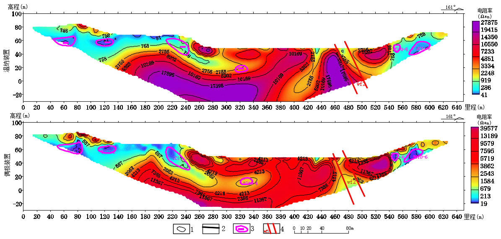

图3\.2\-21  P10综合物探剖面图

1\-电阻率等值线；2\-推断岩土分界面；3\-推断岩溶发育区；4\-推断构造破碎带或裂隙发育带

#### P11线高密度成果解释

P11位于采区中西部，剖面长度1100m，方向为44°。由图3\.2\-22可以看出，纵向上剖面电阻率均逐渐递增，横向上剖面电阻率存在一定分异性，整体电阻率范围为10~1×105Ω\*m，剖面位于矿区开采面，该剖面共圈定10处孤立的低阻异常区，命名为YC11\-1~YC11\-10，推测由岩溶发育区引起，异常区厚度约10~30m不等。

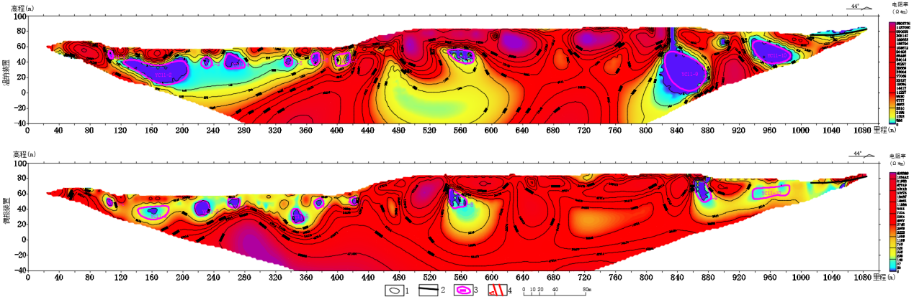

图3\.2\-22  P11综合物探剖面图

1\-电阻率等值线；2\-推断岩土分界面；3\-推断岩溶发育区；4\-推断构造破碎带或裂隙发育带

#### P12线高密度成果解释

P12与P2为平行剖面，位于采区中部，剖面长度1500m，方向为54°。由图3\.2\-23可以看出，纵向上剖面电阻率均逐渐递增，横向上剖面电阻率存在一定分异性，整体电阻率范围为20~68200Ω\*m，第四系覆盖层厚度约为0~7m，该剖面共圈定3处孤立的低阻异常区，推测该异常由岩溶发育区引起，命名为YC12\-1~YC12\-3，埋深约3~10m。

在剖面里程195~222m、395~400m、790~845m和1125~1145m段均存在一贯通状低阻异常，推测该4处异常均为断层破碎带引起并将其命名为wf4、wf5、wf6和wf2，wf4倾向大里程方向，倾角约78°；wf5深部分别向两侧延伸；wf6倾向小里程方向，倾角约51°；wf2倾向小里程方向，倾角约56°。

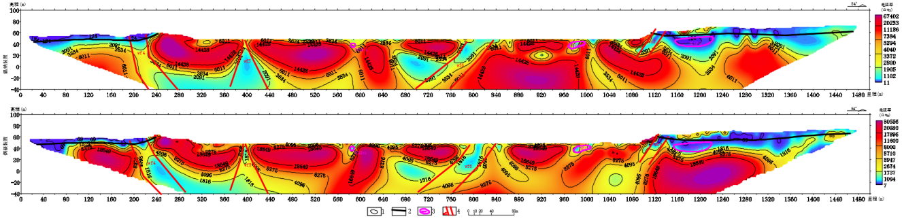

图3\.2\-23  P12综合物探剖面图

1\-电阻率等值线；2\-推断岩土分界面；3\-推断岩溶发育区；4\-推断构造破碎带或裂隙发育带

#### P13线高密度成果解释

P13位于采区东部，剖面长度300m，方向为101°。由图3\.2\-24可以看出，纵向上剖面电阻率均逐渐递增，横向上剖面电阻率存在一定分异性，整体电阻率范围为20~30200Ω\*m，第四系覆盖层厚度约为0~7m，其中里程60~105m段存在一串珠状孤立的低阻异常区，推测该异常由岩溶发育区引起，命名为YC12\-1~YC12\-5，埋深约12~22m。

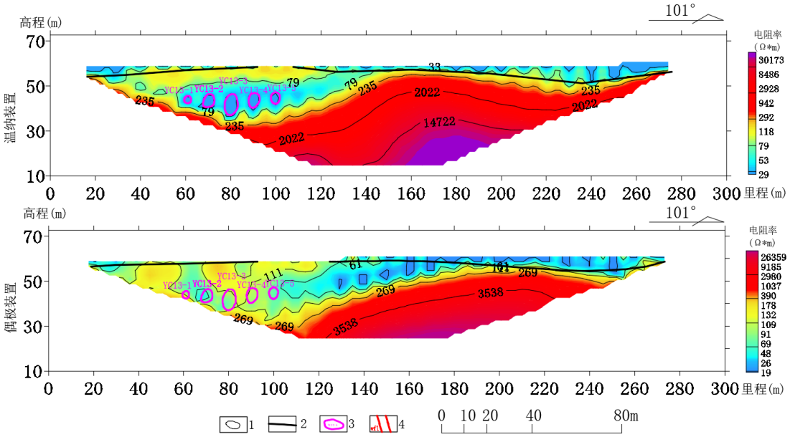

图3\.2\-24  P13综合物探剖面图

1\-电阻率等值线；2\-推断岩土分界面；3\-推断岩溶发育区；4\-推断构造破碎带或裂隙发育带

#### P14线高密度成果解释

P14位于采区中南部，剖面长度820m，方向为94°。由图3\.2\-25可以看出，纵向上剖面电阻率均逐渐递增，横向上剖面电阻率存在一定分异性，整体电阻率范围为20~7×104Ω\*m，剖面位于采场内，该剖面共圈定6处孤立的低阻异常区，推测该异常由岩溶发育区引起，命名为YC14\-1~YC14\-6，异常区厚度约8~23m。

在剖面里程470~485m段存在一贯通状低阻异常，推测该异常均为断层破碎带引起并将其命名为wf8，深部分别向两侧延伸。

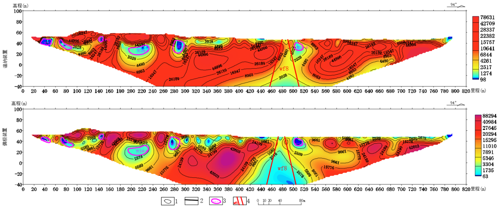

图3\.2\-25  P14综合物探剖面图

1\-电阻率等值线；2\-推断岩土分界面；3\-推断岩溶发育区；4\-推断构造破碎带或裂隙发育带

#### P15线高密度成果解释

P14位于采区中南部，剖面长度820m，方向为94°。由图3\.2\-26可以看出，纵向上剖面电阻率均逐渐递增，横向上剖面电阻率存在一定分异性，整体电阻率范围为20~6×106Ω\*m，剖面位于采场内，该剖面共圈定3处孤立的低阻异常区，推测该异常由岩溶发育区引起，命名为YC15\-1~YC15\-3，异常区厚度约6~20m。

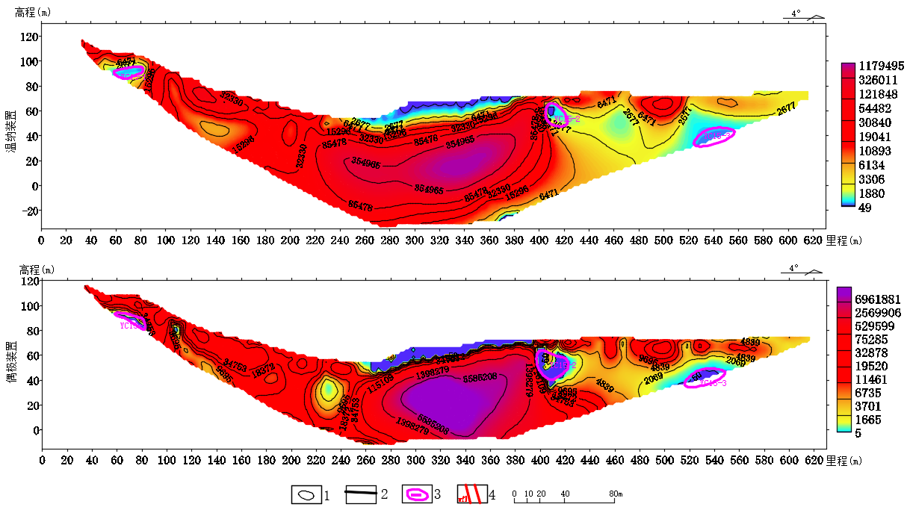

图3\.2\-26  P15综合物探剖面图

1\-电阻率等值线；2\-推断岩土分界面；3\-推断岩溶发育区；4\-推断构造破碎带或裂隙发育带

#### W10线微动成果解释

W10位于采区北部，剖面长度800m，方向为120°。由图3\.2\-27可以看出，纵向上视横波速度均逐渐递增，横向上视横波速度相存在一定分异性，整体视横波速度范围为200~8200m/s。该剖面上共圈定5处低速异常，推测该异常由岩溶发育区引起，命名为YCW10\-1~ YCW10\-5。

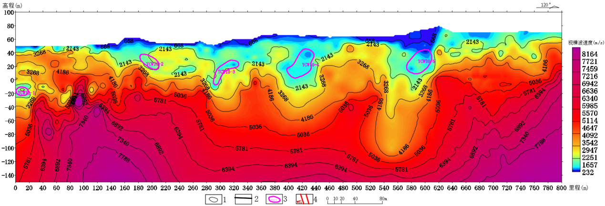

图3\.2\-27  W10综合物探剖面图

1\-电阻率等值线；2\-推断岩土分界面；3\-推断岩溶发育区；4\-推断构造破碎带或裂隙发育带

#### W11线微动成果解释

W11位于采区西部，为折线剖面，沿矿权边界分布，剖面长度1300m。由图3\.2\-28可以看出，纵向上视横波速度均逐渐递增，横向上视横波速度相存在一定分异性，整体视横波速度范围为100~9800m/s。该剖面上共圈定10处低速异常，推测该异常由岩溶发育区引起，命名为YCW11\-1~ YCW11\-10。

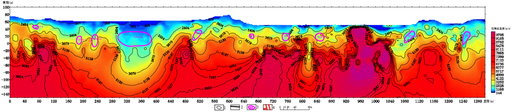

图3\.2\-28  W11综合物探剖面图

1\-电阻率等值线；2\-推断岩土分界面；3\-推断岩溶发育区；4\-推断构造破碎带或裂隙发育带

#### W12线微动成果解释

W11位于采区东南部，沿矿权边界分布，剖面长度830m，剖面方向43°。由图3\.2\-29可以看出，纵向上视横波速度均逐渐递增，横向上视横波速度相存在一定分异性，整体视横波速度范围为200~12000m/s。该剖面上共圈定8处低速异常，推测该异常由岩溶发育区引起，命名为YCW12\-1~ YCW12\-8。

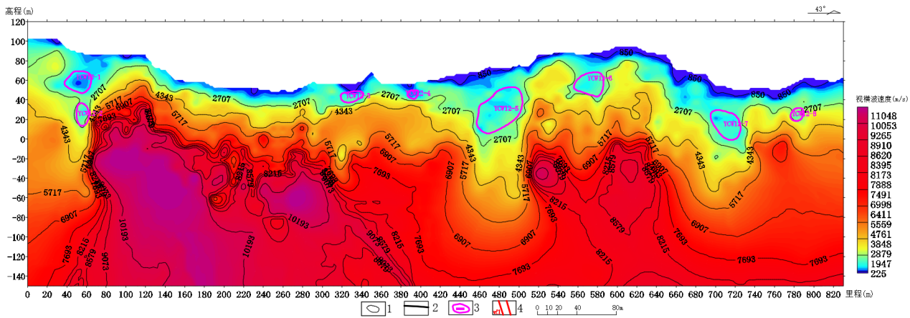

图3\.2\-29  W12综合物探剖面图

1\-电阻率等值线；2\-推断岩土分界面；3\-推断岩溶发育区；4\-推断构造破碎带或裂隙发育带

### 物探成果

综合分析物探成果，并与以往钻物探资料相互印证，勘察区内共划定推断断层10处，分别命名为wf1\-wf10；岩溶发育区81处，分布于整个矿区（详情见表3\.2\-1、图3\.2\-30），工区其他位置电阻率无明显的突变。

表3\.2\-1  物探异常成果统计表

异常

编号

测线号

测线

里程\(m\)

埋深（m）

面积（m2）

异常成因

wf1

P1

630\-680

\\

\\

由构造破碎带或裂隙发育带引起

wf2

P2

1210\-1230

\\

\\

由构造破碎带或裂隙发育带引起

P10

460\-480

\\

\\

由构造破碎带或裂隙发育带引起

P12

1125\-1145

\\

\\

由构造破碎带或裂隙发育带引起

wf3

P2

1230\-1260

\\

\\

由构造破碎带或裂隙发育带引起

wf4

P12

195\-222

\\

\\

由构造破碎带或裂隙发育带引起

wf5

P12

395\-400

\\

\\

由构造破碎带或裂隙发育带引起

wf6

P12

790\-845

\\

\\

由构造破碎带或裂隙发育带引起

P2

910\-970

\\

\\

由构造破碎带或裂隙发育带引起

wf7

P6

360\-390

\\

\\

由构造破碎带或裂隙发育带引起

wf8

P14

470\-485

\\

\\

由构造破碎带或裂隙发育带引起

wf9

P4

470\-490

\\

\\

由构造破碎带或裂隙发育带引起

wf10

P7

410\-440

\\

\\

由构造破碎带或裂隙发育带引起

YC2\-1

P2

165\-215

10\-15

295

由岩溶发育区引起

YC2\-2

P2

360\-385

11\-18

166

由岩溶发育区引起

YC2\-3

P2

415\-440

7\-16

166

由岩溶发育区引起

YC2\-4

P2

450\-470

7\-11

54

由岩溶发育区引起

YC2\-5

P2

510\-550

12\-18

213

由岩溶发育区引起

YC2\-6

P2

805\-815

8\-18

75

由岩溶发育区引起

YC4\-1

P4

100\-130

19\-30

206

由岩溶发育区引起

YC5\-1

P5

535\-565

21\-29

184

由岩溶发育区引起

YC7\-1

P7

478\-495

4\.5\-22

191

由岩溶发育区引起

YC8\-1

P8

70\-90

3\-21

166

由岩溶发育区引起

YC8\-2

P8

120\-130

4\.5\-15

76

由岩溶发育区引起

YC8\-3

P8

143\-158

10\-18

79

由岩溶发育区引起

YC8\-4

P8

178\-185

5\-13

40

由岩溶发育区引起

YC8\-5

P8

230\-258

10\-33

389

由岩溶发育区引起

YC8\-6

P8

325\-340

7\-21

114

由岩溶发育区引起

YC8\-7

P8

362\-380

3\.5\-13

131

由岩溶发育区引起

YC8\-8

P8

444\-455

1\-11\.5

87

由岩溶发育区引起

YC8\-9

P8

530\-546

5\-12

90

由岩溶发育区引起

YC8\-10

P8

570\-600

13\-38

545

由岩溶发育区引起

YC8\-11

P8

650\-660

4\-15

116

由岩溶发育区引起

YC8\-12

P8

785\-830

3\-23

608

由岩溶发育区引起

YC9\-1

P9

70\-98

14\-30

335

由岩溶发育区引起

YC9\-2

P9

118\-190

8\.5\-36

1251

由岩溶发育区引起

YC9\-3

P9

395\-425

27\-50

542

由岩溶发育区引起

YC9\-4

P9

820\-850

8\-25

275

由岩溶发育区引起

YC10\-1

P10

45\-78

18\-32

309

由岩溶发育区引起

YC10\-2

P10

105\-135

11\-20

212

由岩溶发育区引起

YC10\-3

P10

210\-245

7\-30

466

由岩溶发育区引起

YC10\-4

P10

315\-330

27\-35

135

由岩溶发育区引起

YC10\-5

P10

545\-558

5\-16

79

由岩溶发育区引起

YC10\-6

P10

570\-590

15\-33

352

由岩溶发育区引起

YC11\-1

P11

105\-110

7\-17

44

由岩溶发育区引起

YC11\-2

P11

122\-205

14\-44

1608

由岩溶发育区引起

YC11\-3

P11

225\-239

10\-25

151

由岩溶发育区引起

YC11\-4

P11

255\-280

6\-25

367

由岩溶发育区引起

YC11\-5

P11

330\-342

11\-24

103

由岩溶发育区引起

YC11\-6

P11

365\-378

7\-22

125

由岩溶发育区引起

YC11\-7

P11

395\-415

10\-25

265

由岩溶发育区引起

YC11\-8

P11

540\-578

27\-44

450

由岩溶发育区引起

YC11\-9

P11

820\-880

29\-75

1899

由岩溶发育区引起

YC11\-10

P11

938\-985

11\-40

935

由岩溶发育区引起

YC12\-1

P12

580\-590

4\-12

43

由岩溶发育区引起

YC12\-2

P12

977\-1005

4\-15

242

由岩溶发育区引起

YC12\-3

P12

1150\-1220

15\-32

856

由岩溶发育区引起

YC13\-1

P13

59\-62

13\-16

7\.9

由岩溶发育区引起

YC13\-2

P13

68\-72

12\-17

22\.7

由岩溶发育区引起

YC13\-3

P13

78\-82

12\-21

42\.7

由岩溶发育区引起

YC13\-4

P13

88\-92

12\-18

24\.7

由岩溶发育区引起

YC13\-5

P13

99\-102

11\-17

16\.1

由岩溶发育区引起

YC14\-1

P14

30\-53

5\-16

186

由岩溶发育区引起

YC14\-2

P14

64\-90

5\-23

181

由岩溶发育区引起

YC14\-3

P14

140\-150

6\-16

66

由岩溶发育区引起

YC14\-4

P14

197\-237

21\-39

466

由岩溶发育区引起

YC14\-5

P14

280\-300

10\-33

382

由岩溶发育区引起

YC14\-6

P14

500\-520

5\-19

180

由岩溶发育区引起

YC15\-1

P15

58\-82

14\-26

126

由岩溶发育区引起

YC15\-2

P15

398\-424

8\-31

418

由岩溶发育区引起

YC15\-3

P15

518\-550

22\-38

320

由岩溶发育区引起

YCW10\-1

W10

0\-20

60\-73

179

由岩溶发育区引起

YCW10\-2

W10

180\-210

21\-44

388

由岩溶发育区引起

YCW10\-3

W10

290\-330

30\-63

495

由岩溶发育区引起

YCW10\-4

W10

400\-440

20\-63

999

由岩溶发育区引起

YCW10\-5

W10

570\-610

28\-62

898

由岩溶发育区引起

YCW11\-1

W11

62\-78

16\-27

114

由岩溶发育区引起

YCW11\-2

W11

180\-198

40\-63

252

由岩溶发育区引起

YCW11\-3

W11

224\-240

34\-68

450

由岩溶发育区引起

YCW11\-4

W11

275\-385

28\-67

3082

由岩溶发育区引起

YCW11\-5

W11

500\-524

27\-54

408

由岩溶发育区引起

YCW11\-6

W11

655\-670

24\-36

121

由岩溶发育区引起

YCW11\-7

W11

744\-764

21\-43

332

由岩溶发育区引起

YCW11\-8

W11

835\-860

21\-43

398

由岩溶发育区引起

YCW11\-9

W11

1080\-1110

17\-48

451

由岩溶发育区引起

YCW11\-10

W11

1240\-1260

26\-61

425

由岩溶发育区引起

YCW12\-1

W12

40\-60

18\-39

450

由岩溶发育区引起

YCW12\-2

W12

40\-60

50\-73

233

由岩溶发育区引起

YCW12\-3

W12

320\-340

7\-18

197

由岩溶发育区引起

YCW12\-4

W12

382\-395

6\-15

74

由岩溶发育区引起

YCW12\-5

W12

458\-505

19\-65

1501

由岩溶发育区引起

YCW12\-6

W12

555\-590

18\-40

553

由岩溶发育区引起

YCW12\-7

W12

700\-730

24\-54

667

由岩溶发育区引起

YCW12\-8

W12

775\-790

24\-37

135

由岩溶发育区引起

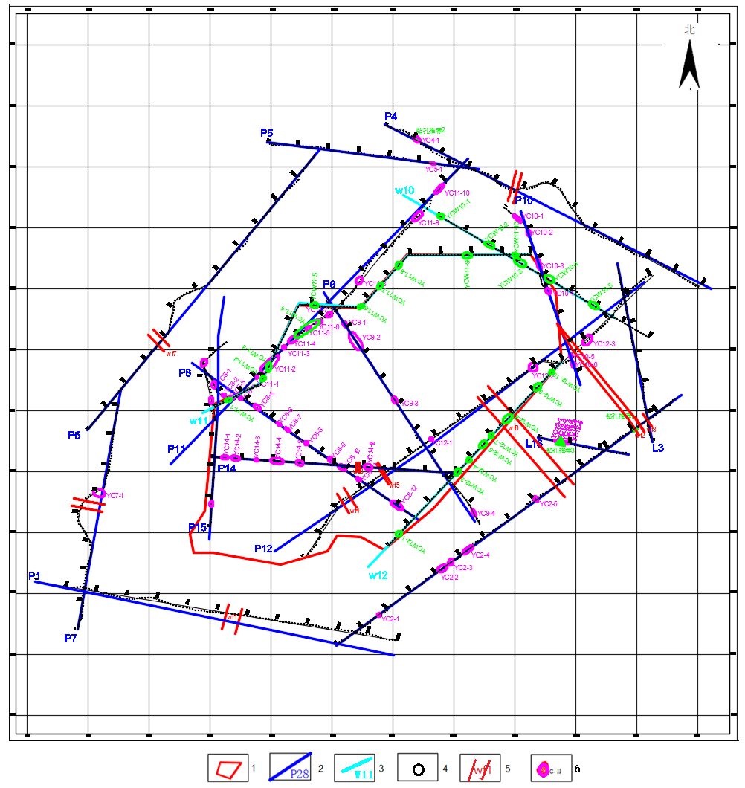

图3\.2\-30  平面异常推断图

矿区范围；2\-高密度电法测线及编号；3\-微动测线及编号；4\-各方法测点及编号；

1. 推断构造破碎带或裂隙发育带；6\-推断岩溶发育区或溶洞

### 成果验证

为验证本次物探成果的可靠性与准确性，本次验证工作选取物探测线上的22个钻孔作为验证点，将物探剖面推断的含水层分布、岩溶发育带位置等成果，与钻孔揭露的含水层情况及岩溶发育带进行对比分析，评估物探解释成果的吻合度，明确本次使用的高密度电阻法及微动在本矿区复杂岩溶水文地质条件下的适用性，为后续矿区水文地质条件综合评价及矿区防治水工程设计提供精准的基础数据支撑。

表3\.2\-2 钻孔验证物探成果表

序号

验证

钻孔

物探成果

钻探揭露

是否

吻合

备注

物探

类型

1

SK16\-1

W10物探线230~265m段，30~8m高程范围内有异常低速区（V<2327m/s）。W11物探线1200~1220m段，29~9m高程范围内见异常低速区（V<2632m/s）。

30~8m高程范围内岩芯较破碎，未见岩溶发育现象。

是

物探推测疑似岩溶发育或破碎带，钻孔揭露破碎带。

微动探测法

2

SK16\-2

W10物探线340~380m段，20m高程以上为低速区（V<2327m/s）。

69\.71~57\.00m高程范围内见双层溶洞，57~35m高程范围见铁质浸染与节理裂隙，35~28m岩芯较破碎。

是

物探低速区钻探见溶洞及裂隙，验证结果高度吻合。

微动探测法

3

SK16\-3

W10物探线445~455m段，27m高程以上为低速区（V<2327m/s）。

29\.28m高程以上见白云岩填充、铁质浸染，岩芯较破碎，29\.28~27\.48m高程范围见溶洞。

是

物探低速区钻探见岩溶裂隙与溶洞，结果吻合。

微动探测法

4

SK11\-1

W11物探线130~150m段，20m高程以上为低速区（V<2632m/s）。

47~45\.5m高程范围见铁质浸染，未见明显破碎带或岩溶发育现象。

否

物探推测疑似岩溶发育或破碎带，钻孔未揭露，结果不吻合。

微动探测法

5

SK9\-1

W11物探线320~340m段，\-25m高程以上为低速区（V<2632m/s），49~40m高程范围物探解译一溶洞（YCW11\-4）。

53\.35~28\.95m高程范围内共揭露5处溶洞，溶洞总深度10\.85m，其中47\.45~43\.55m高程范围揭露YCW11\-4溶洞。

是

该区位于原大旺塘，受地表水入渗影响较大，导致在浅部强岩溶发育，且部分延伸至深部，结果吻合。

微动探测法

6

SK0\-1

W11物探线440~460m段，28m高程以上为低速区（V<2632m/s）。

61\.22~55\.92m高程范围为碎石层，55\.92~50\.65m高程范围为粉砂，50\.65~46\.37高程范围为粘土，39\.92~36\.22高程范围内见溶洞，36\.22~26\.12m见铁质浸染。

是

物探表层低速区钻孔揭露为性质松散的软弱带，中部低速区钻孔揭露溶洞及岩溶裂隙，结果吻合。

微动探测法

7

SK10\-1

W11物探线620~630m段，42m高程以上为低速区（V<2632m/s）。

58\.03~54\.87m高程范围为粘土，42m高程以上见少量岩芯破碎及铁质浸染，未见明显岩溶发育现象。

是

物探显示该区岩溶裂隙弱发育，钻孔未揭露明显岩溶及构造现象，结果吻合。

微动探测法

8

SK2\-2

W11物探线710~730m段，35m高程以上为低速区（V<2632m/s）。

50\.02~45\.02m高程范围为爆破碎石，并见铁质浸染，未见明显岩溶发育现象。

是

物探显示该区岩溶裂隙弱发育，钻孔未揭露明显岩溶及构造现象，结果吻合。

微动探测法

9

SK12\-2

W11物探线795~805m段，25m高程以上为低速区（V<2632m/s）。

25m高程以上岩芯较破碎并见铁质浸染，揭露少量破碎带，未见溶洞

是

物探显示浅层岩溶发育或破碎带，钻孔揭露少量破碎带，结果吻合。

微动探测法

10

SK14\-1

W11物探线930\-950m段无低速区（V>3404m/s）。

岩芯整体较完整，未见明显破碎带及岩溶发育现象

是

物探显示该区岩溶裂隙弱发育，钻孔未揭露明显岩溶及构造现象，结果吻合。

微动探测法

11

SK14\-2

W11物探线1000~1020m段，25m高程以上为低速区（V<2632m/s）。

25m高程以上岩芯较破碎，见极少量铁质浸染，未见岩溶发育与节理裂隙，推测为机械破碎。25m高程以下岩芯较为完整。

是

物探显示该区岩溶裂隙弱发育，钻孔未揭露明显岩溶及构造现象，结果吻合。

微动探测法

12

SK6\-2

W11物探线1120~1130m段，35m高程以上为低速区（V<2632m/s）。

35m高程以上RQD较低，见少量铁质侵染。35m高程以下岩芯较完整，未见明显岩溶现象及构造裂隙。

是

物探显示该区岩溶裂隙弱发育，钻孔未揭露明显岩溶及构造现象，结果吻合。

微动探测法

13

SK0\-2

W12物探线190~210m段，42m高程以上为低速区（V<2494m/s）。

42m高程以上见少量岩芯破碎，未见明显岩溶发育现象。

是

物探显示该区岩溶裂隙弱发育，钻孔未揭露明显岩溶及构造现象，结果吻合。

微动探测法

14

SK10\-6

W12物探线340~350m段，39m高程以上为低速区（V<2494m/s）。

50\.24~47\.84m高程范围内为碎石层，39m高程以上见少量岩芯破碎及铁质侵染，未见明显岩溶发育现象。

是

物探显示该区岩溶裂隙弱发育，钻孔未揭露明显岩溶及构造现象，结果吻合。

微动探测法

15

SK2\-1

W12物探线390~400m段，46m高程以上为低速区（V<2494m/s）。

50\.01~47\.01m高程范围内为碎石层，46m高程以上见少量岩芯破碎及铁质侵染，未见明显岩溶发育现象。

是

物探显示该区岩溶裂隙弱发育，钻孔未揭露明显岩溶及构造现象，结果吻合。

微动探测法

16

SK14\-4

W12物探线690~700m段，\-1m高程以上为低速区（V<2494m/s）。

54\.67~47\.67m高程范围内为填土层，37\.92~36\.17m、25\.67~24\.67m高程范围内岩芯较破碎，未见明显岩溶发育现象

是

物探低速区推测疑似岩溶发育，钻孔揭露疑似破碎带，结果吻合

微动探测法

17

SK6\-3

W12物探线760~780m段，33m高程以上为低速区（V<2494m/s）。

52\.54~46\.62m高程范围内为碎石层，41\.31~39\.00m高程范围揭露溶洞

否

物探显示该区岩溶裂隙弱发育，钻孔揭露溶洞，结果不吻合。

微动探测法

18

SK9\-8

P2物探线415~440m段，44~37m高程范围内见低阻异常，物探解译为溶洞（YC2~3）。

该段上部节理裂隙发育，42\.45\-39\.35高程范围内见溶洞，洞内粘土充填，溶洞深度3\.1m。

是

物探推断为溶洞，钻孔揭露溶洞，验证结果吻合。

高密度电法

19

SK10\-2

P9物探线160~190m段，50~20m高程范围内见低阻异常，物探解译为溶洞（YC9~2）。

该段整体节理裂隙较为发育，裂面偶见铁质浸染，41\.30\-24\.50高程范围内见五处溶洞，洞内无充填，溶洞总深度8\.8m。

是

物探推断为溶洞，钻孔揭露溶洞，验证结果吻合。

高密度电法

20

SK10\-3

P9物探线580~600m段，5m高程以下显示电阻率高。

表层为矿区爆破碎石层，未揭露岩溶发育带，岩芯整体较完整。

是

物探显示该段岩层较完整，与钻孔揭露情况吻合。

高密度电法

21

SK10\-4

P9物探线720~740m段显示电阻率高。

钻孔未揭露岩溶发育带，岩芯整体较完整。

是

物探显示该段岩层较完整，与钻孔揭露情况吻合。

高密度电法

22

SK10\-5

P9物探线760~780m段显示电阻率高。

钻孔未揭露岩溶发育带，岩芯整体较完整。

是

物探显示该段岩层较完整，与钻孔揭露情况吻合。

高密度电法

23

SK16\-2

P10物探线210\-240m段、50高程以上显示为低阻区，物探解译为溶洞（YC10\-3）。

该段岩溶裂隙较为发育，裂面可见铁质浸染，65\.21\-57\.71范围内见双层溶洞，洞内粘土充填。

是

物探解译为溶洞，与钻孔揭露情况吻合。

高密度电法

24

SK16\-4

P10物探线430~450m段、35m高程以上为低阻区，35m以下为高阻区。

该段节理裂隙发育，岩芯呈短柱状或碎块状，裂面见铁质浸染，40\.19~38\.57高程范围为溶洞，洞内无充填，\-0\.47~\-2\.76m高程范围内发育一处溶洞。

否

物探推测该区域岩溶发育，但深部未发现明显岩溶异常，与钻孔揭露情况不完全吻合。

高密度电法

25

SK16\-6

P10物探线430~450m段、35m高程以上为低阻区，35m以下为高阻区。

钻孔在高程36\.46~34\.46m范围内发育一处溶洞，在22\.4~20\.4m、18\.4~17\.4m、\-5\.5~\-7\.5m处也发育有溶洞。

否

物探推测该区域岩溶发育，但深部未发现明显岩溶异常，与钻孔揭露情况不完全吻合。

高密度电法

26

SK5\-1

P15物探线130~150m段，整体为高阻区。

钻孔未揭露岩溶发育带，岩芯整体较完整。

是

物探显示该段岩层较完整，与钻孔揭露情况吻合。

高密度电法

27

SK13\-1

P15物探线200~220m段，整体为高阻区。

钻孔未揭露岩溶发育带，岩芯整体较完整。

是

物探显示该段岩层较完整，与钻孔揭露情况吻合。

高密度电法

28

SK3\-3

P15物探线300~320m段，整体为高阻区。

钻孔未揭露岩溶发育带，岩芯整体较完整。

是

物探显示该段岩层较完整，与钻孔揭露情况吻合。

高密度电法

本次物探验证工作通过28组钻探孔位，对微动探测法、高密度电法两种物探成果进行验证，整体准确率达82\.1%。

微动探测法验证情况：完成17组钻孔验证，15组成果吻合，吻合率88\.2%。物探圈定的低速异常区，与钻探揭露的溶洞、构造破碎带、节理裂隙发育段对应关系良好；仅2组出现偏差，分别为SK11\-1孔位物探推测的浅部异常区未被钻孔证实，以及SK6\-3孔位物探判断的岩溶弱发育区实际揭露溶洞，反映出该方法对局部小型岩溶体的识别精度存在一定局限。

高密度电法验证情况：完成11组钻孔验证，8组成果吻合，吻合率72\.7%。物探解译的低阻溶洞异常、高阻完整岩层区，均与钻探揭露情况高度匹配；3组偏差集中在SK16\-4、SK16\-6孔位，表现为物探未识别到深部岩溶发育，体现出该方法对深部小尺度岩溶体的探测能力不足。

两类物探方法在矿区浅部岩溶、破碎带的探测上精度较高，可有效指导矿区水文地质勘察初步定位工作；但对深部岩溶、局部小型溶洞的识别存在明显局限性。建议后续勘察工作中，结合本次验证的钻孔资料优化物探解译参数，同时在物探异常区加密钻探孔距，进一步提升勘察成果的准确性。

## 水文地质钻探

### 水文地质钻孔

本次水文地质钻探完成66个钻孔施工，总进尺5462\.42 m，各钻孔信息详见下表。所有钻孔均根据矿区水文地质条件调查需求进行布置，主要目的包括：查明岩溶发育特征与富水性、判断地下水流向与补给来源、验证物探结果、通过压水试验和抽水试验获取岩层水文地质参数等。

钻孔类型涵盖水文地质孔、压水试验孔和抽水试验孔，其中SK0\-1、SK2\-1、SK2\-2、SK3\-1、SK3\-3、SK9\-1、SK9\-3、SK12\-3、SK14\-2、SK16\-1、SK16\-3、SK16\-5、SK16\-9为压水试验孔，共13个；SK9\-5、SK4\-1、SK16\-6、SK16\-8、SK12\-6、SK9\-7为6个抽水试验孔。钻孔深度范围在55~150 m之间，孔口标高介于49\.66~80\.95m，水位埋深较浅，最小静水位埋深为0m，最大静水水位埋深为27\.89 m。钻孔位置主要分布于矿区内、各边界附近及断层带附近及物探查明的可疑地段，针对岩溶主要发育区、断层影响带及边界可能集中径流通道进行了重点控制。

__表3\.3\-1__ 水文地质勘察钻孔信息一览表

序号

名称

坐标

孔口标高

钻孔深度

静水位

静水位埋深

钻孔类型

X

Y

（m）

（m）

（m）

（m）

1

SK0\-1

581913\.5172

2603918\.665

61\.22

87\.87

50\.2

11\.02

压水试验孔

2

SK0\-2

582306\.7852

2603319\.895

50\.48

76\.34

49\.58

0\.90

水文地质孔

3

SK1\-0

581738\.6546

2603927\.246

65\.74

90\.65

50\.14

15\.60

水文地质孔

4

SK1\-1

581794\.806

2603750\.521

60\.21

87\.50

50\.41

9\.80

抽水试验孔

5

SK1\-2

581946\.7311

2603527\.607

50\.34

76\.86

49\.6

0\.74

水文地质孔

6

SK1\-5

582046\.0444

2603360\.893

50\.07

86\.44

49\.67

0\.40

水文地质孔

7

SK1\-6

582104\.7972

2603330\.547

49\.66

82\.16

49\.66

0\.00

水文地质孔

8

SK2\-1

582441\.1662

2603463\.809

50\.02

75\.31

49\.69

0\.33

压水试验孔

9

SK2\-2

582139\.7031

2603993\.179

50\.04

150\.35

49\.45

0\.59

压水试验孔

10

SK3\-1

581531\.2026

2603738\.94

74\.31

101\.66

49\.37

24\.94

压水试验孔

11

SK3\-2

581621\.3088

2603634\.405

74\.70

100\.00

50\.32

24\.38

抽水试验孔

12

SK3\-3

581598\.2479

2603536\.548

73\.15

100\.62

49\.63

23\.52

压水试验孔

13

SK3\-4

581913\.9173

2603096\.283

56\.13

83\.17

52\.57

3\.56

水文地质孔

14

SK3\-6

581947\.2168

2603125\.372

55\.58

62\.75

52\.63

2\.95

水文地质孔

15

SK4\-1

582479\.1601

2603683\.207

50\.26

76\.60

50\.02

0\.24

抽水试验孔

16

SK4\-2

582616\.114

2603524\.676

72\.69

98\.92

53\.19

19\.50

水文地质孔

17

SK5\-1

581601\.9042

2603360\.643

73\.43

101\.10

58\.02

15\.41

水文地质孔

18

SK5\-2

581791\.7893

2603027\.687

55\.28

80\.39

52\.42

2\.86

水文地质孔

19

SK5\-3

581925\.4031

2603029\.471

55\.90

82\.67

52\.56

3\.34

水文地质孔

20

SK5\-4

581925\.5619

2603035\.364

55\.96

69\.80

50\.96

5\.00

抽水试验孔

21

SK6\-1

582328\.3849

2604366\.167

75\.25

91\.02

53\.41

21\.84

水文地质孔

22

SK6\-2

582479\.2578

2604108\.632

63\.50

81\.97

49\.98

13\.52

水文地质孔

23

SK6\-3

582712\.4496

2603718\.024

52\.54

78\.14

49\.73

2\.81

水文地质孔

24

SK9\-1

581836\.7696

2603840\.705

60\.74

111\.87

50\.45

10\.29

压水试验孔

25

SK9\-2

581904\.825

2603735\.201

58\.54

63\.94

49\.75

8\.79

水文地质孔

26

SK9\-3

582084\.148

2603476\.017

50\.10

75\.98

49\.66

0\.44

压水试验孔

27

SK9\-4

582187\.9078

2603307\.476

50\.26

55\.35

49\.64

0\.62

水文地质孔

28

SK9\-5

581918\.8604

2603720\.407

58\.58

70\.00

49\.74

8\.84

抽水试验孔

29

SK9\-6

581926\.3482

2603674\.96

50\.22

85\.87

49\.68

0\.54

水文地质孔

30

SK9\-7

582184\.9155

2603307\.556

50\.49

100\.20

49\.69

0\.80

抽水试验孔

31

SK9\-8

582379\.043

2603097\.13

58\.45

88\.19

58\.45

0\.00

水文地质孔

32

SK10\-1

582058\.6683

2603929\.759

58\.03

84\.73

50\.18

7\.85

水文地质孔

33

SK10\-2

582086\.0483

2603814\.826

60\.49

65\.86

50\.08

10\.41

水文地质孔

34

SK10\-3

582172\.0943

2603680\.666

53\.54

79\.55

49\.62

3\.92

水文地质孔

35

SK10\-4

582311\.0087

2603467\.89

50\.35

55\.55

49\.6

0\.75

水文地质孔

36

SK10\-5

582395\.3836

2603349\.625

58\.91

84\.78

49\.63

9\.28

水文地质孔

37

SK10\-6

582413\.3365

2603421\.396

50\.24

61\.41

49\.75

0\.49

水文地质孔

38

SK11\-1

581739\.1618

2603670\.682

60\.35

86\.22

56\.95

3\.40

水文地质孔

39

SK11\-2

581825\.6508

2603530\.837

51\.12

77\.03

49\.78

1\.34

水文地质孔

40

SK11\-3

581974\.8745

2603307\.051

50\.73

85\.33

49\.95

0\.78

水文地质孔

41

SK11\-4

581971\.1139

2603161\.666

55\.15

80\.35

52\.07

3\.08

水文地质孔

42

SK11\-5

581655\.7925

2603853\.683

75\.48

81\.12

50\.75

24\.73

水文地质孔

43

SK12\-1

581912\.0551

2604390\.435

64\.22

91\.35

50\.31

13\.91

水文地质孔

44

SK12\-2

582178\.9673

2604045\.446

50\.17

55\.49

50\.13

0\.04

水文地质孔

45

SK12\-3

582281\.82

2603897\.242

50\.33

75\.98

50\.04

0\.29

压水试验孔

46

SK12\-4

582419\.6947

2603678\.294

50\.20

56\.34

49\.84

0\.36

水文地质孔

47

SK12\-5

582489\.175

2603571\.535

53\.79

79\.42

49\.8

3\.99

水文地质孔

48

SK12\-6

582179\.1195

2604042\.681

50\.28

100\.08

49\.85

0\.43

抽水试验孔

49

SK12\-7

582218\.6444

2604072\.752

50\.38

56\.46

49\.78

0\.60

水文地质孔

50

SK13\-1

581605\.81

2603439\.584

57\.46

83\.34

55\.18

2\.28

水文地质孔

51

SK14\-1

582296\.1795

2604112\.196

50\.46

76\.68

49\.93

0\.53

水文地质孔

52

SK14\-2

582371\.1248

2604112\.502

50\.65

76\.50

49\.83

0\.82

压水试验孔

53

SK14\-3

582485\.4053

2603926\.978

50\.43

61\.83

49\.83

0\.60

水文地质孔

54

SK14\-4

582651\.2844

2603672\.333

54\.67

81\.30

50\.22

4\.45

水文地质孔

55

SK14\-3观1

582474\.755

2603954\.78

50\.18

55\.25

49\.87

0\.31

水文地质孔

56

SK16\-1

582570\.3071

2604112\.171

54\.81

80\.76

50\.2

4\.61

压水试验孔

57

SK16\-2

582668\.1669

2604088\.275

69\.71

95\.24

50\.9

18\.81

水文地质孔

58

SK16\-3

582724\.7187

2603994\.309

50\.29

76\.84

50\.13

0\.16

压水试验孔

59

SK16\-4

582743\.3728

2603889\.855

50\.42

76\.32

49\.76

0\.66

水文地质孔

60

SK16\-5

582749\.6462

2603817\.853

50\.36

75\.74

49\.91

0\.45

压水试验孔

61

SK16\-6

582742\.2399

2603885\.909

50\.46

76\.55

49\.89

0\.57

抽水试验孔

62

SK16\-7

582796\.015

2603823\.014

50\.42

76\.39

50\.42

0\.00

水文地质孔

63

SK16\-8

582685\.8238

2604011\.541

50\.99

100\.00

49\.96

1\.03

抽水试验孔

64

SK16\-9

582737\.5552

2603956\.985

50\.34

150\.53

50\.34

0\.00

压水试验孔

65

SK16\-10

582616\.6656

2604351\.951

80\.95

81\.81

53\.06

27\.89

水文地质孔

66

SK16\-11

582937\.3648

2604069\.511

79\.81

106\.60

53\.08

26\.73

水文地质孔

### 钻孔孔内成像

#### 工作概况

为直观判定孔内岩体的完整程度、节理裂隙发育情况及其产状,本次勘察在钻孔SK4\-1、SK9\-5、SK9\-7、SK12\-2、SK16\-1、SK16\-6、SK16\-8、SK14\-2进行了孔内成像测试。

#### 技术要求

本次勘察孔内成像严格执行《城市工程地球物理探测标准》（CJJ/T 7\-2017）的相关要求。具体如下：

（1）孔内成像宜在干孔、清水孔中进行。当孔中水质透明度不够时，应用清水循环冲洗并加沉淀剂澄清。观测孔壁时，观测段不可有套管。

（2）使用的仪器设备应符合下列规定：

1、附带良好的照明电源。2、摄像机分辨率不应低于500万像素，彩色低照度应达到0\.1lux。3、图像物理分辨率应达到0\.1mm，图像变形应小于5%。4、摄像角度宜为360°，方位角精度应小于1°。5、深度或距离计算精度应小于0\.1m。

（3）成像的现场工作应符合下列规定：

1、摄像时应记录工程名称、孔号、测试日期等参数。2、图像显示的深度相对误差不应大于0\.5%，与电缆深度标记的绝对误差不应大于100mm，每隔500mm应进行一次校核。3、现场记录的图像应清晰可辨，且能读出罗盘显示方位。4、成像可相片与连续影像相结合，也可对异常部位静止拍摄影像，连续拍摄时的机移速度不宜大于30m/min。

（4）成像数据处理应符合下列规定：

1、应根据摄像结果对孔壁地质现象进行直观描述，并确定出裂隙、断层、软弱夹层等的倾角、倾向及厚度：在孔斜大于5°时，应利用井径、并斜等资料进行斜度校正。2、钻孔全景光学成像应展开、拼接成分段连续的图片，图片中横向应从左到右按北、东、南、西、北方向展开，并应标注方位。垂直向标注深度或高程。3、应计算地层界面、断层、裂隙的产状。4、地层界面、断层、裂隙的产状计算宜采用正弦曲线拟合方式。

钻孔全孔壁成像系统是一种能获取全孔壁图像的系统。该系统以光学成像方式获取地下信息，具有直观性、真实性等优点，已广泛应用于地质勘探和工程检测中。通过该系统可以准确地划分岩性，查明地质构造，确定软弱泥化夹层，检测断层、裂隙、破碎带，观察地下水活动状况等。在工程建设中可用来检查浇筑质量、检查灌浆处理效果，协助地质力学试验及地质灾害的监测、检测，指导地下仪器设备的安装埋设，地下管道的检查探测，隧洞开挖的超前探测等。

#### 工作方法

4D超高清全智能孔内成像（GD3Q\-GA型）采用先进的图像采集与处理技术，系统集成度高，内存大。本系统的测试窗口为360°全孔观测（垂直孔＼水平孔＼斜孔＼俯、仰角孔），并解决了以前的钻孔成像在水平孔和斜孔中对有关地质参数观测定量难的这一技术难题。

系统实现高度智能化，在测试过程中自动实现探头提升和下降，及全孔视频图像的实时展开与拼接，而且在采集状态下能看到探头在孔内的实时移动视频，仪器操作方便，稳定可靠。

孔壁图像的展开如下图3\.6\-1所示。

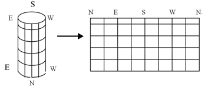

图 3\.6\-1孔壁图像变换示意图

GD3Q\-GA钻孔全孔壁成像系统由井下探管、井口滑轮、主机、绞车等硬件及钻孔孔壁图像采集与解释软件等组成（见图3\.6\-2）。

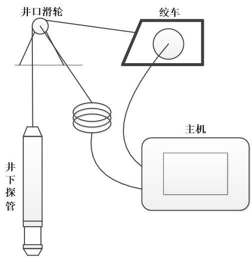

图 3\.6\-2  GD3Q\-GA钻孔全孔壁成像系统组成

#### 测试成果

本次共对区内8个钻孔进行孔内成像测试，成像深度覆盖各钻孔的主要含水层段，孔内成像观察节理裂隙玫瑰图与倾角分布直方图如下，孔内成像成果见附件。

表3\.6\-1 孔内成像测试节理裂隙统计表

孔号

测试深度

NE向

SE向

SW向

NW向

缓倾角

\(0°~30°\)

中倾角

\(30°~60°\)

陡倾角

\(60°~90°\)

合计

SK4\-1

60\.6m

0

13

22

3

10

17

11

38

SK9\-5

50\.0m

未见明显节理裂隙

SK9\-7

47\.7m

3

10

20

1

2

16

16

34

SK12\-2

42\.4m

11

15

26

4

23

16

17

56

SK14\-2

75\.2m

24

28

42

15

12

46

53

111

SK16\-1

78\.0m

9

2

13

8

9

12

11

32

SK16\-6

71\.3m

2

10

2

0

3

6

5

14

SK16\-8

81\.1m

6

2

1

1

1

3

6

10

表3\.6\-2 孔内成像测试成果

孔号

节理玫瑰图

倾角分布直方图

SK4\-1

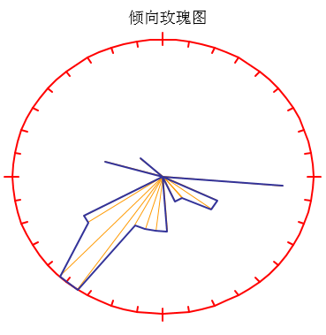

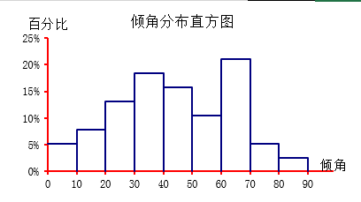

SK9\-5

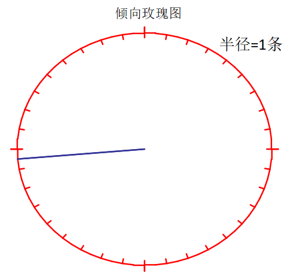

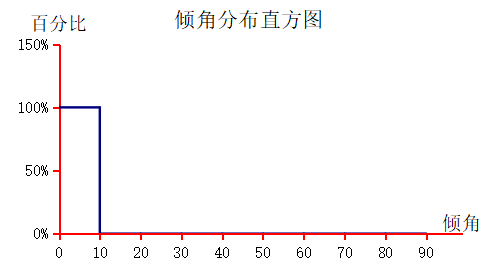

SK9\-7

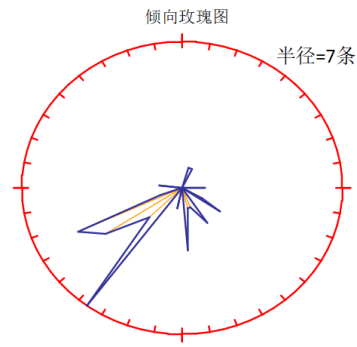

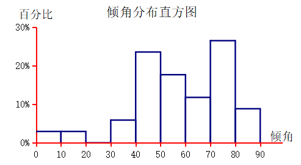

SK12\-2

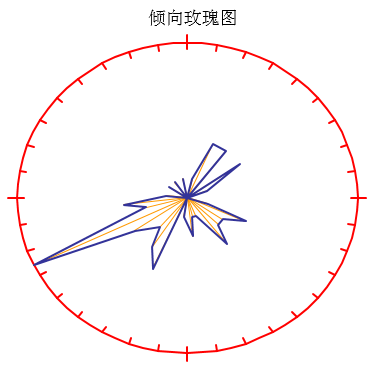

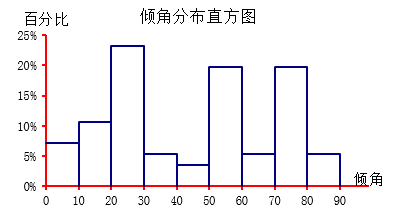

SK14\-2

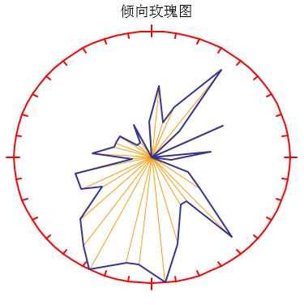

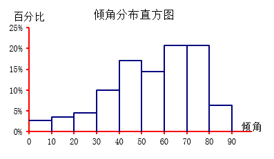

SK16\-1

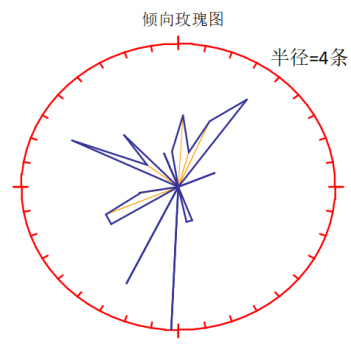

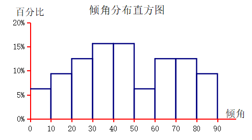

SK16\-6

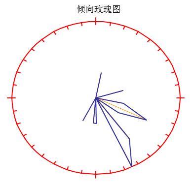

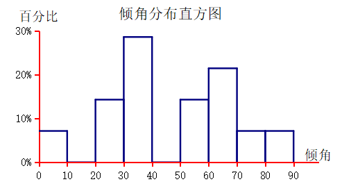

SK16\-8

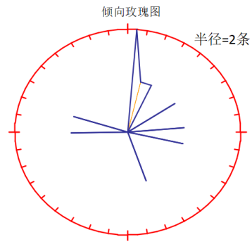

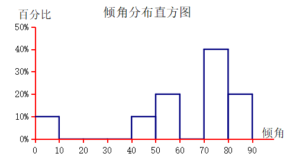

## 水文地质试验

### 抽水试验

#### 试验概况

为查明矿区含水层的水文地质参数（渗透系数*K*、给水度μ等）及地下水开采条件，本次水文地质勘察共设计抽水试验8组，其中单孔抽水试验7组，群孔抽水试验1组。

#### 技术要求

本次抽水试验相关条件与试验准备按照《水文地质手册》、《矿区水文地质工程地质勘查规范》（GB/T 12719\-2021）、《供水水文地质勘察规范》（GB50027\-2024）等标准规范进行设置并实施。抽水试验前测定静水位，采用电控潜水泵抽水，抽水期间在抽水孔及观测孔中采用HC8170型号多参地下水原位自动监测仪进行水位持续监测。同观测时间按抽水开始后的第1、2、3、4、6、8、10、15、20、25、30、40、50、60、80、100、120 min进行，以后每隔半小时观测一次，持续抽水至水位稳定后停泵监测水位恢复，观测恢复水位宜在停泵后第1、2、3、4、6、8、10、15、20、25、30、40、50、60、80、100、120 min进行，以后每隔半小时观测一次。试验过程中稳定水位或恢复水位满足下列条件之一，停止观测：①连续3小时水位不变化；②水位呈现单向变化时，水位变化连续4小时之内每小时水位变化不超过1cm；③水位历时曲线呈锯状波动时，4小时之内升最大升降差不超过5cm；④水位波动与自然水位变化一致。

#### 水文地质参数计算

根据含水层特征、井孔条件及试验类型，依据《水文地质手册》、《矿区水文地质工程地质勘查规范》（GB/T 12719\-2021）、《供水水文地质勘察规范》（GB50027\-2024）、《水电工程钻孔注水试验规程》（NB/T35104\-2017）等标准规范选择相应方法计算含水层水文地质参数。

#### 抽水试验计算公式

根据含水层特征、井孔条件及试验类型，选择相应方法计算含水层水文地质参数，本次单孔抽水试验钻孔均概化为潜水非完整井井流问题，计算公式如下：

____         （3\-1）

式中：*K*为渗透系数（m/d）；*Q*为抽水量（m3/d）；*H*为自然情况下潜水含水层的厚度（m）；*h*为潜水含水层在抽水实验时的厚度（m）；*h*0为自然情况下潜水含水层的厚度和在抽水实验时的含水层厚度的平均值（m）；*r*为抽水孔半径（m）；*R*为影响半径（m）；L为过滤器长度（m）

上述公式中影响半径*R*根据以下公式进行计算：

潜水含水层____                （3\-2）

式中：*S*为稳定降深（m）。

由于影响半径*R*与渗透系数*K*有关，因此在计算中首先赋值初始渗透系数，此后根据公式进行迭代计算，当迭代误差小于0\.005时，结束迭代，得到最终计算结果。

本次群孔抽水试验的水文地质参数计算采用加拿大Schlumberger Water Services开发的AquiferTest Pro软件进行。该软件是国际水文地质领域广泛应用的抽水试验数据分析与解释软件，专门针对含水层抽水试验（pumping test）和微水试验（slug test）数据设计，具有操作便捷、分析功能全面、结果可靠等特点。

AquiferTest Pro内置了丰富的分析方法，涵盖承压含水层、非承压含水层、渗漏含水层及裂隙含水层等多种水文地质条件。针对本次试验条件（潜水非完整井、双井同时抽水），软件采用叠加原理（superposition）处理多井干扰问题，能够准确计算两个抽水井同时工作对观测孔产生的叠加降深影响。该方法基于泰斯公式的叠加原理，即观测孔的总降深等于各抽水井单独作用时在该点产生的降深之和。

本次分析选用Neuman \(1974\)方法进行潜水非完整井分析，该方法专门针对潜水含水层非完整井条件设计，可同时求解渗透系数K和给水度Sy两个参数。软件采用自动类型曲线拟合（automatic type curve matching）技术，结合导数分析（derivative analysis）和诊断图（diagnostic plot）工具，确保拟合结果的客观性和准确性。分析过程中，通过不断调整模型参数，使计算降深曲线与实测降深曲线达到最佳拟合，最终输出含水层的水文地质参数。

实践表明，潜水含水层给水度与渗透系数具有相关性，因此本次工作选用《水文地质计算》（N\.A斯克巴兰诺维奇，1960）中潜水含水层给水度经验公式进行计算。

                                           （3\-3）

式中：按钻孔单位涌水量（q），含水层富水性分为以下四级：

（a）弱富水性：q≤0\.1L/（s·m）；

（b）中等富水性：0\.1L/（s·m）≤q≤1\.0L/（s·m）；

（c）强富水性：1\.0L/（s·m）≤q≤5\.0L/（s·m）；

（d）极强富水性：q>5\.0L/（s·m）。

注：评价含水层的富水性，钻孔单位涌水量以口径91mm，抽水水位降深10m为准。再用公式（3\-4）计算孔径为91mm的钻孔的涌水量，最后除以10便是单位涌水量。

由于抽水试验的钻孔孔径远小于井筒直径，为消除井径的影响，应在预测井筒涌水量时进行井径换算。根据稳定井流理论，不同地下水运动（层流、紊流）状态下井径与涌水量关系可以进行换算，公式如下：

                                  （3\-4）

式中：Q91为孔径为91mm的钻孔的涌水量，单位为立方米每天（m3/d）；Q孔为拟换算钻孔的涌水量，单位为立方米每天（m3/d）；R孔为拟换算钻孔的抽水影响半径，单位为米（m）；r孔为拟换算钻孔的半径，单位为米（m）；R91为孔径为91mm的钻孔的抽水影响半径，没有数据时可采用R孔代替，单位为米（m）；r91为孔径为91mm的钻孔半径，单位为米（m）。

#### 抽水试验计算结果

根据钻孔资料，钻孔SK4\-1、SK16\-6、SK9\-5、SK16\-8、SK12\-6、SK9\-7均未揭穿含水层，因此对钻孔开展单孔抽水试验时，均刻画为潜水非完整井流问题。采用（3\-1）和（3\-2）计算参数。各组试验所用计算参数以及计算结果如下表所示。

综合分析各组井流试验结果，SK4\-1抽水试验计算得到的渗透系数为1\.7088~1\.8482m/d，平均值为1\.75225m/d；给水度为0\.1080~0\.1087，平均值为0\.10835。SK16\-6抽水试验计算得到的渗透系数为8\.8481~9\.1000m/d，平均值为8\.97405m/d；给水度为0\.1365~0\.1371，平均值为0\.1368。SK9\-5抽水试验计算得到的渗透系数为0\.3554~0\.4103m/d，平均值为0\.38285m/d；给水度为0\.0863~0\.0880，平均值为0\.0872。SK16\-8抽水试验计算得到的渗透系数为2\.6023~2\.7608m/d，平均值为2\.68155m/d；给水度为0\.1146~0\.1156，平均值为0\.1151。SK12\-6抽水试验计算得到的渗透系数为4\.3693~4\.4825m/d，平均值为4\.4259m/d；给水度为0\.1234~0\.1239，平均值为0\.12365。SK9\-7抽水试验计算得到的渗透系数为3\.2059~3\.3211m/d，平均值为3\.2635m/d；给水度为0\.1181~0\.1187，平均值为0\.1184。

为进一步验证单孔抽水试验结果的可靠性，并获取群井干扰条件下的综合水文地质参数，开展了SK16\-6与SK16\-8双井联合抽水试验。试验采用潜水非完整井群孔叠加分析方法，利用AquiferTest Pro软件对观测孔SK16\-5和SK16\-2的实测降深数据进行拟合分析，群孔抽水试验计算得到的渗透系数为1\.98~2\.23m/d，平均值为2\.105m/d。

由于各组抽水试验反映了抽水孔影响范围内含水层的整体渗透性，因此对比各钻孔计算结果可以看出其存在一定差异，SK16\-6孔的计算结果相对SK4\-1、SK9\-5、SK16\-8、SK12\-6、SK9\-7孔更大，这表明在工作区范围内，含水层存在一定程度的非均质性。基于已有资料分析，SK16\-6孔可能位于主要径流带范围内，因而其反映的渗透性更好。

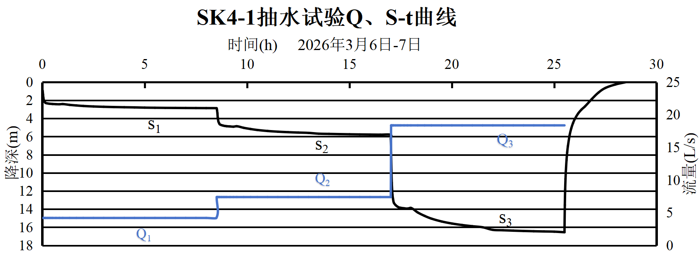

图3\.4\-1 钻孔SK4\-1抽水试验Q、S\-t曲线

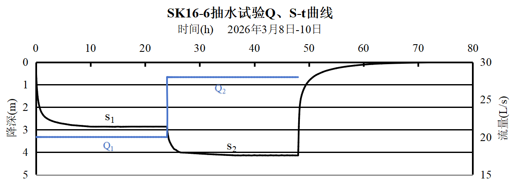

图3\.4\-2 钻孔SK16\-6抽水试验Q、S\-t曲线

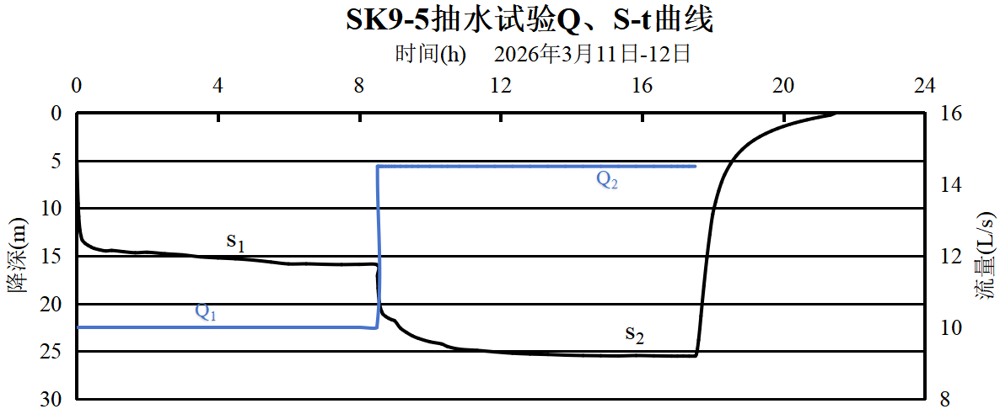

__图3\.4\-3 钻孔SK9\-5抽水试验Q、S\-t曲线__

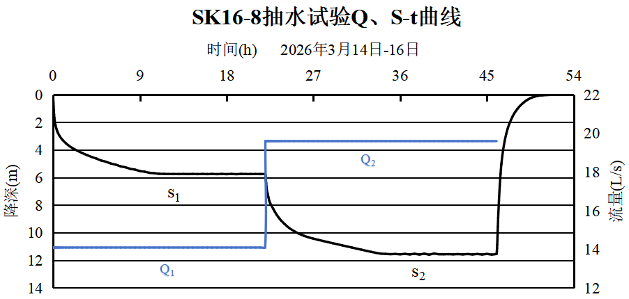

__图3\.4\-4 钻孔SK16\-8抽水试验Q、S\-t曲线__

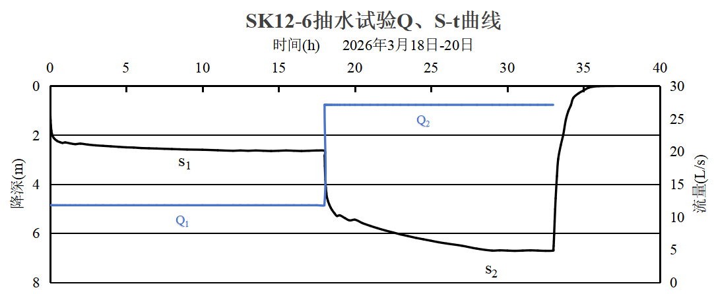

__图3\.4\-5 钻孔SK12\-6抽水试验Q、S\-t曲线__

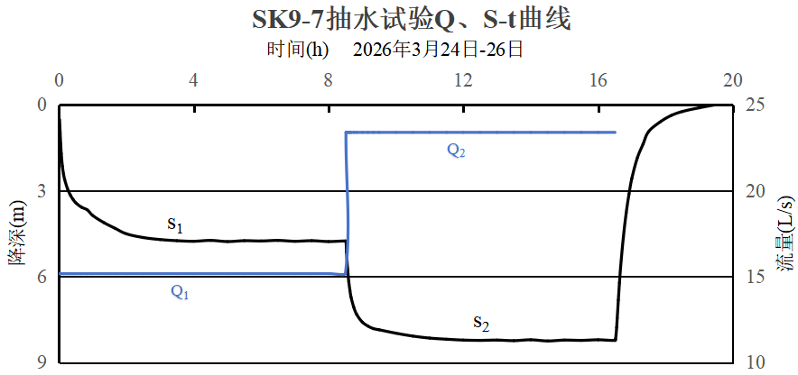

__图3\.4\-6 钻孔SK9\-7抽水试验Q、S\-t曲线__

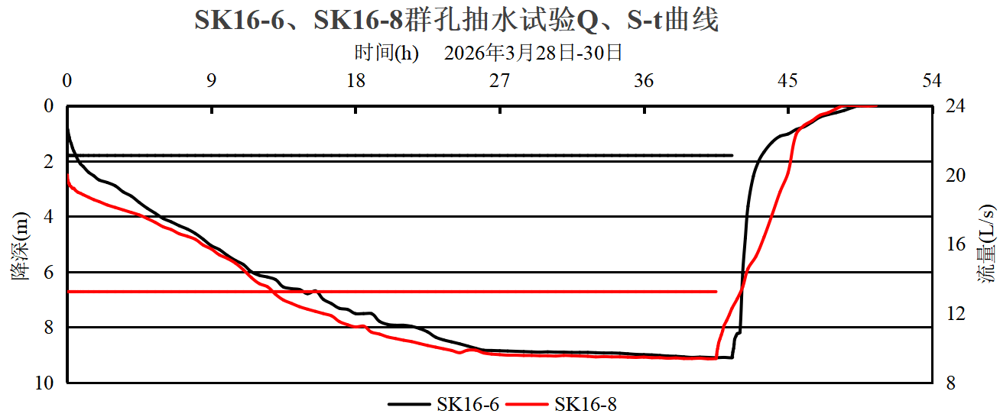

__图3\.4\-7 钻孔SK16\-6、SK16\-8群孔抽水试验Q、S\-t曲线__

__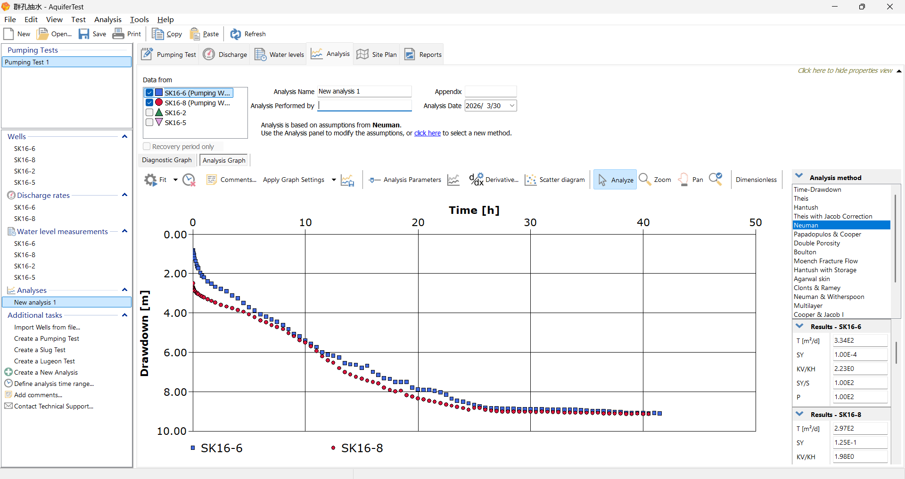__

__图3\.4\-8 AquiferTest Pro计算参数成果图__

表3\.4\-1 钻孔SK4\-1计算参数

计算公式

潜水非完整井公式

含水层底板深度（m）

150

孔深（m）

76\.6

初始水位埋深（m）

0\.245

稳定水位埋深（m）

3\.116

6\.045

16\.795

天然含水层厚度H（m）

149\.755

抽水稳定时含水层厚度h（m）

146\.884

143\.955

133\.205

h平均（m）

148\.3195

146\.855

141\.480

抽水量Q（m3/d）

362\.88

639\.36

1588\.08

孔径rw（m）

0\.1

过滤器长度L（m）

73\.484

70\.555

59\.805

稳定降深S（m）

2\.871

5\.8

16\.55

表3\.4\-2 钻孔SK16\-6计算参数

计算公式

潜水非完整井公式

含水层底板深度（m）

150

孔深（m）

76\.55

初始水位埋深（m）

0\.39

稳定水位埋深（m）

3\.26

4\.54

天然含水层厚度H（m）

149\.61

抽水稳定时含水层厚度h（m）

146\.74

145\.46

h平均（m）

148\.175

147\.535

抽水量Q（m3/d）

1728

2332\.8

孔径rw（m）

0\.1

过滤器长度L（m）

73\.29

72\.01

稳定降深S（m）

2\.87

4\.15

表3\.4\-3 钻孔SK9\-5计算参数

计算公式

潜水非完整井公式

含水层底板深度（m）

150

孔深（m）

70

初始水位埋深（m）

8\.92

稳定水位埋深（m）

24\.86

34\.43

天然含水层厚度H（m）

141\.08

抽水稳定时含水层厚度h（m）

125\.14

115\.57

h平均（m）

133\.11

128\.325

抽水量Q（m3/d）

240

348

孔径rw（m）

0\.1

过滤器长度L（m）

45\.14

35\.57

稳定降深S（m）

15\.94

25\.51

表3\.4\-4 钻孔SK16\-8计算参数

计算公式

潜水非完整井公式

含水层底板深度（m）

150

孔深（m）

100

初始水位埋深（m）

1\.56

稳定水位埋深（m）

7\.34

13\.10

天然含水层厚度H（m）

148\.44

抽水稳定时含水层厚度h（m）

142\.66

136\.9

h平均（m）

145\.55

142\.67

抽水量Q（m3/d）

1217\.04

2293\.056

孔径rw（m）

0\.1

过滤器长度L（m）

92\.66

86\.90

稳定降深S（m）

5\.78

11\.54

表3\.4\-5 钻孔SK12\-6计算参数

计算公式

潜水非完整井公式

含水层底板深度（m）

150

孔深（m）

100\.08

初始水位埋深（m）

0\.85

稳定水位埋深（m）

3\.49

7\.56

天然含水层厚度H（m）

149\.15

抽水稳定时含水层厚度h（m）

146\.51

142\.44

h平均（m）

147\.83

145\.795

抽水量Q（m3/d）

1016\.88

2343\.168

孔径rw（m）

0\.1

过滤器长度L（m）

96\.59

92\.52

稳定降深S（m）

2\.64

6\.71

表3\.4\-6 钻孔SK9\-7计算参数

计算公式

潜水非完整井公式

含水层底板深度（m）

150

孔深（m）

100\.2

初始水位埋深（m）

0\.92

稳定水位埋深（m）

5\.68

9\.15

天然含水层厚度H（m）

149\.08

抽水稳定时含水层厚度h（m）

144\.32

140\.85

h平均（m）

146\.7

144\.965

抽水量Q（m3/d）

1310\.4

2020\.56

孔径rw（m）

0\.1

过滤器长度L（m）

94\.52

91\.05

稳定降深S（m）

4\.76

8\.23

表3\.4\-7 抽水试验计算结果

钻孔

Q（m3/d）

K（m/d）

R（m）

μ

SK4\-1

362\.88

1\.7957

94\.16

0\.1087

639\.36

1\.7088

185\.56

0\.1080

1588\.08

1\.8482

550\.67

0\.1092

SK16\-6

1728

9\.1000

211\.79

0\.1371

2332\.8

8\.8481

301\.98

0\.1365

SK9\-5

240

0\.3554

225\.74

0\.0863

348

0\.4103

388\.17

0\.0880

SK16\-8

1217\.04

2\.6023

227\.20

0\.1146

2293\.056

2\.7608

467\.23

0\.1156

SK12\-6

1016\.88

4\.3693

134\.79

0\.1234

2343\.168

4\.4825

346\.99

0\.1239

SK9\-7

1310\.4

3\.3211

211\.83

0\.1187

2020\.56

3\.2059

359\.84

0\.1181

__表3\.4\-8 钻孔单位涌水量计算结果表__

钻孔

编号

拟换算钻孔的涌水量

Q孔（m3/d）

拟换算钻孔的抽水影响半径

R孔（m）

拟换算钻孔的半径

r孔（m）

孔径为91mm的钻孔的抽水影响半径

R91（m）

孔径为91mm的钻孔半径

r91（m）

孔径为91mm的钻孔的涌水量Q91（m3/d）

单位涌水量q（L/\(s·m\)）

富水性分级

SK4\-1

1030\.64

323\.98

0\.1

323\.98

0\.0455

939\.13

1\.0871

强

SK16\-6

4999\.79

732\.51

732\.51

4593\.33

5\.3164

极强

SK9\-5

186\.16

146\.99

146\.99

168\.02

0\.1945

中等

SK16\-8

1985\.78

399\.02

399\.02

1813\.55

2\.0990

强

SK12\-6

3257\.54

513\.86

513\.86

2982\.66

3\.4521

强

SK9\-7

2417\.07

441\.15

441\.15

2213\.11

2\.5615

强

将参数代入公式（3\-4）换算得到每个钻孔的单位涌水量q，SK4\-1的单位涌水量q为1\.0871L/\(s·m\)，位于1\.0和5L/\(s·m\)之间，属于强富水性；SK16\-6的单位涌水量q为5\.3164L/\(s·m\)，大于5L/\(s·m\)，属于极强富水性；SK9\-5的单位涌水量q为0\.1945L/\(s·m\)，位于0\.1和1\.0L/\(s·m\)之间，属中等富水性；SK16\-8的单位涌水量q为2\.0990L/\(s·m\)，位于1和5L/\(s·m\)之间，属强富水性；SK12\-6的单位涌水量q为3\.4521L/\(s·m\)，位于1和5L/\(s·m\)之间，属强富水性；SK9\-7的单位涌水量q为2\.5615L/\(s·m\)，位于1和5L/\(s·m\)之间，属强富水性。综上，矿区充水含水层富水性以强富水为主，局部存在极强富水区段，含水层富水性空间非均质性明显。其中，SK9\-7钻孔的单位涌水量为2\.5615L/\(s·m\)，位于强富水区间中位水平，与多数钻孔的富水性特征一致，具有较强的代表性。

### 压水试验

#### 试验概况

为查明岩体的渗透性和裂隙性，取得透水率（q值）等参数，以此进行岩层透水性等级分类，为防治水方案提供依据，本次水文地质勘察共设计压水试验13组，即对钻孔SK0\-1、SK2\-1、SK2\-2、SK3\-1、SK3\-3、SK9\-1、SK9\-3、SK12\-3、SK14\-2、SK16\-1、SK16\-3、SK16\-5、SK16\-9的钻孔压水试验。

#### 技术要求

钻孔压水试验工作应参照有关规程执行。试验孔应清水钻进，试验前应洗孔并测定静止水位。

流量观测工作应每隔1\-2min进行一次，当流量无持续增大趋势，且五次流量读数中最大和最小值之差小于最终值的10%，或最大和最小值之差小于1L/min时，本阶段试验即可结束，取最终值作为计算值。

观测记录试验过程中出现的异常，如流量、压力突变等现象。

#### 计算公式

在钻孔中采用自上而下或自下而上既分段又连续的压水试验方法，试验段长一般为5m。当试段埋深较浅时，宜适当降低试段压力。试段压力的确定应遵守下列规定：

1. 当用安设在与试段连通的压力表测压时，试段压力为：

P= Pp\+Pz …………………………（3\-5）

式中：P——试段压力（MPa）；

Pp——压力表压力（MPa）；

Pz——压力表中心至压力计算零线的水柱压力（MPa）；

1. 当安设在进水管上的压力表测压时，试段压力为：

P= Pp\+Pz\- Ps…………………………（3\-6）

式中：Ps——管路压力损失（MPa）；其余符号同前。

压力计算零线的确定：

当地下水位在试段以下时，压力计算零线为通过试段中点的水平线。

地下水位位于试段内时，压力计算零线为通过地下水位以上试段中点的水平线。

地下水位位于试段之上时，压力计算零线为地下水位线。

管路压力损失的确定：

当工作管内径一致，且内壁粗糙度变化不大时，管路压力损失为：

Ps=λ×（Lp/d）×υ2/2g…………………………（3\-7）

式中：λ——摩阻系数，λ=2×10\-4~4×10\-4 MPa/m；

Lp——工作管长度（m）；

d ——工作管内径（m）；

υ——管内流速（m/s）；

g——重力加速度，g=9\.8m/s2。

当工作管内径不一致时，管路损失压力应根据实测资料确定。

#### 计算结果

（1）试验结果概况

根据矿区各钻孔的压水试验结果资料，通过测试不同深度段的透水率q（Lu）和渗透系数K（m/d），依据相关规范可将岩体透水性划分为极微、微、弱、中等和强等不同级别。本次压水试验共对SK12\-3、SK9\-3、SK16\-3、SK2\-1、SK16\-5、SK16\-1、SK14\-2、SK9\-1、SK16\-9、SK3\-1、SK0\-1、SK3\-3以及SK2\-2等多个钻孔开展了分段测试。各组试验计算的透水率及渗透系数评价结果详见压水试验结果综合统计表。

__表3\.4\-9 压水试验结果表__

钻孔编号

深度\-起

（m）

深度\-止

（m）

透水率q

（Lu）

渗透系数K

\(m/d）

渗透系数

\(cm/s\)

备注

SK12\-3

68\.92

73\.92

0\.022

0\.000

0\.0000003

极微

SK12\-3

63\.98

68\.98

0\.033

0\.000

0\.0000004

极微

SK12\-3

58\.99

63\.99

0\.177

0\.002

0\.0000022

微

SK12\-3

54\.09

59\.09

0\.066

0\.001

0\.0000008

极微

SK12\-3

49\.14

54\.14

0\.287

0\.003

0\.0000036

微

SK12\-3

44\.14

49\.14

0\.121

0\.001

0\.0000015

微

SK12\-3

39\.22

44\.22

1\.711

0\.018

0\.0000213

弱

SK12\-3

33\.65

38\.65

0\.044

0\.000

0\.0000006

极微

SK12\-3

38\.52

43\.52

1\.788

0\.019

0\.0000223

弱

SK12\-3

27\.7

32\.7

5\.087

0\.055

0\.0000634

弱

SK12\-3

22\.77

27\.77

1\.070

0\.012

0\.0000133

弱

SK12\-3

17\.79

22\.79

0\.684

0\.007

0\.0000085

微

SK12\-3

12\.85

17\.85

0\.706

0\.008

0\.0000088

微

SK12\-3

7\.91

12\.91

0\.728

0\.008

0\.0000091

微

SK9\-3

68\.82

73\.82

355\.323

3\.829

0\.0044316

强

SK9\-3

65\.85

70\.85

0\.099

0\.001

0\.0000012

极微

SK9\-3

60\.86

65\.86

0\.088

0\.001

0\.0000011

极微

SK9\-3

55\.85

60\.85

0\.077

0\.001

0\.0000010

极微

SK9\-3

50\.95

55\.95

0\.088

0\.001

0\.0000011

极微

SK9\-3

46\.01

51\.01

0\.084

0\.001

0\.0000010

极微

SK9\-3

40\.94

45\.94

0\.066

0\.001

0\.0000008

极微

SK9\-3

36\.04

41\.04

0\.084

0\.001

0\.0000010

极微

SK9\-3

31\.1

36\.1

0\.099

0\.001

0\.0000012

极微

SK9\-3

26\.1

31\.1

50\.802

0\.547

0\.0006336

中等

SK9\-3

21\.22

26\.22

0\.099

0\.001

0\.0000012

极微

SK9\-3

16\.28

21\.28

0\.099

0\.001

0\.0000012

极微

SK9\-3

11\.28

16\.28

0\.099

0\.001

0\.0000012

极微

SK9\-3

6\.41

11\.41

3\.308

0\.036

0\.0000413

弱

SK16\-3

67\.76

72\.76

0\.088

0\.001

0\.0000011

极微

SK16\-3

62\.81

67\.81

0\.083

0\.001

0\.0000010

极微

SK16\-3

57\.25

62\.25

0\.088

0\.001

0\.0000011

极微

SK16\-3

52\.43

57\.43

0\.081

0\.001

0\.0000010

极微

SK16\-3

47\.04

52\.04

0\.088

0\.001

0\.0000011

极微

SK16\-3

45

50

192\.382

2\.073

0\.0023994

强

SK16\-3

39\.07

44\.07

218\.582

2\.355

0\.0027262

强

SK16\-3

34\.38

39\.38

245\.826

2\.649

0\.0030660

强

SK16\-3

29\.7

34\.7

271\.131

2\.922

0\.0033816

强

SK16\-3

24\.51

29\.51

223\.171

2\.405

0\.0027834

强

SK16\-3

19\.56

24\.56

235\.172

2\.534

0\.0029331

强

SK16\-3

13\.66

18\.66

236\.106

2\.544

0\.0029447

强

SK2\-1

66\.54

71\.54

0\.088

0\.001

0\.0000011

极微

SK2\-1

61\.61

66\.61

0\.250

0\.003

0\.0000031

微

SK2\-1

56\.67

61\.67

0\.229

0\.002

0\.0000029

微

SK2\-1

51\.17

56\.17

0\.104

0\.001

0\.0000013

微

SK2\-1

46\.72

51\.72

0\.242

0\.003

0\.0000030

微

SK2\-1

41\.77

46\.77

0\.159

0\.002

0\.0000020

微

SK2\-1

36\.81

41\.81

4\.856

0\.052

0\.0000606

弱

SK2\-1

33\.81

38\.81

3\.133

0\.034

0\.0000391

弱

SK16\-5

67\.35

72\.35

1\.876

0\.020

0\.0000234

弱

SK16\-5

62\.48

67\.48

2\.311

0\.025

0\.0000288

弱

SK16\-5

57\.57

62\.57

4\.661

0\.050

0\.0000581

弱

SK16\-5

52\.56

57\.56

6\.173

0\.067

0\.0000770

弱

SK16\-5

47\.69

52\.69

6\.478

0\.070

0\.0000808

弱

SK16\-5

42\.75

47\.75

247\.400

2\.666

0\.0030856

强

SK16\-5

37\.77

42\.77

311\.500

3\.357

0\.0038851

强

SK16\-5

32\.88

37\.88

311\.436

3\.356

0\.0038843

强

SK16\-5

27\.95

32\.95

308\.745

3\.327

0\.0038507

强

SK16\-5

70\.87

75\.87

3\.596

0\.039

0\.0000448

弱

SK16\-5

65\.94

70\.94

2\.746

0\.030

0\.0000342

弱

SK16\-5

61\.03

66\.03

0\.892

0\.010

0\.0000111

微

SK16\-5

56\.06

61\.06

2\.406

0\.026

0\.0000300

弱

SK16\-5

51\.16

56\.16

3\.614

0\.039

0\.0000451

弱

SK16\-5

46\.23

51\.23

1\.181

0\.013

0\.0000147

弱

SK16\-5

41\.21

46\.21

1\.054

0\.011

0\.0000131

弱

SK16\-5

36\.32

41\.32

1\.223

0\.013

0\.0000153

弱

SK16\-5

31\.34

36\.34

2\.532

0\.027

0\.0000316

弱

SK16\-5

26\.37

31\.37

1\.244

0\.013

0\.0000155

弱

SK16\-5

21\.5

26\.5

48\.426

0\.522

0\.0006040

中等

SK16\-5

15\.59

20\.59

75\.413

0\.813

0\.0009406

中等

SK16\-5

10\.66

15\.66

192\.186

2\.071

0\.0023970

强

SK16\-1

70\.87

75\.87

3\.596

0\.039

0\.0000448

弱

SK16\-1

65\.94

70\.94

2\.746

0\.030

0\.0000342

弱

SK16\-1

61\.03

66\.03

0\.892

0\.010

0\.0000111

微

SK16\-1

56\.06

61\.06

2\.406

0\.026

0\.0000300

弱

SK16\-1

51\.16

56\.16

3\.614

0\.039

0\.0000451

弱

SK16\-1

46\.23

51\.23

1\.181

0\.013

0\.0000147

弱

SK16\-1

41\.21

46\.21

1\.054

0\.011

0\.0000131

弱

SK16\-1

36\.32

41\.32

1\.223

0\.013

0\.0000153

弱

SK16\-1

31\.34

36\.34

2\.532

0\.027

0\.0000316

弱

SK16\-1

26\.37

31\.37

1\.244

0\.013

0\.0000155

弱

SK16\-1

21\.5

26\.5

48\.426

0\.522

0\.0006040

中等

SK16\-1

15\.59

20\.59

75\.413

0\.813

0\.0009406

中等

SK16\-1

10\.66

15\.66

192\.186

2\.071

0\.0023970

强

SK14\-2

67\.83

72\.83

1\.389

0\.015

0\.0000173

弱

SK14\-2

62\.96

67\.96

2\.295

0\.025

0\.0000286

弱

SK14\-2

58\.02

63\.02

1\.985

0\.021

0\.0000248

弱

SK14\-2

53

58

1\.808

0\.019

0\.0000226

弱

SK14\-2

48\.12

53\.12

1\.672

0\.018

0\.0000209

弱

SK14\-2

43\.15

48\.15

1\.672

0\.018

0\.0000209

弱

SK14\-2

38\.15

43\.15

1\.525

0\.016

0\.0000190

弱

SK14\-2

33\.26

38\.26

1\.504

0\.016

0\.0000188

弱

SK14\-2

28\.33

33\.33

2\.236

0\.024

0\.0000279

弱

SK14\-2

23\.35

28\.35

2\.359

0\.025

0\.0000294

弱

SK14\-2

18\.47

23\.47

2\.508

0\.027

0\.0000313

弱

SK14\-2

13\.56

18\.56

2\.513

0\.027

0\.0000313

弱

SK14\-2

8\.57

13\.57

3\.307

0\.036

0\.0000412

弱

SK9\-1

100\.91

105\.91

0\.060

0\.001

0\.0000007

极微

SK9\-1

96\.03

101\.03

0\.070

0\.001

0\.0000009

极微

SK9\-1

90\.77

95\.77

0\.089

0\.001

0\.0000011

极微

SK9\-1

85\.79

90\.79

0\.139

0\.001

0\.0000017

微

SK9\-1

80\.19

85\.19

0\.179

0\.002

0\.0000022

微

SK9\-1

75\.22

80\.22

0\.139

0\.001

0\.0000017

微

SK9\-1

69\.89

74\.89

5\.051

0\.054

0\.0000630

弱

SK9\-1

64\.88

69\.88

6\.015

0\.065

0\.0000750

弱

SK9\-1

60\.01

65\.01

6\.328

0\.068

0\.0000789

弱

SK9\-1

55\.08

60\.08

6\.618

0\.071

0\.0000825

弱

SK9\-1

50\.08

55\.08

6\.103

0\.066

0\.0000761

弱

SK9\-1

45\.21

50\.21

7\.218

0\.078

0\.0000900

弱

SK9\-1

39\.31

44\.31

6\.673

0\.072

0\.0000832

弱

SK9\-1

33\.38

38\.38

87\.044

0\.938

0\.0010856

中等

SK9\-1

19\.56

24\.56

90\.587

0\.976

0\.0011298

中等

SK16\-9

103\.64

108\.64

212\.968

2\.295

0\.0026562

强

SK16\-9

101\.66

106\.66

204\.297

2\.201

0\.0025480

强

SK16\-9

98\.69

103\.69

206\.831

2\.229

0\.0025796

强

SK16\-9

93\.78

98\.78

201\.084

2\.167

0\.0025079

强

SK16\-9

88\.83

93\.83

206\.472

2\.225

0\.0025751

强

SK16\-9

83\.9

88\.9

190\.435

2\.052

0\.0023751

强

SK16\-9

78\.9

83\.9

176\.535

1\.902

0\.0022018

强

SK16\-9

74

79

172\.450

1\.858

0\.0021508

强

SK16\-9

69\.05

74\.05

160\.987

1\.735

0\.0020078

强

SK16\-9

64\.07

69\.07

214\.887

2\.316

0\.0026801

强

SK16\-9

18\.23

23\.23

230\.406

2\.383

0\.0027577

强

SK16\-9

52\.83

57\.83

0\.077

0\.001

0\.0000009

极微

SK16\-9

47\.09

52\.09

0\.287

0\.003

0\.0000034

微

SK16\-9

42\.91

47\.91

0\.861

0\.009

0\.0000103

微

SK16\-9

38\.01

43\.01

0\.507

0\.005

0\.0000061

微

SK16\-9

33\.05

38\.05

0\.177

0\.002

0\.0000021

微

SK16\-9

28\.06

33\.06

0\.265

0\.003

0\.0000032

微

SK16\-9

23\.15

28\.15

0\.375

0\.004

0\.0000045

微

SK16\-9

18\.22

23\.22

197\.772

2\.045

0\.0023671

强

SK16\-9

13\.24

18\.24

0\.265

0\.003

0\.0000032

微

SK16\-9

9\.34

14\.34

2\.686

0\.028

0\.0000321

弱

SK16\-9

4\.34

9\.34

85\.783

0\.887

0\.0010267

中等

SK3\-1

93\.08

98\.08

1\.043

0\.011

0\.0000130

弱

SK3\-1

88\.14

93\.14

0\.602

0\.006

0\.0000075

微

SK3\-1

83\.21

88\.21

0\.521

0\.006

0\.0000065

微

SK3\-1

77\.95

82\.95

0\.998

0\.011

0\.0000124

微

SK3\-1

73\.01

78\.01

0\.575

0\.006

0\.0000072

微

SK3\-1

68\.1

73\.1

0\.585

0\.006

0\.0000073

微

SK3\-1

63\.18

68\.18

0\.671

0\.007

0\.0000084

微

SK3\-1

58\.25

63\.25

0\.863

0\.009

0\.0000108

微

SK3\-1

53\.29

58\.29

0\.054

0\.001

0\.0000007

极微

SK3\-1

48\.29

53\.29

0\.773

0\.008

0\.0000096

微

SK3\-1

43\.34

48\.34

0\.108

0\.001

0\.0000013

微

SK3\-1

38\.41

43\.41

0\.361

0\.004

0\.0000045

微

SK3\-1

33\.49

38\.49

0\.162

0\.002

0\.0000020

微

SK3\-1

28\.51

33\.51

0\.108

0\.001

0\.0000013

微

SK3\-1

23\.58

28\.58

0\.863

0\.009

0\.0000108

微

SK3\-1

18\.65

23\.65

0\.018

0\.000

0\.0000002

极微

SK3\-1

14\.69

19\.69

51\.914

0\.559

0\.0006475

中等

SK0\-1

70\.88

75\.88

0\.126

0\.001

0\.0000016

微

SK0\-1

65\.95

70\.95

0\.071

0\.001

0\.0000009

极微

SK0\-1

61\.01

66\.01

18\.167

0\.196

0\.0002266

中等

SK0\-1

56\.04

61\.04

105\.070

1\.132

0\.0013104

强

SK0\-1

51\.05

56\.05

3\.196

0\.034

0\.0000399

弱

SK0\-1

46\.08

51\.08

0\.399

0\.004

0\.0000050

微

SK0\-1

41\.2

46\.2

0\.159

0\.002

0\.0000020

微

SK0\-1

36\.24

41\.24

36\.325

0\.391

0\.0004530

中等

SK0\-1

30\.95

35\.95

17\.959

0\.194

0\.0002240

中等

SK0\-1

27\.05

32\.05

98\.013

1\.056

0\.0012224

中等

SK3\-3

93\.52

98\.52

0\.053

0\.001

0\.0000007

极微

SK3\-3

89\.53

94\.53

0\.035

0\.000

0\.0000004

极微

SK3\-3

84\.57

89\.57

0\.026

0\.000

0\.0000003

极微

SK3\-3

81\.6

86\.6

0\.018

0\.000

0\.0000002

极微

SK3\-3

73\.81

78\.81

0\.123

0\.001

0\.0000015

微

SK3\-3

68\.88

73\.88

0\.246

0\.003

0\.0000029

微

SK3\-3

63\.92

68\.92

0\.211

0\.002

0\.0000025

微

SK3\-3

58\.97

63\.97

1\.113

0\.012

0\.0000133

弱

SK3\-3

54\.01

59\.01

0\.994

0\.010

0\.0000119

微

SK3\-3

49\.04

54\.04

0\.202

0\.002

0\.0000024

微

SK3\-3

44\.1

49\.1

2\.466

0\.025

0\.0000295

弱

SK3\-3

39\.16

44\.16

5\.125

0\.053

0\.0000613

弱

SK3\-3

34\.25

39\.25

0\.079

0\.001

0\.0000009

极微

SK3\-3

29\.33

34\.33

0\.220

0\.002

0\.0000026

微

SK3\-3

27\.35

32\.35

0\.194

0\.002

0\.0000023

微

SK2\-2

141\.03

146\.03

0\.022

0\.000

0\.0000003

极微

SK2\-2

136\.07

141\.07

0\.022

0\.000

0\.0000003

极微

SK2\-2

131\.11

136\.11

0\.022

0\.000

0\.0000003

极微

SK2\-2

126\.15

131\.15

0\.022

0\.000

0\.0000003

极微

SK2\-2

120\.72

125\.72

0\.022

0\.000

0\.0000003

极微

SK2\-2

115\.51

120\.51

0\.022

0\.000

0\.0000003

极微

SK2\-2

110\.36

115\.36

0\.022

0\.000

0\.0000003

极微

SK2\-2

105\.2

110\.2

0\.022

0\.000

0\.0000003

极微

SK2\-2

100\.24

105\.24

0\.022

0\.000

0\.0000003

极微

SK2\-2

95\.33

100\.33

0\.022

0\.000

0\.0000003

极微

SK2\-2

90\.45

95\.45

63\.449

0\.684

0\.0007913

中等

SK2\-2

85\.5

90\.5

0\.132

0\.001

0\.0000017

微

SK2\-2

80\.56

85\.56

0\.187

0\.002

0\.0000023

微

SK2\-2

75\.62

80\.62

0\.132

0\.001

0\.0000017

微

SK2\-2

70\.67

75\.67

0\.154

0\.002

0\.0000019

微

SK2\-2

59\.87

64\.87

0\.419

0\.004

0\.0000050

微

SK2\-2

54\.95

59\.95

0\.196

0\.002

0\.0000023

微

SK2\-2

49\.65

54\.65

0\.173

0\.002

0\.0000021

微

SK2\-2

44\.73

49\.73

0\.088

0\.001

0\.0000011

极微

SK2\-2

39\.77

44\.77

0\.110

0\.001

0\.0000013

微

SK2\-2

34\.82

39\.82

53\.978

0\.558

0\.0006460

中等

SK2\-2

29\.88

34\.88

0\.099

0\.001

0\.0000012

极微

SK2\-2

24\.99

29\.99

0\.132

0\.001

0\.0000016

微

SK2\-2

20\.05

25\.05

0\.110

0\.001

0\.0000013

微

SK2\-2

15\.11

20\.11

3\.671

0\.038

0\.0000439

弱

SK2\-2

10\.19

15\.19

0\.154

0\.002

0\.0000018

微

SK2\-2

5\.24

10\.24

0\.926

0\.010

0\.0000111

微

（2）钻孔试验结果特征分析

综合分析各组压水试验结果，不同钻孔及同一钻孔的不同深度段其岩体渗透性存在显著差异：强/中等透水区段（构造或岩溶发育区）：部分钻孔揭露了透水性较强的岩段。SK16系列钻孔整体展现出较强的透水特征。SK16\-3在13\.66~50\.00m深度段透水率q高达192\.38~271\.13Lu，渗透系数K达2\.07~2\.92m/d，富水性被评定为“强”。SK16\-5在27\.95~47\.75m深度段透水率更是达到247\.40~311\.50Lu，同样属强透水段。SK16\-9则在较深部位（64\.07~108\.64m）持续出现160\.98~214\.88Lu的强透水段。SK9\-3和SK0\-1亦存在局部强透水异常。SK9\-3孔在68\.82~73\.82m段透水率突增至355\.32Lu（强透水），而其相邻深度多为极微透水。SK0\-1在56\.04~61\.04m段透水率为105\.06Lu，评定为强透水。弱/微/极微透水区段（相对完整区）：大部分钻孔的多数孔段透水率较低，反映岩体相对完整或裂隙闭合。SK14\-2整体表现为“弱”透水，各深度的测试段透水率分布十分均匀，介于1\.38~3\.30Lu之间。SK2\-2深部岩体较为致密，在95\.33~146\.03m深度范围内透水率稳定在0\.022Lu左右，渗透系数约为0\.0002m/d，属“极微”透水，仅在个别浅部岩段出现中等透水带。SK3\-3、SK12\-3及SK3\-1等钻孔的主体测试段透水率基本小于5\.0Lu，以极微、微及弱透水为主。

（3）综合评价

由于压水试验直观反映了测试孔段岩体的整体裂隙发育和渗透情况，对比各钻孔计算结果可以看出其存在极大的空间差异。工作区岩体的背景透水性普遍较弱（以极微~弱透水为主），但在局部深度段及特定平面区域（如SK16孔区、SK9\-3深部局部等）出现了极高的透水率峰值。这表明在工作区范围内，岩体介质存在强烈的空间非均质性。基于已有资料分析，SK16系列钻孔及高透水异常段可能正位于断层破碎带或主要的岩溶地下水径流带范围内，裂隙/岩溶高度发育，因而其反映的渗透性远好于周边围岩。

### 示踪试验

#### 试验概况

在矿区南北两侧开展6组示踪试验，分两次进行，北侧布设3个示踪试验投放孔，1个示踪试验监测孔；南侧布设3个示踪试验投放孔，1个示踪试验监测孔。结合示踪试验成果，补充完善地面调查推测但难以确定的矿区地下水连通情况及流域特征，矿区地下水流向、流速、流量，以及矿区地下水与地表水的转化补排关系。

#### 试验原理

地下水示踪试验是基于水动力弥散原理，在地表水和地下水水平运动为主的沟渠、裂隙、含水层中进行的一种试验。示踪试验可以查明地下水运动途径、速度等水文地质条件，了解地下水系统的补给范围、径流特征、与相邻系统的关系，确定分水岭的位置，地下河系统的连通、延展与分布情况，调查地下水的转化关系以及岩溶水的渗漏通道，追踪地下水污染源等，为资源评价与合理开发提供依据。

示踪试验采用在线监测仪器，在线监测仪器使用示踪荧光仪（GGUN\-FL24和GGUN\-FL30），能检测的示踪剂为荧光素钠、罗丹明B和荧光增白剂等。各种染色荧光素都有其特定的光学属性，即吸收入射光而发射出荧光。该仪器首先将发射光源透过特定的激发光光学滤器，滤去不需要的光线，然后形成特定的激发光光束，达到待测溶液，并转角90°后透过荧光滤波器，最后到达检测器。由于吸收光光强与荧光素的浓度成反比，可根据标准函数计算出荧光素的浓度。采用2GB容量及以上的TIF存储卡，记录时间长，可实现野外中长时间尺度的在线检测。该技术在国内外已得到较为普遍的推广应用。

GGUN\-FL24地下水示踪荧光测定仪主要用于钻孔和地下水的示踪研究，可测量荧光示踪剂、浊度和温度三种参数，使用时深度可以达到70m，水井口直径需大于5cm。仪器配备双激发\-双检测器，允许对浊度和1种荧光染料同时进行分析。FL24荧光仪拥有4个激发\-检测通道，可同步测量浊度和三种类型的荧光示踪剂。

GGUN\-FL30地表水野外荧光光度计用于地表水、地下水露头（泉水和地下河出口）的示踪研究，可测量荧光示踪剂、浊度、温度三类参数（还可增配电导率和水压），使用水深0\-20m。仪器配备4个光源，覆盖了整个光谱范围；还拥有4个激发\-检测通道，可同步测量浊度和三种类型的荧光示踪剂。

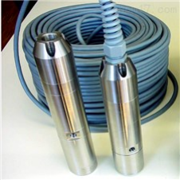

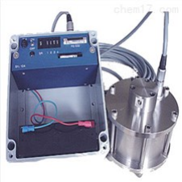

图3\.4\-9示踪荧光仪（GGUN\-FL24）

图3\.4\-10示踪荧光仪（GGUN\-FL30）

这些仪器具有双路激发光、双路检测光谱系统，使得仪器能同时检测到两种及以上不同的荧光物质浓度，同时记录浊度数据，以便对不同浊度条件下的荧光物质浓度进行补偿矫正。该仪器主要具有如下几个优点：（1）自动化程度高，在线连续监测。仪器可10s、30s、60s、300s或900s自动记录一组数据，野外现场检测结果即可被记录到记忆卡中，仪器记录时间长，耗电量小；同时也避免了传统试验人工取样的繁琐程序，大大降低了劳动强度。（2）精度高，不易受到污染。能精确地捕捉示踪剂浓度变化的数值，避免了传统试验人工取样中容器和人为操作时对样品的污染，也避免了样品在取样运至实验室分析这段时间内的浓度降解造成数据失真的问题。（3）试验成本便宜。本试验投放荧光素钠和罗丹明的量小，投入的人力物力较传统示踪试验少，大大降低了试验成本。（4）仪器携带方便、操作简单。仪器轻（约12kg），便于野外携带和使用，同时具有很好的防水功能，仪器接收记录易设置，并拥有专门的视窗软件，界面友好，操作和采集数据方便。

荧光材料示踪主要是根据化学物质在水中溶解后具有荧光的特点，通过检测出水口水样的荧光强度，证明投放点与地下水出口之间的连通性。

（1）荧光素钠（Uranine），分子式为C12HNa2O3，分子量376\.27；有多个中文别名：荧光红、荧光红钠、荧光黄钠、荧光素二钠、荧光素钠盐、荧光橙红钠、荧光素二钠、荧光素钠、水溶荧光素等。荧光素钠易溶于水，溶液呈黄红色，并带极强的黄绿色荧光。荧光素钠广泛应用于化工、医药等领域，如医药领域的吸附指示剂、化工中的氧化还原指示剂、生物染色剂和化妆品着色剂，其应用范围与人们的生活直接相关，因此，其对环境影响小。荧光素钠在pH小于7时形

成单价阴离子，pH大于7时形成二价阴离子，2种阴离子的性质均稳定，二价阴离子的荧光性最强。荧光素钠分子和阳离子态易被吸附，荧光素钠因而更适合碱性的岩溶水，岩溶含水层中常见的黏土矿物一般不吸附荧光素钠。

（2）罗丹明（SulforhodamineB），分子式为C28H31ClN2O3，分子量479\.01；又称玫瑰红B，或碱性玫瑰精，俗称花粉红，是一种具有鲜桃红色的人工合成的染料。罗丹明B在溶液中有强烈的荧光，用作实验室中细胞荧光染色剂、有色玻璃、特色烟花爆竹等行业。罗丹明染料在较大波长时吸光和发光，分析时与荧光素钠和其他染料易于区分，对光线和pH的敏感性低于荧光素钠。罗丹明适用于强裂隙发育的含水层。

（3）荧光增白剂（Fluorescentbrightener），荧光增白剂作用原理是吸收光线中不可见的紫外光，并发出可见的蓝光，与织物发出的黄光进行叠加后，互补形成白光，使织物发出的白光增加，肉眼可感觉到白色织物明显变得亮白，这就是亮白效果。荧光增白剂可以吸收不可见的紫外光（波长范围约为60\-380nm），转换为波长较长的蓝光或紫色的可见光，因而可以补偿基质中不想要的微黄色，同时反射出比原来入射的波长在400\-600nm范围的更多的可见光，从而使制品显得更白、更亮、更鲜艳。荧光增白剂在黏土表面强烈吸附，滞后现象明显，回收率较低，一般不建议作为酸性地下水的示踪剂，但可以用于管道系统充分发育的长距离示踪。在重要的饮用水源地和景观用水等特殊水体，荧光素钠和罗丹明投放量过多会导致水体变绿或变红而引起周围居民恐慌，过少会导致无法检出。荧光增白剂的染色性弱于荧光素钠和罗丹明，为了保证试验成功，三种示踪剂配合使用。

针对这些要求，同时考虑与仪器匹配使用，选用荧光素钠（C20H10Na2O5）、罗丹明B1（C28H31ClN2O3）和荧光增白剂作为显色示踪剂，且这些示踪剂适用于中性或碱性的岩溶水。

#### 试验方法

对于示踪剂的选择，宜根据现场情况选取，遵循无毒、对当地的生态环境无影响、自然本底值低、受围岩干扰小、化学性能稳定、易检测、灵敏度高及成本相对低等为原则，并根据区域水文地质调查情况，结合以往的示踪试验经验，并考虑当地的饮用水安全及经济、技术条件等因素综合考虑。两组示踪试验的示踪剂投放点分别布设在矿区南、北两侧地下水下游的监测井中。

可采用人工监测或机械自动监测的方式。在示踪剂投放后，如监测仪器使用瑞士Albilia公司生产的GGUN\-FL24和GGUN\-FL30型野外自动化荧光光度计，此型号野外荧光光度计灵敏度极高，对罗丹明B、荧光增白剂、荧光素钠等示踪剂的检测下限为0\.02μg/L，仪器监测时间可根据实际需要和水文地质条件等特征综合考虑设置为每2s、4s、10s等短时间间断监测一次，也可以设置为每2min、5min、15min等长时间间断监测一次。需要记录的主要内容包括示踪剂投放点与接收点间的距离和流量、仪器监测接收点地下水的背景信号（本底）、投放点示踪剂的投放量和具体的投放时间等相关信息。示踪剂的投放量应在充分考虑到有效示踪剂物质，满足采样点仪器能够清楚地检测，不增加额外费用、不增加环境负荷等为前提，设计有效示踪剂的用量。在示踪仪工作期间要保障其正常运转，也可同时进行人工取样进行检查（视情况决定）。在示踪剂出现并恢复到背景值之后，野外荧光仪要继续工作一段时间（数小时至数天不等，视情况决定），以判定是否有第二次峰值产生。同时通过野外水文实测，获取接收点的背景信号。

#### 试验过程

##### 试验部署

本次地下水示踪试验的部署，严格依据大旺塘矿山专项水文地质勘察的总体目标任务，在前期水文地质调查、物探测量及钻探成果的基础上，结合矿区岩溶发育特征、含水层结构及地下水补径排条件，针对矿区\+50m（现地面）至\+5m标高范围内的重点水文地质问题，统筹考虑矿山开采过程中可能诱发突涌水、岩溶塌陷等地质灾害的关键区域，合理选定示踪试验投放点与接收监测点。为了能够更加快速地得到示踪试验的结果，在开展示踪试验的同时，在接收孔SK12\-6和SK9\-7进行抽水。根据现场实际条件与试验需求，本次示踪试验共分两次开展，共完成6组示踪试验具体部署如下：

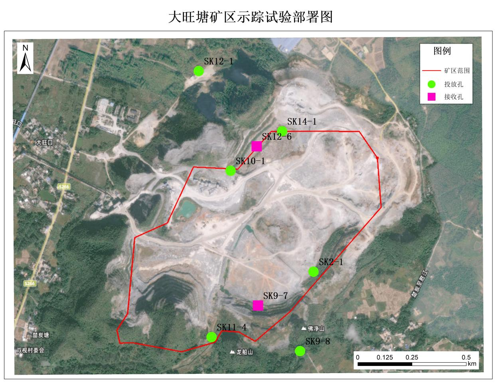

图3\.4\-11 大旺塘矿区示踪试验部署图

##### 第一次示踪试验

在完成对示踪试验监测仪器的安装和调试之后，2026年3月19日正式开始进行大旺塘矿区第一组示踪试验。

3月19日17：08分，首先在投放孔SK12\-1中投入示踪剂荧光素钠约500g，现场调查得到投放孔SK12\-1距离接收孔SK12\-6约437\.42m。

3月21日18：56分在投放孔SK14\-1中投入示踪剂荧光增白剂约500g，现场调查得到投放孔SK14\-1距离接收孔SK12\-6约135\.71m。

3月21日19：20分在投放孔SK10\-1中投入示踪剂罗丹明约500g，现场调查得到投放孔SK10\-1距离接收孔SK12\-6约165\.1m。

表3\.4\-10第一次示踪试验工作部署统计表

序号

MC

类型

X

Y

投放

时间

示踪剂

投放量

距离

1

SK12\-1

投放孔

2604390\.435

581912\.0551

3月19日19:08

荧光素钠

500g

437m

2

SK14\-1

投放孔

2604112\.196

582296\.1795

3月21日18:56

荧光增白剂

500g

135m

3

SK10\-1

投放孔

2603929\.759

582058\.6683

3月21日

19：20

罗丹明

500g

165m

4

SK12\-6

接收孔

2604042\.681

582179\.1195

/

/

/

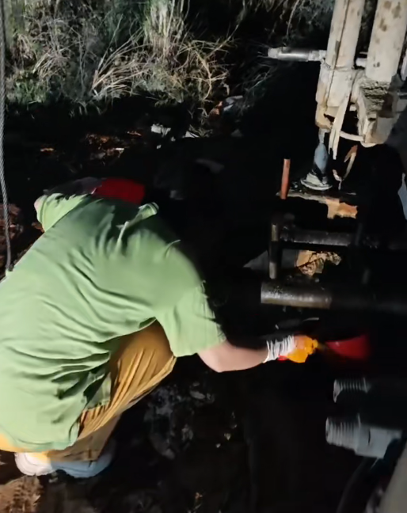

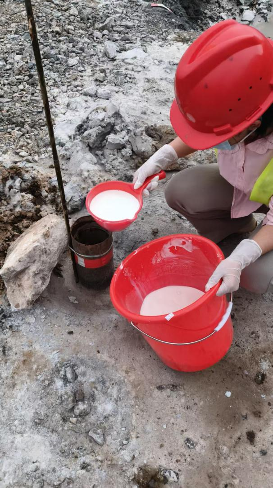

图3\.4\-12 SK12\-1投放荧光素钠照片

图3\.4\-13 SK14\-1投放荧光增白剂照片

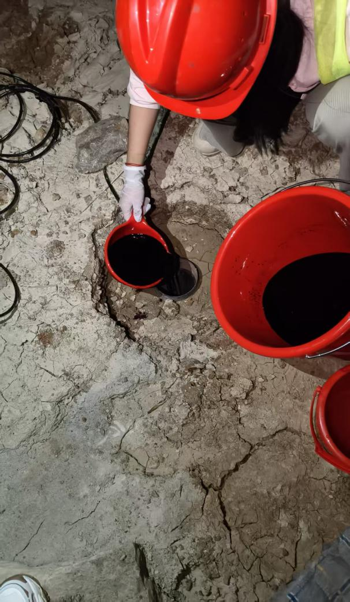

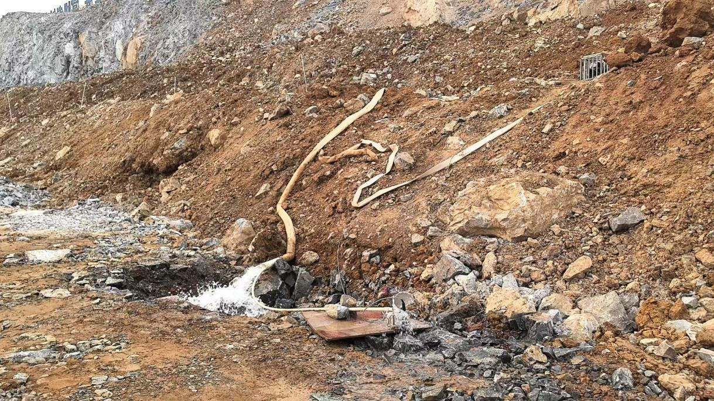

图3\.4\-14 SK10\-1投放罗丹明照片

图3\.4\-15 SK12\-6布置检测设备照片

##### 第二次示踪试验

2026年3月24日在矿区南部开始第二组示踪试验。3月24日18:11，在投放孔SK11\-4投放荧光增白剂约500g，投放孔SK11\-4距离接收孔SK9\-7约260m。

3月24日18：45分，在投放孔SK9\-8中投入示踪剂荧光增白剂约500g，现场调查得到投放孔SK9\-8距离接收孔SK9\-7约276m。

3月24日19:45在投放孔SK2\-1中投入示踪剂罗丹明约500g，现场调查得到投放孔SK2\-1距离接收孔SK9\-7约289m。

表3\.4\-11 第二次示踪试验工作部署统计表

序号

MC

类型

X

Y

投放

时间

示踪剂

投放量

距离

1

SK11\-4

投放孔

2603161\.666

581971\.1139

3月24日18:11

荧光素钠

500g

260

2

SK9\-8

投放孔

2603097\.13

582379\.043

3月24日18:45

荧光增白剂

500g

276

3

SK2\-1

投放孔

2603463\.809

582441\.1662

3月24日19:45

罗丹明

500g

289

4

SK9\-7

接收孔

2603307\.556

582184\.9155

/

/

/

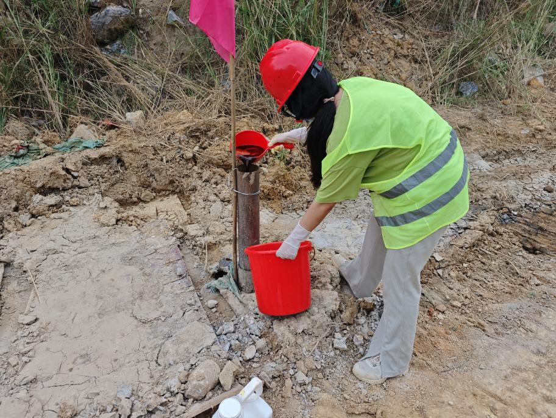

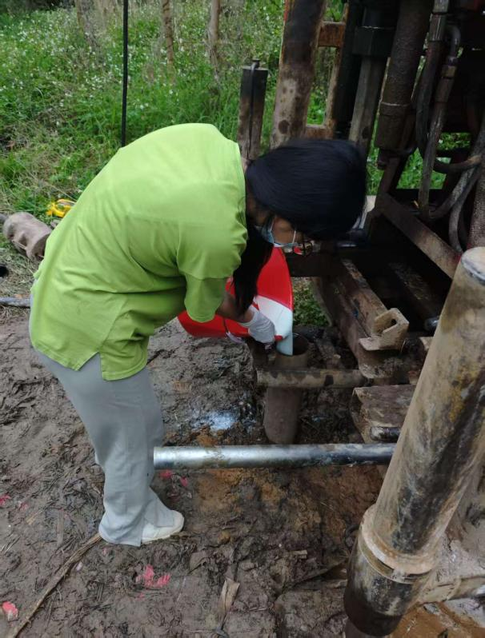

图3\.4\-16 SK11\-4投放荧光素钠照片

图3\.4\-17 SK9\-8投放荧光增白剂照片

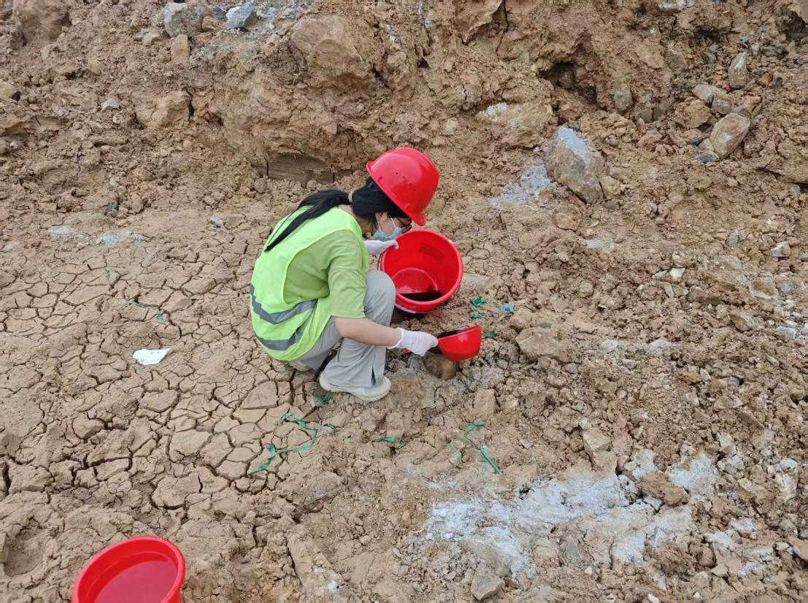

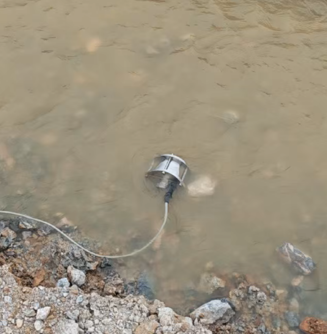

图3\.4\-18 SK2\-1投放罗丹明照片

图3\.4\-19 SK9\-7布置检测设备照片

#### 试验结果

本次示踪试验在SK12\-6、SK9\-7抽排水口布置自动检测设备，第一次示踪试验从3月19日19:08监测至3月23日8:26，第二次示踪试验从3月24日18:11监测至3月25日8:31。由于本次示踪试验投放孔未在径流管道上，且现场不具备示踪试验的有利条件，试验时间紧，截至监测结束，两处监测点均暂未检测到示踪剂信号。

## 水文地球化学及同位素分析

### 取样测试与数据整理

为充分揭示大旺塘矿区的水文地质条件，于2026年3月间，在20个取样点处持续采集了揭露含水层的钻孔地下水、矿井出水点及地表水样品，共计20组。具体取样位置见图3\.5\-1。

测试指标包括pH、TDS、EC、常规阴阳离子、微量元素及D、O同位素，具体测试项目见表3\.5\-1。其中，pH、温度等易变指标采用SX571型便携式pH/ORP/电导率/溶解氧测量仪野外现场测定；水样阴离子于长江大学油气地球化学与环境湖北省重点实验室采用离子色谱仪测试，阳离子及微量元素于湖北理工学院矿区环境污染控制与修复湖北省重点实验室采用电感耦合等离子体发射光谱仪（ICP\-OES）测试；D、O 同位素分别送往中国地质大学（武汉）生物地质与环境地质国家重点实验室进行测试。

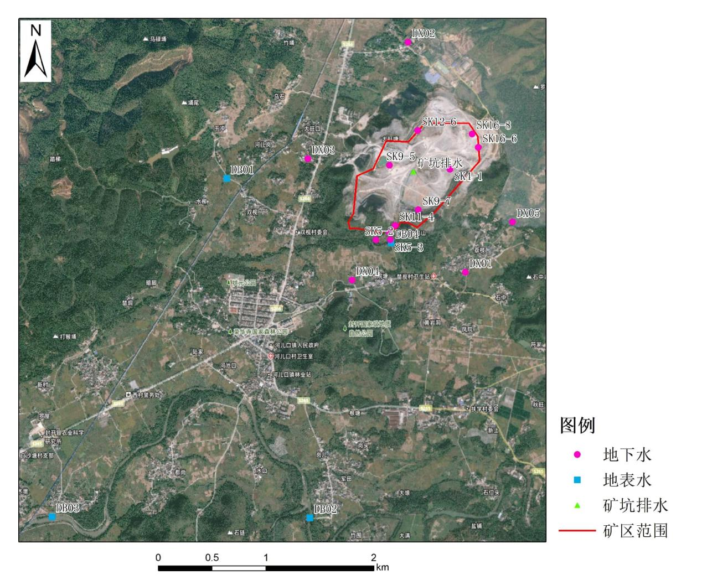

图3\.5\-1  矿区取样点分布图

为保证地下水水化学分析的准确性，采用阴阳离子平衡检验法对数据的准确性进行检验。检验公式如下：

E=（∑Nc−∑Na）/（∑Nc\+∑Na）×100%      （3\-8）                          

式中：E为相对误差，Nc代表阳离子的毫克当量浓度（meq/L），Na代表阴离子的毫克当量浓度（meq/L）。若|E|≤10％，则数据可信，若|E|＞10％，则不可信，以此为基础将上机测试的地下水阴阳离子数据进行检验，计算结果均在10%以内，具体水化学测试数据见附表。

__表3\.5\-1 取样点及测试项目表__

序号

编号

取样位置

类型

阴阳离子

氢氧同位素

1

DB01

西侧溪沟

地表水

√

√

2

DB02

渔涝河上游

地表水

√

√

3

DB03

渔涝河下游

地表水

√

√

4

DB04

南侧溪沟

地表水

√

√

5

DX01

井边水井

地下水

√

√

6

DX02

榃甘水井

地下水

√

√

7

DX03

大为水井

地下水

√

√

8

DX04

院塘水井

地下水

√

√

9

DX05

荔枝水井

地下水

√

√

10

SK4\-1

SK4\-1

地下水

√

√

11

SK9\-5

SK9\-5

地下水

√

√

12

SK16\-6

SK16\-6

地下水

√

√

13

SK16\-8

SK16\-8

地下水

√

√

14

矿坑排水

矿坑积水点

矿坑排水

√

√

15

SK12\-6

SK12\-6

地下水

/

/

16

SK11\-4

SK11\-4

地下水

/

/

17

SK3\-4

SK3\-4

地下水

/

/

18

SK9\-7

SK9\-7

地下水

/

/

19

SK5\-3

SK5\-3

地下水

/

/

20

SK5\-2

SK5\-2

地下水

/

/

注：“√”表示测试了该项目，“/”表示测试了该项目但该项目尚未获得数据。

### 矿区水化学及同位素特征

#### 水化学基本特征

由附表可知，工作区内地表水样品氧化还原电位（ORP）在72~209 mV范围内变化，地表水系统环境呈氧化环境；地表水pH在6\.35~7\.47范围内变化，呈中性或弱酸性；地表水溶解性总固体含量（TDS）在51~277mg/L范围内变化，TDS较低。工作区内地下水的氧化还原电位（ORP）在\-35~196 mV范围内变化，大部分呈现氧化环境，其中位于矿区东南侧的钻孔SK3\-4和SK5\-2的ORP分别为\-33mV和\-35mV，呈现还原环境；pH在5\.18~7\.56范围内变化，基本呈中性或弱酸性；TDS含量波动范围为133~633mg/L，最低值出现在荔枝水井（DX05），最高值出现在矿区东北侧钻孔SK12\-6。

工作区内地表水样中西侧西溪沟（DB01）和南侧溪沟（DB04）主要阳离子成分为 Ca2\+，质量浓度显著高于 Na\+、K\+和Mg2\+，反映典型的碳酸盐岩溶蚀控制的水化学特征；而渔涝河上游点（DB02）与下游点（DB03）主要阳离子成分为 Ca2\+、 Na\+、K\+，Mg2\+质量浓度相对较小，由于渔涝河上游地层岩性为黑云母花岗岩，DB02与DB03的Si含量也相对较高，推测存在硅酸盐溶解作用影响。阴离子均以 HCO3\- 为主，SO42\- 与Cl⁻含量较低。工作区地下水中阳离子大多以 Ca2\+为主，质量浓度远高于 Na\+、K\+、Mg2\+，其中位于矿区东南侧的井边水井（DX01）和荔枝水井（DX05）阳离子以 Ca2\+、K\+为主，荔枝水井（DX05）的Si含量相对较高，位于矿区东北边的榃甘水井（DX02）阳离子以 Ca2\+、 Na\+为主。地下水阴离子组成整体以 HCO3\-占绝对优势，其中井边水井（DX01）和荔枝水井（DX05）的SO42\-质量浓度相对较高，榃甘水井（DX02）和荔枝水井（DX05）Cl⁻的质量浓度相对较高。因此，推测DX01、DX02和DX05可能接收了矿区东侧地层岩性为黑云母黄岗岩的孔隙裂隙水补给。

#### 水化学类型特征

##### 舒卡列夫分类

根据舒卡列夫分类法将工作区水样中毫克当量百分比大25%的阴、阳离子排序后得各水样的水化学类型，见表3\.5\-2。工作区内水化学类型较为简单，以HCO3\-Ca型为主，反映出自然水体中以 HCO3\- 和 Ca2\+为主导的典型特征；少数水样如渔涝河上游与下游、榃甘水井等则呈现HCO3\-Ca·Na或Cl·HCO3\-Ca·Na类型，推测局部水体可能受到矿区东侧侵入岩孔隙裂隙水的补给或存在轻度人为干扰。因此，整体上，该区域水化学类型HCO3\-Ca以型为主，水质状况较好。

__表3\.5\-2 舒卡列夫分类表__

序号

编号

取样位置

水化学类型

1

DB01

西侧溪沟

HCO3\-Ca

2

DB02

渔涝河上游

HCO3\-Ca·Na

3

DB03

渔涝河下游

HCO3\-Ca·Na

4

DB04

南侧溪沟

HCO3\-Ca

5

DX01

井边水井

HCO3\-Ca·K

6

DX02

榃甘水井

Cl·HCO3\-Ca·Na

7

DX03

大为水井

HCO3\-Ca

8

DX04

院塘水井

HCO3\-Ca

9

DX05

荔枝水井

Cl·HCO3\-Ca

10

SK4\-1

SK4\-1

HCO3\-Ca

11

SK9\-5

SK9\-5

HCO3\-Ca

12

SK16\-6

SK16\-6

HCO3\-Ca

13

SK16\-8

SK16\-8

HCO3\-Ca

14

矿坑排水

矿坑积水点

HCO3\-Ca

##### Piper三线图

舒卡列夫分类法简单明了，应用十分广泛，但以25%毫克当量为界限划分水型具有主观性故应该结合Piper三线图等方法进一步讨论工作区地下水的形成过程。Piper三线图常用于水化学分析，其优点在于不受人为主观因素影响，可以直观简便地分析地下水和地表水水化学相的演变规律。该图由一个平行四边形和两个等边三角形组成，其左下角阳离子三角形的三条边分别表示Ca2\+、Mg2\+、Na\+\+K\+的毫克当量百分数；其右下角阴离子三角形的三条边分别表示Cl\-、SO42\-、CO32\-\+HCO3\-的毫克当量百分数。根据工作区地下水和地表水的主要离子含量绘制Piper三线图，如图3\.5\-2所示。

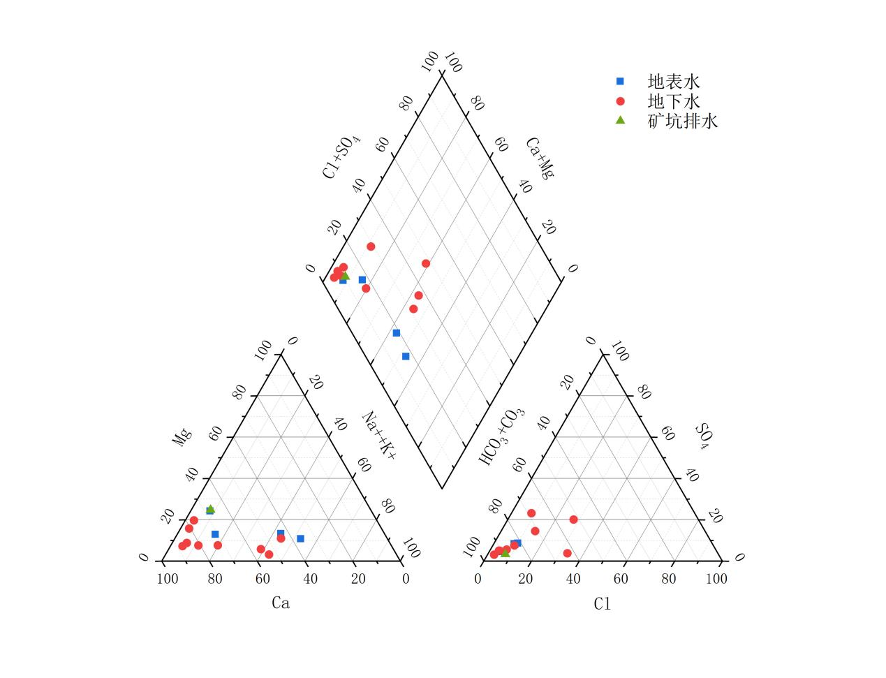

__图3\.5\-2  大旺塘矿区水化学Piper三线图__

研究区水化学类型主要为HCO3\-Ca型；地表水的阴离子主要向HCO32\-富集，阳离子主要Ca2\+向富集，水化学类型为 HCO3\-Ca 型，渔涝河上下游水点Na\+含量较高则向Na\+\+K\+偏移，水化学类型为 HCO3\-Ca ·Na型；地下水的阴离子主要向HCO32\-富集，矿区外围的水井（DX01，DX02，DX04，DX05）有轻微向Cl\-或SO42\-偏移，其中位于矿区南侧的DX01、DX04与DX05的SO42\-相对较高，可能受到了轻微的人为干扰，阳离子主要向Ca2\+富集，是矿区外围水井（DX01，DX02，DX05）与渔涝河可能因受到矿区东侧侵入岩孔隙裂隙水补给影响向Na\+\+K\+偏移。

#### 水化学形成作用分析

##### 水化学成因分析

地下水中发生溶滤作用是指地下水与其赋存环境中的周围介质发生相互作用，可溶物进入地下水，导致地下水水化学组分发生变化。Gibbs图能够清楚地展示水体的水化学特征，对于研究水体的化学物质组成及形成原因能够提供依据，从而判断水中离子的主要来源。该方法最早是由Gibbs在1970年提出，其中Gibbs图纵坐标为对数坐标，代表水中的TDS，横坐标为阳离子Na\+/（Na\+\+Ca2\+）或者阴离子Cl\-/（Cl\-\+HCO3\-）的质量浓度比值。当工作区的水体受人类影响较小时，水中离子来源可分为三类：（1）岩石风化型：TDS含量稍高且离子比值（横坐标）小于0\.5，其离子的主要来源是岩石溶滤作用；（2）降水控制型：TDS含量很低且具有离子的比值较高（横坐标接近于1），主要受大气降水的控制；（3）蒸发浓缩型：TDS含量很高且离子比值也较高（横坐标接近于1），其受蒸发影响较大。

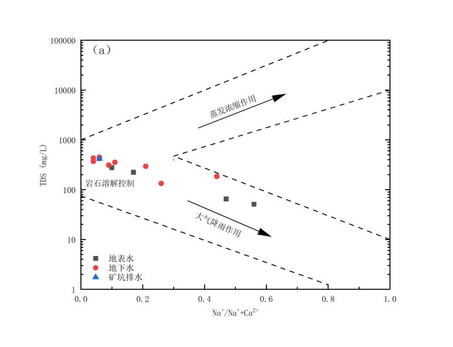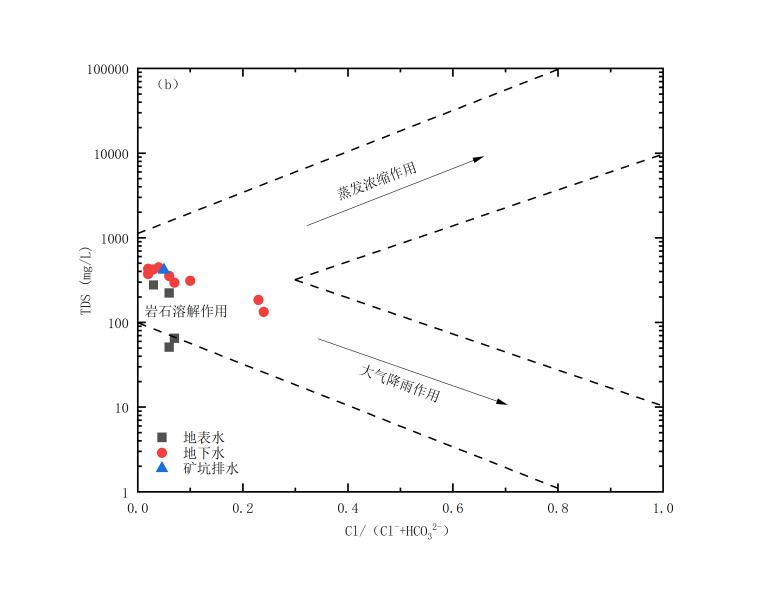__图3\.5\-3  大旺塘矿区Gibbs图__

由图3\.5\-3可知，研究区地下水与地表水水样整体分布于Gibbs图的岩石风化作用控制区内。多数地表水样与地下水TDS主要集中在约100–1000 mg/L范围内，Na⁺/\(Na⁺\+Ca²⁺\)大致在0\.04–0\.6之间，表明水体溶质来源多数以岩石风化溶解作用为主，但有部分水点受大气降雨作用影响；Cl⁻/\(Cl⁻\+HCO₃⁻\)约在0\.02–0\.25之间，均明显小于0\.5，表明水体溶质来源以岩石风化溶解作用为主。大气降雨作用和水岩相互作用控制着研究区整体水化学特征；结合区域地层岩性推断，水体中的主要溶质离子可能主要来自方解石等碳酸盐类矿物的溶解贡献。地表水中渔涝河受大气降雨影响较大，地下水中榃甘水井（DX02）受大气降雨较大，井边水井（DX01）和荔枝水井（DX05）也受到一定的大气降雨影响。

综合两幅Gibbs图判断，研究区大部分水样的溶解性总固体（TDS）与主阴离子比值均为“岩石风化溶解为主、蒸发浓缩与大气降水为辅”的水化学控制模式，阳离子比值为“岩石风化溶解与大气降水为主、蒸发浓缩为辅”的水化学控制模式。局部异常点偏离Gibbs模型主要由人为活动、局地蒸发条件差异或外源水体混入导致。

##### 离子比值分析

（1）γ\(Na\+\+K\+\)/γCl−

γ\(Na\+\+K\+\)/γCl−的比值（γ代表毫克当量浓度）可用来揭示地下水中Na\+、K\+、Cl−的来源。一般认为地下水中只存在岩盐溶解则γ\(Na\+\+K\+\)/γCl−=1；若γ\(Na\+\+K\+\)/γCl−＞1，则Na\+、K\+相对于  Cl−过量，表明地下水中存在硅酸盐溶解或阳离子交换作用；若γ\(Na\+\+K\+\)/γCl−＜1，则表明地下水中的Cl−可能受人类活动影响。Na\+\+K\+与Cl−的毫克当量的比值关系是表征含水层封闭程度和地下水发生浓缩作用程度的重要指标，比值越大说明地下水封闭性越差，接受浅层渗入水的补给越多，比值为１说明地下水是含盐岩地层溶滤而成的水。

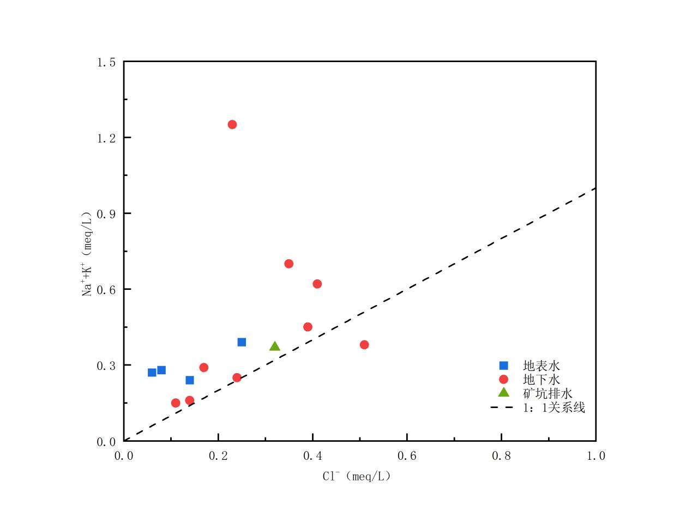

__图3\.5\-4  γ\(Na\+\+K\+\)/γCl−比值图__

如图3\.5\-4所示，研究区内大部分样品点落于1:1关系线以上，结合离子相关性分析结果可知研究区存在岩盐溶解，DX01的（Na⁺\+K⁺）/Cl⁻比值较高，结合Piper三线图及舒卡列夫分类结果以及附近存在大片的庄稼，进一步说明其受区域东侧侵入岩孔隙裂隙水补给或农业污染的影响。研究区内仅位于矿区南侧的院塘水井（DX04）采样点位于1:1关系线下方，故推测其可能受一定的人为活动影响。

1. c\(HCO3\-\)与c\(Mg2\+\)/c\(Ca2\+\)关系

碳酸盐岩矿区c\(Mg2\+\)/c\(Ca2\+\)与c\(HCO3\-\)的比值（c代表物质量浓度）可以用于判断方解石与白云石风化溶解过程中的主要物质组成来源。仅方解石溶解状态下几乎不存在Mg2\+，c\(Mg2\+\)/c\(Ca2\+\)＝0；仅白云石溶解状态下，c\(Mg2\+\)/c\(Ca2\+\)＝1；方解石与白云石共同溶解状态下，c\(Mg2\+\)/c\(Ca2\+\)的值为0\.5。

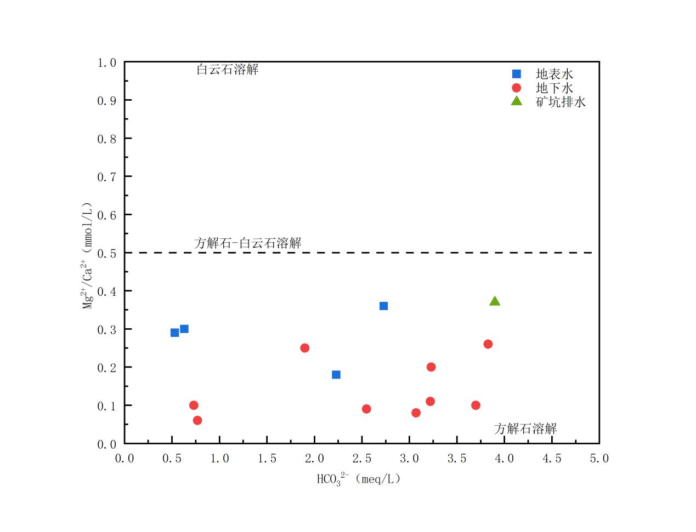

__图3\.5\-5  c\(Mg2\+\)/c\(Ca2\+\)与c\(HCO3\-\)的离子比值图__

如图3\.5\-5所示，研究区浅层水样点c\(Mg2\+\)/c\(Ca2\+\)的值在0\.06~0\.37之间变化，水点均落于方解石\-白云石溶解线以下，故矿区水点主要受方解石溶解沉淀作用控制，且地下水水点c\(Mg2\+\)/c\(Ca2\+\)的值普遍低于地表水水点，显示出更好的方解石溶解作用。

1. 阳离子交换作用

引入地下水氯碱指数（CAI1、CAI2）为可定量表征地下水中阳离子交换作用的方向与强度，氯碱指数表达式见下式。

CAI1=\[c\(Cl\-\) \- c\(Na\+\+K\+\)\]/c\(Cl\-\)

CAI2=\[c\(Cl\-\) \- c\(Na\+\+K\+\)\]/\[c\(HCO3\-\) \+ c\(SO42\-\)\]

当CAI1、CAI2均为负数时，代表地下水中Ca2\+、Mg2\+与岩土中Na\+进行阳离子交换作用，地下水中Na\+含量升高而Ca2\+、Mg2\+含量降低；反之则代表岩土中Ca2\+、Mg2\+进入地下水中且地下水中Na\+被岩土颗粒吸附。氯碱指数的绝对值越大，则阳离子交替吸附作用越强，工作区地下水氯碱指数见图3\.5\-6。

__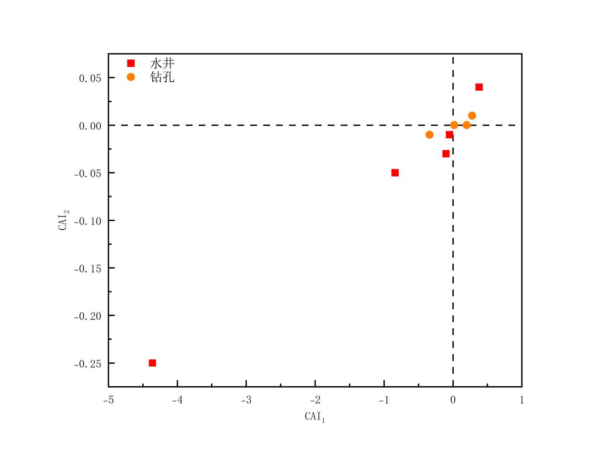__

__图3\.5\-6  地下水氯碱指数图__

如图3\.5\-6所示，矿区外围水井除院塘水井（DX04）外其他样品CAI1、CAI2均为负数，反映不同程度的阳离子交换作用，地下水中Na\+含量升高，Ca2\+、Mg2\+含量降低。阳离子交换作用强度以井边水井（DX01）最为强烈，推测可能受区域东侧侵入岩孔隙裂隙水补给或农业污染的影响；矿区内部钻孔除SK9\-5外其他样品CAI1、CAI2均大于0，表明水体Cl⁻含量相对较高，显示地下水主要发生反向离子交换过程。推测研究区地下水可能地下水滞留时间较长、水岩相互作用时间充分，矿区开采活动可能加强了水–岩作用控制，导致离子交换过程在该样品水化学演化中占据主导地位。

#### 氢氧稳定同位素特征分析

氢有两类稳定同位素，即1H和2H（D），其中1H丰度占绝对优势。氧有三类稳定同位素，即18O、17O和16O，其中18O丰度占绝对优势，其次是16O，17O的丰度最低。

氘（D）和18O稳定同位素不会随水的蒸发或凝结等外界条件的变化而变化，被称为稳定的“惰性示踪剂”，有助于深入了解水循环的基本特征。因此，采用稳定同位素18O和D含量的千分偏差δ值进行分析。工作区中地下水样品δD和δ18O含量见表3\.5\-3，地表 水 δD 为 \-33\.41‰~\-40\.07‰ ， δ 18O 为 \-4\.99‰~\-6\.37‰ ；地下水 δD 为 \-34\.85‰~\-42\.59‰，δ 18O 为\-5\.49‰~\-6\.64‰；矿坑排水δD 为\-34\.69‰，δ 18O 为 \-5\.61‰。总体上，矿区水点的 H\-O 同位素组成较相似。

__表3\.5\-3 δD和δ18O含量统计表__

类型

取样位置

样品编号

δD/‰

δ18O/‰

氘盈余 

地表水

西侧溪沟

DB01

\-33\.41 

\-4\.99 

6\.54 

渔涝河上游

DB02

\-40\.07 

\-6\.24 

9\.86 

渔涝河下游

DB03

\-39\.31 

\-6\.37 

11\.65 

南侧溪沟

DB04

\-35\.25 

\-5\.71 

10\.44 

地下水

井边水井

DX01

\-41\.79 

\-6\.31 

8\.73 

榃甘水井

DX02

\-38\.26 

\-6\.30 

12\.13 

大为水井

DX03

\-34\.86 

\-5\.54 

9\.42 

院塘水井

DX04

\-35\.47 

\-5\.49 

8\.45 

荔枝水井

DX05

\-42\.59 

\-6\.64 

10\.49 

SK4\-1

SK4\-1

\-35\.56 

\-5\.80 

10\.87 

SK9\-5

SK9\-5

\-39\.36 

\-5\.95 

8\.21 

SK16\-6

SK16\-6

\-36\.46 

\-6\.00 

11\.52 

SK16\-8

SK16\-8

\-37\.11 

\-6\.21 

12\.60 

矿坑排水

矿坑积水点

矿坑排水

\-34\.69 

\-5\.61 

10\.18 

由于肇庆地区没有大气降水的同位素监测站，选用距工作区最近的云浮市地区大气降雨线作为当地大气降水线背景值与全球大气降水线，绘制δD和δ18O关系图，如图3\.5\-8。云浮大气降雨线（LMWL）方程：δD=8\.1δ18O\+11\.4、全球大气降水（GMWL）方程：δD=8δ18O\+10。

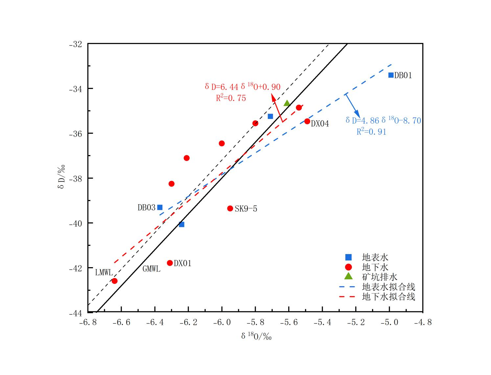

__图3\.5\-7  研究区δD\-δ18O关系图__

地下水的拟合方程为δD=6\.44δ18O\+0\.90（R2=0\.75），斜率略低于LMWL的斜率，表明地下水可能虽受蒸发影响，但蒸发强度中等，可能是在补给前地表滞留阶段发生了一定程度的蒸发，随后快速入渗，避免了进一步强烈的蒸发分馏。R2=0\.75说明地下水的δD与δ18O之间呈中等程度的线性相关，相关性不算很高，这说明不同深度、不同径流路径的地下水存在混合，DX01、DX04与SK9\-5取样点位于 LMWL 下方且距离大气降水线较远，说明水体在地表或浅层滞留时间较长，其中SK9\-5位于大旺塘矿区的排水点附近，且附近均为富水性较好的灰岩，因此推测SK9\-5可能接受了大旺塘排水点的补给，而距离DX01与DX04的100m~200m位置均存在鱼塘，推测DX01与DX04可能接受了附近地表的补给。

地表水的拟合方程为δD=4\.86δ18O\-8\.7（R2=0\.91），DB03取样点落在LMWL上方，发生了18O的负向漂移，因为岩石中含氢矿物很少，且δD含量较低，因此同位素交换反应对岩溶水δD几乎不产生影响，而地壳中化学作用可释放 CO2，当 CO2进入岩溶水中，发生 18O 交换时，会导致δ18O 偏负，结合渔涝河下游（DB03）的水位仅为23\.21m，而在区域中监测的地下水水位最低也高达49\.37m，因此推测此处可能接受了地下水的补给。DB02与DB04取样点位于 LMWL 下方且靠近大气降水线，说明受大气降水影响最为直接，水循环深度较浅、流速快，水岩相互作用较弱，而 DB01距离 LMWL 更远且发生了明显的 18O 正向漂移，反映了水在地下水中运移时间更长，水岩作用更强。同时也说明其补给来源更远，补给范围更广。

氘盈余\(d\-excess\)是研究大气降水过程及受影响因素的重要的指标参数，d值\(d=δD－8δ18O\)主要受空气相对温度控制，因此d\-excess值与水体受到的蒸发分馏作用相关，d\-excess值越小其受到蒸发分馏作用越强。

d\-excess均值为10\.08‰，接近全球大气降水线标准值，表明其主要来源于海洋水汽的降水补给，蒸发作用影响较小。西侧溪沟（DB01）的d\-excess 值为6\.54‰， 低于全球平均值\(10‰\)，表明受蒸发影响较大，推测可能是由于DB01处流量较小（约75\.6m³/h），西侧溪沟体积小，面积大，从上游部分开始便一直受蒸发作用影响，因此受蒸发影响强烈。

#### 小结

1. 研究区水化学组成主要受碳酸盐岩溶解控制，局部受侵入岩孔隙裂隙水、阳离子交换及人为干扰等因素影响。地下水TDS变化范围为133~633 mg/L，最低值出现在荔枝水井（DX05），最高值出现在钻孔SK12\-6。
2. 离子比值分析表明，γ\(Na⁺\+K⁺\)/γCl⁻关系显示，研究区多数水样中Ca²⁺主要来源于方解石溶解，局部点（如DX01）受侵入岩孔隙裂隙水补给及阳离子交换作用影响显著。
3. δD–δ¹⁸O同位素关系显示，地下水主要来源于大气降水补给，入渗前存在一定程度的蒸发，但蒸发强度中等，反映补给条件良好、入渗迅速。部分水点（如DX01、DX04、SK9\-5）偏离大气降水线，推测可能存在地表水补给或混合作用。

# 矿区水文地质条件

## 矿区地质

### 矿区地层

矿区出露地层主要为刘家塘组灰岩，局部未开采地段有零星第四系（Q）。

刘家塘组（C1*lj*）：广泛分布于矿区，岩性为灰岩、白云质灰岩夹一层硅质灰岩。平均厚493m，为赋矿层位。

第四系（Q）分布于矿区未开采地段及低洼地带。主要为冲积、洪积层，由砂砾、砂质粘土、粘土等组成。厚度变化大，1~33m不等。

### 矿区地质构造

本次物探共识别出10条构造破碎带，明确了矿区构造格架的边界，为后续矿床开采及防治水工程的布设提供了可靠的地质依据。

表4\.1\-1 基于物探成果的断层构造破碎带汇总表

序号

编号

发育位置

倾向（°）

倾角（°）

1

Wf1

勘察区南侧

95

70

2

Wf2

勘察区东侧

50

56

3

Wf3

勘察区东侧

62

31

4

Wf4

勘察区南侧

52

72

5

Wf5

勘察区南侧

深部分别向两侧延伸

6

Wf6

勘察区南侧

50

51

7

Wf7

勘察区西侧

55

72

8

Wf8

勘察区南侧

深部分别向两侧延伸

9

Wf9

勘察区北侧

122

81

10

Wf10

勘察区西侧

15

77

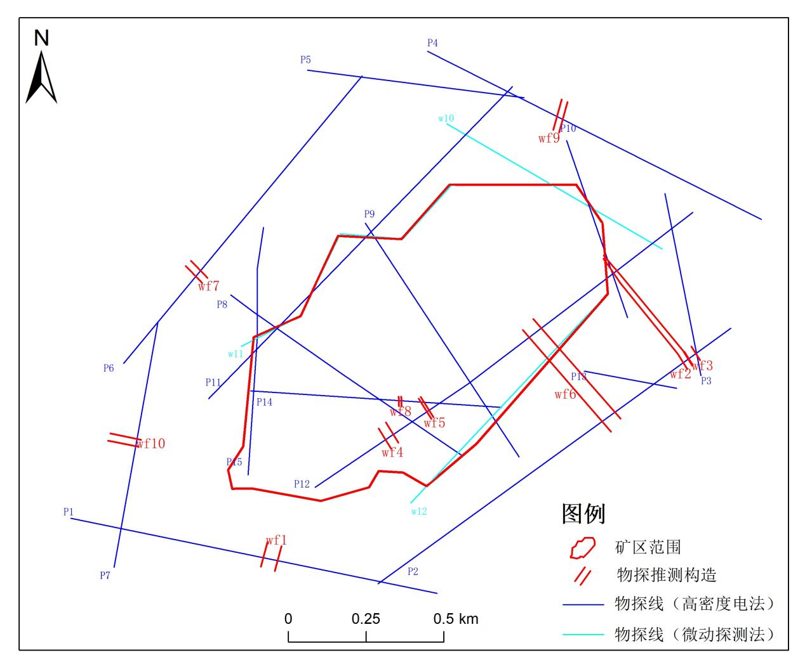

图4\.1\-1 基于物探成果的断层构造破碎带图

### 矿体地质特征

#### 矿体形态、产状

矿层沿北东\-南西走向展布，除局部被第四系覆盖外，矿体基本裸露地表。由于该矿区开采多年，现状形成一个北东向长1450m，南西向宽750m的采坑，开采面形状近似椭圆形。赋存标高\+236\.00~\+5\.00m。矿层受地层控制，呈单斜层状产出，其产状与地层产状一致，总体走向北东55°~68°，倾向325°~338°，倾角14°~25°，产状较稳定，局部产状有一定变化，沿走向在2线附近的0、4、6线间有波状隆起，沿倾向局部也有轻微波状起伏。矿区范围内矿体沿走向1430m，倾向790m，矿床标高\+236\.00~\+5\.00m，最大相对高差231\.00m。

矿体赋存于刘家塘组（C1*lj*）地层中，由中~厚层状灰岩组成，矿床由1个矿层和5个夹层（或夹石透镜体）组成。刘家塘组（C1*lj*）夹层编号自下而上依序为G1、G2、G3、G4、G5，矿体为单矿层，呈单斜层状产出，受地层控制，产状与地层产状一致。矿层内的矿石由灰~灰黑色中~厚层状灰岩组成，由于本矿区矿石多为Ⅰ级品，少数矿石为Ⅱ级品，在实际生产中无法分采，矿区不再划分矿石品级。

#### 规模

矿区矿层总体呈厚大层状，沿走向、倾向方向经工程控制，连续对应，层位较稳定。矿层赋存于刘家塘组（C1*lj*）地层中，沿走向延长大于1600m，呈单斜层状产出，单工程控制厚度24\.00m~202\.62m，沿倾向方向延深136\.20m~301\.73m，勘探线控制的矿层总厚度大于200m，矿层属于厚大层沉积矿床，厚度稳定，矿层赋存标高\+236\.00m~5\.00m，埋深0m~231\.00m。

### 矿石特征

#### 矿石的岩石学特征

矿区的矿石自然类型为碎裂岩化不等晶灰岩、生物屑微晶灰岩、弱白云石化内碎屑微晶灰岩夹白云质灰岩。

生物屑微晶灰岩：岩石标本呈灰色，粉\-微晶结构，生物屑结构，碎裂化结构，块状构造，滴冷的稀盐酸剧烈冒泡。可见少量裂隙及白色方解石脉体。岩石由方解石、生物屑和白云石等组成，粒径多属微晶。方解石呈细小粒状，粒径0\.01~0\.05mm，微晶为主，高级白干涉色，滴茜素红\-S溶液染色呈鲜红，较均匀分布。生物屑呈圆状、椭圆状、弯钩状、管状或团块状，粒径0\.05~3\.4mm，少部分重结晶为亮晶方解石，较均匀分布。白云石呈粒状，粒径0\.01~0\.04mm，高级白干涉色，滴茜素红\-S溶液染色不上色，不均匀分布。炭质呈黑色粉尘状或浸染状不均匀分布在矿物间隙及岩石微细裂隙中。铁质呈褐色粉尘状不均匀分布。不透明矿物呈半自形\-他形粒状，粒径0\.02~0\.08mm，不均匀分布。次生方解石呈脉状充填于岩石裂隙中，脉宽0\.02~0\.34mm，高级白干涉色，滴茜素红\-S溶液染色呈鲜红色。

弱白云石化内碎屑微晶灰岩：岩石标本呈灰色，微晶结构、内碎屑结构、生物屑结构，块状构造，滴冷的稀盐酸剧烈冒泡。可见少量裂隙及方解石脉体。岩石主要由方解石、内碎屑和生物屑等组成，粒径多属微晶。方解石呈粒状，粒径0\.01~0\.04mm，多为微晶，高级白干涉色，滴茜素红\-S溶液染色呈鲜红色，均匀分布。白云石呈粒状，粒径约0\.01~0\.03mm，高级白干涉色，滴茜素红\-S溶液染色不上色，不均匀分布。内碎屑呈团状、次圆状或不规则状，粒径约0\.2~8\.8mm，成分为细晶灰岩，多已重结晶为亮晶方解石，不均匀分布。生物屑呈圆状、椭圆状、弯钩状、条状或团块状，粒径0\.1~2\.7mm，部分重结晶为亮晶方解石，较均匀分布。铁质呈褐色粉尘状或浸染状不均匀分布于矿物间隙及岩石微细裂隙中。不透明矿物呈他形粒状，粒径约0\.01~0\.07mm，零星分布。次生方解石呈脉状充填于岩石裂隙中，脉宽0\.02~0\.8mm，闪突起，高级白干涉色。

碎裂岩化不等晶灰岩：岩石标本呈灰色，碎裂化结构、不等晶结构，块状构造，滴冷的稀盐酸剧烈冒泡。可见裂隙及白色方解石脉体。岩石由方解石和白云石等组成，镜下可见微晶、粉晶和细晶，三种粒径含量相当。岩石可见碎裂，呈碎裂化结构。方解石呈粒状，粒径0\.01~0\.2mm，高级白干涉色，滴茜素红\-S溶液染色呈鲜红，较均匀分布。生物屑呈椭圆状、圆状或弯钩状，长径0\.1~0\.6mm，略脏杂，高级白干涉色，较均匀分布。白云石呈粒状，粒径在0\.02~0\.1mm范围，高级白干涉色，滴茜素红\-S溶液染色不上色，不均匀分布。铁质呈褐色浸染状不均匀分布于矿物间隙及岩石微细裂隙中。不透明矿物呈他形粒状，粒径0\.01~0\.05mm，零星分布。次生方解石呈脉状充填于岩石裂隙中，脉宽0\.04~0\.8mm，方解石呈高级白干涉色，滴茜素红\-S溶液染色呈鲜红色。

#### 矿石化学特征

根据2025年分割报告知：区内矿层主要化学成分含量为：CaO为45\.00~55\.84%，平均值为53\.89%，其中多数位于50\.47%~55\.25%之间；矿区内圈定矿体的矿石中MgO含量一般为0\.03%~3\.50%，其中多数小1%。矿石体加权平均值为1\.22%；矿区矿石SiO2为0\.19%~26\.92%，平均值为0\.80%，其中多数位于0\.34%~1\.14%之间；Al2O3为0\.07%~3\.38%，其中多数位于0\.12%~0\.25%之间，平均值为0\.17%；Fe2O3为0\.04%~1\.39%，平均值为0\.08%，其中多数位于0\.05%~0\.13%之间；LOI为31\.61%~46\.54%，平均值为43\.08%，其中多数位于42\.76%~43\.47%之间。根据分割报告选取的1624个矿石样品数据分析可知，矿区矿体CaO含量主要集中在54\.00%~55\.50%之间，占矿石样品总数量的61\.71%。矿区有益组分CaO含量较高，满足I级品矿石要求。矿区圈定矿体MgO含量＜1\.00%样品占矿石样品总数量的66\.93%，矿体总体属于低镁矿石。

#### 矿石放射性

根据2016年《大旺塘储量核实报告》采取的1件矿石做放射性试验，按照《建筑材料放射性核素限量》（GB6566\-2010）和《民用建筑工程室内环境污染控制规范》（GB50325\-2010）要求：

测定照射指数为：内照射指数IRa（未检出），外照射指数Iγ（未检出）。结合放射性样品的结果，矿石符合建筑材料放射性核素限量建筑主体材料及A类装饰装修材料标准，其产销和使用范围不受限制。

### 矿石加工技术性能

#### 矿石的使用情况

水泥用石灰岩破碎位于现持采矿权证19号拐点北面约100m处，该破碎站主要为水泥用石灰岩原矿进行粗碎，以便于运输。矿山水泥用灰岩破碎后，通过长皮带廊运至采矿权人华润水泥（封开）有限公司所属水泥厂。

#### 破碎加工工艺流程

石灰石是生产水泥用量最多的原料，因为原矿开采块较大，硬度较高，必须破碎到一定粒度才符合入磨要求。破碎机的选型主要根据原料的种类以及原料的强度、硬度等性质来选择。主要种类有：旋回破碎机、颚式破碎机、圆锥破碎机、辊式破碎机、锤式破碎机、反击式破碎机等。水泥厂石灰石破碎一般采用单段锤式破碎机，一段闭路破碎。锤式破碎机为水泥生产普遍使用的破碎机，用于破碎石灰石、泥灰岩、泥质粉砂岩、页岩、石膏和煤等。

水泥用石灰岩（含夹石）经采场道路运输至水泥用石灰岩破碎站粗碎卸料平台，通过矿仓进入粗碎，一段破碎（破碎比为12\.5）后的物料（块度≤80mm）由运输皮带输送进入成品堆场堆存。

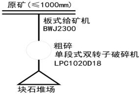

图4\.1\-2水泥用石灰岩（含夹石）破碎工艺流程图

### 矿体资源量

本次资源储量复核报告资源量估算的基准日为：2025年11月4日。

本次资源量估算范围为复核区范围（拟设采矿权范围）。根据工业指标圈定矿体，估算拟设置采矿权范围内的资源量。

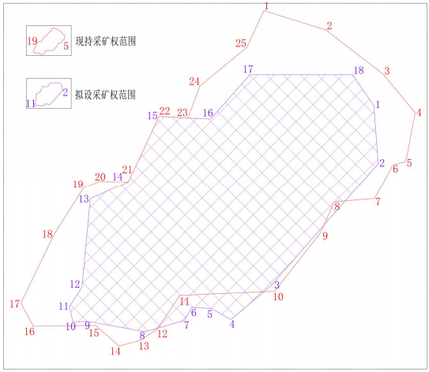

图4\.1\-3资源量估算范围分布图

资源储量复核截止日期2025年11月4日，经估算复核区（现拟设采矿权范围）（标高\+236\.00m~\+5\.00m）内查明保有水泥用石灰岩资源量矿石量8529\.5×104t，保有控制资源量矿石量7779\.8×104t，占保有资源量的91\.21%；推断资源量矿石量749\.7×104t，占保有资源量的8\.79%。

## 矿区水文地质

### 含隔水层

矿区出露地层为石炭系下统刘家塘组及第四系，含水层主要为松散岩类孔隙水含水层和碳酸盐岩类裂隙溶洞水含水层，详细分布特征如下：

#### 松散岩类孔隙水含水层

根据现场调查，矿区内第四系已基本挖空，目前仅在矿区中部存在部分矿山开采回填形成的填土及爆破震动形成的碎石土，分布范围极小且不连续，单位涌水量小于0\.1 L/\(s·m\)，整体富水性较弱。

#### 碳酸盐岩类裂隙溶洞水含水层

该类地下水主要分布于石炭系下统刘家塘组（C1lj）的灰岩裂隙溶洞中，属于裸露型岩溶水，含水层厚度大于260m，根据抽水试验成果资料分析，该含水层以岩溶裂隙发育形成的裂隙溶洞水为主，平均单位涌水量为1\.95L/\(s·m\)，位于1和5L/\(s·m\)之间，富水性强，水量丰富。

### 岩溶发育特征

#### 可溶岩的分布与埋藏条件

矿区出露地层主要为石炭系下统刘家塘组（C1*lj*）碳酸盐岩及第四系残坡积层（Qedl）。受前期矿产开采活动影响，第四系松散岩类孔隙含水层已基本被疏干，目前基岩呈现大面积裸露状态。基于现状条件，矿区主要含水层确定为刘家塘组（C1*lj*）岩溶裂隙含水层。该含水层岩性由灰岩、白云质灰岩组成，地层呈单斜产出。在水文地质补给与排泄方面，由于矿区现有地下水位标高低于50m，低于矿区四周水位，矿床接收四周含水层的侧向补给。

受地形坡度较大及岩石裸露的影响，该区域地表径流条件良好，具备较强的自然排水能力，矿层整体导水性较好。受地质构造及溶蚀风化作用的共同影响，矿区节理较为发育，原地貌多见悬崖峭壁。岩溶作用在空间上呈现出一定的发育规律：地表出露段以溶孔、溶隙及溶洞为主要特征；地下隐伏段则以溶隙与溶洞发育为主。

#### 可溶岩岩溶发育特征

（1）地表岩溶发育特征

本次调查共布设56处地质调查点，对刘家塘组（C1*lj*）可溶岩的出露情况进行了系统观测。

区域内地表岩溶发育强烈，岩溶现象典型且广泛分布，矿区及周边露头区可见大量溶孔、溶洞、溶沟等岩溶形态，其中小型溶孔密集分布，溶沟多顺层理或节理展布。

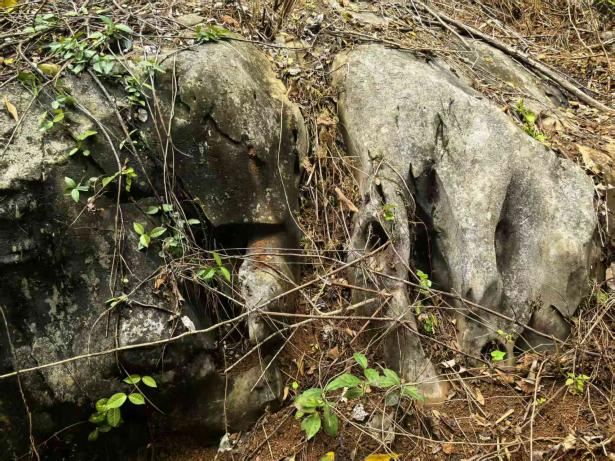

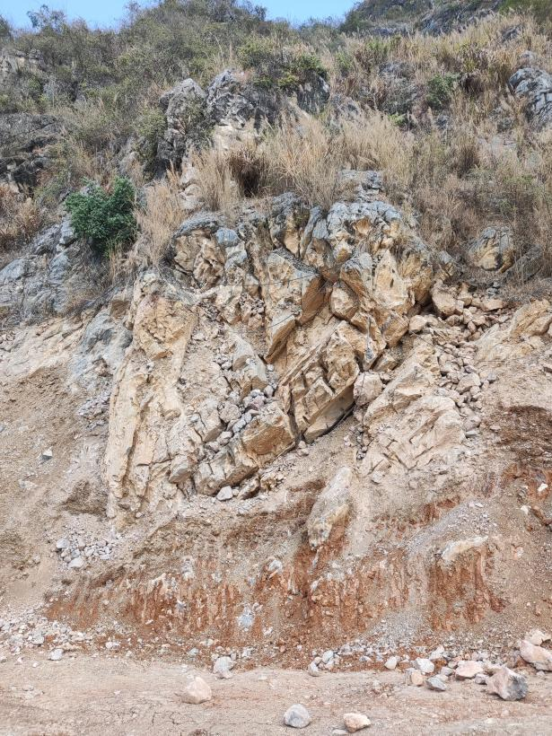

小溶孔、溶蚀沟照片1

小溶孔、溶蚀沟照片2

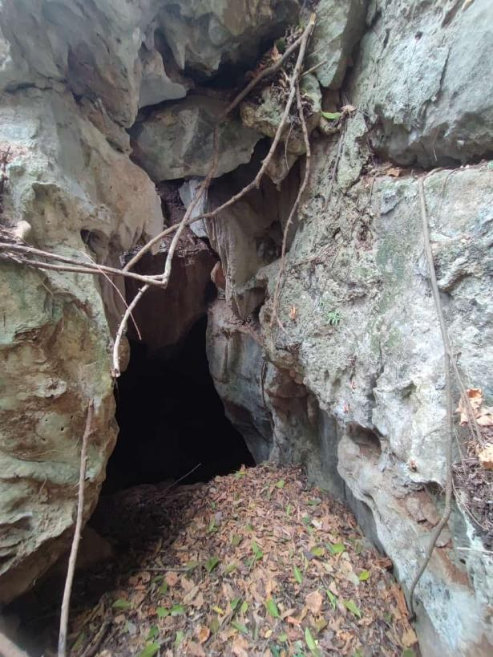

矿区西侧外围溶洞照片1

矿区西侧外围溶洞照片2

矿区北侧约300m处发育有一处小型溶洞，洞口呈三角形，宽约1mm，高约1\.5m，洞口直接出露于山坡地表，无明显的洞前堆积平台，显示其处于岩溶发育的早期阶段。从洞口向内观察，洞穴呈廊道式延伸，内部光线昏暗，深度不可见，洞体走向推测受岩层节理或层面控制。洞口右上方岩壁可见小型溶蚀凹坑，属于典型的地表溶蚀微形态，长期受地表水流溶蚀作用影响。

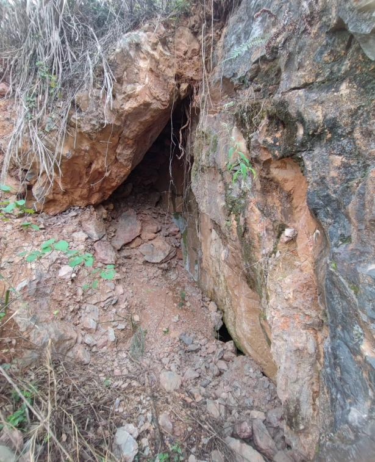

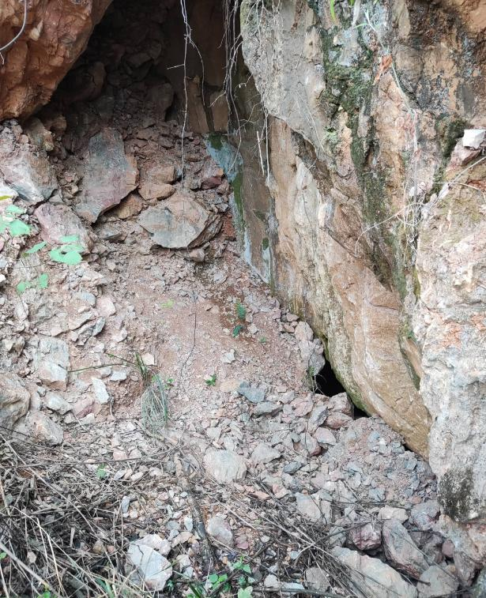

矿区西北侧300m处溶洞照片1

矿区西北侧300m处溶洞照片2

矿区东侧庙边村后山为罗沙岩遗址，该遗址发育于一处大型溶洞内，发育于石炭纪灰岩中，洞口朝向西北，宽度约为10m，高度约为2~3m。该溶洞向内逐渐扩大，形成厅堂式洞室结构，已探明洞长约为80m，最宽处达15m，局部高度约为12m。洞体呈廊道式与厅堂式交替分布，并沿岩层节理和断裂带方向延伸。

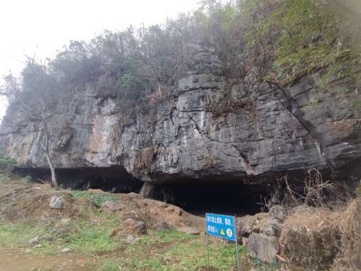

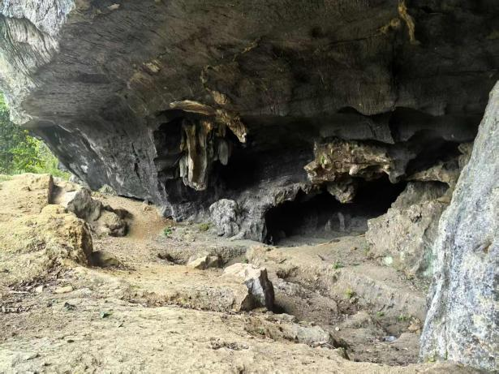

矿区东侧庙边村后山罗沙岩遗址照片1

矿区东侧庙边村后山罗沙岩遗址照片2

矿区南侧1\.5km处为黄岩洞洞穴遗址，位于渔涝河北部，发育于石炭纪灰岩中，是华南地区典型的岩溶洞穴遗址。洞穴洞口朝向西南，相对高程15m，高6m，宽5m，洞内分上下两层，洞厅西、南两侧各有支洞延伸。该洞形成于更新世中晚期，受NE向和NW向两组节理控制，沿岩层层面溶蚀扩展而成，属于渗流带溶洞。洞穴周边为岩溶谷地，地下水位波动带位于洞底以下5~8m，目前仍受大气降水补给影响，处于稳定发育阶段。

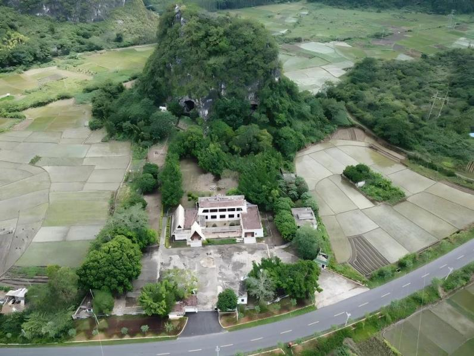

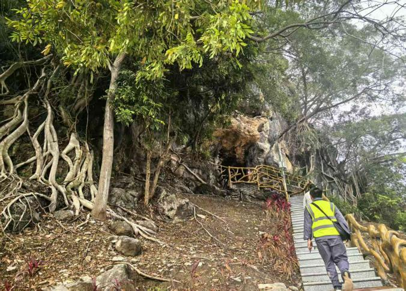

矿区南侧黄岩洞洞穴遗址照片1

矿区南侧黄岩洞洞穴遗址照片2

1. 地下岩溶平面发育特征

综合往次及本次勘探新施工钻孔揭露岩溶发育情况，矿区共施工66个揭露碳酸盐岩的钻孔，其中揭露溶洞的钻孔有30个，钻孔见洞率为45\.45%，所有钻孔穿过可溶岩段的总进尺深度为5064\.99m，所有钻孔中揭露到的溶洞（包括充填或半充填溶洞）的垂直高度总和为151\.30m，线岩溶率为2\.99%。

a\.SK16\-2

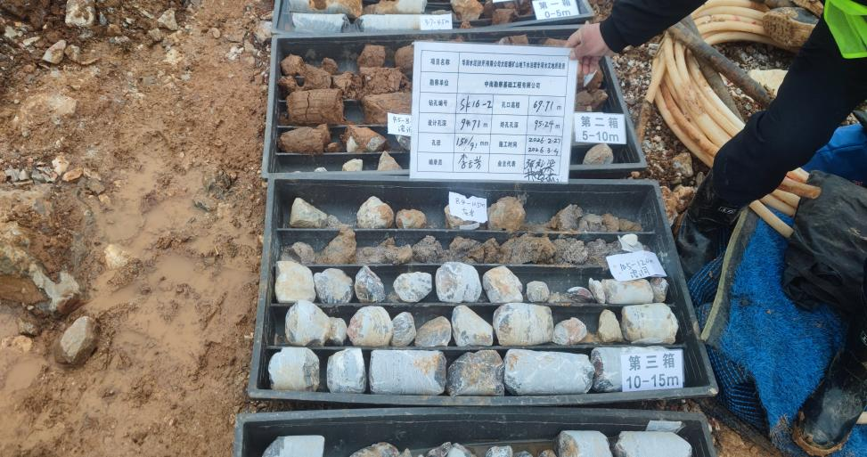     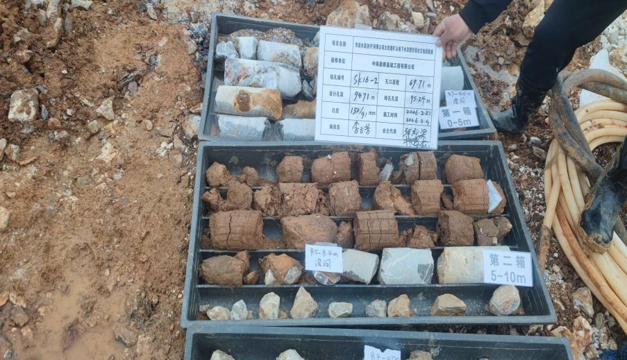

b\.SK16\-3

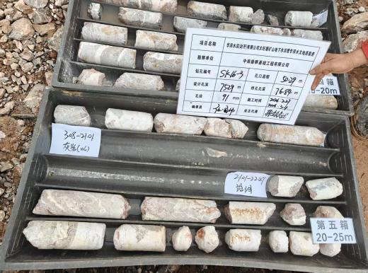     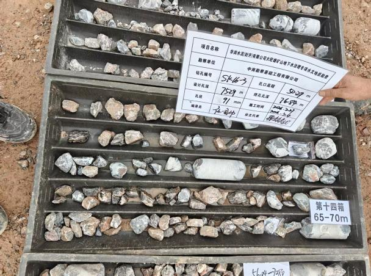

c\.SK16\-4

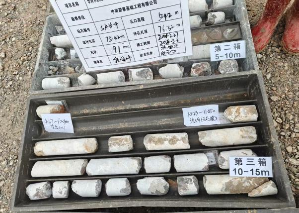     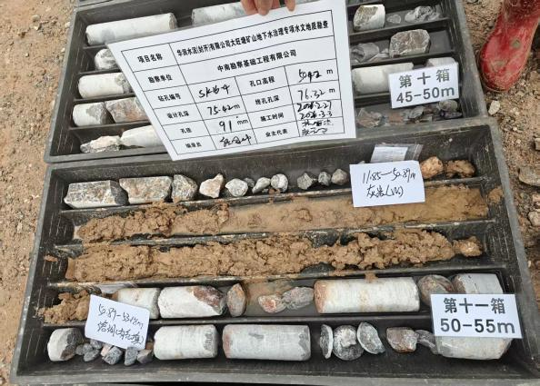

d\.SK16\-5

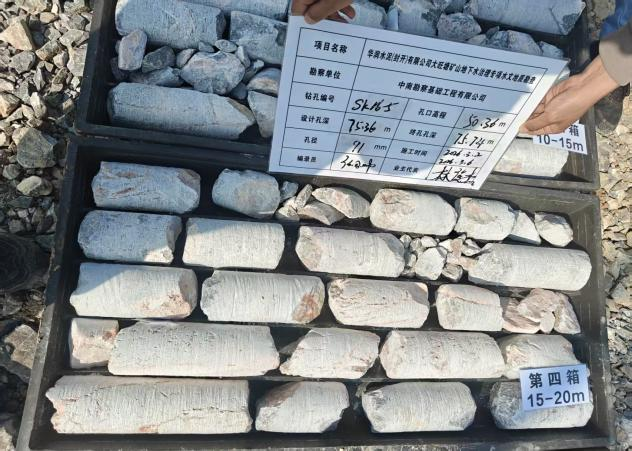     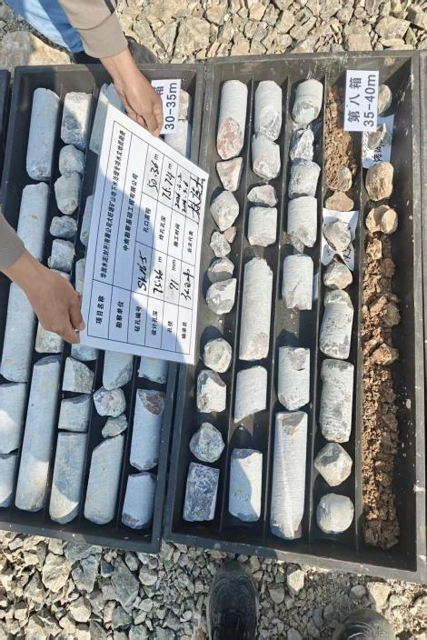

图4\.2\-1 部分钻孔岩溶发育情况

钻孔岩溶率指钻孔所遇岩溶洞隙长度与钻孔穿过可溶岩长度的百分比，是岩溶研究中定量表征岩溶发育强度的核心指标。为比较不同碳酸盐岩含水层中岩溶发育情况，统计了本次施工揭露钻孔不同深度的钻孔岩溶率。

表4\.2\-1 本次施工钻孔岩溶发育高度统计表

钻孔编号

岩溶发育高程（m）

\+70~\+50

\+50~\+30

\+30~\+10

\+10~\-10

\-10~\-30

SK0\-1

0\.00%

18\.50%

0\.00%

0\.00%

0\.00%

SK0\-2

0\.00%

0\.00%

0\.00%

0\.00%

0\.00%

SK1\-0

4\.25%

0\.00%

0\.00%

0\.00%

0\.00%

SK1\-1

10\.00%

0\.00%

0\.00%

16\.50%

0\.00%

SK1\-2

0\.00%

0\.00%

0\.00%

0\.00%

0\.00%

SK1\-5

0\.00%

0\.00%

0\.00%

0\.00%

0\.00%

SK1\-6

0\.00%

0\.00%

0\.00%

0\.00%

0\.00%

SK2\-1

0\.00%

11\.50%

0\.00%

0\.00%

0\.00%

SK2\-2

0\.00%

0\.00%

0\.00%

0\.00%

0\.00%

SK3\-1

0\.00%

0\.00%

0\.00%

0\.00%

0\.00%

SK3\-2

0\.00%

0\.00%

0\.00%

0\.00%

0\.00%

SK3\-3

0\.00%

0\.00%

0\.00%

0\.00%

0\.00%

SK3\-4

0\.00%

5\.00%

6\.00%

0\.00%

0\.00%

SK3\-6

0\.00%

5\.75%

0\.00%

0\.00%

0\.00%

SK4\-1

0\.00%

0\.00%

0\.00%

0\.00%

0\.00%

SK4\-2

45\.00%

0\.00%

0\.00%

0\.00%

0\.00%

SK5\-1

0\.00%

0\.00%

0\.00%

0\.00%

0\.00%

SK5\-2

0\.00%

0\.00%

0\.00%

0\.00%

0\.00%

SK5\-3

0\.00%

6\.50%

0\.00%

0\.00%

0\.00%

SK5\-4

0\.00%

13\.65%

0\.00%

0\.00%

0\.00%

SK6\-1

10\.00%

1\.25%

0\.00%

0\.00%

0\.00%

SK6\-2

0\.00%

0\.00%

0\.00%

0\.00%

0\.00%

SK6\-3

0\.00%

6\.55%

0\.00%

0\.00%

0\.00%

SK9\-1

14\.75%

34\.25%

5\.25%

0\.00%

0\.00%

SK9\-2

3\.50%

64\.50%

13\.50%

2\.50%

0\.00%

SK9\-3

0\.00%

0\.00%

0\.00%

0\.00%

0\.00%

SK9\-4

0\.00%

5\.50%

0\.00%

0\.00%

0\.00%

SK9\-5

0\.00%

58\.15%

46\.85%

40\.65%

6\.85%

SK9\-6

0\.00%

0\.00%

0\.00%

0\.00%

0\.00%

SK9\-7

0\.00%

0\.00%

2\.50%

0\.00%

0\.00%

SK9\-8

0\.00%

15\.50%

0\.00%

0\.00%

50\.00%

SK10\-1

0\.00%

0\.00%

0\.00%

0\.00%

0\.00%

SK10\-2

0\.00%

34\.00%

10\.00%

0\.00%

0\.00%

SK10\-3

0\.00%

0\.00%

0\.00%

0\.00%

0\.00%

SK10\-4

0\.00%

0\.00%

0\.00%

0\.00%

0\.00%

SK10\-5

0\.00%

0\.00%

0\.00%

0\.00%

0\.00%

SK10\-6

0\.00%

0\.00%

0\.00%

0\.00%

0\.00%

SK11\-1

0\.00%

0\.00%

0\.00%

0\.00%

0\.00%

SK11\-2

0\.00%

0\.00%

0\.00%

0\.00%

0\.00%

SK11\-3

0\.00%

0\.00%

0\.00%

0\.00%

5\.00%

SK11\-4

0\.00%

0\.00%

0\.00%

0\.00%

0\.00%

SK11\-5

0\.00%

8\.50%

0\.00%

0\.00%

0\.00%

SK12\-1

0\.00%

0\.00%

0\.00%

0\.00%

0\.00%

SK12\-2

0\.00%

0\.00%

0\.00%

0\.00%

0\.00%

SK12\-3

0\.00%

0\.00%

0\.00%

0\.00%

0\.00%

SK12\-4

0\.00%

0\.00%

7\.00%

0\.00%

0\.00%

SK12\-5

0\.00%

0\.00%

0\.00%

0\.00%

0\.00%

SK12\-6

0\.00%

0\.00%

0\.00%

10\.00%

0\.00%

SK12\-7

0\.00%

0\.00%

4\.00%

0\.00%

0\.00%

SK13\-1

0\.00%

0\.00%

0\.00%

0\.00%

0\.00%

SK14\-1

0\.00%

0\.00%

0\.00%

0\.00%

0\.00%

SK14\-2

0\.00%

0\.00%

0\.00%

0\.00%

0\.00%

SK14\-3

0\.00%

0\.00%

0\.00%

0\.00%

0\.00%

SK14\-4

0\.00%

0\.00%

0\.00%

0\.00%

0\.00%

SK14\-3观1

0\.00%

0\.00%

0\.00%

0\.00%

0\.00%

SK16\-1

0\.00%

0\.00%

0\.00%

0\.00%

0\.00%

SK16\-2

27\.00%

0\.00%

0\.00%

0\.00%

0\.00%

SK16\-3

0\.00%

0\.00%

9\.00%

0\.00%

0\.00%

SK16\-4

0\.00%

8\.10%

0\.00%

11\.45%

0\.00%

SK16\-5

0\.00%

0\.00%

6\.25%

0\.00%

0\.00%

SK16\-6

0\.00%

10\.00%

15\.00%

10\.00%

0\.00%

SK16\-7

0\.00%

0\.00%

0\.00%

0\.00%

0\.00%

SK16\-8

0\.00%

5\.70%

14\.30%

2\.50%

0\.00%

SK16\-9

0\.00%

0\.00%

0\.00%

0\.00%

0\.00%

SK16\-10

0\.00%

0\.00%

0\.00%

0\.00%

0\.00%

SK16\-11

0\.00%

0\.00%

0\.00%

18\.05%

0\.95%

矿区内钻孔岩溶发育在高程与平面空间分布上具有一定规律性。从高程区间来看，岩溶发育主要集中在\+70~\+10m段，其变化趋势呈明显的单峰状：在高程\+50~\+30m段岩溶发育强，在\+70~\+50m段、\+30~\+10m段发育中等；进入到\+10~\-10m段后，岩溶发育程度开始减弱，最后在\-10~\-30m段钻孔岩溶率在垂向上整体最低。

在平面分布上，岩溶强发育孔主要集中于矿区的西北部区域，受原大旺塘及构造影响，SK9\-2、SK9\-5在\+50~\+10m高程区间段内岩溶强发育；位于矿区东北侧边界附近的SK16\-2以及东南侧边界附近的SK4\-2等钻孔在浅层\+70~\+50m高程段岩溶较为发育，而矿区东侧边界附近的SK16\-4、SK16\-6则在\+50~\-10m高程段内岩溶中等发育，反映出矿区岩溶发育受局部地质构造或地层条件的差异性控制明显。

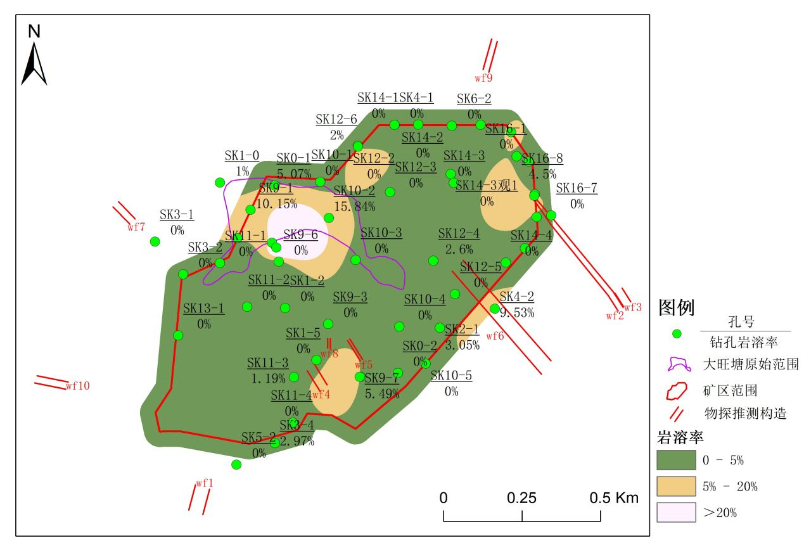

图4\.2\-2 矿区钻孔总岩溶率分区图

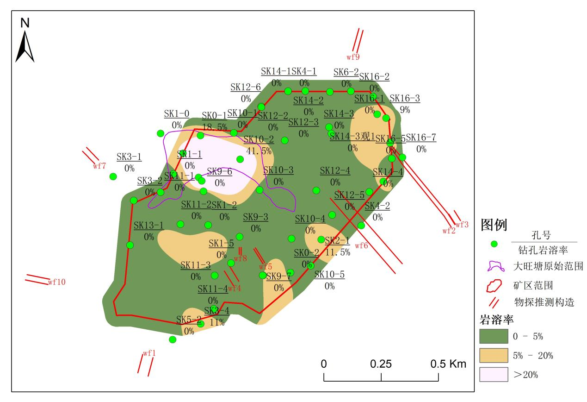

图4\.2\-3 矿区\+35m开采平台钻孔岩溶率分区图

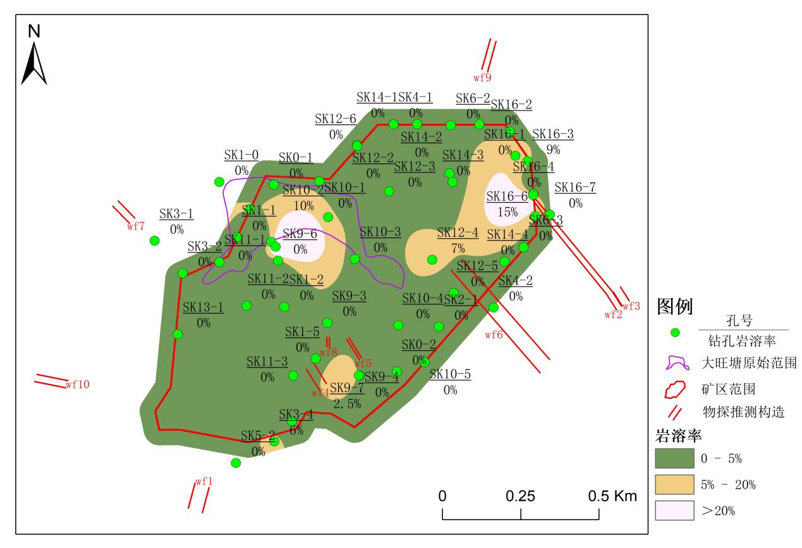

图4\.2\-4 矿区\+20m开采平台钻孔岩溶率分区图

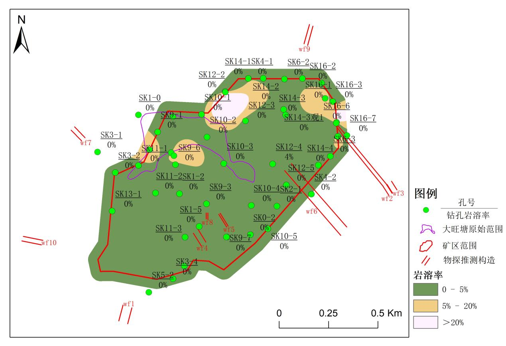

图4\.2\-5 矿区\+5m开采平台钻孔岩溶率分区图

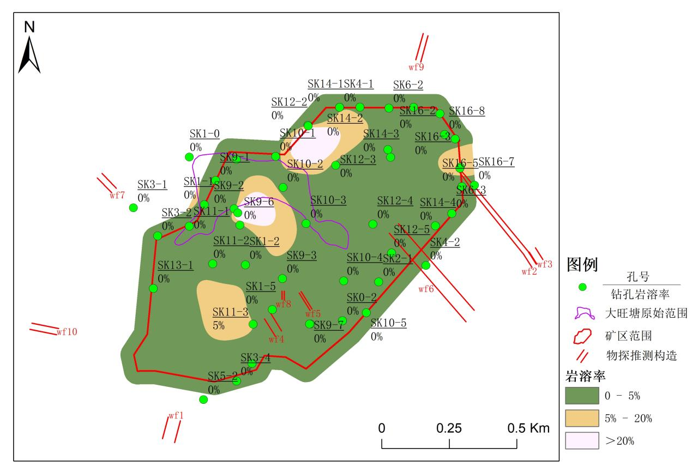

图4\.2\-6 矿区\-10m开采平台钻孔岩溶率分区图

根据矿区钻孔总岩溶率分区图可知，矿区北部受原大旺塘及推测构造wf9影响，SK9\-2（29\.71%），SK9\-5（50\.83%）钻孔岩溶率较高，该区为矿区内强岩溶发育区。其次，矿区东部受破碎带、溶隙及物探推测构造（如wf2、wf3等）影响，SK16\-2（5\.71%）、SK16\-4（5\.18%）、SK16\-6（9\.14%）钻孔岩溶发育率在5~10%左右，该区为矿区内中等岩溶发育区。同时，矿区东南部受破碎带、溶隙及推测构造wf6等影响，SK4\-2（9\.52%）钻孔岩溶发育率中等，该区域为岩溶中等发育区，矿区西部的SK13\-1、SK5\-2与中部的SK1\-2、SK9\-3以及东侧中部区域的SK14\-3、SK12\-4钻孔岩溶率较低，这些区域为矿区内弱岩溶发育区。

根据矿区\+35m开采平台钻孔岩溶率分区图可知，矿区西北部受原大旺塘及构造（如wf9等）影响，SK9\-2（61\.50%）、SK9\-1（27\.25%）、SK10\-2（41\.50%）、SK9\-5（83\.15）在此平台±10m范围内的钻孔岩溶率极高，该区为矿区在此平台内的强岩溶发育区。其次，矿区东侧边界附近及西南侧边界附近区域受构造（如东侧wf6以及中南部wf4、wf5、wf8等推测构造）影响，SK16\-6（10\.00%）、SK16\-8（10\.00%）及SK2\-1（11\.50%）钻孔岩溶发育率在10%左右，该区为矿区内中等岩溶发育区。矿区西部的SK13\-1、SK5\-2与中部的SK1\-2、SK9\-3以及东侧中部区域的SK14\-3、SK12\-4钻孔岩溶率较低，这些区域在此平台为矿区内弱岩溶发育区。

根据矿区\+20m开采平台钻孔岩溶率分区图可知，强岩溶发育中心主要集中在矿区北部，SK9\-5（45\.85%）、SK9\-2（13\.5%）钻孔岩溶率均大于20%。矿区东部的SK16\-6（15\.00%）、SK16\-8（14\.30%）等钻孔岩溶率在10~15%左右，该区为中等岩溶发育区，其展布方向受东侧推测构造控制较为明显。矿区东北部SK4\-1等钻孔与西部SK13\-1等钻孔以及东南部SK2\-1等钻孔的岩溶率均较低，这些区域在此平台为矿区内弱岩溶发育区。

根据矿区\+5m开采平台钻孔岩溶率分区图可知，进入较深部的\+5m平台之后，矿区北部受原大旺塘的影响减弱，仅SK9\-5（15\.65）仍维持在中等岩溶发育，SK9\-1、SK9\-3等钻孔岩溶率均骤降，该区在此平台上为中等岩溶发育区。矿区东侧边界附近的SK16\-4在较深部（\+5m平台）钻孔岩溶率提升由0\.00%（\+20m平台）提升至11\.45%，且该区域的SK16\-5等钻孔的岩溶率在5~10%之间，该区为中等岩溶发育区，推测仍受局部地质构造或裂隙延伸影响。除矿区北部边界附近的SK12\-6（10\.00%）临近区域为中等岩溶发育区外，矿区其余部分在该平台为弱岩溶发育区。

根据矿区\-10m开采平台钻孔岩溶率分区图可知，强岩溶发育区仍位于矿区北部的SK9\-5（40\.00%）附近，说明该区域深部局部岩溶及裂隙仍较发育，可能受深部构造控制，并且北部边界附近的SK12\-6（10%）以及东部边界附近的SK16\-6（10%）临近区域为中等岩溶发育区，矿区其余部分为弱岩溶发育区。

总体而言，矿区在钻孔岩溶率以及不同开采平台上岩溶率的表现上来看，北部区域除在\+5m开采平台为中等岩溶发育区外，均为强岩溶发育区，说明北部受原大旺塘及构造（如wf9等）影响，岩溶发育受地表水下渗影响大，垂向上的岩溶发育强度有一定波动。同时，矿区东侧边界附近区域在浅中部表现为中等岩溶发育区，但深部岩溶率极低（基本为0），这说明矿区东部受构造（如wf2、wf3、wf6等）影响明显，但构造主要控制的是岩溶的发育深度和分布方向，并不具备良好的垂直连通性。矿区南部受构造（如wf4、wf5、wf8等）影响，在浅部（\+35m平台）为中等岩溶发育区，但并未延伸至更深部。钻孔SK12\-6附近区域在浅部（\+35m、\+20m开采平台）为弱岩溶发育区，但在深部（\+5m、\-10m开采平台）为中等岩溶发育区，这说明无论浅部还是深部，该类隐伏岩溶带的形成均是受深部地质构造控制的结果。

1. 矿区边界垂向岩溶发育特征

为研究矿区边界位置垂向岩溶发育情况，以矿区边界拐点坐标为起止点，划分7个垂向水文地质剖面，分别是18\-2剖面、2\-4剖面、4\-10剖面、10\-13剖面、13\-15剖面、15\-17剖面、17\-18剖面，如图4\.2\-7所示。在本次勘查中，针对岩溶发育区地下水分布不均的特点，勘查工作主要以岩溶裂隙发育强度来刻画含水层的富水特征。该界线综合考虑物探显示的异常区（低阻/低速区）与钻孔揭露（岩芯破碎、漏水、溶洞段）等因素得出。可以反映岩溶水依附溶蚀空间赋存的特性并推断潜在径流通道，也可为后续帷幕注浆等治水工程提供相对可靠的空间靶区。

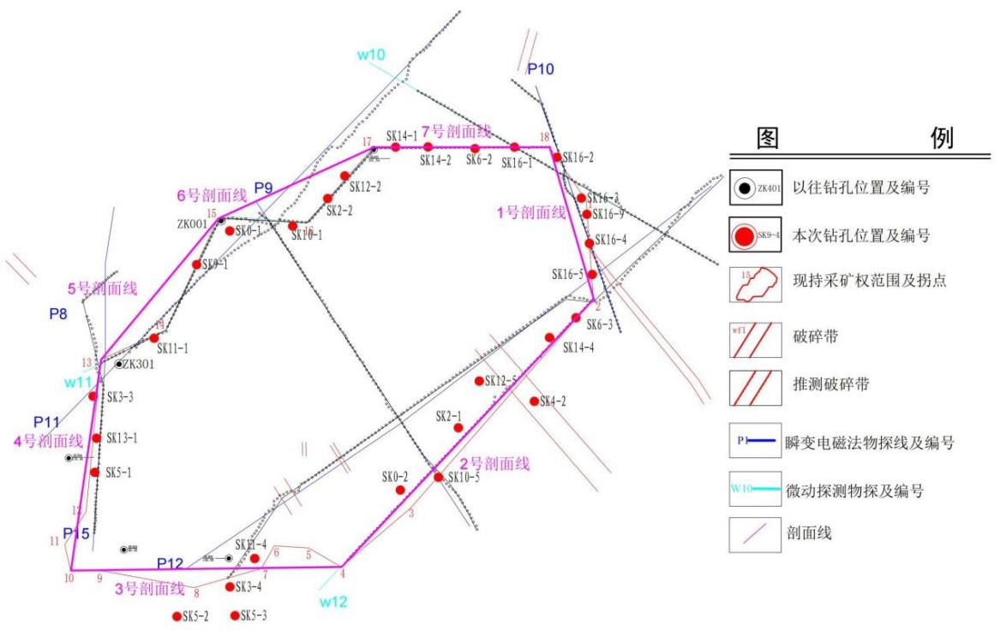

图4\.2\-7 剖面布置平面图

① 1号水文地质剖面

1号剖面，位于矿区东北侧，矿区边界拐点18\-1\-2，涉及钻孔SK16\-2、SK16\-3、SK16\-4、SK16\-5、SK16\-9如图4\.2\-8所示。

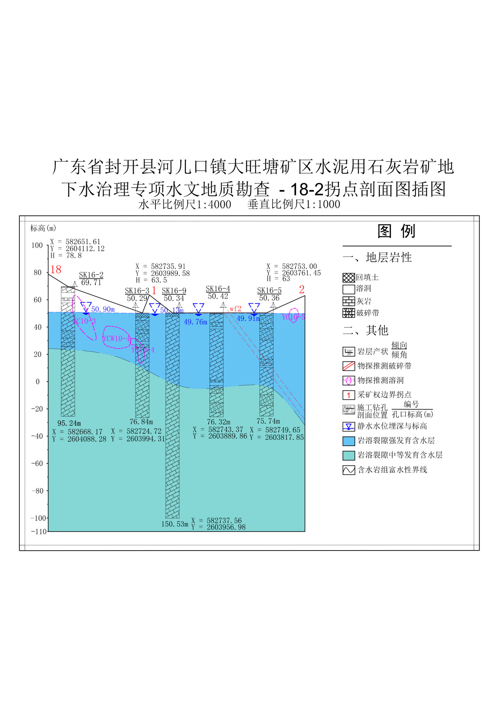

图4\.2\-8 大旺塘矿区边界18\-2拐点水文地质剖面图

钻孔显示，此边界溶洞发育，其中SK16\-2、SK16\-3、SK16\-4、SK16\-5均有岩溶发育，SK16\-4具有双层溶洞发育，且岩芯采取率较低，该区浅层（\+50~\+10m高程）强岩溶裂隙发育。根据SK6\-4附近SK16\-6抽水试验结果显示，此处岩层渗透系数平均达到9\.03m/d，渗透性强，富水性强，是矿区含水层的主要补给通道。根据物探结果，在SK16\-2、SK16\-3之间，地面高程0m以上，岩溶节理裂隙发育，可能是矿区地下水主要径流通道之一，另外在SK16\-4附近\-20m高程以上，垂向发育有一岩溶破碎带。综上，根据钻孔揭露及物探解译，此次岩溶裂隙发育带主要发育在\-20m高程以上，但是除物探显示异常区外，其他区域也普遍存在一定发育程度的导水裂隙。如图所示，我们将0m至\-50m以上划分为岩溶裂隙强发育含水层，0m至\-50m以下划分为岩溶裂隙中等发育含水层。

② 2号水文地质剖面

2号剖面，位于矿区东南侧，矿区边界拐点2\-3\-4，涉及钻孔SK6\-3、SK14\-4、SK12\-5、SK4\-2、SK12\-5、SK2\-1、SK10\-5、SK0\-2、SK9\-4，如图4\.2\-9所示。

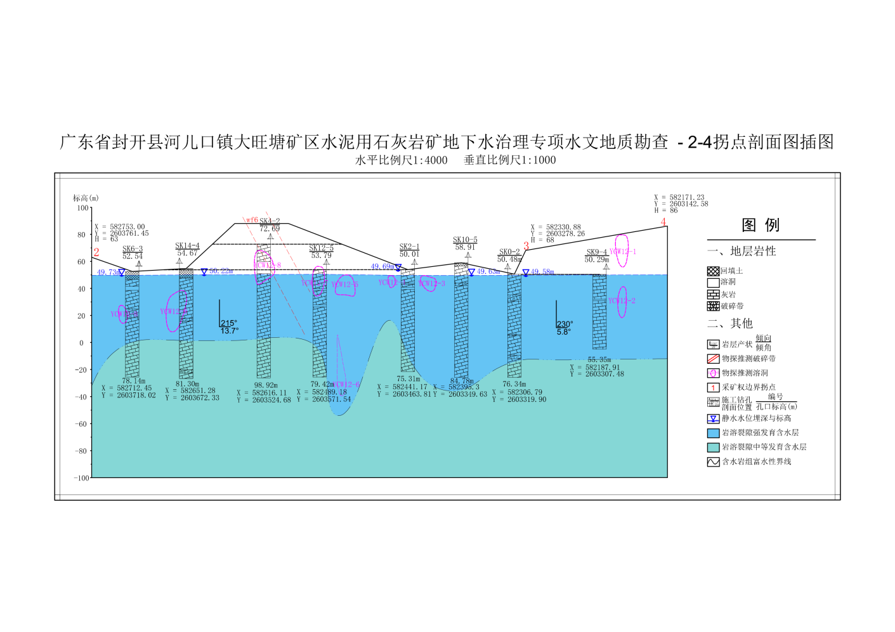

图4\.2\-9 大旺塘矿区边界2\-4拐点水文地质剖面图

钻孔显示，此边界钻孔在浅部具有一定岩溶发育，深部岩溶发育程度一般，其中岩溶发育程度最高的为矿区边界外围，wf6断裂带上钻孔SK4\-2在\+59\.89~\+50\.89m高程范围内有溶洞，钻孔岩溶率为9\.53%，其次为SK10\-5西侧SK9\-4，岩溶发育率为5\.49%。根据物探结果，在SK6\-3、SK14\-4之间，地面高程\+20~\+10m之间，发育有一岩溶节理裂隙带，可能是矿区地下水主要径流通道之一，靠近矿区4号拐点处，物探解译有两个垂向溶洞，疑似有近垂向的破碎带，以上位置均有可能是矿区主要导水通道。综上，根据钻孔揭露及物探解译，此次裂隙溶洞发育带主要在\+20m至\+40m高程左右，部分区域延伸至\-40m高程位置，除物探显示异常区外，其他区域也普遍存在一定发育程度的导水裂隙。如图所示，我们将0m至\-40m以上划分为岩溶裂隙强发育含水层，0m至\-40m以下划分为岩溶裂隙中等发育含水层。

③ 3号水文地质剖面

3号剖面，位于矿区南侧，矿区边界拐点4\-10，涉及钻孔SK11\-4、ZK304、SK3\-4、SK5\-2、ZK503，如图4\.2\-10所示。

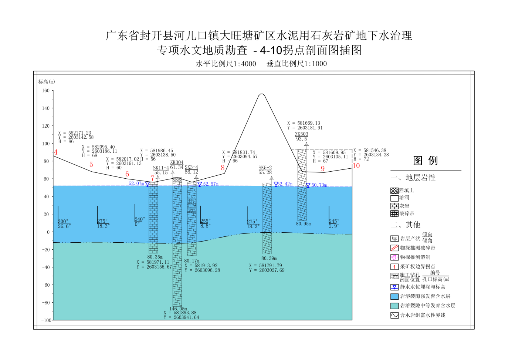

图4\.2\-10 大旺塘矿区边界4\-10拐点水文地质剖面图

钻孔显示，此边界钻孔总体岩溶发育程度一般，其中发育程度最高的为矿区边界外围，SK3\-4，岩溶率为2\.97%，其他钻孔未见溶洞发育。根据前人物探结果，在SK11\-4、SK3\-4附近，地面高程\+30~0m之间，地下水富水性较强，可能是矿区地下水径流通道。综上，根据钻孔揭露及物探解译，此处岩溶裂隙发育带主要在\-10m高程以上，除物探显示异常区外，其他区域也普遍存在一定发育程度的导水裂隙。如图所示，我们将\-10m至0m以上划分为岩溶裂隙强发育含水层，\-10m至0m以下划分为岩溶裂隙中等发育含水层。

④ 4号水文地质剖面

4号剖面，位于矿区边界拐点10\-11\-12\-13，涉及钻孔SK5\-1、SK13\-1、SK3\-3，如图4\.2\-11所示。

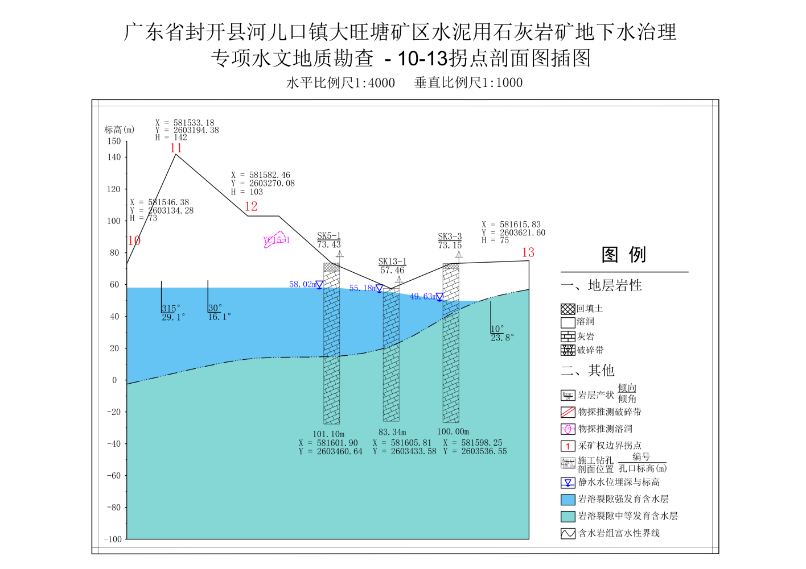

__图4\.2\-11 大旺塘矿区边界10\-13拐点水文地质剖面图__

钻孔显示，此边界浅表部普遍分布回填土，下伏岩性以灰岩为主。虽然钻孔未揭露明显的大型溶洞，但SK13\-1揭露有少量的基岩破碎带，表明该区段存在构造裂隙发育。根据剖面水位监测，静水水位分布在\+49\.63m~\+58\.02m之间。结合地质条件分析，受构造裂隙及岩性差异影响，含水岩组富水性界线在垂向上起伏较大，呈波浪状；在SK13\-1孔附近，强发育带向下延伸最深（底板约至\-20m高程），向两侧则逐渐变浅抬升。

综上，根据钻孔揭露及剖面解译，此边界区段虽无大型充填溶洞，但基岩破碎带及导水裂隙具有一定发育。如图所示，含水层厚度受富水性界线控制呈波浪状变化，我们将起伏的富水性界线（高程大致在\+20m至\-20m之间波动）以上划分为岩溶裂隙强发育含水层，该界线以下划分为岩溶裂隙中等发育含水层。

⑤5号水文地质剖面

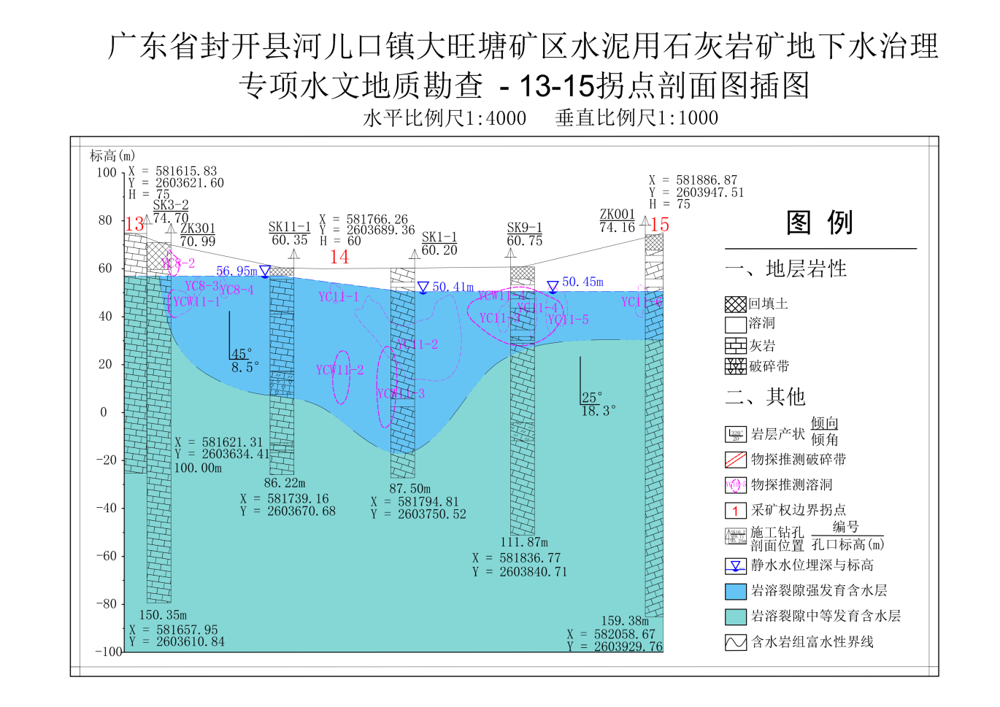

图4\.2\-12 大旺塘矿区边界13\-15拐点水文地质剖面图

5号剖面，位于矿区西北侧，矿区边界拐点13\-14\-15，涉及钻孔SK3\-2、ZK301、SK11\-1、SK1\-1、SK9\-1、ZK001，如图4\.2\-12所示。钻孔显示，此边界溶洞发育，其中SK9\-1具有双层溶洞发育，且基岩见大量铁锈浸染与裂隙该区属于强岩溶裂隙发育区。根据物探结果，在SK11\-1到SK9\-1周围和SK1\-1与拐点13之间，地面高程\-20m以上。根据收集矿山开采前地形资料分析，此剖面位置位于原有大旺塘低洼地带，基岩上部具有一定第四系覆盖层，且常年蓄水，属于矿区地下水补给区，下伏灰岩常年受地表水溶蚀作用，0m高程以上岩溶发育，根据钻孔资料，发育有较多溶洞，且溶洞中大量淤泥质充填。另外，此边界线西侧钻孔SK1\-1、SK0\-1显示基岩完整，推测矿区西侧可能为一局部分水岭。

综上，根据钻孔揭露及物探解译，此次岩溶裂隙发育带在\-20m以上，溶洞发育，溶洞内大量淤泥质充填，除物探显示异常区外，其他区域也普遍存在一定发育程度的导水裂隙。如图所示，我们将\-20m至\+30m以上划分为岩溶裂隙强发育含水层，\-20m至\+30m以下划分为岩溶裂隙中等发育含水层。

⑥6号水文地质剖面

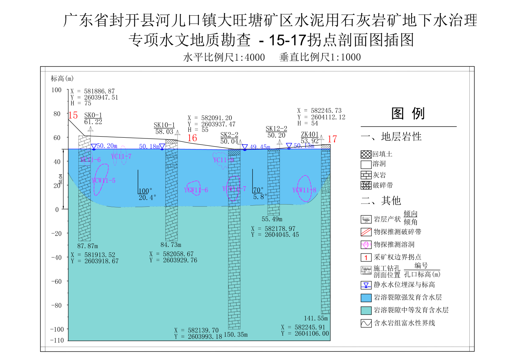

图4\.2\-13 大旺塘矿区边界15\-17拐点水文地质剖面图

6号剖面，位于矿区西北侧，矿区边界拐点15\-16\-17，涉及钻孔SK0\-1、SK10\-1、SK12\-2、ZK401，如图4\.2\-13所示。根据物探结果，在拐点15到SK10\-1、SK10\-1到SK12\-2以及SK12\-2到拐点17之间，地面高程0m以上，岩溶节理裂隙较发育，均有可能是地下水的集中径流通道。根据钻孔揭露及物探解译，此次岩溶裂隙发育带在0m以上，除物探显示异常区外，其他区域也普遍存在一定发育程度的导水裂隙。如图所示，我们将0m以上划分为岩溶裂隙强发育含水层，0m以下划分为岩溶裂隙中等发育含水层。

⑦ 7号水文地质剖面

7号剖面，位于矿区东北侧，矿区边界拐点17\-18，涉及钻孔ZK401、SK14\-1、SK14\-2、SK6\-2、SK16\-1，如图4\.2\-14所示。

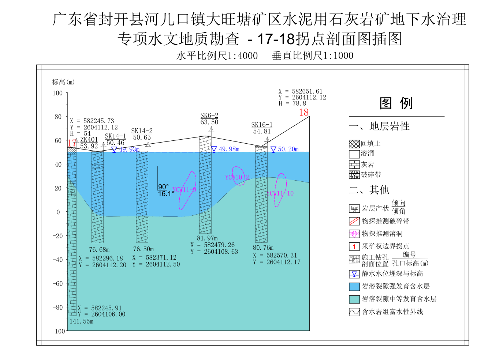

图4\.2\-14 大旺塘矿区边界17\-18拐点水文地质剖面图

钻孔显示，此边界岩溶发育程度一般，SK16\-1、SK6\-2岩芯极度破碎，疑似节理裂隙发育。根据物探结果，在SK6\-2到SK16\-1周围，地面高程0m以上，有疑似溶洞发育。综上，根据钻孔揭露及物探解译，此次岩溶裂隙发育带在0m以上，除物探显示异常区外，其他区域也普遍存在一定发育程度的导水裂隙。如图所示，我们将0m至\+30m以上划分为岩溶裂隙强发育含水层，0m至\+30m以下划分为岩溶裂隙中等发育含水层。

（4）溶洞填充物

钻探揭露显示，矿区浅部发育的溶洞与溶沟中有淤泥质充填。

#### 岩溶发育规律控制因素分析

矿区内岩溶发育程度受地层岩性、埋藏与补给条件、水流动力特征及地质构造等多种因素共同影响。根据现有钻孔数据、物探资料及地质调查结果，本矿区岩溶发育表现出明显的非均质性，在平面与垂向上具有不同的分布规律。

（1）碳酸盐岩地层岩性因素影响

岩性是矿区岩溶发育的基础条件。矿区出露地层主要为刘家塘组（C1*lj*），岩性以灰~灰黑色的中~厚层状灰岩、白云质灰岩为主，局部夹有硅质灰岩。从岩石学特征看，区内矿石多具生物屑微晶结构、内碎屑结构及碎裂化结构，整体质地较脆，在构造应力作用下容易产生裂隙，为地下水的运移与溶蚀提供了物理空间。受岩石易溶特性的影响，水岩作用表现较为充分，导致区内普遍发育不同程度的溶隙、溶洞。而在含硅质组分较高的层位，由于岩石化学稳定性相对较强，岩溶发育程度表现出相应的减弱趋势。

（2）埋藏与补给条件对岩溶发育的影响

岩溶的发育程度与地下水的补给条件及循环更新速度密切相关。矿区内刘家塘组（C1*lj*）灰岩地层除在局部低洼及未开采地段有第四系（Q）覆盖外，大部分区域直接裸露或呈浅埋状态。

1）原地形地貌及大旺塘岩溶洼地的影响矿区北侧原始地形起伏明显，其中发育的原大旺塘岩溶洼地是影响局部岩溶发育的关键因素。该洼地在形态上呈闭合或半闭合的低洼地貌，具备汇集周边山体地表径流的条件。这种地形特征使得大气降水在洼地中心相对集中，水体通过洼地底部的裂隙与溶孔进行垂向入渗。受长期集中的水动力作用影响，洼地及其周边区域的水岩作用表现得较为活跃，促使浅部岩溶向深部延伸，导致该区域岩溶形态较丰富，常见溶洞及破碎带发育。

2）覆盖层特征的影响矿区内的第四系覆盖层（Q）主要分布于原岩溶洼地底端、未开采地段及低洼地带，厚度在1~33m 之间。岩性主要由砂砾、砂质粘土及粘土组成。由于覆盖层分布具有局限性且厚度随地形变化大，其对大气降水入渗的阻隔作用较小。裸露或浅埋的条件使得降水能较快通过覆盖层及基岩裂隙补给深部含水层，为浅部岩溶的持续发育提供了水分循环条件。

3）补给分区对岩溶发育的引导从区域补给关系来看，矿区北部（包括大旺塘洼地区域）及东部地势相对较高，为主要的补给来源区。地下水在接受北部和东部的侧向径流补给与垂向入渗补给后，受水位势能差驱动，总体由东北向西南方向径流。

在补给方面，矿区北部及东部作为流场上游，地下水水力联系较强，具有溶蚀能力的地下水能够得到补充。这种频繁的水力交换过程，配合大旺塘洼地等汇水地形，促进了该区域岩层内溶隙与破碎带的发育，表现为钻孔及物探显示的岩溶发育程度相对较好。

在径流与排泄方面，地下水在向西南方向径流并排泄的过程中，虽在该汇集地带也具备一定的岩溶发育空间，但整体发育规模与形态受东北侧补给源及原始地形坡度的控制明显。

（3）结论

综合钻孔揭露、物探解译及矿区水流动力学特征分析，矿区岩溶发育规律及控制因素总结如下：

1）在原始地貌与补给条件方面

大面积浅埋或裸露的灰岩以及北侧原大旺塘岩溶洼地，是驱动岩溶发育的主要补给源。特别是矿区北部原大旺塘洼地作为原地表汇水中心，配合薄层第四系，有效促进了大气降水的集中与垂向入渗。这种直接且较为顺畅的补给条件，使得该区域深浅部的水岩溶蚀作用均较为活跃，成为矿区内岩溶形态丰富、发育显著的中心区域。

2）在平面发育规律与网络连通性方面

矿区岩溶及导水裂隙系统表现出明显的非均质性。从钻孔岩溶率来看，总体呈现北部强、东南部中等、中西部弱的分布格局。但在水流动力学上，虽然中部及部分西部区域的大型溶洞发育较弱，但其构造裂隙及微观岩溶通道存在互联，含水系统连通性较好，构成了地下水向心汇聚的良好径流区。

3）在垂向发育规律方面

整体而言，矿区浅中部（高程0m及以上区域）岩溶裂隙发育相对明显，向深部延伸则逐渐减弱。但在局部径流通道的影响下，垂向特征存在差异：北部受地表水持续下渗及深部构造控制，垂向发育强度具有一定波动且局部深部依然存在发育迹象；而东部受限于构造的垂直连通性，随深度增加岩溶率明显降低（深部岩溶极少发育）。

4）在地质构造控制方面

地质构造不仅为地下水的运移提供了物理空间，也是控制隐伏岩溶展布与径流带形成的重要因素。例如，矿区东部及南部的中等岩溶区展布主要受控于wf2、wf3、wf6等断裂带。此外，多组高倾角断层及构造交汇带构成了地下水深循环的通道，引导了局部岩溶向深部延伸发育。

5）在岩性基础与流场导向方面

刘家塘组（C1*lj*）脆性灰岩为岩溶发育提供了良好的物质基础。受后期人工集中抽排水的持续影响，矿区地下水动力场已发生明显演变，流场由天然状态转变为从四周边界（包括南、西侧发生的流向逆转）向矿区中心排泄区汇聚的向心径流模式。这种较大的局部水力梯度和向心汇聚的水流动力，沿着现有的构造与岩溶裂隙网络持续进行冲刷与溶蚀，进一步影响了矿区非均质的岩溶空间格局。

### 矿区强径流带特征

矿区内划分的强、中等径流带与现状地下水流场特征高度吻合。受抽排水影响，地下水整体呈由外围高水位向矿区中心低水位汇流的径流模式。推测的四条强径流带（JL1~JL4）对应了流场的核心运移通道，构成了主要的侧向补给入口（JL3、JL4）及集中排泄出口（JL1、JL2）。在地下水位等值线图上，强径流带多位于等值线稀疏、水力梯度平缓的区域，反映出该区岩溶及导水裂隙高度发育、地下水径流阻力小的动力学特征；而中等径流带则多分布于局部边界补给段或等值线相对密集的区域，连通性与径流汇聚能力相对较弱。

划分强径流带与中等径流带的核心依据，在于物探异常区的空间尺度、钻探所见岩溶裂隙的连通性，以及抽压水试验获取的渗透参数表现。强径流带在物探上表现为大范围连续的低阻或低速异常区，钻探揭露溶洞多层集中发育且岩体极破碎，渗透系数高（如JL3带局部平均值近9m/d），深部多具备强透水性。相比之下，中等径流带的岩溶多以浅部垂向发育为主或仅受局部构造破坏，侧向水力连通性一般，其渗透系数明显偏低（如北部局部仅为0\.38285m/d），且压水试验结果多呈现出浅部透水率强、向深部迅速衰减为弱至极微的垂直分带特征。

#### 强径流带

根据以往物探、钻探成果以及本次地表调查及物探钻探结果，共推测出矿区内强径流带4条（JL1、JL2、JL3、JL4），各强径流带位置、宽度及方向如图4\.2\-15所示。

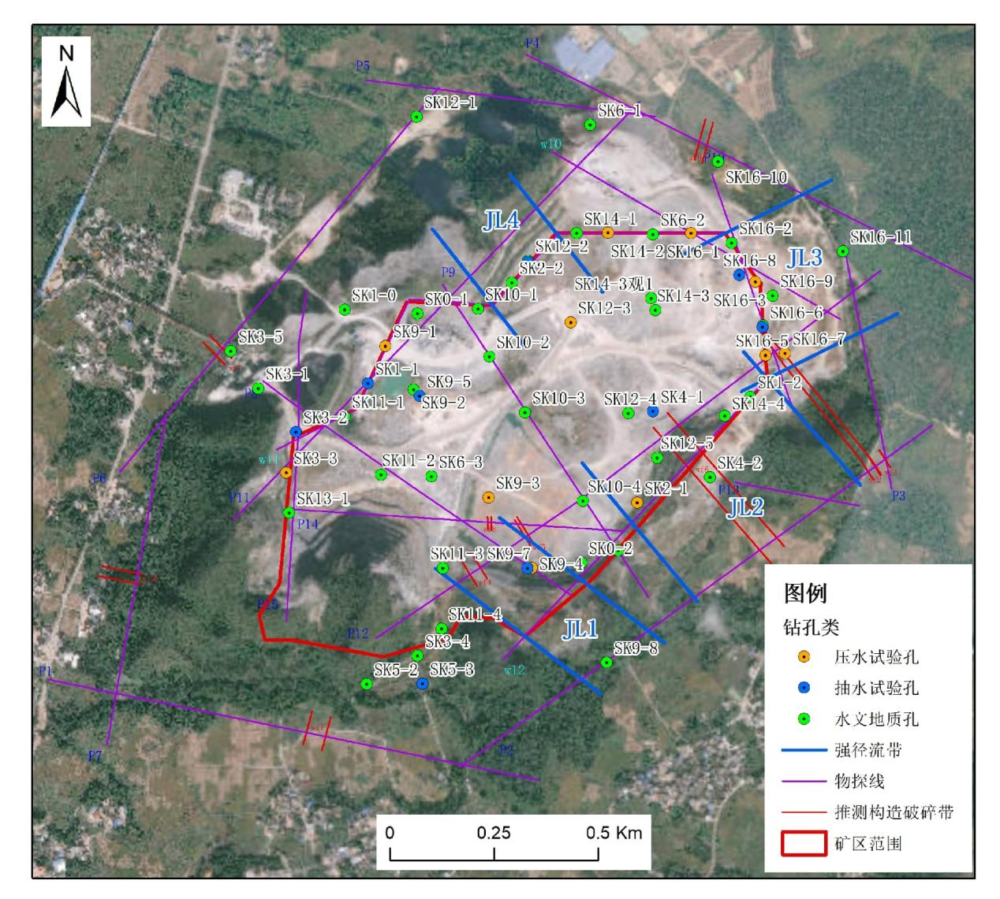

__图4\.2\-15 矿区强径流带分布图__

（1）JL1强径流带

在物探方面，W12物探线的0~141m段显示异常低速区，P12物探线190~387m段显示异常低阻区；在钻探方面，钻孔SK9\-4在\+32\.09~\+30\.99m高程范围内见溶洞、SK11\-3在\-16\.77~\-17\.77m高程范围内见溶洞，SK9\-7附近出现岩溶塌陷现象，SK11\-4、SK0\-2、SK10\-4、SK10\-5，未见岩溶发育；在地表调查方面，该区域内有本次推断的破碎带（wf4、wf5），在地表可见明显破碎带；在边界垂向岩溶发育方面，该区域属于2号水文地质剖面的3~4号拐点段，根据2号水文地质剖面图可知，靠近矿区4号拐点处，物探解译有2个垂向溶洞，疑似有近垂向的破碎带；在压水、抽水试验方面，抽水试验结果显示SK9\-7的渗透系数为3\.2635m/d，说明钻孔SK9\-7附近渗透性较强；由此可推测JL1强径流带位于矿区南侧边界3~4段附近，西侧边界位于钻孔SK11\-3与SK11\-4之间，东侧边界位于钻孔SK9\-4与SK0\-2之间，宽约185m，角度约北西向53°。

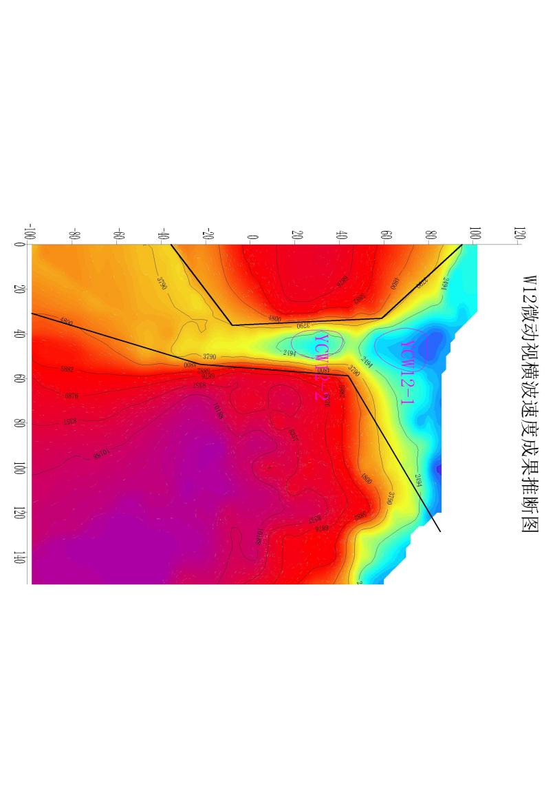

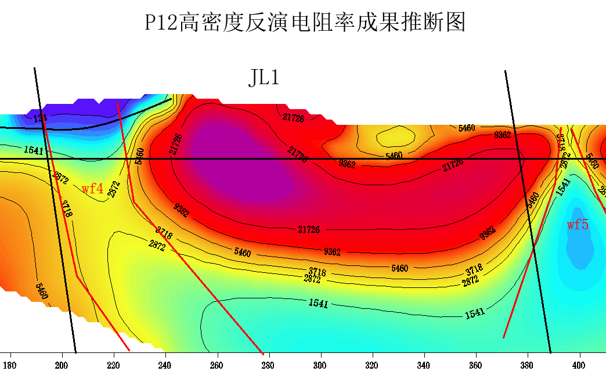

__图4\.2\-16 W12物探线低速区、P12物探线低阻区__

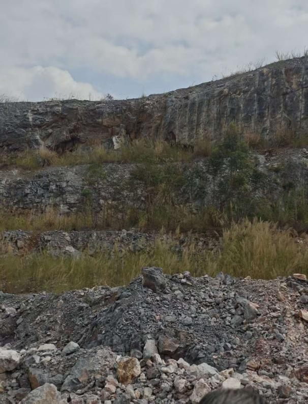 __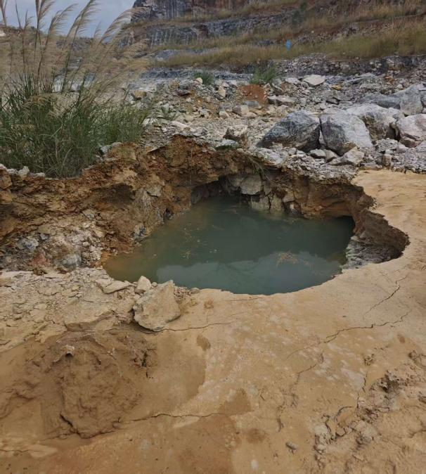__

__图4\.2\-17 wf5破碎带地表照片以及SK9\-7附近岩溶塌陷照片__

__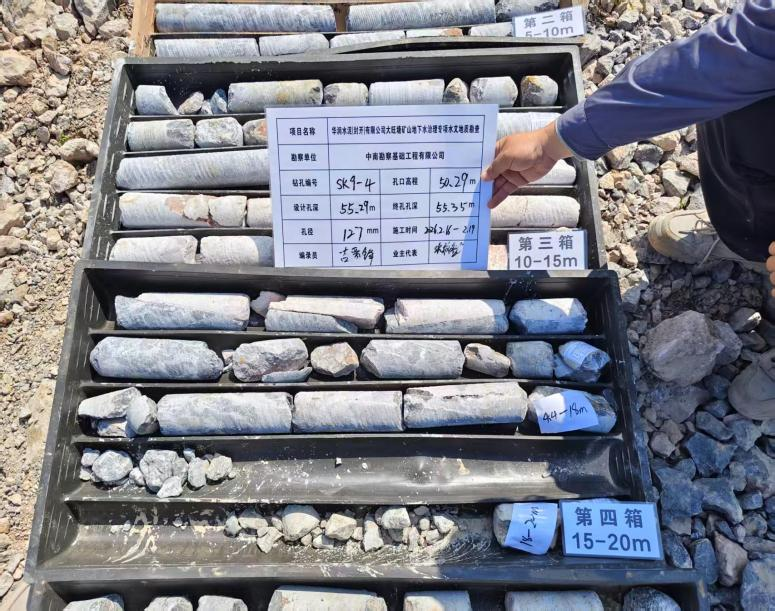 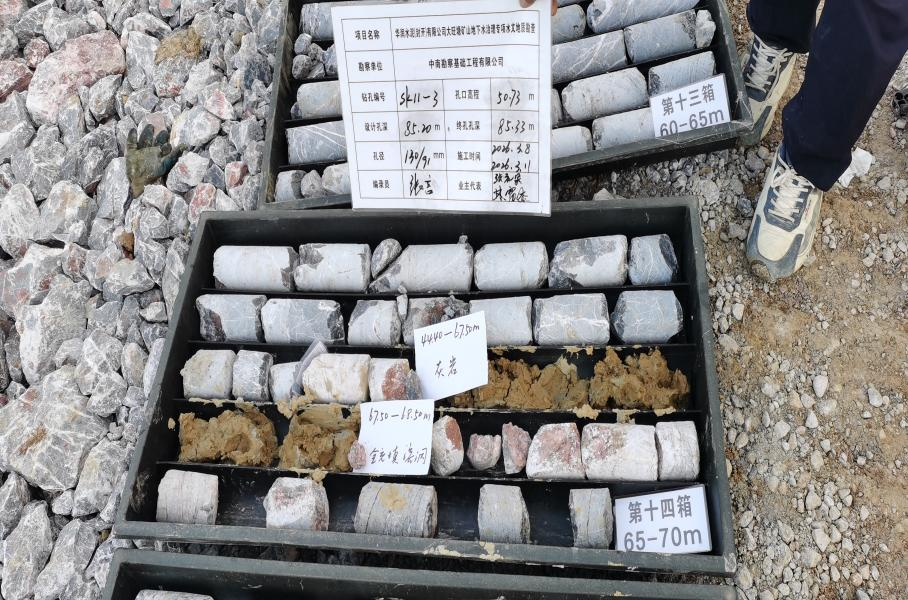__

__图4\.2\-18 钻孔SK9\-4、SK11\-3岩芯照片__

（2）JL2强径流带

在物探方面，W12物探线432~541m段显示异常低速区，P12物探线208~511m段显示异常低阻区；在钻探方面，SK2\-1在高程范围内见溶洞，SK4\-2在\+59\.89~\+50\.89m高程范围内见溶洞，SK6\-3在\+40\.31~\+39\.00m高程范围内见溶洞，SK10\-5未见岩溶发育；在地表调查方面，在SK12\-5附近发现明显的裂隙及溶蚀现象；在边界垂向岩溶发育方面，该区域属于2号水文地质剖面的2~3号拐点段，根据2号水文地质剖面图可知，物探解译有8个溶洞集中发育在\+50~\+10m高程区间，推测该区浅部具备良好的储水空间与导水通道；在压水、抽水试验方面，钻孔SK4\-1的渗透系数为1\.7088~1\.8482m/d，平均值为1\.75225m/d，说明钻孔SK4\-1周边渗透性较强。由此可推测JL2强径流带位于矿区东南侧边界2~3段附近，西侧边界位于SK2\-1与SK10\-5中间，东侧边界定于矿区边界2号拐点，宽约480m，方向约北西向41°。

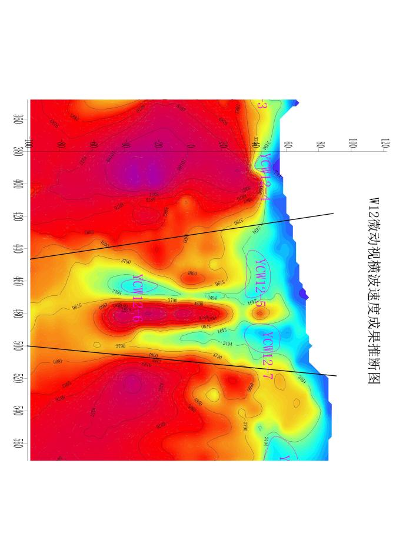

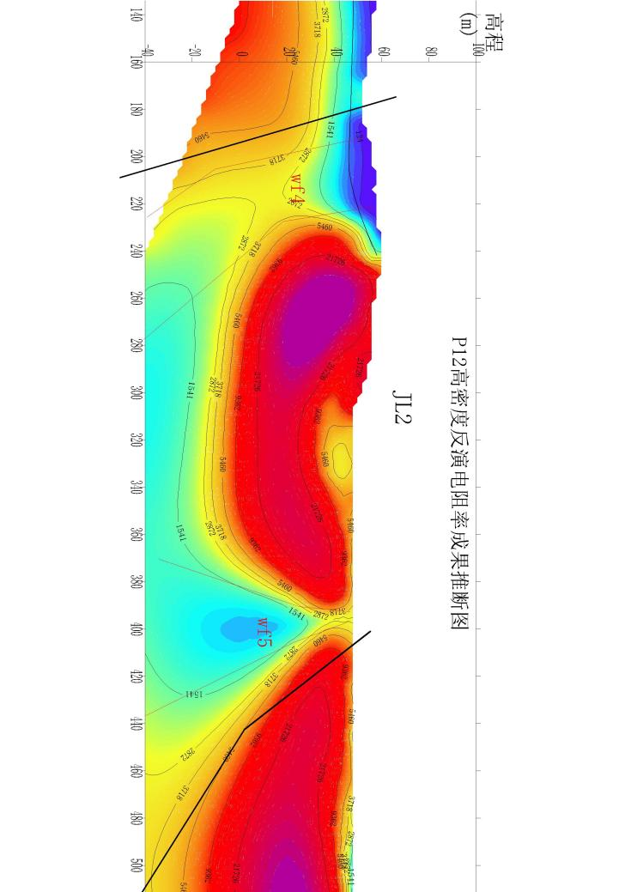

__图4\.2\-19 W12物探线低速区、P12物探线低阻区__

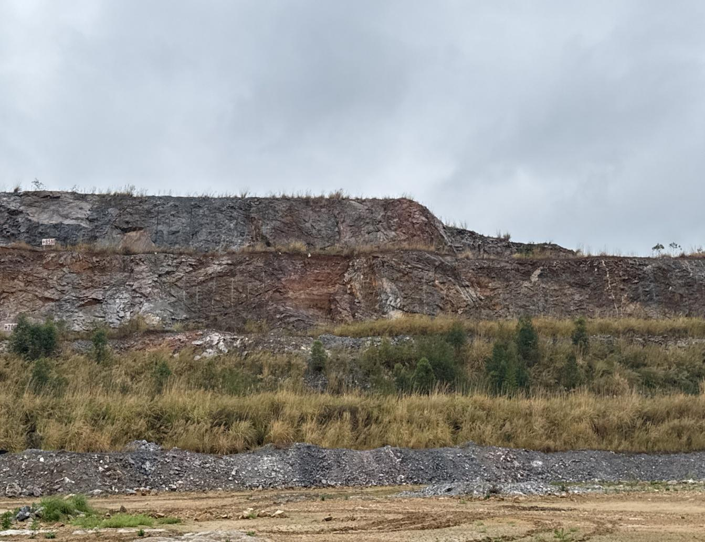 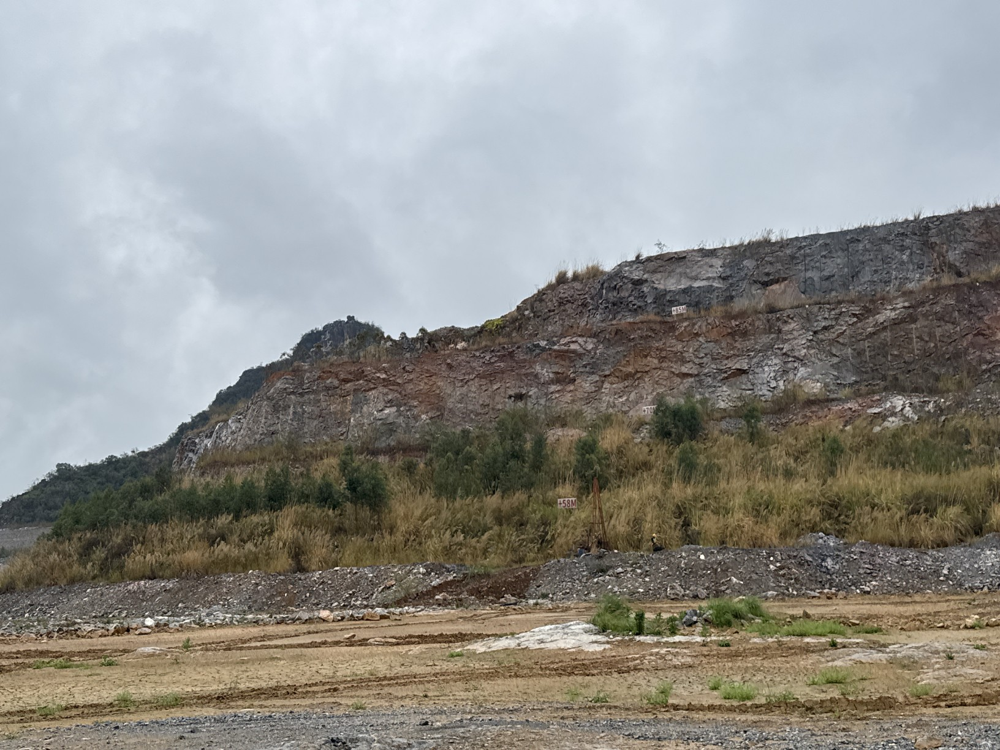

__图4\.2\-20 SK12\-5附近裂隙照片__

__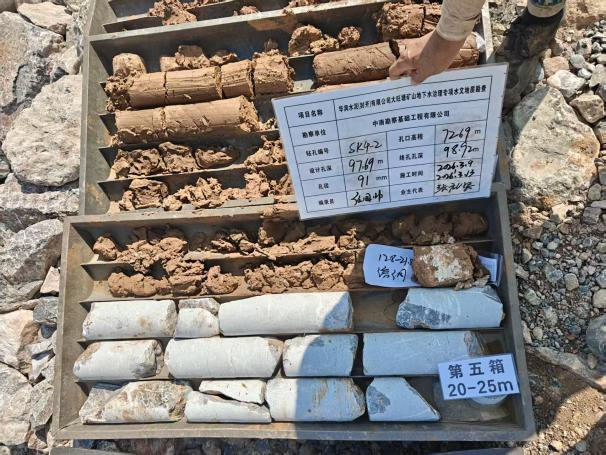 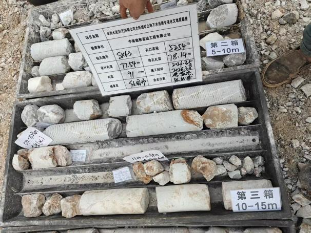__

__图4\.2\-21 SK4\-2、SK6\-3岩芯照片__

（3）JL3强径流带

在物探方面，P10物探线208~511m段显示异常低阻区，W10物探线310~610m段显示异常低速区；在钻探方面，钻孔SK16\-2、SK16\-3、SK16\-4、SK16\-5等钻孔均有岩溶发育现象；在边界垂向岩溶发育方面，该区域属于1号水文地质剖面，物探解译在18~1拐点段有3个可能存在水力联系的溶洞，在2号拐点附近有1个溶洞，区内导水裂隙普遍发育（主要发育于\-20m标高以上）；在压水、抽水试验方面，根据抽水试验，钻孔SK16\-8的渗透系数为2\.6023~2\.7608m/d，平均值为2\.68155m/d，钻孔SK16\-6的渗透系数为8\.8481~9\.1000，平均值为8\.97405m/d，说明钻孔SK16\-8和SK16\-6附近渗透性强；根据压水试验，钻孔SK16\-5的\+27\.95~\+47\.75m高程段透水性为强透水。由此可推测JL3强径流带位于矿区东侧边界18~2段，南侧边界定为矿区边界2号拐点，北部边界定为矿区边界18号拐点，宽约360m，方向约北东向63°。

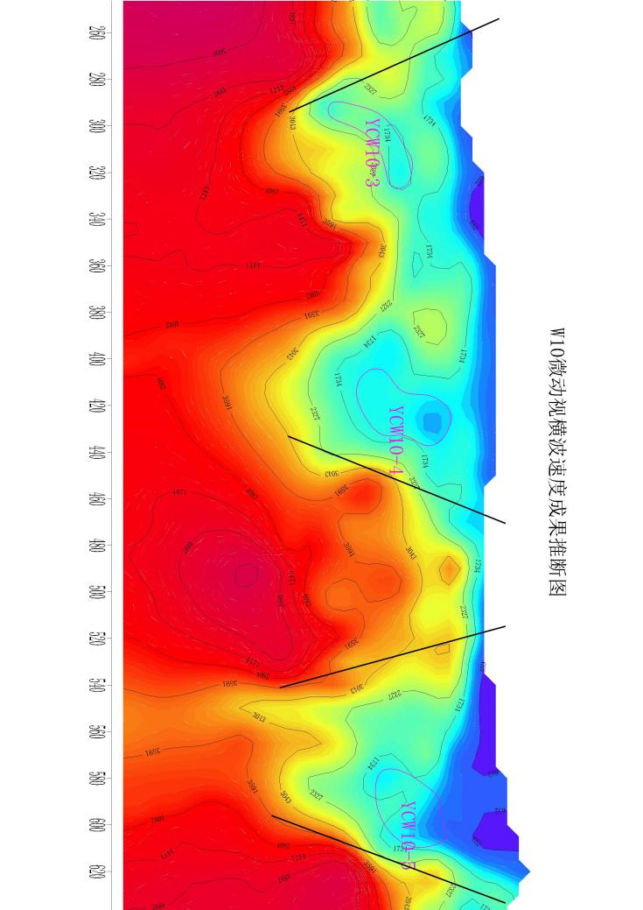

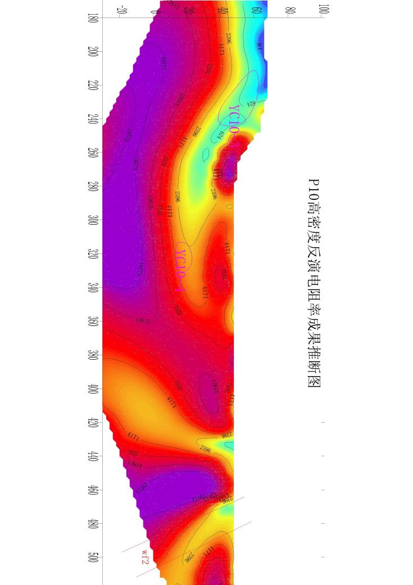

__图4\.2\-22 W10物探线低速区、P10物探线低阻区__

（4）JL4强径流带

在物探方面，W11物探线781~844m段显示异常低速区，P9物探线582~726m段显示异常低阻区；在钻探方面，钻孔SK12\-2岩芯极为破碎、岩芯采取率低；在地表调查方面，在SK12\-2附近未见明显地表岩溶发育与裂隙；在边界垂向岩溶发育方面，该区域属于6号水文地质剖面的16~17段，该段物探解译有4个溶洞，如6号水文地质剖面图所示，该区0m高程以上为岩溶裂隙强发育含水层，0m高程以下为岩溶裂隙中等发育含水层；在压水、抽水试验方面，钻孔SK12\-6的渗透系数为4\.4259m/d，渗透性为强。钻孔SK12\-3在\+5m高程以下微透水，\+5m高程以上强透水。说明该区具备良好的地下水运移条件，推测为强径流带。JL4强径流带位于矿区北部16~17段边界附近，西侧边界位于钻孔SK2\-2处，东侧边界位于钻孔SK12\-2与SK14\-1之间，宽约230m，方向约北西向38°。

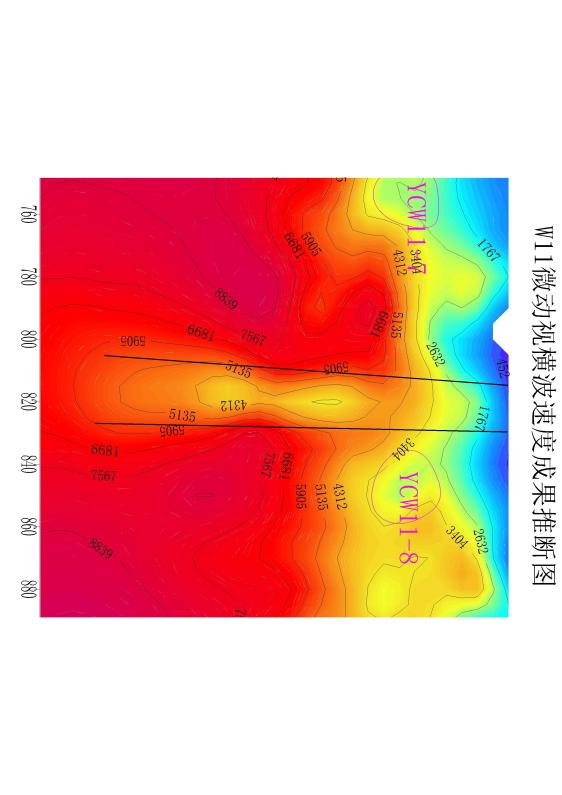 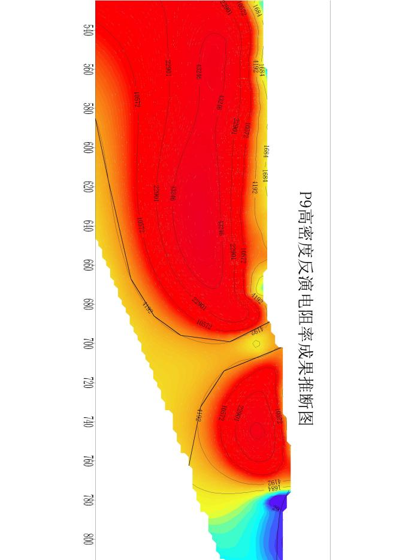

__图4\.2\-23 W11物探线低速区、P9物探线低阻区__

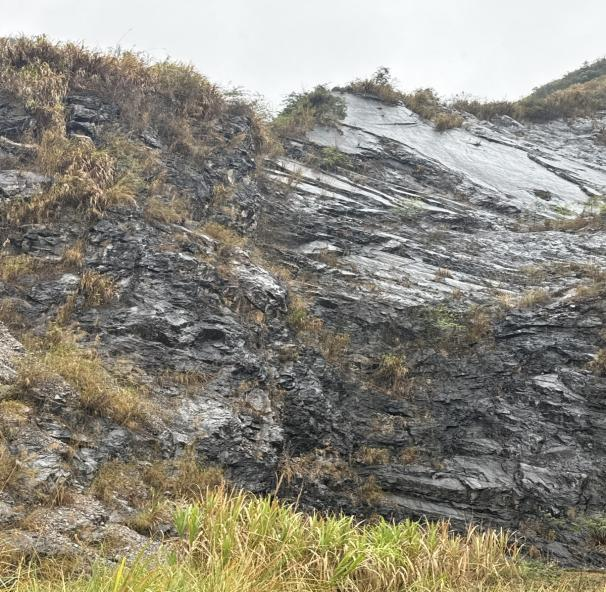 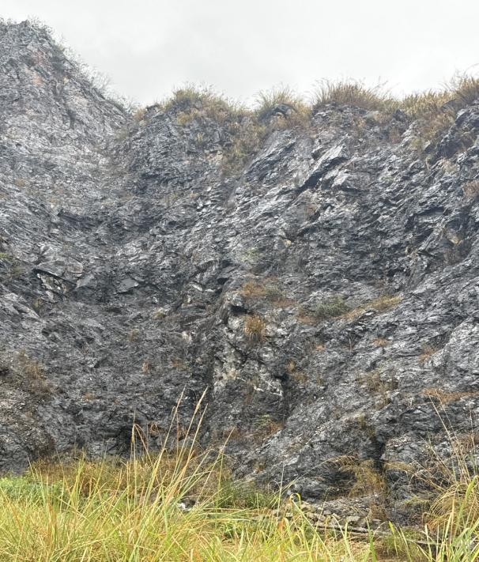

__图4\.2\-24 SK12\-2附近地表调查照片__

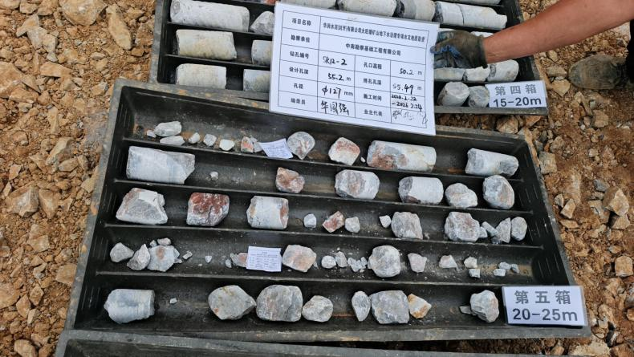 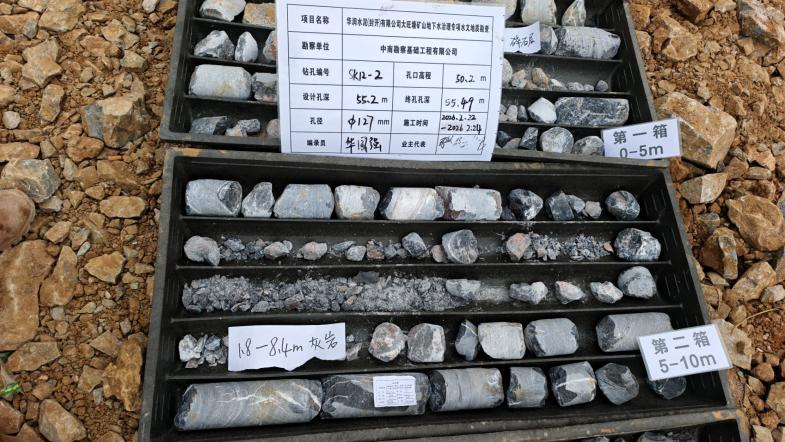

__图4\.2\-25 SK12\-2岩芯照片__

#### 中等径流带

（1）矿区北部边界14~16段附近中等径流带

矿区北部受原大旺塘影响，岩溶发育受地表水下渗影响大，垂向上的岩溶发育强度有一定波动，侧向补给能力中等。在地表调查方面，SK9\-2附近地表有明显岩溶发育现象；在物探方面，在W11物探线300~400m段有明显的一条低速带，同时P11物探线的120~320m段也有明显低阻区。在钻探方面，SK9\-1发现5处溶洞，SK9\-2发现6处溶洞，SK9\-5发现3处溶洞。尽管地表调查、物探异常及钻探揭露均表明矿区北部属强岩溶发育区，但受原大旺塘地表水集中下渗控制，区内岩溶形态以垂向发育为主，侧向水力连通性一般，结合抽水试验获取的较低渗透系数（SK9\-5孔仅为0\.38285m/d），压水试验SK9\-1在浅部（19\.56~24\.56m、33\.38~38\.38m深度范围）透水率强，从浅部向深部透水率由弱至极微，表明该区域地下水在浅部具有一定交替能力，但尚未形成强烈的水平向水动力网络。因此，推测矿区北部属中等径流带。

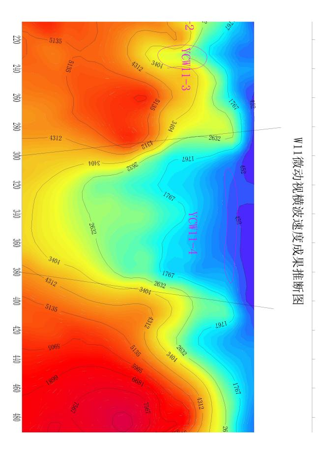

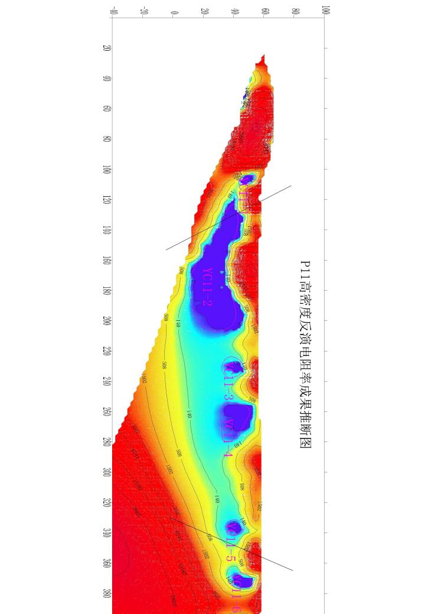

__图4\.2\-26 W11物探线低速区、P11物探线低阻区__

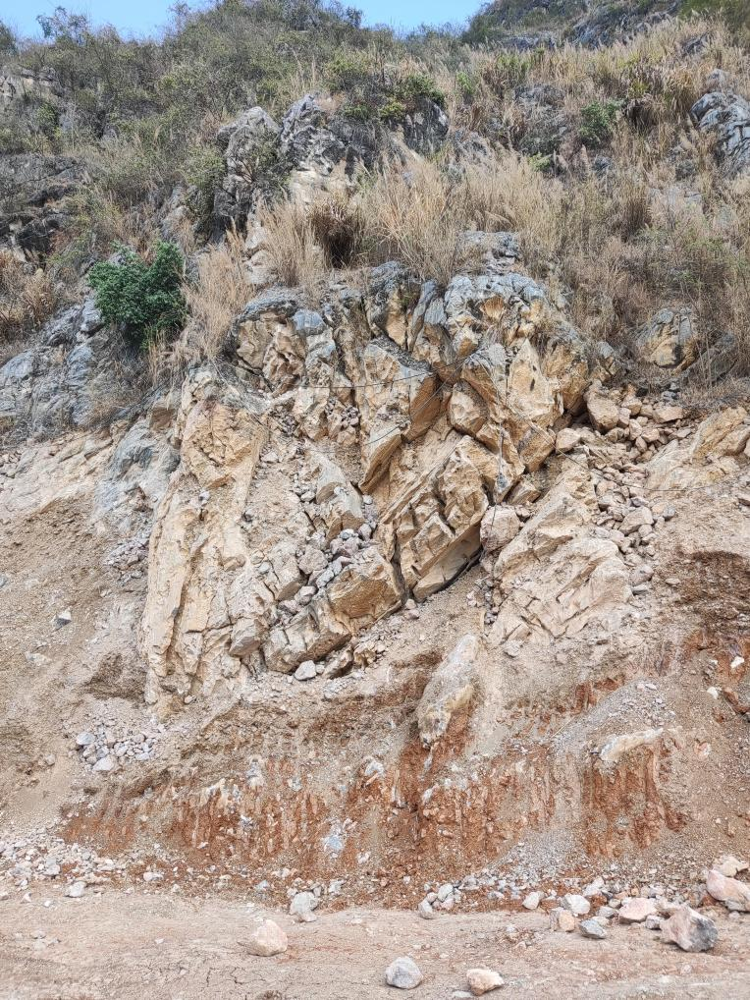

__图4\.2\-27 SK9\-2附近岩溶裂隙照片__

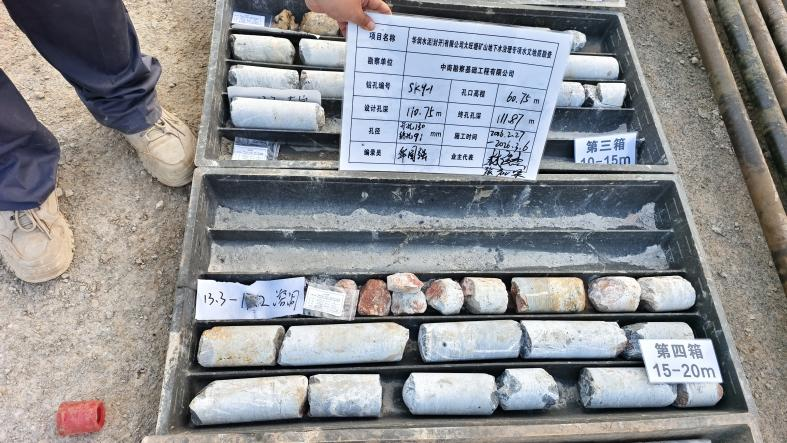 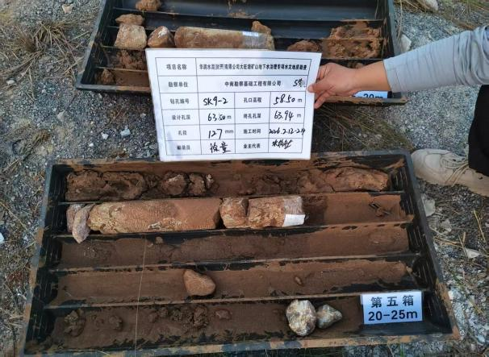

__图4\.2\-28 SK9\-1、SK9\-2岩芯照片__

（2）矿区东北侧边界17~18段附近中等径流带

在地表调查方面，钻孔SK14\-1附近有裂隙发育，产状约215°∠73°，宽约1~10cm，长度约2m，距地面高约10m；在物探方面，该位置位于W11物探线的900~1300m段，同时W10物探线的0~300m段可辅助判断。在W11物探线的1040~1300m段可见从地表至\+10m高程范围内的低速区，在W10物探线的150~300m段也可见从地表至\+10m高程范围内的低阻区；在钻探方面，位于此范围内的钻孔SK6\-2及SK16\-1等钻孔均未见岩溶发育，但岩芯较破碎，岩芯采取率低；在压水试验方面，钻孔SK14\-2整体透水率弱，钻孔SK16\-1在浅部（10\.66~15\.66m深度区间）透水率强，中部（15\.59~26\.5m深度区间）透水率中等，向深部延伸时透水率降至弱。说明该区域岩体可能受到了局部断层、褶皱或节理的破坏，形成了裂隙密集发育带。虽然这些裂隙还没有扩大成为溶洞，但岩体的完整性已经被破坏，且裂隙中富集地下水。故推测该区域为具有一定导水能力的中等径流带。

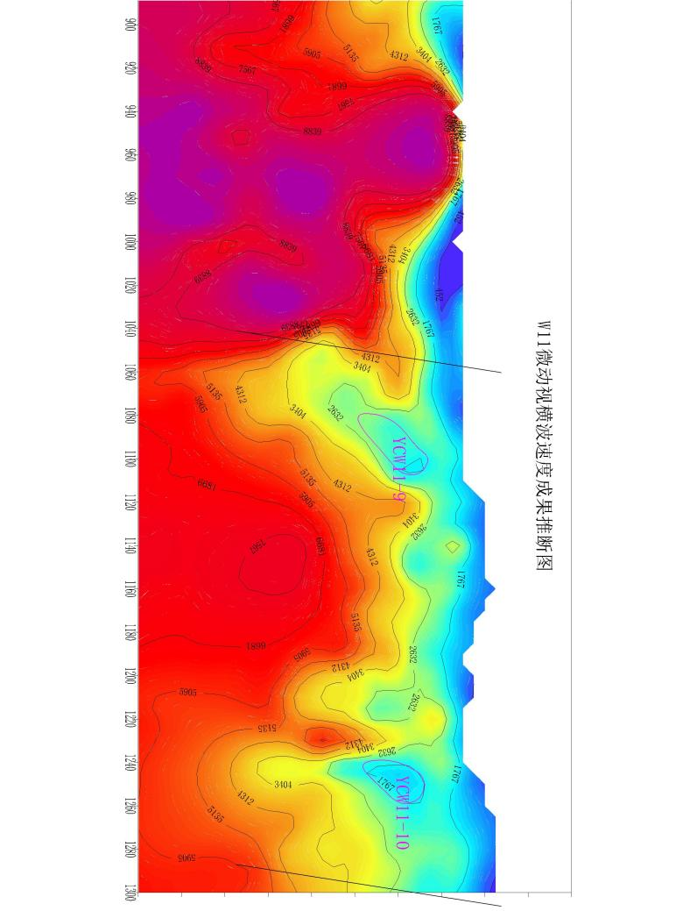

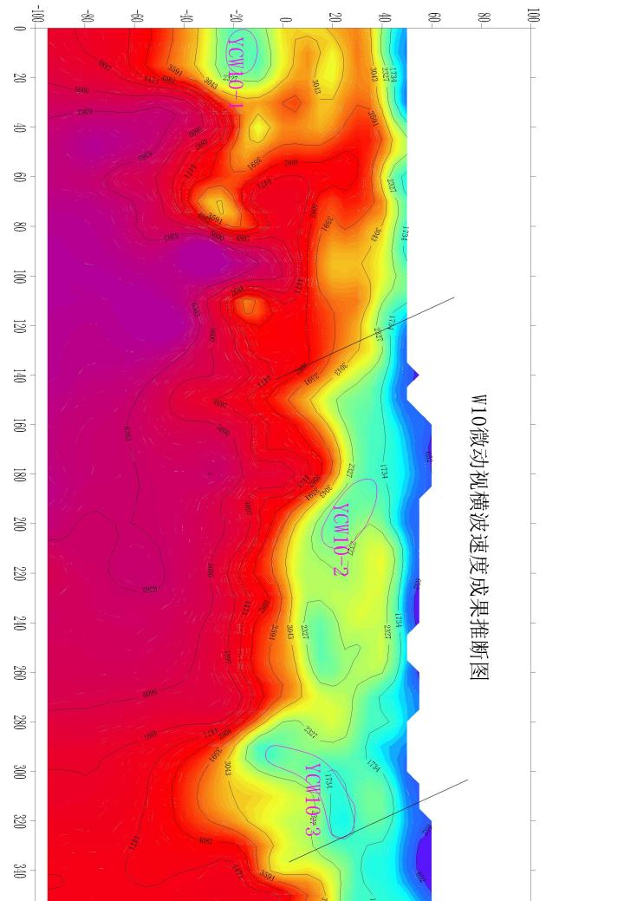

__图4\.2\-29 W10物探线低速区、W11物探线低阻区__

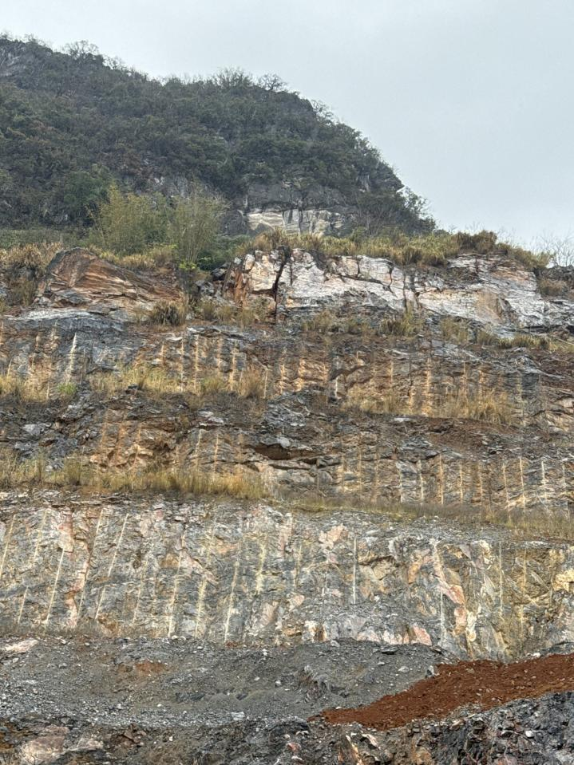

__图4\.2\-30 钻孔SK14\-1附近裂隙__

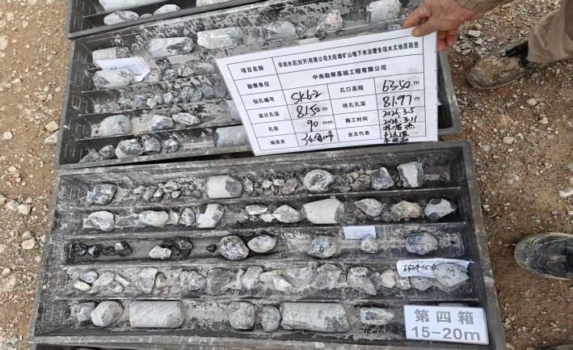 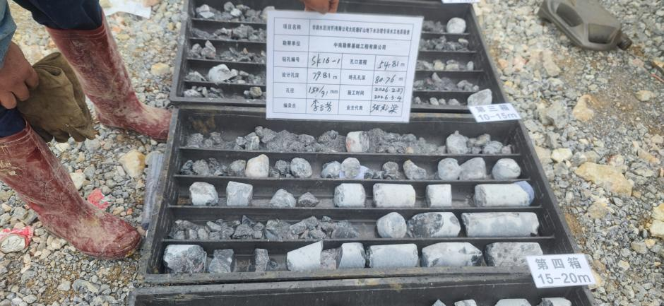

__图4\.2\-31 钻孔SK6\-2、SK16\-1岩芯照片__

（3）矿区西侧边界10~14段附近中等径流带

在地表调查方面，钻孔SK13\-1附近有方解石脉与节理发育，在矿区门口处有导水裂隙发育，在钻孔SK3\-1附近有导水裂隙发育，产状约220°∠45°，宽度约2~10cm；在物探方面，W11物探线的0~100m段（矿区边界13~14段）未见明显低速区，P15物探线的0~400m段（矿区边界10~13段）未见明显低阻区；在钻探方面，该区域内的SK3\-2、SK13\-1、SK11\-2以及以往钻孔ZK501等，钻孔岩溶率均为0%，岩芯采取率较高，该区域为弱岩溶发育区；在压水、抽水试验方面，压水试验显示钻孔SK3\-3透水率为弱~极微，SK3\-1仅在浅部（14\.69~19\.69m深度区间）透水率为强，其余深度为弱~极微，抽水试验显示，抽水试验孔SK3\-2无水。虽然该段深部完整岩块的富水性相对较弱，但受局部构造应力影响，浅表层及特定构造部位发育有导水裂隙网络，且局部具有强透水性（SK3\-1浅部）。地下水在此区域呈现脉状、裂隙式流动特征，具备一定的地下水交替与径流能力。据此推测，矿区西侧边界10~14段为中等径流带。

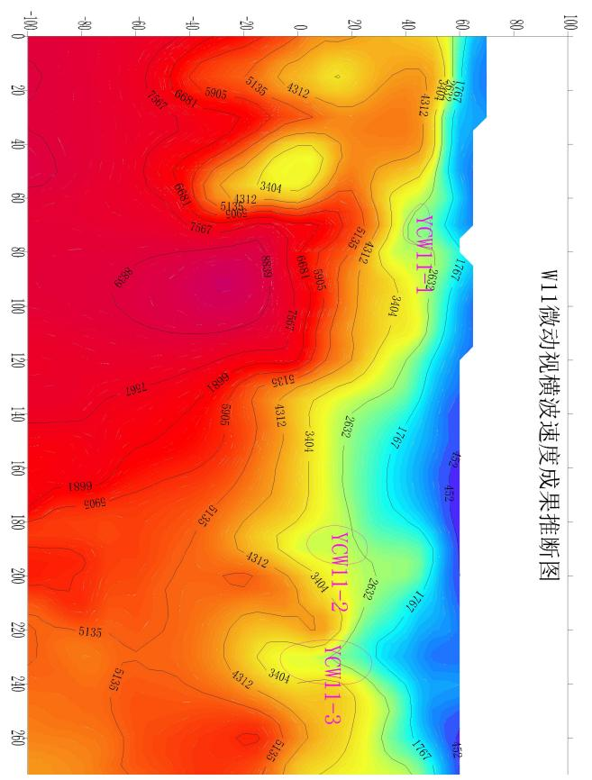

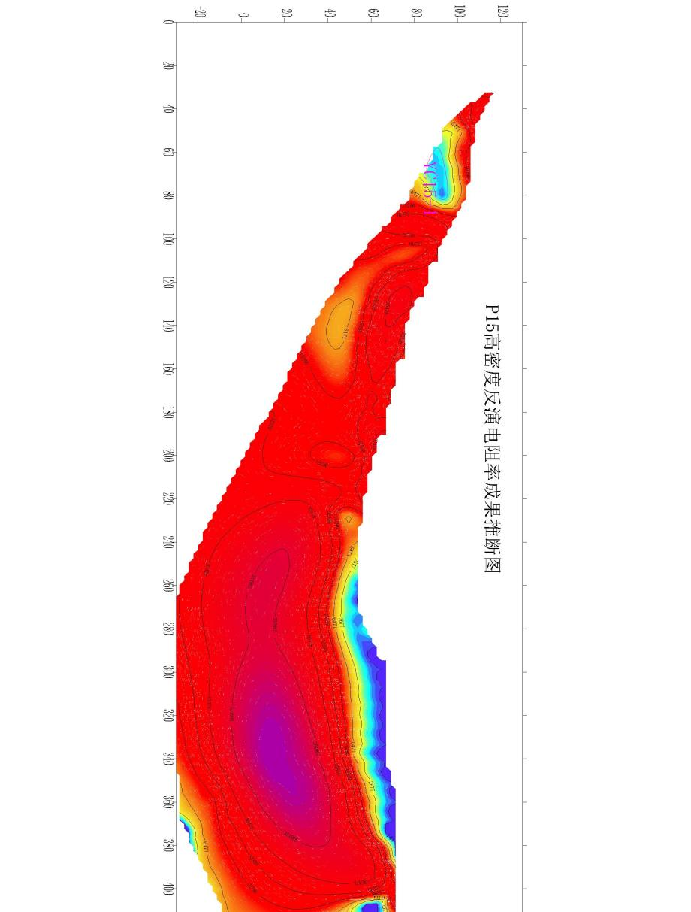

__图4\.2\-32 W11、P15物探线__

__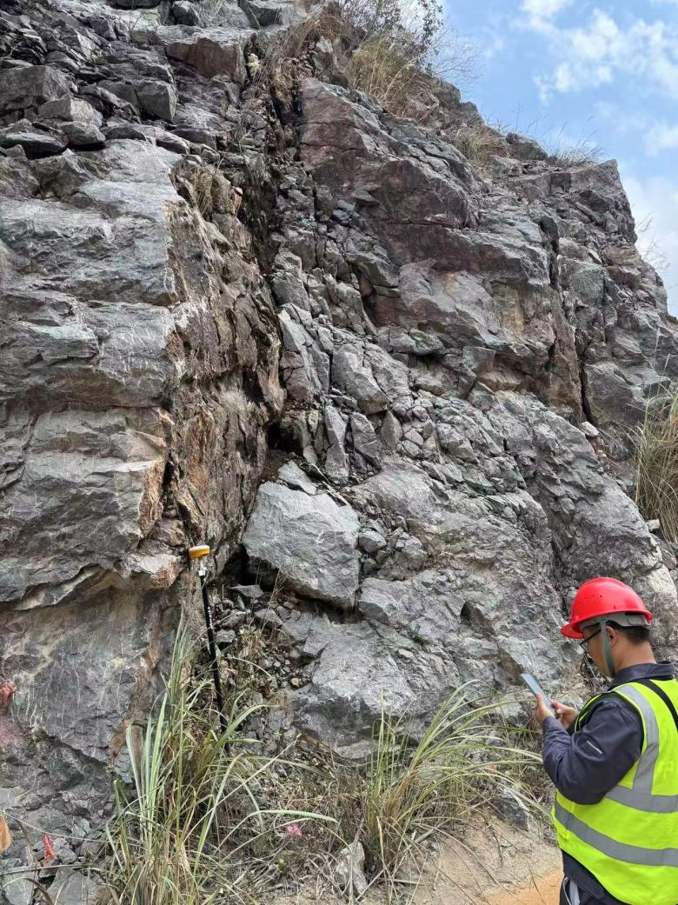__

__图4\.2\-33 矿山大门处导水裂缝__

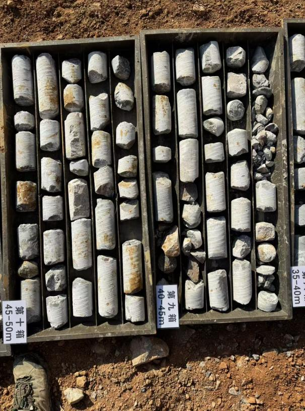 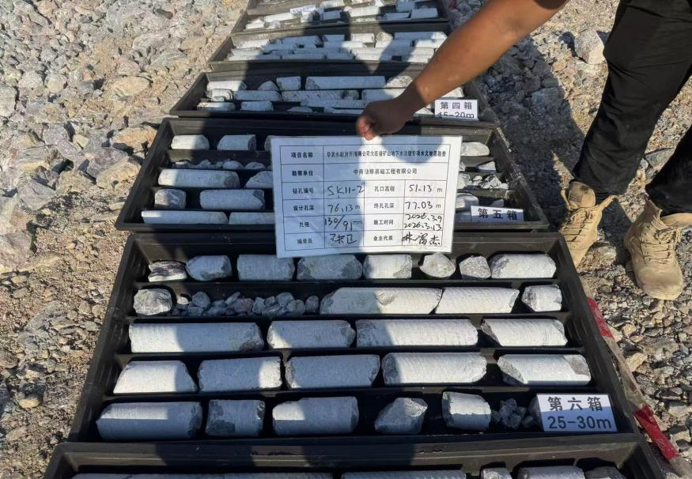

__图4\.2\-34 SK13\-1、SK11\-2岩芯照片__

（4）矿区南侧边界4~10段附近中等径流带

在地表调查方面，该区南侧为小河沟，宽约1\.5m，深约0\.25m，流向正西，流量约0\.17m3/s；在物探方面，P12物探线0~180m段（矿区边界4~8段）未见明显低阻区，由于矿区该部分多为山体难以布设物探线，所以其余部分无物探资料；在钻探方面，本次钻孔SK11\-4、SK3\-4、SK5\-2以及以往钻孔ZK505、ZK503等钻孔均无岩溶发育现象，岩芯采取率较高，该区域为弱岩溶发育区；综上，推测矿区南侧边界4~10段附近为中等径流带。

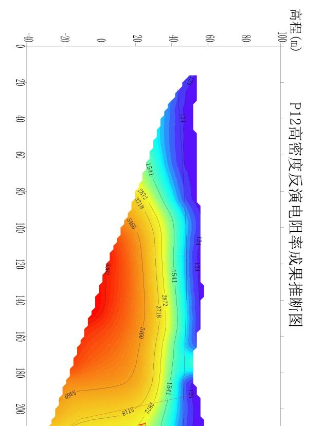

__图4\.2\-35 P12物探线__

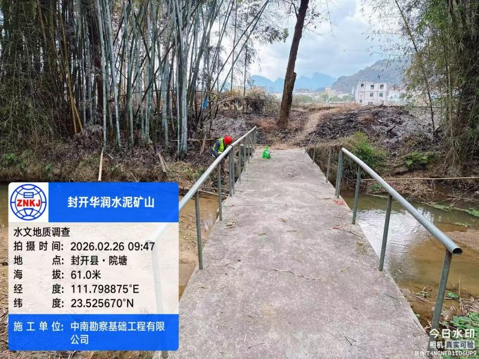

__图4\.2\-36 南侧小河沟__

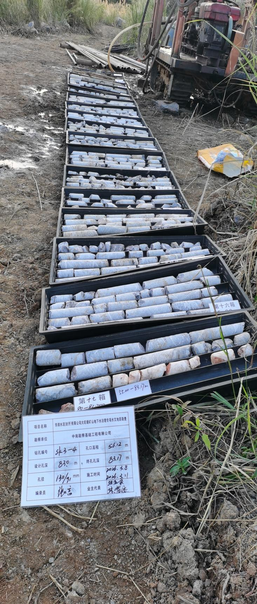 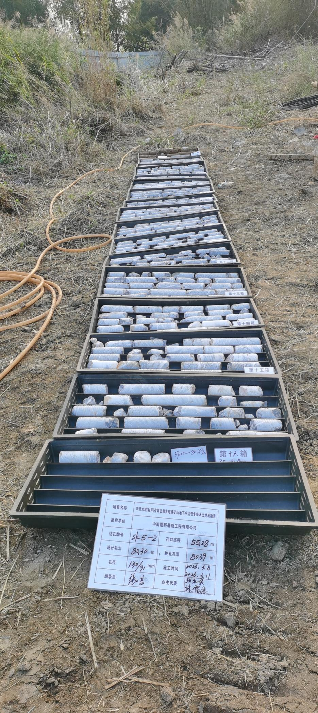

__图4\.2\-37 SK3\-4、SK11\-2岩芯照片__

### 地下水补径排特征

矿区地下水流场受原始地形地貌、地层岩性及断裂构造的综合影响，表现出补给来源明确、径流受构造与岩溶强发育带引导、排泄趋向集中的循环特征。

#### 地下水补给特征及边界来水通道

矿区地下水的补给主要由大气降水垂向入渗与北部、东部边界的侧向径流补给共同构成。

（1）大气降水垂向入渗补给：矿区内大部分刘家塘组灰岩地层直接裸露或呈浅埋状态。局部分布的第四系覆盖层（厚度1~33m）对降水入渗的阻隔作用较小。当前，大气降水主要通过大面积裸露的基岩、采场揭露的裂隙与溶孔直接垂向渗入并补给深部含水层。需要指出的是，矿区北侧虽已无原大旺塘洼地的闭合汇水地形，但该区域岩溶及垂向破碎通道强发育，是地下水补给的重要补给源之一。

（2）北部及西北部来水通道（JL4径流带）：矿区北部及西北部为主要的侧向补给来源区之一。在矿区北部边界16~17拐点段，发育有JL4强径流带，该区域具备良好的地下水运移条件，构成了北部地下水进入矿区的主要优势通道。同时，西北部14~16拐点段受大旺塘地表水下渗影响，也存在中等强度的径流补给。

（3）东部来水通道（wf2、wf3及JL3径流带）：矿区东部地势相对较高，是流场上游的主要补给源。受断裂构造引导，东部补给流场主要通过wf2、wf3等断层进入矿区。其中，边界18~2拐点段发育有JL3强径流带（渗透系数高、导水裂隙普遍发育），承接了东部区域的侧向径流并将其引导至矿区内部。

（4）南部来水通道：南部及西部来水：受漏斗波及影响，南部（如SJ\-10，水位\+59\.95m；SK3\-6，水位\+52\.63m）及西部（如SK5\-1，水位\+58\.02m）的地下水发生流向逆转，由原向外排泄转变为向矿区内部的侧向补给。

#### 地下水径流特征

在矿区持续抽排水形成的巨大水力梯度驱动下，矿区地下水径流总体呈现由四周向矿区低水位中心汇流的趋势。

（1）径流路径与非均质介质：地下水在进入矿区后，主要沿灰岩内的构造裂隙、高倾角断层破碎带（如wf1、wf2、wf3等）与岩溶管道运移。径流过程表现出明显的非均质性与构造导向性。

（2）向心汇聚：流场图表明，地下水由北部、东部、南部及西部进入后，在向中心运移的过程中，向断裂构造交汇区及采坑强排泄区集中，呈现典型的向心汇聚径流特征。

#### 地下水排泄特征及出口通道

受采矿活动影响，矿区地下水的天然排泄途径已被改变。当前矿区地下水已无明显的向外自然排泄通道，四周边界均为进水边界。其排泄主要表现为向降落漏斗中心的运移与汇集，并通过露天采坑或井下水泵进行集中人工排泄。

#### 地下水补径排关系总结

综上所述，矿区地下水的补径排过程明显受断裂构造、岩溶发育程度及人工抽排水的共同控制：上游主要通过大面积裸露基岩接受大气降水垂向入渗，同时在抽水降压作用下，四周边界均转变为补给通道接受侧向径流流入；随后受强烈的水力梯度驱动，地下水从四周向矿区中心主导径流；最终通过采区的人工集中抽排水系统向外排泄，形成了外围地下水向矿坑汇集、再由人工集中排出的流场演变模式。

### 地下水动态特征

#### 现状地下水水位

根据地下水水位等值线图，受矿区持续的抽排水活动影响，该区域目前呈现出明显的地下水降落漏斗特征。矿区外围的北部、东南部及西部区域水位普遍较高（部分外围点位水位标高在\+53m~\+63m以上），而矿区内部的水位较低（普遍维持在\+49m~\+50m左右）。地下水整体表现为从四周高水位区向矿区低水位中心汇流的径流模式。

同时，图中的水位等值线形态极不规则，呈现出明显的扭曲、折变，局部水力梯度变化强烈。这深刻反映了矿区地下岩溶较为发育，且岩溶通道、裂隙网络在空间分布上存在极强的不规则性（非均质性）。具体表现为：

（1）等值线稀疏区（如矿区中部）：说明该区域地下岩溶及导水裂隙高度发育，含水系统连通性较好，地下水径流阻力小，因此水力梯度较缓。

（2）等值线密集区（如矿区东南部及部分边缘）：说明该处岩溶相对欠发育或存在阻水介质，导致地下水径流受阻，渗透性能较差，从而形成了较大的局部水力梯度。

综合来看，当前地下水位等值线图所呈现的极不规则的漏斗状特征，正是矿区人工集中抽水与各向异性的复杂岩溶水文地质条件共同作用的直观体现。

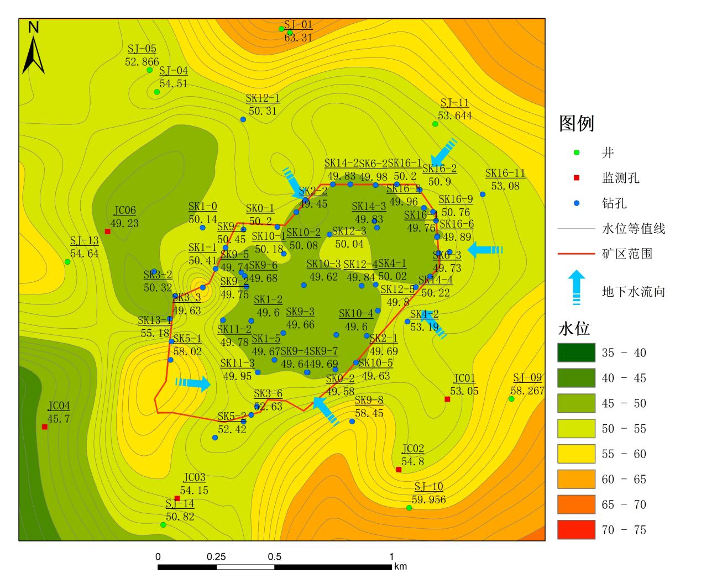

图4\.2\-38 矿区地下水位等值线图

#### 长期地下水位动态观测

本次地下水长期观测点选择矿区外围的六个监测孔JC01、JC02、JC03、JC04、JC05、JC06，矿区内选择了SK9\-2、SK9\-4、SK10\-4和SK12\-4等28个监测孔，主要检测石炭系下统刘家塘组（C1*lj*）的灰岩裂隙溶洞水，地下水监测频率为每天监测一次，目前已获得近半年的水位动态。从各孔水位动态图中可以看出，其中JC04为矿区最低水位，目前水位高程为45\.58m。截至2026年3月10日，地下水水位为45\.58~63\.31m，平均水位为51\.50m。

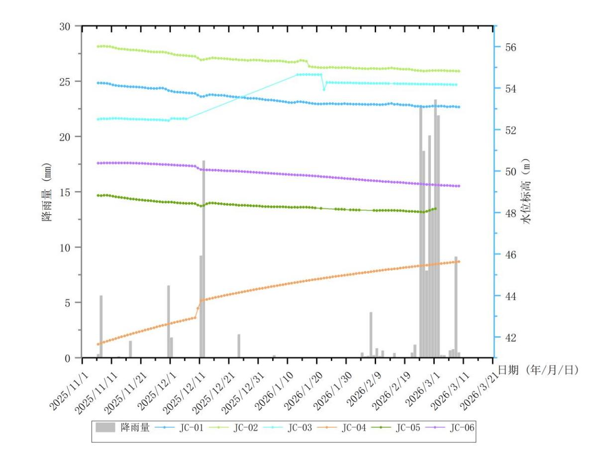

图4\.2\-39 矿区地下水动态曲线图1

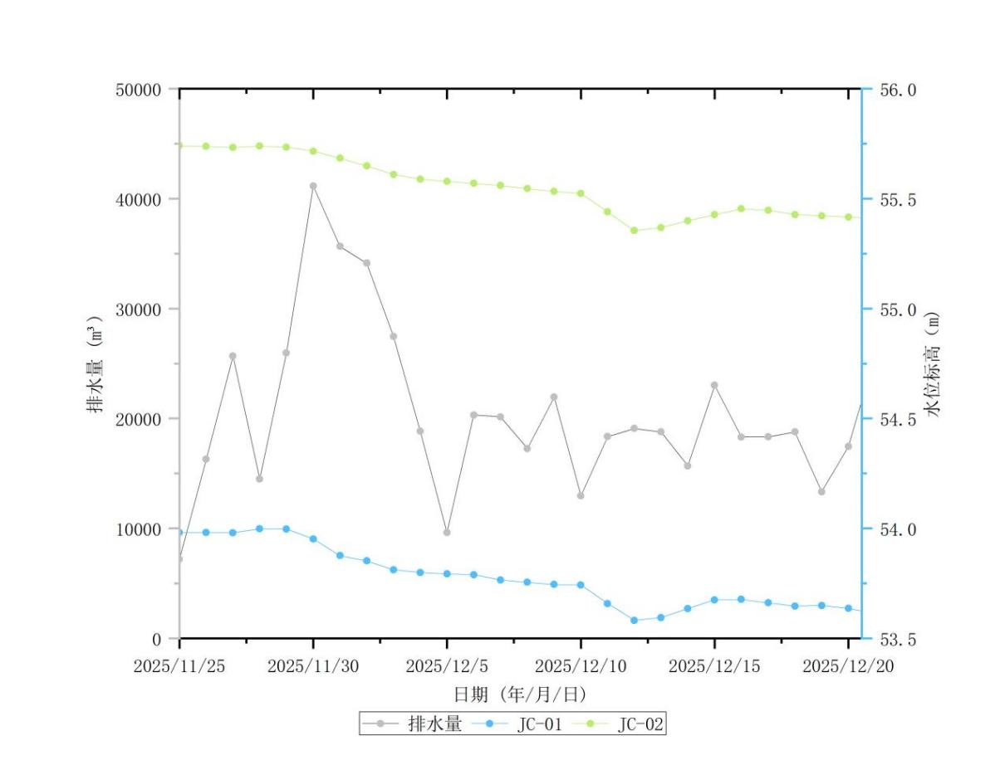

图4\.2\-40 矿区地下水动态曲线图2

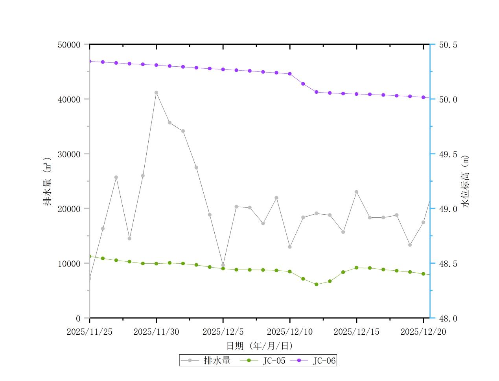

图4\.2\-41 矿区地下水动态曲线图3

根据地下水水位动态曲线（图4\.2\-38~5\.2\-41）可知，JC01、JC02、JC05和JC06水位2025年11月至2026年3月有稳定下降的趋势，由于调查时间处于旱季，地下水水位下降可能受到季节性的影响，但是影响并不强烈；JC03和JC04水位2025年11月至2026年3月有上升趋势，自2026年1月开始，JC03水位已逐渐趋于稳定，JC04仍然有继续上升的趋势，可能存在其他的补给来源，其附近有鱼塘，可能与地表水存在水力联系。在2025年12月10日至2025年12月15日之间，JC01、JC02、JC05和JC06都出现了一个较小的波动，水位微微下降后回升，这可能与大旺塘在2025年11月25日至2025年12月5日的排水量显著上升有联系，但影响较小，推测径流途径可能较远。

### 涌水量动态特征

大旺塘排水主要集中在矿区中部偏北地区，根据大旺塘排水量动态曲线图（图4\.2\-42）可知，获得了大旺塘一个水文年的排水量数据，并且从中可以看出大旺塘的排水量在2025年5月出现了大幅上升，至2025年10月出现大幅下降，并且具有明显的波动，计算矿区涌水量的季节变化系数为2\.71，说明受大气降水影响较大，呈现出明显的季节性特征，没有明显的滞后性，说明矿区涌水量主要受大气降水直接补给。

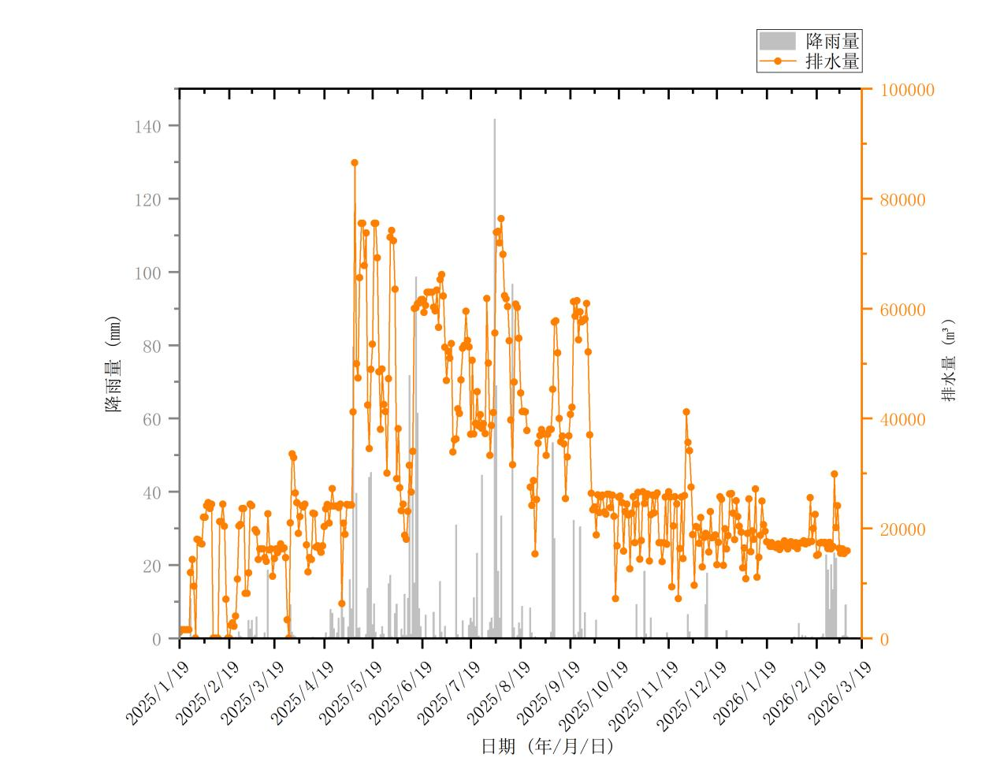

图4\.2\-42 大旺塘排水量动态曲线图

## 矿区充水条件分析

#### 大气降水

大气降水，严格意义讲，是一切矿坑充水的最终水源，因为无论是地表水或地下水都直接或间接地来自大气降水的补给。

本矿区为露天开采，未来存在凹陷型开采阶段，四周保留了部分原始陡峭山体，具备汇水地形条件。大气降水一方面可直接落入矿区露天采坑内，一方面可受地形控制汇流或散流进入采坑，此外，降雨入渗后可补给表层岩溶带进而就地排泄进入采坑，或继续向下补给岩溶含水层动储量。

因矿区地处北回归线，属亚热带季风湿润气候，降雨量大且较为集中，采坑及其汇水面积较大，地表岩溶裂隙发育，故大气降水是矿区充水的主要来源之一。

#### 地表水

矿区东侧和南侧存在季节性溪流，南部渔涝河为常年性地表水体。溪流本身流量较小，切割深度有限，故溪流虽可通过第四系松散层间接补给岩溶水，但不具备优势通道，且随着矿区疏干，岩溶水位降低，补给越发困难，总量十分有限，是次要充水水源。而渔涝河距离矿区较远且位于下游地区，为盆地排泄基准，可忽略其充水影响。

#### 地下水

##### 第四系残坡积层孔隙水

矿区边残存的第四系残坡积层孔隙水可通过补给岩溶水间接进入采坑，因残坡积层面积有限且富水性弱，随矿区疏干，补给影响持续降低，列为次要充水水源。

##### 石炭系碳酸盐岩裂隙溶洞水

矿区凹陷型开采的地层为石炭系刘家塘组（C1*lj*）灰岩，该层赋存碳酸盐岩裂隙溶洞水，富水性强，存在强发育带和径流带。目前\+50m平台水位埋深极浅，未来开采几乎全在饱水带中，需重点疏干该层才具备开采条件，故石炭系碳酸盐岩裂隙溶洞水是矿坑充水的主要水源之一。

## 矿区水文地质勘查类型

大旺塘矿区内分布石炭系刘家塘组（C1*lj*）碳酸盐岩裂隙溶洞水，该含水层厚度大，中间无隔水层，溶蚀裂隙发育，具有垂向分带的小型溶洞，与矿体直接接触，岩溶水可直接进入凹陷开采区。矿区地形不利于自然排水，主要矿体位于侵蚀基准面以下，东侧南侧溪沟不构成主要充水因素。该含水层除出露区外，均隐伏于盆地第四系下，补给条件一般，矿区区域水文地质条件边界较为清晰简单，无区域导水构造直穿矿区，存在次级小型断裂及局部强径流带，无老空水分布，疏干排水可能产生少量局部塌陷。

本次专项勘察与以往不同的是，聚焦凹陷开采区的地下水治理问题，布设钻孔数量多、分布密、单孔进尺深、水文地质试验详细。在划定的强径流带上，部分钻孔单位涌水量处于1\.0\-5\.0L/（s·m），个别大于5\.0L/（s·m），富水性属于强。本着就高不就低原则，将未来凹陷开采区的水文地质条件定为复杂。

依据规范的判定标准，矿区水文地质勘查类型为：以溶洞为主、直接充水、水文地质条件复杂的岩溶充水矿床。

# 矿段涌突水影响因素评价

## 涌突水影响因素分析

本次矿区范围内的充水水源主要由大气降水、含水层地下水、第四系残坡积层孔隙水及地表水四部分组成。其中，大气降水直接汇入露天采场，与富水性强、集中在\+50\.00~\+10\.00m强发育带的裂隙溶洞地下水共同构成了矿坑的最主要充水水源；此外，第四系残坡积层孔隙水能够通过岩溶裂隙渗入采场，连同矿区南侧可能经松散层下渗补给岩溶水的地表河流，共同作为矿坑的次要或间接补给来源。

### 大气降水对矿段涌水量的影响

根据大旺塘排水量动态曲线图可知，大气降水对该矿段的涌水量可能具有较为明显的影响，推测是导致矿区涌水呈现季节性动态特征的重要因素。图中可以看出其排水量在2025年5月出现了大幅上升，期间伴随降雨呈现出明显的波动，至10月又出现大幅下降。经计算，矿区涌水量的季节变化系数为2\.71，且水量增减与降雨过程之间未见明显的滞后性。这些动态特征初步表明，矿区涌水量受大气降雨的影响较大，主要受大气降雨直接补给。

### 地表水对矿段涌水的影响

综合分析矿区周边水系特征、汇流计算参数与涌水动态，目前资料表明矿区（尤其是中北部大旺塘）地下水受常态地表水体的直接补给有限，但需高度警惕极端降雨条件下的地表汇流冲击。

（1）在地表水系方面，矿区周边主要发育渔涝河及汇入该河的西沟、南沟等地表水体。渔涝河位于矿区南侧，虽水量充沛（流量达7000~22464m³/h），但距离中北部大旺塘较远（约2\.5~3km），初步判断两者间的水力联系较弱。西沟流量极小（约75\.6m³/h），相较于大旺塘雨季平均2040\.74m³/h的矿坑排水量，其潜在的水量贡献基本可以忽略。南沟流量约为615m³/h，在空间上虽与矿区间发育有JL1、JL2两条强径流带而具备一定的水力连通潜力，但实际补给作用受限。因此，现有常态水系对矿区的水量贡献极低。

（2）在地表汇流方面，露天采场上游具备575849\.7m²的广阔汇水面积，在0\.45的径流系数以及最大日降雨量达172mm的极端工况下，矿区在强降雨期将面临巨大的坡面汇流冲击潜力。然而，矿区实际排水量对降雨的响应表现出显著的“无滞后”特征。动态监测数据显示，在2025年9月末降雨减弱后，矿区排水量即刻出现大幅下降。这种涌水量随降水同步增减、迅速回落的特征，侧面印证了矿坑涌水主要受大气降水直接入渗控制。这表明即使暴雨期周边具备产生巨大地表汇流的潜力，在目前的防洪截排体系或特定的水文地质结构下，这部分水并未沿南沟或径流带形成对矿坑的大规模、持续性或迟滞性的侧向补给。总体而言，目前矿区地下水受地表水体的直接补给影响依然较小。

### 构造对矿段涌突水的影响

本次通过物探资料，新增识别了10条断层破碎带（wf1~wf10），其中有5条（wf1、wf4等）分布于矿区南侧，2条（wf2、wf3）分布于矿区东侧，2条（wf7、wf10）分布于矿区西侧，1条（wf9）分布于矿区北侧，倾向大多北西向50°~62°，倾角多为50°以上，其中wf5、wf8深部向两侧延伸，构成潜在的区域导水通道；wf2、wf3和wf6岩层破碎、裂隙发育，倾向与强径流带JL2径流方向一致，增加了地下水赋存空间，为地下水径流形成了优势通道。因此，矿区内东部和南部受原大旺塘及构造影响，断层破碎带发育，增强了岩层的富水性，加剧了矿区突涌水的风险；整体上，矿区涌水量呈现明显的季节性波动，受构造影响较小。

### 岩溶发育对矿段涌水的影响

综合分析表4\.2\-1及图4\.2\-2至图4\.2\-6可知，矿区内钻孔岩溶发育在平面空间分布与垂向分布上具有一定的规律及局部特征。

#### 平面岩溶非均质性对涌突水的影响

平面岩溶的非均质性控制着地下水赋存与径流的空间格局。受原大旺塘及构造影响，矿区北部（SK9\-2、SK9\-5附近）属强岩溶发育区，浅层导水网络密集。该区储导水能力较强，对降雨及地表水下渗响应迅速，是开采期需重点防范的主涌水靶区。东侧及边界区整体以中等发育为主，但局部构造连通性好，主要构成地下水侧向运移与越流补给的径流通道。北部强发育区主要带来高强度、直接的集中涌水影响；东侧中等发育区则表现为相对平缓、持续的径流补给影响。

#### 垂向岩溶分带性对涌突水的影响

岩溶随深度的单峰状发育特征，决定了不同深度的水害类型存在显著差异。浅至中深部（标高\+70~\+10m，尤其是\+50~\+30m核心段）为主要储水空间，揭露该层位时含水层富水性好，矿坑将面临较大的常态化涌水压力。深部（\+10m以下，尤其是\-10~\-30m）岩溶整体减弱，常规涌水量呈下降趋势，此时防治重心需转向隐伏岩溶突水。例如南部SK12\-6钻孔周边存在浅层弱发育且深层中等发育的异常现象，深部开采（如\+5m至\-10m平台）切穿此类构造带时，极易诱发高水压驱动的局部承压水突涌。在浅部，对常态化涌水量具有剧烈的放大影响；在深部，常规涌水影响虽降低，但隐伏构造对诱发高压承压水突涌具有高危、突发性影响。

### 小结

矿区涌突水主要受大气降水、地表水、地质构造及岩溶发育四大因素的综合影响，具体特征如下：

（1）大气降水是最主要的直接充水水源：矿区涌水量呈现显著的季节性动态特征，且对降雨过程响应迅速、无明显滞后性，表明大气降雨是主导矿坑涌水量变化的核心因素。

（2）地表水补给作用有限：周边主要地表水系（如渔涝河、西侧溪沟、南侧溪沟）与矿区的水力联系较弱，对矿坑涌水的直接补给和实质性水量贡献较小。

（3）构造断裂带加剧局部突水风险：矿区内发育的多条断层破碎带构成了地下水的优势导水通道和赋存空间，增加了东部和南部区域的岩层富水性与突水隐患，但未改变涌水量整体受季节性降雨控制的规律。

（4）岩溶空间分布是控制突涌水格局的主要因素：在平面上，北部强发育区是易发生高强度集中涌水的核心区域；东侧中等发育区则主要作为持续的侧向径流补给通道。在垂向上，中浅部（标高\+70~\+10m）为主要储水段，常态化涌水量大；深部（\+10m以下）常规涌水减弱，但极易受隐伏构造影响，可能面临突发性高压承压水突涌的风险。

## 含水层富水性评价与分区

充分挖掘矿区勘察资料，并结合研究区岩溶发育的特征，确定将钻孔岩溶率、岩芯采取率和渗透系数作为含水层富水性的主控因素。由于矿坑涌水量的大小能够直接反映含水层的富水性强弱，可作为检验含水层富水性强度的最终指标。

### 主控因素专题图

将各主控因素通过插值方法分别绘制各主控因素专题图，如下图所示。

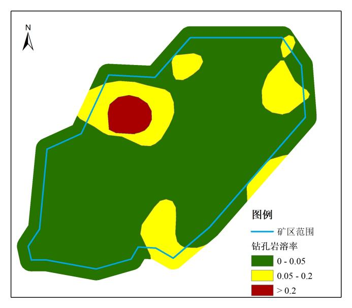

__\(a\)钻孔岩溶率__

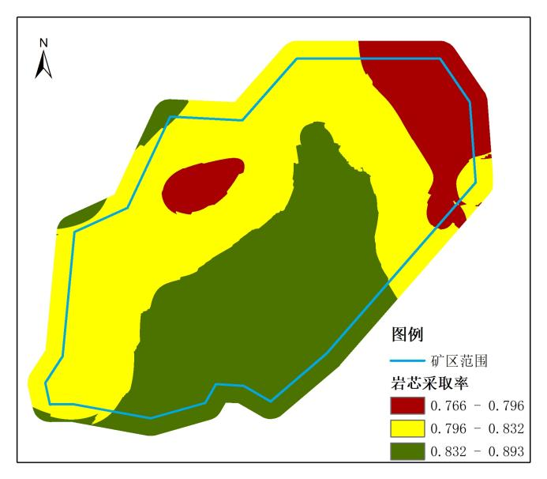

__\(b\)岩芯采取率__

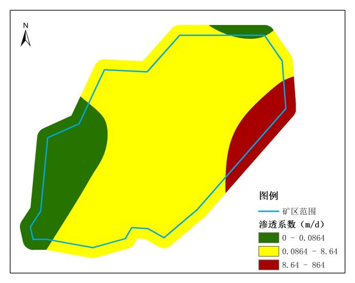

__\(c\)渗透系数__

__图5\.2\-1 富水性主控因素专题图__

（1）钻孔岩溶率

岩溶率与地下水富水性之间存在着密切的相关性。岩溶率能反映可溶岩分布区在一定地段内岩溶发育程度的指标。岩溶率高的地区通常地下水资源丰富，因为岩溶过程会增加岩石孔隙和裂隙数量，进而提高岩层连通性，有利于地下水的储存和补给。岩溶过程还会直接影响地下水的储存、水质特征以及地下水循环系统的形成和演化。

由岩溶率专题图可知，矿区北部受原大旺塘影响，钻孔岩溶率较高，该区为矿区内强岩溶发育区。其次，矿区东部受破碎带及溶隙影响，钻孔岩溶发育率在5~10%左右，该区为矿区内中等岩溶发育区。同时，矿区东南部受破碎带、溶隙等影响，钻孔岩溶发育率中等，该区域为岩溶中等发育区，矿区西部与中部以及东侧中部区域钻孔岩溶率较低，这些区域为矿区内弱岩溶发育区。

（2）岩芯采取率

岩芯采取率是指在钻探过程中，实际提取上来的岩芯总长度，与该次钻进的实际深度（进尺长度）之比，通常用百分数表示。岩芯采取率是评价地下岩土层物理力学性质和岩体完整程度的直观依据：采取率高说明地下岩石非常完整、坚硬，地质条件较好。采取率低通常意味着钻头遇到了破碎带、断层、软弱夹层或者地下溶洞等（岩石碎裂被冲洗液带走，或干脆掉块、漏失），导致取上来的岩芯很少甚至没有。

由岩芯采取率专题图可知，矿区北部受原大旺塘影响，该区岩溶裂隙发育较强，岩芯采取率较低（76\.6%~80\.8%）。矿区东部JL4径流带上的钻孔岩溶裂隙发育较强，岩芯采取率在79\.6%~83\.2%左右。矿区西南侧岩芯采取率在83\.2%~89\.3%左右，该区溶洞存在半充填或全充填的情况，同时该区在岩溶发育相对较弱的深度，岩体较为完整。

（3）渗透系数

渗透系数的物理定义为：多孔介质（如岩石、土壤）允许单相流体（如水、石油等）在压差作用下通过其连通孔隙的难易程度。由渗透系数专题图可知，矿区东南侧含水层渗透性等级为强透水（10\-2≤*K*<1，cm/s），该区地下水的流动速度很快，增加了突涌水的可能性。矿区中部、北部及南部含水层渗透性等级为中等透水（10\-4≤*K*<10\-2，cm/s），地下水的流动速度较快，有一定突涌水的可能性。矿区西侧含水层渗透性等级为弱透水及以下（0≤*K*<10\-4，cm/s），地下水的流动速度较慢，相对较安全。

### 富水性分区

引入富水性指数*CI*的初始模型来对充水含水层富水性进行评价。模型公式如下：

		（5\-1）

式中：*CI*—富水性指数；*Wk*—地缘信息权重；*fk*\(*x*,*y*\)—单信息影响值函数；*n*—地缘信息的个数；\(*x*,*y*\)—地理坐标。

本次勘察共计66个钻孔的钻孔岩溶率以及岩芯采取率，其中，钻孔岩溶率以钻孔揭露溶洞及岩溶裂隙为准，其现象揭露较为明显，并且与物探预测信息较为吻合，但矿区北部受原大旺塘地表水入渗影响导致垂向岩溶发育较强，并不能直接反映目前该区含水层的富水性以及侧向补给能力，其准确性及合理性中等，其权重*W1*取0\.3；本次勘察在钻探过程中，部分区域岩芯较破碎且岩芯采取率较低，但是物探显示并不是破碎带或溶洞，并且岩芯也没有明显的岩溶及裂隙现象，推测其破碎大多应该为机械破碎（钻头的震动、摩擦以及冲洗液的冲刷导致相对完整的脆性岩体被破坏），其结果的合理性与准确率相比钻孔岩溶率较低，其权重*W2*取0\.1；渗透系数作为直接表征含水层导水能力与地下水动力场特征的核心参数，对矿区富水性分区具有决定性的控制作用。相比于岩溶率和岩芯采取率等表征岩体物理结构的间接指标，渗透系数能够最真实、动态地反映地下水的赋存与径流状态，所以其权重*W3*取0\.6。

由于含水层富水性的各主控因素的量级不在同一水平，在进行综合分析之前需通过归一化处理统一量纲，同时，由于钻孔岩溶率与渗透系数为正向指标（其值越大，说明富水性指数越大），而岩芯采取率为负向指标（其值越大，则说明富水性指数越小），所以正、负指标要使用相对应的归一化公式，公式如下：

		（5\-2）

其中，*L*为主控因素实际值，*L’*为归一化后的值，*L*min为*L*的最小值，*L*max为*L*的最大值。

将归一化后的含水层富水性各主控因素及其权重代入该式（5\-3），可以得出矿区含水层富水性评价公式为：

		（5\-3）

计算富水性指数，其数值的大小表明充水含水层富含水的程度，富水性指数的值在0~1之间，值越大说明该区富水性越好，并根据富水性指数值绘制矿区含水层富水性分区图。

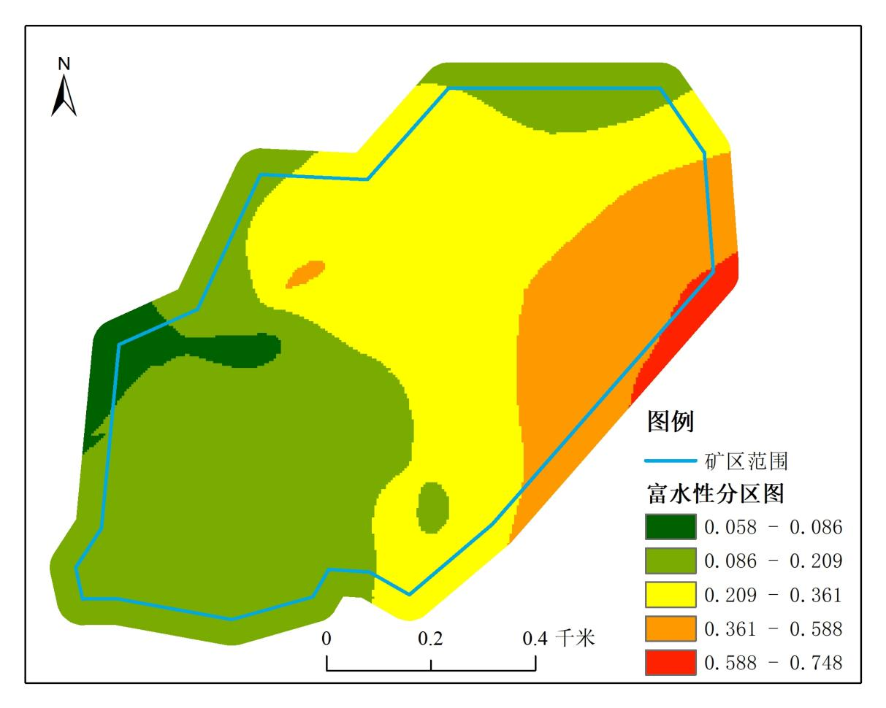

__图5\.2\-2 矿区含水层富水性分区图__

根据矿区含水层富水性分区图，将含水层按照富水性指数的大小，对其富水性由弱到强依次划分为五个等级：富水性相对弱区、富水性相对较弱区、富水性相对中等区、富水性相对较好区和富水性相对好区。

从空间分布特征来看，矿区含水层富水性整体呈现出“东强西弱”的格局。其中，富水性相对好区及较好区主要集中在矿区的东部及东南部边缘，呈带状展布；富水性相对中等区分布范围最广，大面积覆盖矿区的中部及北部；而富水性相对弱区及较弱区则主要局限于矿区的西部及西南部。

在此基础上，根据含水层富水性分析结果，明确突涌水危险性分级标准，并将研究区划分为安全区、低风险区、中风险区、中高风险区和高风险区。

从矿区突涌水危险性评价综合分区图中可以看出，矿区内突涌水高风险及中高风险地区主要沿矿区的东部及东南部边缘呈宽带状集中分布，在矿区北部也有少量中高风险区域；中风险区则大面积连片分布于矿区的中部及大部区域。这主要是因为这些区域主要充水含水层富水性较高，且导水裂隙及岩溶带发育较好。富水性高的含水层提供了丰富的静态储量与补给水源，而发育良好的导水通道为地下水流动提供了便捷途径，两者叠加显著增加了突涌水的风险。

相比之下，低风险区主要分布于矿区的西南部及西部边缘，在矿区西部边界处仅有极少量的安全区范围。由于该区域含水层富水性相对较低，且推测导水裂隙带发育较弱，地下水径流条件较差，导致突涌水危险性处于偏低水平。

针对上述分区结果，对于高风险及中高风险区域，在采掘过程中应重点采取相应的防范措施，如加强超前探放水监测、实施疏干排水或帷幕注浆等，以有效切断补给通道并降低突涌水发生的概率。对于广大的中、低风险区域，虽然突涌水的大规模暴发可能性相对较低，但仍需保持警惕，落实定期监测和动态评估机制，以确保矿山生产安全。该危险性分区结果能够直观指导矿区的防排水工程布置、资源安全开发及日常应急管理，为矿山防灾减灾决策提供科学依据。

__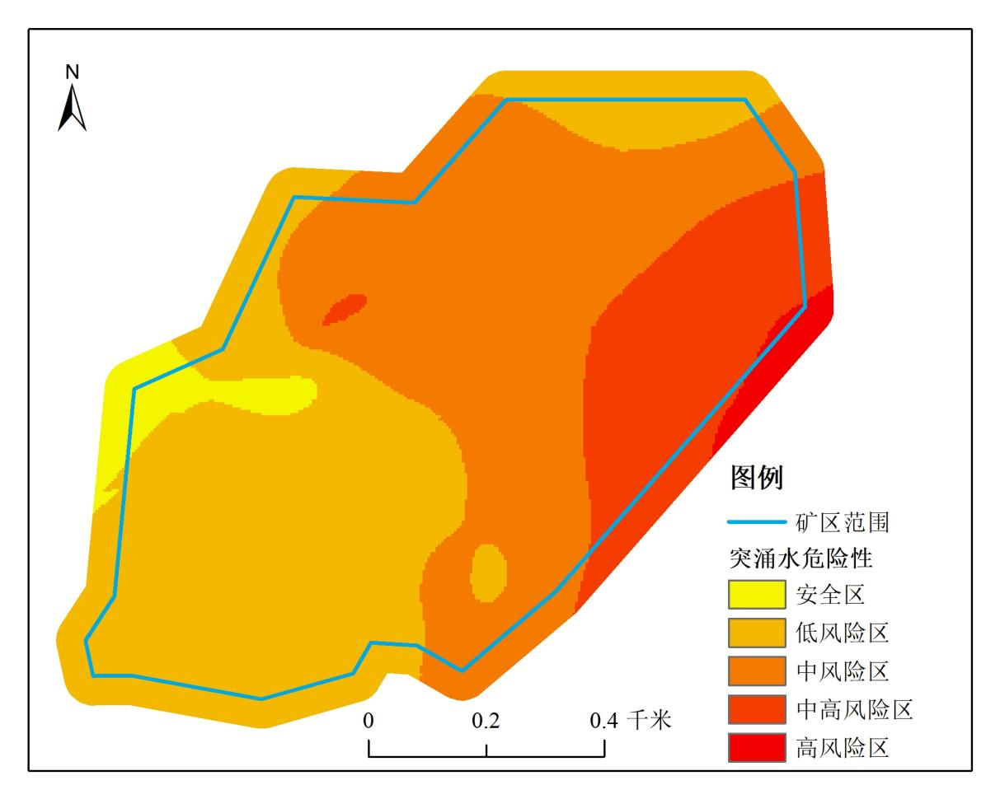__

__图5\.2\-3 矿区突涌水危险性评价综合分区图__

# 矿坑涌水量预测

## 水文地质概念模型

### 模型范围

基于区域及大旺塘矿区水文地质条件综合分析，明确矿区水文地质概念模型北部以地表分水岭为零通量边界，南部以渔涝河为给定水头边界，东部以加里东期侵入岩为相对隔水边界，西部以寒武系粉砂岩为相对隔水边界，构成东、西两侧隔水的半开放式水文地质单元，工作区总面积约为36\.45km2，模型范围如下图所示。

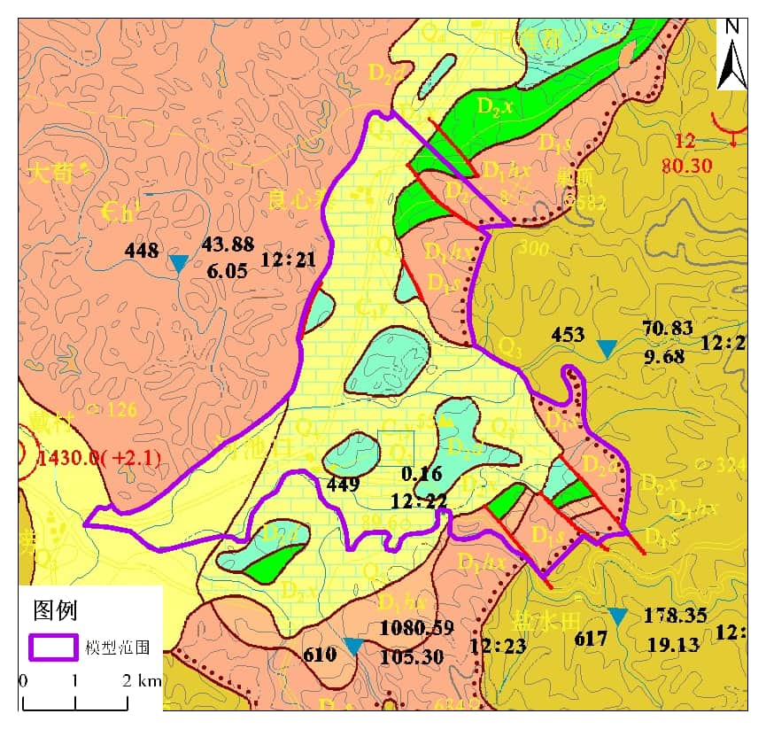

图6\.1\-1 水文地质概念模型范围

### 模型概化

矿区内含（隔）水层根据实际野外调查情况以及实际钻孔揭露情况进行进一步划分，自上而下概化为3层，分别为弱含水层、岩溶裂隙强发育含水层以及岩溶裂隙中等发育含水层，具体如下：

（1）第一层：第四系残坡积层粉质粘土层（弱含水层）

包含较多黏粒、粉粒、粉砂等，主要分布于山间盆地土层中，部分区域上部覆盖不连续的粉质粘土层，覆盖厚度0\.50m~15\.80m。一般为潜水型，属弱富水层；该层与地表水联系较密切。

（2）第二层：石炭系下统刘家塘组（C1*lj*）岩溶裂隙强发育段（岩溶裂隙强发育含水层）

主要岩性为灰岩、白云质灰岩夹一层硅质灰岩。该层段主要分布于碳酸盐岩的浅部、风化壳及地下水主要交替径流带，溶洞、溶蚀孔隙及构造裂隙强烈发育，网络连通性较好。主要含岩溶裂隙水，富水性强，透水性好，水量丰富，是模型中需重点考量的间接充水含水层。

（3）第三层：石炭系下统刘家塘组（C1*lj*）岩溶裂隙中等发育段（岩溶裂隙中等发育含水层）：

主要岩性与第二层一致。该层段位于强发育带之下的深部区域，随着埋深增加，岩体完整性相对变好，岩溶及裂隙发育程度较上部明显减弱，岩溶形态以小型溶孔、微张或闭合状裂隙为主，连通性变差。富水性及透水性较第二层有所降低，属中等富水层。

### 模型边界概化

结合矿区地形地貌、地质构造及充水水源分布特征，对水文地质概念模型边界进行概化，边界概化如下：

一、西部边界：为寒武系八村群下亚群（∈bc）粉砂岩夹砂岩及页岩，底部为砾岩，岩层透水性极弱，为天然隔水边界，模型中按相对隔水边界处理，对外部水体侧向补给具有阻隔作用，排除其对矿坑充水的影响。

二、东部边界：为加里东期（r3）黑云母花岗岩，透水性差，为相对隔水边界，模型中按相对隔水边界概化，限制含水层东部延伸，避免外部水体干扰充水计算。

三、北部边界：为石炭系下统刘家塘组（C1*lj*）灰岩、白云质灰岩夹一层硅质灰岩，为地表分水岭，模型中概化为零通量边界。

四、南部边界：天然条件下地下水向南部渔涝河排泄，模型中概化为给定水头边界。

模型概化时充分考虑各类充水水源的影响：将大气降水作为间接充水水源，通过降水入渗系数分区量化其入渗贡献；矿区内地表水系无直接充水作用；矿区内无规模老空水积水。水文地质概念模型边界概化如下图所示。

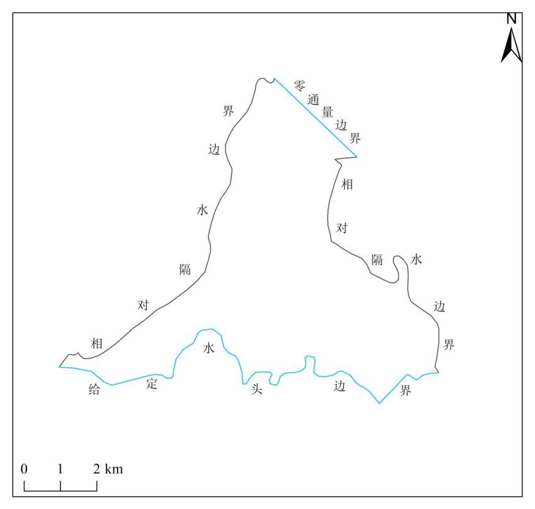

图6\.1\-2 水文地质概念模型图

## 水文地质比拟法预测矿坑涌水量

本矿坑为露天矿坑类型，根据《矿坑涌水量预测计算规程》要求，露天矿坑涌水量比拟法预测应包括地表水汇入采坑水量（Q1）、降水渗入采坑水量（Q2）和露天采坑地下水涌水量（Q3）。

### 地表水汇入采坑水量计算

根据《矿坑涌水量预测计算规程》中附录G露天矿矿坑涌水量计算公式中的G\.1计算地表水汇入采坑水量，公式如下

                      Q1=F·P·α                    （6\-1）

式中：

Q1——地表水汇入采坑水量，单位为立方米每天\(m3/d\)；

F——采坑上游汇水面积，单位为平方米\(m2\)；

P——降水量，单位为米\(m\)；

α——地表径流系数。

表6\.2\-1 参数取值表

类别

数值

备注

采坑上游汇水面积F

0\.5758497km2

575849\.702m2

根据地形、遥感图综合圈定

日降水量P

平均值

4\.05mm

0\.00405m

基于近30年的降水量数据（表6\.2\-2）

最大值

172mm

0\.172m

地表径流系数α

0\.45

根据矿区的用地类型取经验值

表6\.2\-2 近30年的降水数据统计表

年份

1996

1997

1998

1999

2000

2001

2002

2003

2004

2005

年\(日\)平均值

\(mm\)

4\.11

5\.85

4\.41

3\.56

3\.26

4\.24

3\.88

3\.21

3\.64

4\.34

年\(日\)最大值

\(mm\)

97\.00

88\.10

112\.70

76\.80

92\.60

74\.50

58\.20

80\.60

80\.10

84\.70

年\(日\)最小值

\(mm\)

0

0

0

0

0

0

0

0

0

0

年份

2006

2007

2008

2009

2010

2011

2012

2013

2014

2015

年\(日\)平均值

\(mm\)

4\.74

3\.15

4\.42

3\.77

3\.90

3\.47

4\.18

5\.45

3\.85

4\.38

年\(日\)最大值

\(mm\)

149\.00

54\.60

69\.20

98\.20

108\.00

117\.00

78\.80

100\.40

105\.30

79\.30

年\(日\)最小值

\(mm\)

0

0

0

0

0

0

0

0

0

0

年份

2016

2017

2018

2019

2020

2021

2022

2023

2024

2025

年\(日\)平均值

\(mm\)

5\.02

4\.15

3\.36

3\.93

3\.71

3\.23

4\.40

3\.71

4\.00

4\.31

年\(日\)最大值

\(mm\)

131\.00

77\.20

78\.50

171\.70

103\.10

52\.20

112\.50

60\.50

110\.20

141\.70

年\(日\)最小值

\(mm\)

0

0

0

0

0

0

0

0

0

0

将参数代入公式（6\-1）：

Q1\-平=575849\.702×0\.00405×0\.45=1050\.77m3/d；

Q1\-大=575849\.702×0\.172×0\.45=44570\.77m3/d。

本次计算在不考虑排水沟的截水影响下，地表水汇入采坑水量的平均值为Q1\-平为1050\.77m3/d，最大值Q1\-大为44570\.77m3/d。

### 降水渗入采坑水量计算

根据《矿坑涌水量预测计算规程》的要求，应分别在年\(日\)平均降水量和最大日降水量的情形下对降水渗入采坑水量进行计算。

（1）正常天气条件下的降水渗入采坑水量计算

本次计算的降水量参数采用年（日）均降水量，公式如下：

Q2=F·X                     （6\-2）

式中：

Q2——降水渗入采坑水量，单位为立方米每天\(m3/d\)；

F——露天矿坑的面积，单位为平方米\(m2\)；

X——年平均降水量\(或雨季日均降水量\)，单位为米\(m\)。

表6\.2\-3 参数取值表

类别

数值

备注

露天矿坑的面积F

0\.6925040km2

692504\.04m2

\+35m开采平台面积

0\.6400487km2

640048\.75m2

\+20m开采平台面积

0\.5999135km2

599913\.55m2

\+5m开采平台面积

雨季日均降水量X

5\.54mm

0\.00554m

基于近30年的降水量数据（表6\.2\-2）

表6\.2\-4 不同开采标高的露天采坑底面积

\+50m开采平台面积

0\.7279409km2

727940\.90m2

\+35m开采平台面积

0\.6925040km2

692504\.04m2

\+20m开采平台面积

0\.6400487km2

640048\.75m2

\+5m开采平台面积

0\.5999135km2

599913\.55m2

将参数代入公式（6\-2）：

表6\.2\-5 计算结果表

开采工况

降水渗入采坑水量Q（m3/d）

开采至\+35m平台

3836\.47

开采至\+20m平台

3445\.87

开采至\+5m平台

3323\.52

开采至\+35m开采平台时：

降水渗入采坑水量Q2=692504\.04×0\.00554=3836\.47m3/d；

开采至\+20m开采平台时：

降水渗入采坑水量Q2=640048\.75×0\.00554=3445\.87m3/d；

开采至\+5m开采平台时：

降水渗入采坑水量Q2=599913\.55×0\.00554=3323\.52m3/d。

（2）极端天气下的降水渗入采坑水量计算

本次计算的降水量参数采用最大日降水量，公式如下：

QP=F·HP                     （6\-3）

                  （6\-4）

式中：

QP——降水渗入采坑水量，单位为立方米（m3）；

HP——设计频率暴雨量，单位为米（m）；

F——露天矿坑的面积，单位为平方米（m2）；

——历年日最大降水量平均值，单位为米（m）；

——皮尔逊Ⅲ型曲线（P\-Ⅲ型曲线）的离均系数，为频率P与CV的函数；

CV——变差系数。

表6\.2\-6 参数取值表

类别

数值

备注

露天矿坑F

0\.6925040km2

692504\.04m2

\+35m开采平台面积

0\.6400487km2

640048\.75m2

\+20m开采平台面积

0\.5999135km2

599913\.55m2

\+5m开采平台面积

历年日最大降水量平均值

94\.79mm

0\.09479m

基于近30年的降水量数据（表6\.2\-2）

P\-Ⅲ型曲线的离均系数ϕ

2\.6

设计暴雨频率为2%，相应重现期为50a一遇的暴雨情形下拟合的P\-Ⅲ型曲线的离均系数

1\.90

设计暴雨频率为5%，相应重现期为20a一遇的暴雨情形下拟合的P\-Ⅲ型曲线的离均系数

1\.34

设计暴雨频率为10%，相应重现期为10a一遇的暴雨情形下拟合的P\-Ⅲ型曲线的离均系数

变差系数CV

0\.33

根据广东省年最大24小时点雨量变差系数等值线图查询所得

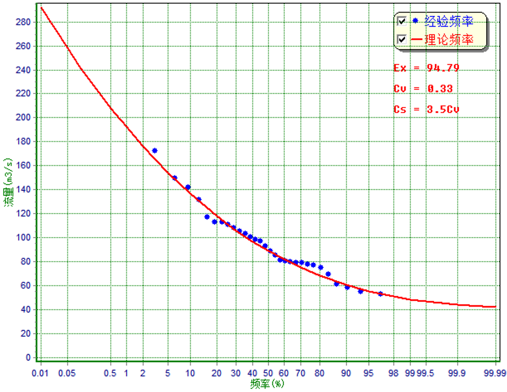

图6\.2\-1 P\-Ⅲ型拟合曲线

将参数代入公式（6\-3）、（6\-4）中：

表6\.2\-7 计算结果表

开采工况

降水渗入采坑水量QP（m3/d）

50a

20a

10a

开采至\+35m平台

121963\.69

106800\.28

94669\.55

开采至\+20m平台

112725\.27

98710\.45

87498\.59

开采至\+5m平台

105656\.67

92520\.67

82011\.86

开采至\+35m开采平台时：

设计暴雨频率为2%，相应重现期为50a一遇的暴雨情形下降水渗入采坑水量QP=692504\.04×0\.09479×（1\+2\.6×0\.33）=121963\.69m3/d；

设计暴雨频率为5%，相应重现期为20a一遇的暴雨情形下降水渗入采坑水量QP=692504\.04×0\.09479×（1\+1\.90×0\.33）=106800\.28m3/d；

设计暴雨频率为10%，相应重现期为10a一遇的暴雨情形下降水渗入采坑水量QP=692504\.04×0\.09479×（1\+1\.34×0\.33）=94669\.55m3/d；

开采至\+20m开采平台时：

设计暴雨频率为2%，相应重现期为50a一遇的暴雨情形下降水渗入采坑水量QP=640048\.75×0\.09479×（1\+2\.6×0\.33）=112725\.27m3/d；

设计暴雨频率为5%，相应重现期为20a一遇的暴雨情形下降水渗入采坑水量QP=640048\.75×0\.09479×（1\+1\.90×0\.33）=98710\.45m3/d；

设计暴雨频率为10%，相应重现期为10a一遇的暴雨情形下降水渗入采坑水量QP=640048\.75×0\.09479×（1\+1\.34×0\.33）=87498\.59m3/d；

开采至\+5m开采平台时：

设计暴雨频率为2%，相应重现期为50a一遇的暴雨情形下降水渗入采坑水量QP=599913\.55×0\.09479×（1\+2\.6×0\.33）=105656\.67m3/d；

设计暴雨频率为5%，相应重现期为20a一遇的暴雨情形下降水渗入采坑水量QP=599913\.55×0\.09479×（1\+1\.90×0\.33）=92520\.67m3/d；

设计暴雨频率为10%，相应重现期为10a一遇的暴雨情形下降水渗入采坑水量QP=599913\.55×0\.09479×（1\+1\.34×0\.33）=82011\.86m3/d。

### 露天采坑地下水涌水量的比拟计算

根据《矿坑涌水量预测计算规程》的要求，对于露天开采，开采下一个水平（或中段）时，采坑的地表境界面积和坑底境界面积可能有所变化，计算下一个开采水平（或中段）的矿坑地下水涌水量，可以利用以下公式：

                 （6\-5）

式中：

Q——下一个开采水平（或中段）采坑地下水涌水量，单位为立方米每天（m3/d）；

Q0——目前开采水平（或中段）采坑地下水涌水量，单位为立方米每天（m3/d）；

F——下一个开采水平（或中段）采坑坑底境界面积，单位为平方米（m2）；

F0——目前开采水平（或中段）采坑坑底境界面积，单位为平方米（m2）；

s——下一个开采水平（或中段）采坑地下水位降深，单位为米（m）；

s0——目前开采水平\(或中段）采坑地下水位降深，单位为米\(m）。

表6\.2\-8 参数取值表

类别

数值

备注

开采水平（或中段）采坑地下水涌水量Q0

23788\.88m3

根据近两年矿区抽水记录表统计的矿区\+50m开采水平的日均地下水涌水量

86529m3

根据近两年矿区抽水记录表统计的矿区\+50m开采水平的日最大地下水涌水量

开采水平（或中段）采坑坑底境界面积F

727940\.90m2

\+50m开采平台坑底底面积

692504\.04m2

\+35m开采平台坑底底面积

640048\.75m2

\+20m开采平台坑底底面积

599913\.55m2

\+5m开采平台坑底底面积

开采水平（或中段）采坑地下水位降深s

2\.895m

矿区水位疏干到\+50m开采平台的水位降深

22\.65m

矿区水位疏干到\+35m开采平台以下5m的水位降深（在开采的时候需要疏干水位到开采平台以下方便露天开采）

37\.65m

矿区水位疏干到\+20m开采平台以下5m的水位降深

52\.65m

矿区水位疏干到\+5m开采平台以下5m的水位降深

注：初始水位选取周边受矿区疏干影响较小的水井水位—52\.65m，矿区当前开采平台（\+50m）的水位为49\.755m。

将参数代入公式（6\-5）：

表6\.2\-9 计算结果表

开采工况

采坑地下水涌水量Q（m3/d）

平均值

最大值

开采至\+35m平台

64900\.34

236066\.63

开采至\+20m平台

80443\.46

292602\.72

开采至\+5m平台

92096\.95

334990\.79

开采至\+35m开采平台时：

日均采坑地下水涌水量=64900\.34m3/d

日最大采坑地下水涌水量=236066\.63m3/d

开采至\+20m开采平台时：

日均采坑地下水涌水量=80443\.46m3/d

日最大采坑地下水涌水量=292602\.72m3/d

开采至\+5m开采平台时：

日均采坑地下水涌水量=92096\.95m3/d

日最大采坑地下水涌水量=334990\.79m3/d

### 露天矿矿坑总涌水量

露天矿矿坑总涌水量=地表水汇入采坑水量（Q1）\+降水渗入采坑水量（Q2）\+露天采坑地下水涌水量（Q3）。

表6\.2\-10 露天矿矿坑总涌水量计算结果总表

类别

\+35m开采平台

\+20m开采平台

\+5m开采平台

地表水汇入采坑水量Q1\(m3/d\)

平均值（Q1\-平）

1050\.77

最大值（Q1\-大）

44570\.77

降水渗入采坑水量Q2\(m3/d\)

年（日）平均降水量（Q2\-平）

3836\.47

3545\.87

3323\.52

10a一遇暴雨（Q2\-10a）

94669\.55

87498\.59

82011\.86

20a一遇暴雨（Q2\-20a）

106800\.28

98710\.45

92520\.67

50a一遇暴雨（Q2\-50a）

121963\.69

112725\.27

105656\.67

露天采坑地下水涌水量Q3\(m3/d\)

平均值（Q3\-平）

64900\.34

80443\.46

92096\.95

最大值（Q3\-大）

236066\.63

292602\.72

334990\.79

露天矿矿坑总涌水量\(Q=Q1\+Q2\+Q3\)\(m3/d\)

平均值

Q1\-平\+Q2\-平\+Q3\-平

69787\.59

85040\.11

96471\.25

最大值

10a

Q1\-大\+Q2\-10a\+Q3\-大

375306\.95

424672\.08

461573\.42

20a

Q1\-大\+Q2\-20a\+Q3\-大

387437\.68

435883\.93

472082\.22

50a

Q1\-大\+Q2\-50a\+Q3\-大

402601\.08

449898\.76

485218\.22

综上，开采至\+35m开采平台时，平均总涌水量为69787\.59m3/d，在10a一遇的暴雨情形下的最大总涌水量为375306\.95m3/d，在20a一遇的暴雨情形下的最大总涌水量为387437\.68m3/d，在50a一遇的暴雨情形下的最大总涌水量为402601\.08m3/d；

开采至\+20m开采平台的平均总涌水量为85040\.11m3/d，在10a一遇暴雨情形下的最大总涌水量为424672\.08m3/d，在20a一遇的暴雨情形下的最大总涌水量为435883\.93m3/d，在50a一遇的暴雨情形下的最大总涌水量为449898\.76m3/d；

开采至\+5m开采平台的平均总涌水量为96471\.25m3/d，在10a一遇暴雨情形下的最大总涌水量为461573\.42m3/d，在20a一遇的暴雨情形下的最大总涌水量为472082\.22m3/d，在50a一遇的暴雨情形下的最大总涌水量为485218\.22m3/d。

## 解析法预测矿坑涌水量

### 计算公式的选取

对于矿区，在涌水过程中假定影响半径未延伸至边界，因此可将含水层视为侧向无限延伸。因此，矿坑充水模型可以概化为无限延展边界的“大井”。根据《矿坑涌水量预测计算规程》（DZ/T 0342\-2020），选取潜水非完整井裘布依公式计算涌水量。

                   （6\-6）

式中：Q——矿坑“大井”涌水量（m3/d）；K—含水层渗透系数（m/d）；H——潜水含水层厚度或静水位高度（m）；h——动水位时的含水层厚度（m）；L——过滤器长度（m）；S——降深（m）；R0——“大井”引用影响半径（m）；r0——“大井”引用—半径（m）。

根据矿区开采设计，本次计算预测3个开采中段的平均涌水量及最大涌水量，分别为\+35m、\+20m和\+5m。

### 水文地质参数的选取

（1）渗透系数K

在本次水文地质勘察中，共取得7个钻孔的渗透系数。经对比分析，SK9\-7钻孔的渗透系数与各孔渗透系数的平均值最为接近，且其所在位置及揭露的地层条件对矿区主要充水含水层具有较好的代表性。因此，在大井法计算中，选用SK9\-7的渗透系数作为矿区渗透性能的综合代表值。

（2）影响半径R

对于潜水含水层，影响半径采用库萨金经验公式进行计算。

                     （6\-7）

式中：R——计算影响半径（m）；S——降深（m）；H——含水层厚度（m）；K——渗透系数（m/d）。

对于大井法公式，把露天矿坑圈定的面积F作为该“大井”的面积。不同轮廓的大井，引用半径r0的计算方式也不同。“大井”的引用半径r0，在一般情况下其计算公式如下所示。

                 （6\-8）

式中：F为露天矿坑圈定的面积。

从稳定井流理论的实际应用出发，根据等效原则，将疏干量和补给量相平衡时出现的稳定流场，其边界用一个引用的圆形等效外边界进行概化，其与“大井”中心的水平距离称为引用影响半径，也被叫作补给半径，即R0=R\+r0。其中R为影响半径。

（3）计算参数总结

根据上述描述，本次解析法计算涌水量的具体计算参数如下表所示。

__表6\.3\-1 “大井法”计算参数表__

参数

开采至\+35m平台

开采至\+20m平台

开采至\+5m平台

渗透系数K（m/d）

3\.2635

3\.2635

3\.2635

动水位时的含水层厚度h（m）

144\.32

144\.32

144\.32

降深S（m）

19\.76

34\.76

49\.76

影响半径R\(m\)

1465\.45

2187\.45

2960\.80

开采面积F（m2）

692504\.04

640048\.75

599913\.55

引用影响半径r0（m）

470\.18

452\.02

437\.62

大井影响半径R0（m）

1384\.68

2132\.66

2942\.24

### 解析法预测矿坑涌水量结果

计算得到矿区的平均涌水量及最大涌水量如下表所示。根据矿区排水量监测数据，自2025年1月以来，矿区排水量为0m3/d~86529m3/d，平均值为23788\.88m3/d，最大排水量约为平均值的3\.637倍，因此本次计算以平均涌水量的3\.637倍计算最大涌水量。按照比拟法，露天矿矿坑总涌水量=地表水汇入采坑水量（Q1）\+降水渗入采坑水量（Q2）\+露天采坑地下水涌水量（Q3），因此解析法计算的涌水量还需加上地表水汇入采坑水量和降水渗入采坑水量，地表水汇入采坑水量和降水渗入采坑水量直接使用比拟法计算的数据。

__表6\.3\-2 利用解析法预测矿坑涌水量计算结果__

开采至\+35m平台

开采至\+20m平台

开采至\+5m平台

平均涌水量\(m3/d\)

39889\.01

53753\.27

66800\.60

最大涌水量\(m3/d\)

10a

284316\.67

327569\.99

369536\.43

20a

296447\.39

338781\.84

380045\.23

50a

311610\.80

352796\.67

393181\.23

综上，开采至\+35m开采平台时，平均总涌水量为39889\.01m3/d，在10a一遇的暴雨情形下的最大总涌水量为284316\.67m3/d，在20a一遇的暴雨情形下的最大总涌水量为296447\.39m3/d，在50a一遇的暴雨情形下的最大总涌水量为311610\.80m3/d；

开采至\+20m开采平台的平均总涌水量为53753\.27m3/d，在10a一遇暴雨情形下的最大总涌水量为327569\.99m3/d，在20a一遇的暴雨情形下的最大总涌水量为338781\.84m3/d，在50a一遇的暴雨情形下的最大总涌水量为352796\.67m3/d；

开采至\+5m开采平台的平均总涌水量为66800\.60m3/d，在10a一遇暴雨情形下的最大总涌水量为369536\.43m3/d，在20a一遇的暴雨情形下的最大总涌水量为380045\.23m3/d，在50a一遇的暴雨情形下的最大总涌水量为393181\.23m3/d。

## 数值法预测矿坑涌水量

通过对水文地质概念模型的分析，依据渗流连续性方程和达西定律，建立模拟区地下水系统水文地质概念模型相对应的三维非稳定流数学模型：

，

，

，

式中，__Ω__：地下水渗流区域，量纲：L2；

H0：初始地下水位，量纲：L；

H1：指定水位，量纲：L；

S1：第一类边界；

S2：第二类边界；

μs：单位储水系数，量纲：L\-1；

Kxx，Kyy，Kzz：分别为x、y、z主方向的渗透系数，量纲：LT\-1；

w：源汇项，包括蒸发，降雨入渗补给，井的抽水量，量纲：T\-1；

q\(x，y，z，t\)：表示在边界不同位置上不同时间的流量，量纲：L3T\-1；

：表示水力梯度在边界法线上的分量。

上述数学控制方程的求解平台采用DHI\-WASY公司开发的基于有限单元法的FEFLOW\(Finite Element subsurface FLOW system\)软件。

自20世纪70年代问世以来，FEFLOW经过不断的发展已成为世界上功能最齐全、技术最先进的交互式三维地下水模拟分析软件。广泛应用于地下水及渗流介质的二维、三维流量、溶质运移、热传递、变密度及变饱和模拟。

### 初始网格及地质模型

基于FEFLOW平台，输入模拟区域矢量数据并转化为supermesh结构，利用Advancing Front剖分方法，将区域离散为不规则三角剖分网格，剖分过程严格遵循Delaunay法则，使三角网格内的三角形内角角度为锐角，三边长度尽量相等，三角形网中任一三角形的外接圆范围内不会有其他点存在，在散点集可能形成的三角剖分中，Delaunay三角剖分所形成的三角形的最小角最大。

二维剖分结果如图6\.4\-1所示，其中结点数5069个，有限单元数9765个。

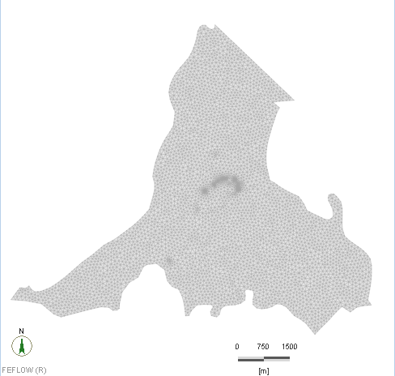

图6\.4\-1 模拟区二维剖分网格图

地质概化模型共分为三层（layer）四片（slice）。模拟区地面高程数据采用测绘数据，利用ESRI公司的ArcGIS软件处理得到。其他各片高程根据相关地质资料，利用克里金插值法得到各片高程，输入FEFLOW后得到评价区三维地质模型，如图6\.4\-2所示，其中结点数20276个，有限单元数29295个。

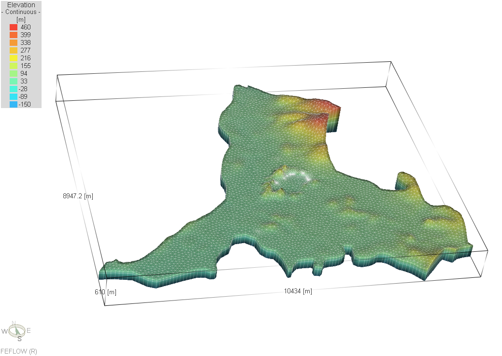

图6\.4\-2 模拟区三维模型结构图

### 边界条件及初始参数

边界条件的概化是建立水文地质数值模型的一项复杂而重要的基础工作，边界条件处理的正确与否，直接关系到是否能够真实地刻画地下水渗流场。概化的关键内容就是边界的性质（类型）和边界条件的控制程度。根据前述水文地质概念模型结合已有各类水文地质资料，确定本次模拟评价区边界条件如下：

四周边界：

南部边界：天然条件下地下水向南部渔涝河排泄，模型中概化为给定水头边界。

北部：零通量边界。

南部、东侧边界：隔水边界。

上边界为降水补给、蒸发。

下边界等效定义为相对隔水边界。

本次模拟工作所用到的初始水文地质参数主要依据水文地质勘查成果，其中溶裂隙强发育段降雨量赋值参考比拟法，降水渗入采坑水量计算中的年（日）均降水量为5\.54mm，水文地质初始参数取值详见表6\.4\-1。

表6\.4\-1 模拟区水文地质初始参数取值表

__参数__

__第四系残坡积层粉质粘土层__

__（富水性弱）__

__石炭系下统刘家塘组（C1lj）岩溶裂隙强发育段__

__（富水性强）__

Kxx（m/d）

0\.04

2\.68

Kyy（m/d）

0\.04

2\.68

Kzz（m/d）

0\.004

0\.268

给水度

0\.03

0\.11

降雨入渗系数

0\.15

/

### 识别验证与初始条件

数值法求解地下水非稳定流动问题需要给出初始条件，即每个结点在计算初始时刻的水头，作为后续计算的初始流场。而对于网格剖分后形成的如此庞大数目的结点，实际的水位观测数据显然无法满足。因此，需要采取一定的处理技术来获取模拟对象的地下水初始流场。

通常的处理方法是利用已知水位点通过插值算法来获取各结点水头值，但因厂区可以利用的实际观测点少，采取该方法后获取的初始水位并不尽如意，个别观测孔水位在模拟初期即出现陡升陡降的情况。究其原因，一方面固然是插值结果只是对实际水位的近似趋近而非等价，另一方面是插值结果无法表征一定范围内的非均质性。为改变这种状况，本次预测中初始流场采取的技术方法是将模拟区参数分区及初始参数取值表输入模型，经过稳定流计算得到模拟区稳定流条件下的天然流场，然后根据实际观测水位对天然流场进行参数拟合，以验证此流场能否全面、客观地表征模拟区实际的水文地质条件和特征。将模拟水位值与8个水位实测值（见图6\.4\-3）进行拟合分析，可以看到8个拟合点基本均匀分布在标准线附近，反映了模拟结果与实际测量值拟合情况较好，初始流场水位拟合折线图也反映了模拟值与实际值总体变化规律的一致性。

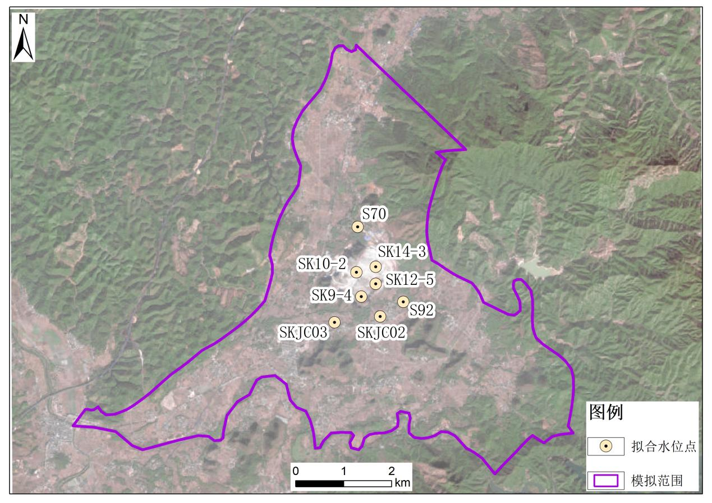

图6\.4\-3 观测点分布图

1、识别结果

识别后的参数见表6\.4\-2，水位拟合情况如图6\.4\-4所示。

表6\.4\-2 参数取值表

__参数__

__第四系残坡积层粉质粘土层__

__（富水性弱）__

__石炭系下统刘家塘组（C1lj）岩溶裂隙强发育段__

__（富水性强）__

Kxx（m/d）

0\.05

3\.26

Kyy（m/d）

0\.05

3\.26

Kzz（m/d）

0\.005

0\.326

给水度

0\.05

0\.12

降雨入渗系数

0\.1

/

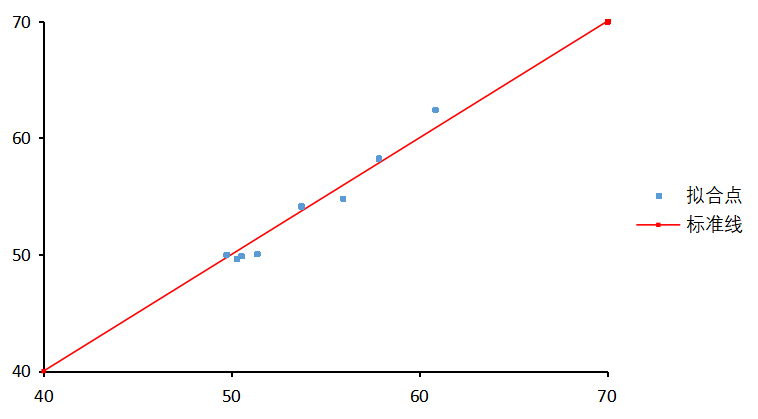

（1）天然流场水位实测点与拟合散点分布图

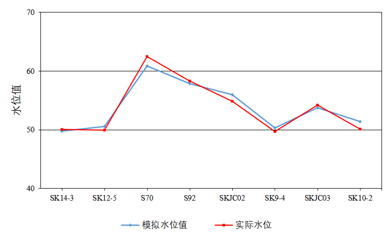

（2）天然流场水位拟合折线图

图6\.4\-4 天然流场水位拟合图

2、验证结果

验证后的水位动态如图6\.4\-4所示，随着时间变化水位逐渐趋于稳定，模型中地下水动态变化较小，模拟结果可信。

通过以上技术工作，经过识别验证后的、可作为初始条件的地下水流场如图6\.4\-5所示，基本符合实际水文地质条件，基本反映了地下水流系统的流场特征，可以此为基础开展后续工作。

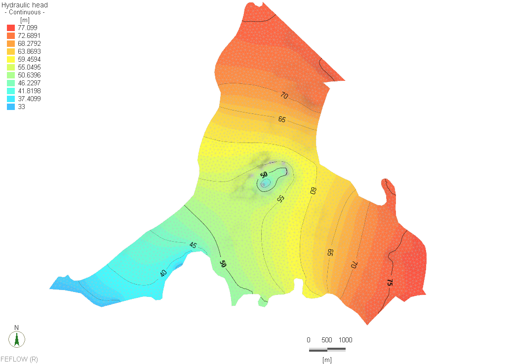

图6\.4\-5 模拟区天然条件下初始流场模拟结果图

### 数值法预测矿坑涌水量结果

本次利用数值法开展矿坑涌水量预测，以基于实际钻孔资料构建的三维地质结构模型为核心基础，在对该基础模型进行系统识别、验证与校准后，所建立的三维数值模型基本符合矿段实际水文地质条件，能够较好地反映矿区地下水运动规律及赋存特征，具有可靠性。基于此，本次构建的三维水文地质数值模型可用于预测未来开采工况下地下水的动态变化特征。本次预测工作针对\+35m、\+20m、\+5m三个设计开采中段，开展矿坑涌水量预测。本次预测预设开采条件严格贴合矿段实际设计方案，具体设定如下：以开采境界终了线为依据，将矿坑的空间展布特征（埋深及形态）在数值模型中完成精准三维概化，确保模型与实际开采场景高度一致；预测时段明确为地下水系统从天然初始平衡状态，逐步过渡至开采扰动影响下的稳态平衡状态，以此保障预测成果的实用性与针对性。

根据矿区排水量监测数据，自2025年1月以来，矿区排水量为0m3/d~86529m3/d，平均值为23788\.88m3/d，最大排水量约为平均值的3\.637倍，因此本次计算以平均涌水量的3\.637倍计算最大涌水量。

模型概化时充分考虑各类充水水源的影响：将大气降水作为间接充水水源，通过降水入渗系数分区量化其入渗贡献；矿区内地表水系无直接充水作用；矿区内无规模老空水积水。因此数值法得到的涌水量无地表水汇入采坑水量，主要为露天采坑地下水涌水量和降水渗入采坑水量。

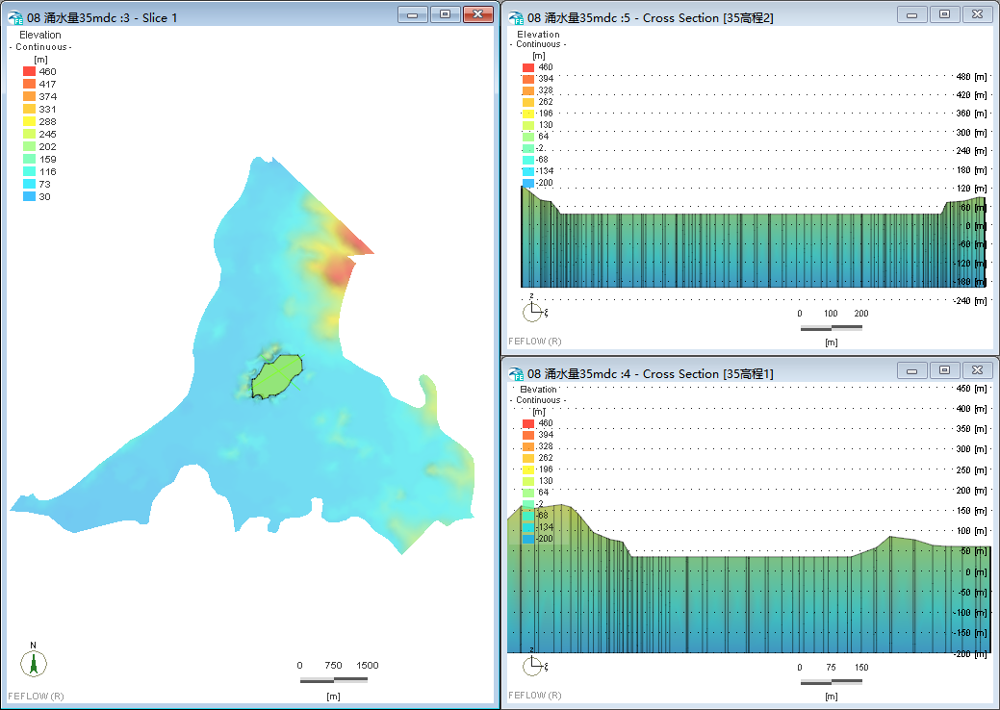  
图6\.4\-6 开采终了线\+35m地质结构

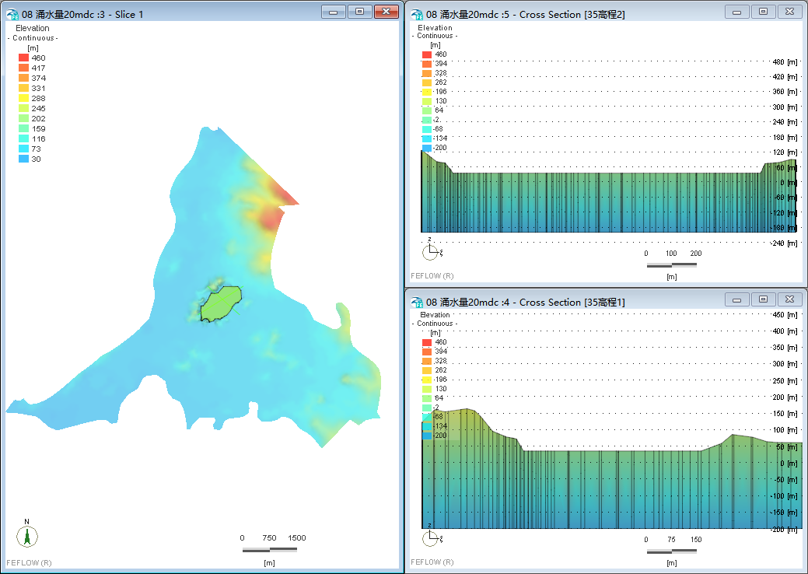  
图6\.4\-7 开采终了线\+20m地质结构

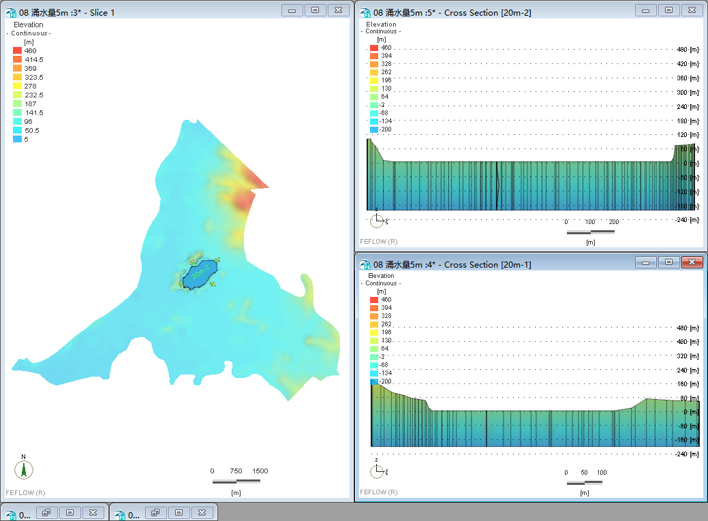  
图6\.4\-8 开采终了线\+5m地质结构

表6\.4\-3 平台坑底面积和水位降深

类别

数值

备注

开采水平（或中段）采坑地下水涌水量Q0

23788\.88m3

根据近两年矿区抽水记录表统计的矿区\+50m开采水平的日均地下水涌水量

86529m3

根据近两年矿区抽水记录表统计的矿区\+50m开采水平的日最大地下水涌水量

开采水平（或中段）采坑坑底境界面积F

727940\.90m2

\+50m开采平台坑底底面积

692504\.04m2

\+35m开采平台坑底底面积

640048\.75m2

\+20m开采平台坑底底面积

599913\.55m2

\+5m开采平台坑底底面积

开采水平（或中段）采坑地下水位降深s

2\.895m

矿区水位疏干到\+50m开采平台的水位降深

22\.65m

矿区水位疏干到\+35m开采平台以下5m的水位降深（在开采的时候需要疏干水位到开采平台以下方便露天开采）

37\.65m

矿区水位疏干到\+20m开采平台以下5m的水位降深

52\.65m

矿区水位疏干到\+5m开采平台以下5m的水位降深

各开采水平正常涌水量及最大涌水量计算成果详见表6\.4\-4。

表6\.4\-4 数值法计算正常涌水量及最大涌水量

开采平台（m）

正常涌水量Q\(m3/d\)

最大涌水量\(m3/d\)

\+35

37465

136260\.68

\+20

51345

186741\.77

\+5m

64373

234124\.60

同样将模拟结果与实际矿井排水量监测数据进行对比，自2025年1月以来，矿区排水量为0m3/d~86529m3/d，平均值为23788\.88m3/d，其反映了\+50m开采水平下的涌水量情况，可以看出利用数值法计算得到的\+50m正常涌水量（21365m3/d）与实际涌水量也相对一致，表述模型计算结果可靠。通过分析数值法对矿坑涌水量的预测结果可以看出，矿段涌水量在空间分布上的变化情况，具体表现为\+50m正常涌水量为21365m3/d；至\+35m增至37465m3/d，这一差异主要源于含水层岩溶裂隙更为发育、渗透性更强，矿坑为露天开采，直接接受大气降水入渗与侧向径流补给，形成开放的补径排系统；从\+50m至\+35m涌水量增长幅度达75\.4%，反映该区域浅至中部含水层系统对疏干排水响应敏感，影响范围随开采深度扩大而显著扩展，而涌水量则随开采深度增加呈现下降趋势，正常涌水量从\+35m的37465m3/d增至\+20m的51345m3/d，整体增幅约37%，在\+20m的51345m3/d增至\+5m的64373m3/d，整体增幅约25\.4%，至\+5m段增长速率趋缓，这一方面是由于深部岩溶发育程度减弱，同时也与\+5m水平设计开采面积显著缩小有关。对于不同开采水平条件，露天开采涌水量整体随开采深度增加呈逐渐下降趋势。

## 预测成果分析

综合水文地质比拟法、解析法和数值法预测结果，本次矿坑涌水量预测主要得出以下结论：

（1）综合考虑三种方法的适用条件及本工程的实际水文地质特点，从工程安全角度出发，涌水量预测结果应取三者中的较大值作为设计依据，以保障后续降水或供水系统具备足够的安全裕度，确保工程运行安全可靠。三种方法中，比拟法所得预测值最大，故本次采用比拟法结果作为最终设计涌水量。比拟法基于相似矿区实际开采过程中的实测涌水量数据，通过构建水文地质条件相似性指标进行类比推算，其数据来源真实可靠，能够综合反映实际开采状态下的水文地质响应特征，包括含水层非均质性、局部优势通道等理论概化难以完全捕捉的不利因素。相比之下，解析法与数值法虽规律揭示清晰、理论严谨，但均基于一定程度的地质概化或参数赋值，结果偏向理论均值或理想工况。因此，取三者最大值的比拟法结果，实质上是采用实测统计规律覆盖理论计算的不确定区间，既符合工程风险预控原则，又为不可预见的水文地质异常预留了充足的安全储备，是保障工程降水或供水系统安全冗余的合理选择。

（2）各中段开采时的具体涌水量预测结果如下：

开采至\+35m开采平台时，平均总涌水量为69787\.59m3/d；遭遇10年一遇暴雨时，最大总涌水量为375306\.95m3/d；20年一遇暴雨情形下，最大总涌水量为387437\.68m3/d；50年一遇暴雨时，最大总涌水量则为402601\.08m3/d。

开采至\+20m开采平台时，平均总涌水量为85040\.11m3/d；10年一遇暴雨下的最大总涌水量为424672\.08m3/d；20年一遇暴雨时为435883\.93m3/d；50年一遇暴雨时则为449898\.76m3/d。

开采至\+5m开采平台时，平均总涌水量为96471\.25m3/d；10年一遇暴雨下的最大总涌水量为461573\.42m3/d；20年一遇暴雨时为472082\.22m3/d；50年一遇暴雨时则为485218\.22m3/d。

上述预测结果表明，随着矿区开采深度增加，涌水量总体呈上升趋势，从\+35m至\+20m，比拟法预测的涌水量平均值增长21\.85%，从\+20m开采至\+5m时，比拟法结果增长13\.44%，表明该区域含水层系统对疏干排水响应强烈；且暴雨条件下的最大涌水量远高于正常涌水量，这是矿区防治水工作需重点关注的关键控制工况。

# 工程地质与地质环境条件

## 工程地质条件

### 工程地质岩组的划分

根据矿区内各岩组的工程地质特性、物质成分及其组合关系分析，根据岩石试验结果（表7\.1\-1：岩石力学测试结果统计表）及结合以往本地区同类岩石试验结果经验，依据《工程岩体分级标准》（GB 50218\-94）及《矿区水文地质工程地质勘查规范》（GB/T 12719\-2021），可将矿区内的工程地质岩组划分为两类，即松散岩组和坚硬岩组。现将矿区各类岩组的描述如下：

#### 松散岩组

该岩组主要由第四系残坡积（Qedl）层，黄褐、浅黄、褐红色含砂岩等岩石碎块的砂质粘土、砾质粘土、粘土、砂砾等组成，属松散岩类工程地质岩组，分布广泛，覆盖层平均厚度为5\.80m，最小厚度为0\.50m，最大厚度为18\.50m。该层结构松散，力学强度低，工程力学性质差。

#### 坚硬岩组

该岩组出露地层为石炭系下统刘家塘组（C1*lj*）碳酸盐岩，为本矿区的矿体，主要为灰岩、白云质灰岩，岩石坚硬，岩体较完整，其岩石力学强度较高。

依据《工程岩体分级标准》（GB 50218\-94）第3\.4\.2节、4\.1\.1节，岩石的坚硬程度属于坚硬~较坚硬岩，岩体的完整程度属于完整~较完整，岩体基本质量等级属于Ⅱ类岩。其软化系数为0\.76~0\.88，平均值为0\.83，属于不软化岩，抗剪强度高、致密、坚硬，为稳定性强的工程地质体。局部地段岩溶裂隙较发育，存在有溶蚀形成的溶洞、土洞等现象，易发生地陷等情况。

### 岩土分层及其特征

根据本次施工钻孔揭露的土层，并结合项目范围内已有的矿山详细勘查资料，矿区内岩土层根据成因、地质年代、岩性和工程特性等可分为第四系残坡积层和石炭系下统刘家塘组（C1*lj*）碳酸盐岩，各岩土层的分布如下：

#### 第四系残坡积层\(Qedl\)

粉质粘土：黄褐、褐红色，可塑，稍湿，稍密，主要有粘粉粒、次为砂砾组成，稍有光泽，干强度中等、韧性中等，顶部0\.50m为根植土，0\.00\-1\.10m含较多砂砾石，含量约10\-15%，底部为粉质粘土，遇水具粘性，整个矿区均有分布，详细分布特征见钻孔柱状图。根据矿山详勘钻孔资料统计，第四系覆盖层平均厚度为5\.80m，最小厚度为0\.50m，最大厚度为15\.8m。

#### 石炭系下统刘家塘组（C1*lj*）基岩

矿区基岩主要为石炭系下统刘家塘组（C1*lj*）碳酸盐岩，主要为灰岩、白云质灰岩。本层取岩样8件，其天然、饱和、干燥状态下的抗压强度平均值分别为77\.1MPa、66\.6MPa、88\.0MPa；抗剪切强度凝聚力平均值为11\.85MPa，内摩擦角平均值为45\.41°；抗拉强度平均值为4\.37MPa。根据岩石的抗压（饱和、天然、干燥）、抗拉、抗剪试验结果，依据《工程岩体分级标准》（GB 50218\-94）第3\.4\.2节、4\.1\.1节，岩石的坚硬程度属于坚硬~较坚硬岩，岩体的完整程度属于完整~较完整，岩体基本质量等级属于Ⅱ类岩。其软化系数为0\.76~0\.88，平均值为0\.83，属于不软化岩，抗剪强度高、致密、坚硬，为稳定性强的工程地质体。详细试验结果及其力学参数特征见表7\.1\-1。

表7\.1\-1 矿区岩石主要物理力学指标一览表

序号

检测编号

样品原号

块体密度

吸水率

单轴抗压强度

软化系数

抗拉强度

抗剪强度（直剪试验）

单轴压缩变形

g/cm3

%

MPa

\\

MPa

凝聚力（MPa）

内摩擦角  
（°）

弹性模量  
（×104MPa）

泊松比

天然

干燥

饱和

饱和

天然

饱和

1

TG260130001

YS1

2\.71 

0\.29

77\.3

80\.3

70\.4

0\.88

4\.17

12\.5

43\.9

4\.02

0\.25

2

TG260130002

YS2

2\.71 

0\.13

67\.7

72\.8

57\.8

0\.79

5\.25

10\.1

44\.9

3\.87

0\.28

3

TG260130003

YS3

2\.69 

0\.21

73\.8

76\.3

60\.7

0\.80

4\.81

11\.1

46\.7

3\.94

0\.27

4

TG260130004

YS4

2\.70 

0\.16

55\.2

60\.0

45\.7

0\.76

5\.02

9\.41

43\.2

3\.58

0\.31

5

TG260130005

YS5

2\.71 

0\.17

101

103

86\.2

0\.84

4\.21

15\.4

45\.2

4\.78

0\.22

6

TG260130006

YS6

2\.72 

0\.22

80\.2

81\.7

69\.2

0\.85

3\.48

11\.5

45\.2

4\.21

0\.23

7

TG260130007

YS7

2\.72 

0\.13

96\.5

98\.5

85\.0

0\.86

4\.21

15\.0

47\.4

4\.92

0\.21

8

TG260130008

YS8

2\.75 

0\.16

65\.2

68\.0

58\.0

0\.85

3\.84

9\.77

46\.8

3\.90

0\.26

### 露采边坡稳定性分析

岩质边坡：矿区范围内主要为碳酸盐岩岩体，岩体质量总体较好，矿区岩溶作用相对较弱，未出现岩溶塌陷现象。矿区已开采多年，基岩裸露，人工开采山体坡度为50º~70º。

通过对出露边坡的观察，矿区原生结构面主要为岩层面以及节理面。石灰岩矿床赋存在石炭系下统刘家塘组第二段（C1*lj*2）地层中，岩性为浅灰~灰色、局部浅灰白色或浅灰黑色中~厚层状灰岩局部夹透镜状白云质灰岩、白云岩等，工程地质性质较好，岩层面为硬性结构面，层间结合力较强。矿床底板地层为刘家塘组第一段（C1*lj*1）的白云质灰岩及灰岩、白云岩等。工程地质性质较好，岩层面为硬性结构面，层间结合力较强。

矿区为一向北西倾斜的单斜构造，岩层总体走向为北东40°~80°，倾向310°~350°，倾角12°~25°。大部分地段产状变化不大，但沿走向局部呈微波浪状起伏，隆起处岩层倾向有较大的变化。

矿区内主要发育三组节理，第一组：北东走向节理，总体走向NE10~30°，倾向280°~300°，倾角32°~56°，不同地段其产状有所变化。节理一般0\.20~3m可见1条，有时稀疏，延长>50m或更长，延深<50m，节理面平直、紧闭无充填；第二组：南东走向节理，以SE140°~150°走向为主，倾向50°~60°，有时反倾为230°~240°，倾角38°~62°不等，约0\.30~5m左右可见1条，延长、延深一般较大，延长个别可达百多米，局部节理上部有张开溶蚀现象，并充填有土黄色含岩石碎块粘土；第三组：南东走向节理，以SE100°~120°走向多见，倾向10°~30°，倾角一般55°~75°，多呈不均匀稀疏分布，延长、延深一般>50m，节理面一般平直无充填。

节理面局部较陡，节理面一般平直无充填，局部节理上部有张开溶蚀现象，并充填有土黄色含岩石碎块粘土，节理结构面切割矿体，降低了岩石的稳定性，特别是向深部发育的近于陡立的裂隙，矿床在开采时易垮落，对矿区工程地质有一定影响。

根据以往收集的地质资料，结合本次现场调查，矿区出露地层和岩性较为单一，主要是石炭系下统刘家塘组（C1*lj*）中~厚层状灰岩局部夹透镜状白云质灰岩、白云岩，采区无大规模的地质构造通过。总体上，矿区岩性变化不大，受到的区域地质构造作用的影响差异性不大。

综合考虑，本采区全区定1个工程地质分区。

在同一工程地质分区内，边坡几何要素和坡面产状基本一致并能采用同一的剖面和相同的计算参数来表征的区段定为同一个边坡分区。

综合考虑矿山现状边坡位置、坡向、坡高及工程地质岩组等多种因素，拟将采场边坡划分为3个区，各区编号分别为Ⅰ区（矿区南部，南侧边坡）、Ⅱ区（矿区西部和西北部，西侧边坡和西北侧边坡）、Ⅲ区（矿区东部和东北部，东侧边坡和东北侧边坡）。其中I区对应的典型剖面为A\-A’剖面和B\-B’剖面，II区的典型剖面为C\-C’剖面，III区的典型剖面为D\-D’剖面，共计4条代表性剖面。各边坡分区工程地质剖面图见图7\.1\-1~图7\.1\-5。各区对应分析剖面详见表7\.1\-2。

分析仅对矿区红线范围内的边坡进行稳定性计算，未包含红线范围外民采遗留下的边坡，采场现状图见图7\.1\-1。

表7\.1\-2 边坡分区表

边坡分区编号

分区剖面

分区位置

边坡

坡向

边坡最大

高度（m）

整体边坡角（°）

陡坡区域边坡角（°）

分区工程地质岩组

Ⅰ区

A\-A＇

南部

67°

153

40\.8

53\.9

较坚硬~坚硬

碳酸盐岩岩性组

B\-B＇

南部

20°

179

47\.0

56\.3

较坚硬~坚硬

碳酸盐岩岩性组

Ⅱ区

C\-C＇

西部和西北部

117°

150

43\.6

56\.5

较坚硬~坚硬

碳酸盐岩岩性组

Ⅲ区

D\-D＇

东部和东北部

297°

47

34\.5

50\.9

较坚硬~坚硬

碳酸盐岩岩性组

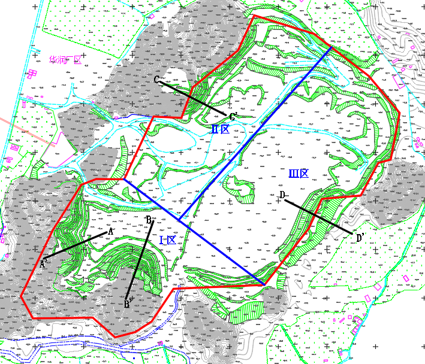

图7\.1\-1 现状边坡分区及剖面分布图

#### A\-A’剖面

A\-A’剖面边坡位于矿区西南部的I区，人工边坡总高度为120m，台阶高度10m和15m，台阶坡度58~77°不等，现状边坡帮坡角为52\.6°，边坡倾向67°，岩层产状324°∠16°，为逆向坡，边坡岩组为微风化灰岩。台阶坡率与高度较设计值偏大。

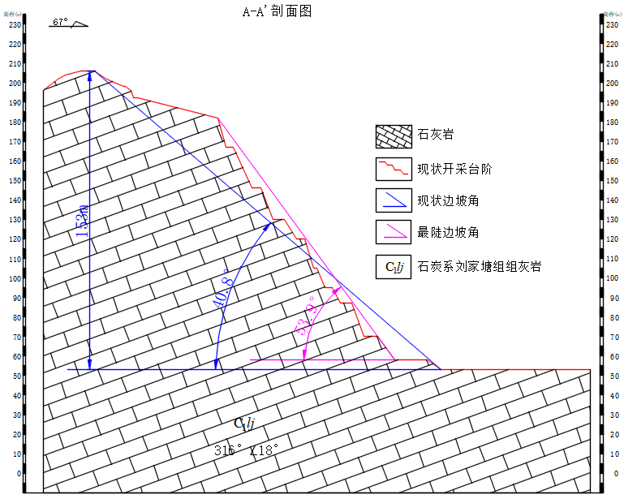

图7\.1\-2  A\-A’剖面图

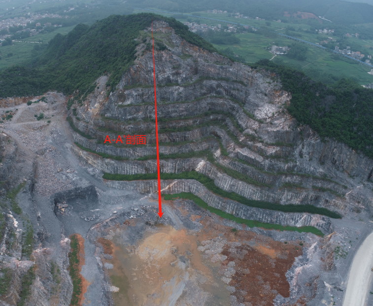

图7\.1\-3  A\-A’剖面现状图

#### B\-B’剖面

B\-B’剖面边坡位于矿区西南部的I区，该边坡第一级台阶宽度约30m，该平台宽度对计量整体坡脚误差较大，因此，边坡高度和坡度从第二级台阶底部算起。人工边坡总高度为166m，台阶高度10m、15m和20m，台阶坡度60~80°不等，现状边坡帮坡角为56\.5°，边坡倾向20°，岩层产状324°∠16°，为逆向坡，边坡岩组为微风化灰岩。

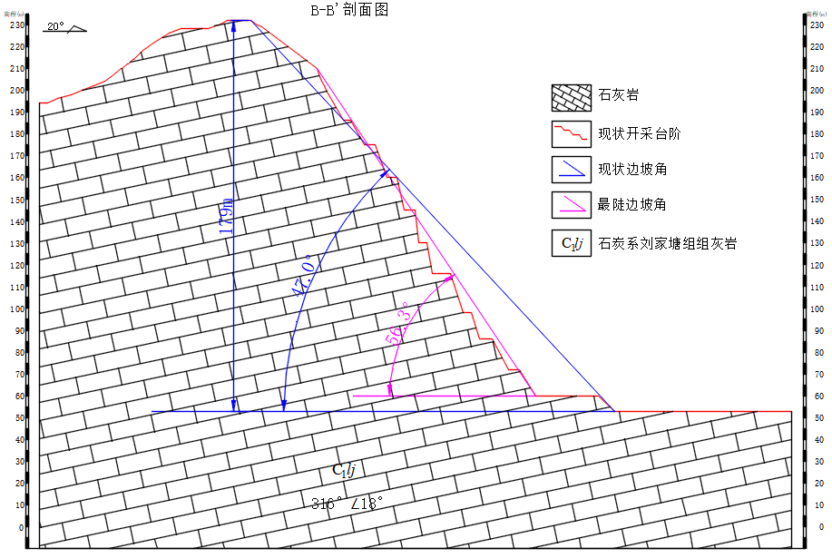

图7\.1\-4  B\-B’剖面图

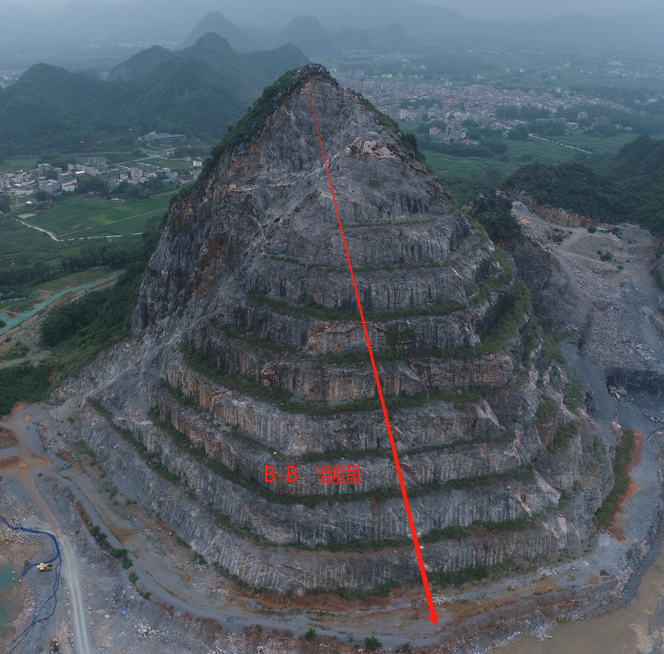

图7\.1\-5  B\-B’剖面现状图

#### C\-C’剖面

C\-C’剖面位于矿区中部II区，人工边坡总高度为130m，台阶高度10m、15m和20m，台阶坡度63~86°不等，现状边坡帮坡角为54\.4°，边坡倾向117°，岩层产状324°∠16°，为逆向坡，边坡岩组为微风化灰岩。

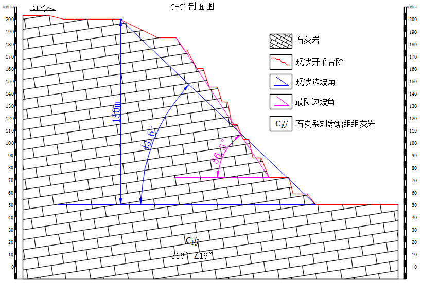

图7\.1\-6  C\-C’剖面图

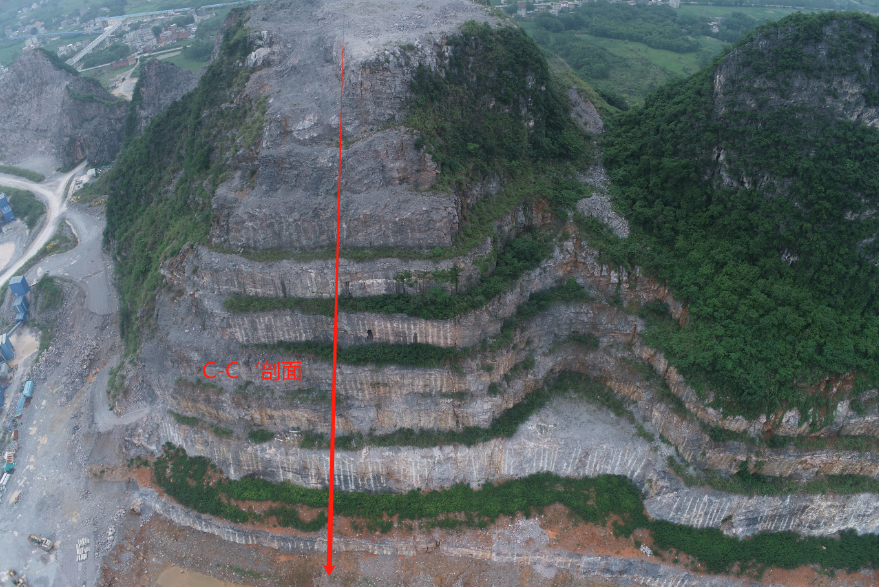

图7\.1\-7 C\-C’剖面现状图

#### D\-D’剖面

D\-D’剖面位于矿区北部III区，该边坡第一级台阶宽度约21m，该平台宽度对计量整体坡脚误差较大，因此，边坡高度和坡度从第二级台阶底部算起。人工边坡总高度为163m，台阶高度15m、20m和25m，台阶坡度68~86°不等，现状边坡帮坡角为65\.3°，为矿区最陡边坡，边坡倾向210°，岩层产状324°∠16°，为逆向坡，边坡岩组为微风化灰岩。该边坡的东侧面为颁发采矿证前期历史遗留的边坡，该坡一坡到底，无规范开采台阶，坡高约123m，坡度约60°，见剖面图和图片。目前该山峰形成“半边山、一面墙”，安全隐患较大。

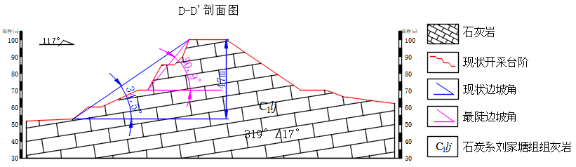

图7\.1\-8  D\-D’剖面图

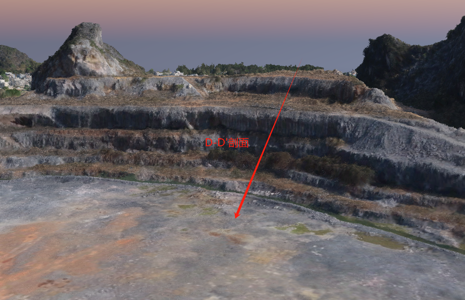

图7\.1\-9  D\-D’剖面现状图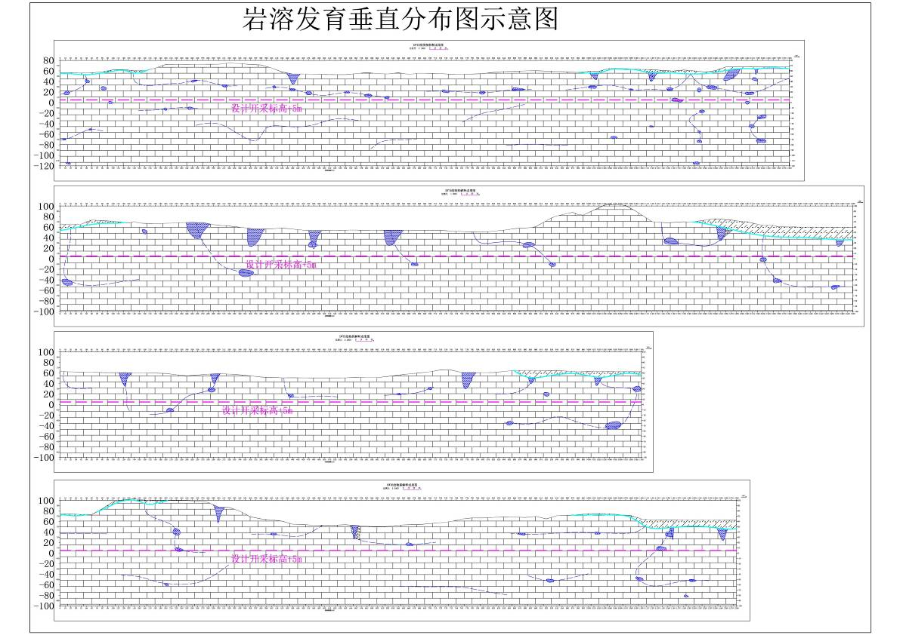

### 工程地质问题预测与分析

矿体开采时可能遇到的工程地质问题主要有岩溶地面塌陷、地面变形、矿坑突水（突泥）、采场边坡崩塌/滑坡等问题。

#### 岩溶地面塌陷

矿区上覆土层厚度一般在0\.50~15\.80m，发生岩溶塌陷的机会较大；强烈的地下水运动，形成降落漏斗，增加了岩溶塌陷的可能性；大量抽排地下水，水动力条件的急剧变化，使岩土体应力平衡发生变化，从而诱发岩溶地面塌陷。

岩溶地面塌陷表现的形式主要有塌陷坑、地裂隙、房屋地面变形等，主要对道路、居民、民房、矿山生产设备及人员、果园和农作物造成影响。

为了解岩溶发育区及周边地区地下水位下降情况，宜在岩溶发育区及周边地区建立地下水和地面变形长期监测网络系统，以便及时掌握勘察区地下水位下降情况，及时指导和预测地面沉降变形或岩溶塌陷的发生趋势，以便提前采取预防措施。

#### 地表变形

当地下水被大量开采（或超量开采）时，可引起地下水位连续大幅度下降，在一定范围内形成漏斗区，这就改变了地下水的径流状态，使水力坡度和水流速度增大，水流对二元结构土层中的疏松细粒产生冲刷潜蚀掏空作用，由于矿山持续地进行地下水的抽取，这将加速及促进地面变形的产生。降水、地表水入渗对地面变形形成及显露于地表的作用，地面变形多发生在大雨、暴雨之后，降水和地表水的入渗、冲刷、潜蚀加速了地面变形的形成和地表显现。

地面变形危害对象为地面人员、民房和财产损失。

地表变形防治的方法主要在于减弱第四系含水层与基岩裂隙溶洞水之间、基岩裂隙溶洞水与矿体采空排水之间的连通性。同时要做好对地裂区进行监测预测，通过对地面勘查、地形变形测量、地裂位移等方法监测地裂活动情况，预测、预报地裂缝发展方向、速率及可能的危害范围。

#### 矿坑突水（突泥）

矿体开采时遇见较大封闭型溶洞或连通性较强涌水量较大的岩溶通道时，开采过程中易发生矿坑突水（突泥）问题。

矿坑突水（突泥）主要影响矿坑中开采人员的生命安全及对开采设备的影响。一旦发生突水或矿区地下水位大幅度降低，同时也会引起建筑物变形，地面大量漏水等迹象。

采矿过程中要积极预防矿坑突水的发生，应及时派出专业人员前往巡查，并及时采取预防措施。开采过程中，施工人员必须高度注意采掘面的透水预兆，发现问题及时处置，防止溶洞的突然涌水，杜绝透水事故的发生；对地下岩溶通道进行局部注浆或帷幕灌浆处理，减少外围地段地下水位下降幅度，对地下水涌水口进行封堵。

#### 采场边坡崩塌/滑坡

为了防止崩塌/滑坡事故发生，应该对露天采场边坡采取以下安全防护措施：

（1）矿山今后生产过程中，剥离台阶和工作台阶参数严格按设计要求进行。结束一个水平台阶开采时，应按设计要求检查台阶高度和坡面角；临近最终边坡的采掘作业，必须按设计的宽度，预留安全平台和清扫平台，保持阶段坡面角，不得超挖坡底。岩层破碎带或稳定性差的岩层应采取支护措施。

（2）在最终边坡附近，爆破必须采用控制或减震措施，严格控制一次爆破的炸药量。

（3）如果遇到可能崩塌/滑坡区域，必须坚持“先排险后作业”，不能立即处理的，应划定危险区、设立警示标志，撤出相关人员，待制定出安全可行的施工方案后再采取措施。

（4）边坡安全管理小组应切实负起责任，要定期定时加强安全检查与观测，专人负责，并建立技术档案，加强边坡的监控和维护管理工作。人工监测应每月不少于1次，在雨季应每半月进行一次。出现等速变形时，应每周不少于1次；加速变形时应每日进行监测。在大雨和地震过后由矿山安全技术人员对边坡进行检查监测，确定安全后方可复工。

（5）完善采场周围、场内台阶以及道路、堆石场附近的防洪排水设施，定期检查，及时疏通排水沟，防止地表径流冲刷边坡、坡面和路面，防止因暴雨而造成滑坡、塌方和淤塞采场。

（6）矿区存在台风强降水天气，应及时做好台风强降水可能带来的各种地质灾害预防措施，对各种构建筑及时修复和加固，并通知场内人员做好各种准备及应急工作。

（7）做好边坡稳定的监测工作，做好监测记录，并定时对记录进行分析，目前矿区开采边坡高度已达179m，应该每年进行一次边坡稳定性分析。当采场边坡形成最终边坡时，应根据最终边坡的稳定类型、分区特点确定各区监测级别。对存在不稳定的最终边坡应长期监测，发现问题及时处理。在建立健全一系列的边坡管理和检查制度的情况下，可有效地减少边坡的稳定性对安全生产可能构成的隐患。

矿山在今后的生产过程中，除了严格按设计规定的各项参数进行开采外，还应加强边坡管理和制定边坡安全防范措施和事故应急预案，认真贯彻落实设计和安全预评价报告提出的各项安全措施，确保采场边坡的稳定。

综上所述，矿区岩石的坚硬程度属于坚硬~较坚硬岩，岩体的完整程度属于完整~较完整，岩体基本质量等级属于Ⅱ类岩。其软化系数为0\.76~0\.88，平均值为0\.83，属于不软化岩，抗剪强度高、致密、为稳定性强的工程地质体。局部地段岩溶裂隙较发育，存在有溶蚀形成的溶洞、土洞等现象，易发生地陷等情况。矿体开采时有可能遇到的工程地质问题主要有岩溶地面塌陷、地面变形、矿坑突水（突泥）、采场边坡崩塌/滑坡等问题。因此，本矿床为工程地质条件中等的矿床。

### 矿区工程地质勘查类型

大旺塘矿区位于河儿口盆地北端，原始地形为孤立的峰丛地貌，四周多为悬崖峭壁，现已开采形成\+50m平台，未来凹陷开采区最低标高\+5m。矿区出露及开采地层为石炭系刘家塘组（C1*lj*）灰岩，坚硬程度属于坚硬～较坚硬岩，岩体的完整程度属于完整～较完整，抗剪强度高、致密、为稳定性强的工程地质体。矿区内无区域性构造直接通过，存在北西向为主的小型次生断裂，钻探结果显示局部地段岩溶裂隙较发育，垂向分层较为明显，地表可见小型岩溶塌陷。依据规范的判定标准，矿区工程地质勘查类型为：第五类特殊岩类（碳酸盐岩），复杂程度为中等型。

## 地质环境条件

### 勘察区地质环境评价

根据《中国地震动参数区划图（GB 18306\-2001）》和《中国地震动反应谱特征周期区划图（GB 18306\-2001）》查阅可知，区内地震动峰值加速度值为0\.05g，地震动反应谱特征周期值为0\.35s，相应地震基本烈度小于Ⅵ度，勘察区地壳较稳定。可能诱发地震的断裂构造不发育，对矿山建设危害性小。勘察区根据《广东省地下水功能区划》该勘察区按地下水一级功能区划分属于开发区，按二级功能区划分属于分散式开发利用区。

### 环境水文地质问题

本次勘查进行了专项环境水文地质调查工作，主要勘察区是否存在岩溶塌陷、地面沉降等水文地质问题、是否存在地表水、地下水的保护区；是否有污染源，地下水污染源的类型，排污的方式、排放量、污染因子和影响途径方式；对地下水开发利用现状调查，包括取水的方式，取水层位和取水量等；查明勘查范围内出露的泉点的标高、钻孔见水标高、居民水井的水位标高以及泉点出露位置和钻孔位置的坐标。本次共调查溪流河渠4条。调查分析结果如下。

勘察区以外大部分地区土地以农田种植为主，次为水塘养殖。区内无河流，主要有一些灌溉的沟渠，水量随季节性影响较大，一般在灌溉期间才放水，平时几乎处于无水状态。在暴雨、多雨的极端天气情况下，洪涝较易发生，从而导致当地村民农田农作物与鱼塘受灾，洪涝的诱发因素主要是暴雨受地形、地势的影响。

本区岩溶作用强烈，岩溶塌陷地质灾害易发。经实地调查，矿区以北榃甘附近的农田区域存在一处岩溶塌陷点，该塌陷初始直径约1\.0m，深度约1\.5m，目前已完成回填处理，地表塌陷迹象已消失。

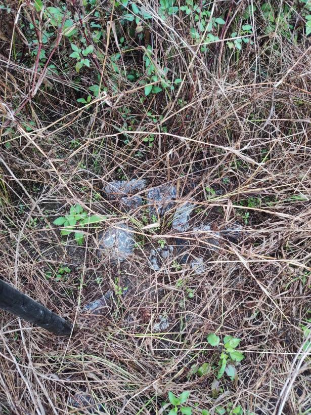

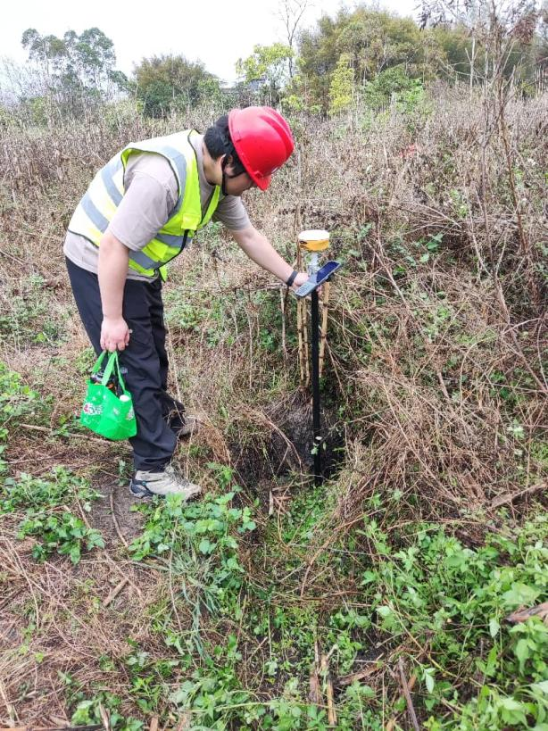

榃甘塌陷照片1

榃甘塌陷照片2

据调查访问，在采矿时附近地下水位、水量变化不大。在采矿期间，附近居民区暂未出现地面塌陷、地表变形等不良地质现象。

### 地下水开发利用现状

勘察区根据《广东省地下水功能区划》该勘察区按地下水一级功能区划分属于开发区，按二级功能区划分属于分散式开发利用区。目前，勘察区地下水主要用水为分散式生产、生活用水，区内无日常性的大口径地下水开采，调查内地下水资源的开采保护良好，未进行规模化的地下水开采活动。地下水水质、水量与水位变化性相对较小。矿区及周边仅存在一些当地村民自挖的小水井，民井抽汲地下水的水量有限，对区内水文地质环境基本无影响。

### 地下水水质分析及污染源调查

于2026年2月20日至3月10日期间现场共采取了20组水样，包括11组矿区钻孔水样，5组井泉点地下水水样，4组河流溪沟地表水水样。

勘察区及其附近没有发现大型排污企业，没有排污污染源。地下水水质状况由长江大学实验室进行了水样化学分析。

### 未来矿山开采过程中可能引起的环境地质问题预测评价

#### 矿山建设和开采引发地面地质灾害的预测评价

矿山开采，进行疏干排水，强烈的地下水运动，形成降落漏斗，增加了岩溶塌陷的可能性；大量抽排地下水，水动力条件的急剧变化，使岩土体应力平衡发生变化，从而诱发岩溶地面塌陷、地面变形、矿坑突水（突泥）、弃土区边坡失稳等地面地质灾害问题。主要威胁采矿人员和机械设备，并对周边区内村寨、人畜及财产造成危害。对矿山地面设施等构成威胁。综上所述，矿山的开采活动对矿区地下水环境的影响小。

#### 矿山开采对水环境质量影响评价

根据现阶段对该含水层中地下水及附近民井采样的检测结果，地下水水质良好。石灰岩矿一般不会产生有毒、有害气体。矿山地下开采过程中炸药的使用、人工生活污水对地下水水质有影响。但因该矿区的生产规模小、服务年限少，因此其对地下水环境的影响小。

#### 矿山开采对水源的影响

未来矿山排水量较大，矿坑疏干排水必然导致勘察区地下水位大幅度下降，形成以开采区为中心的勘察区地下水降落漏斗，造成降落漏斗范围内的井水不同程度地减少、地表水漏失。危及排水影响范围内的人畜饮水、农田灌溉。

### 矿区地质环境类型

大旺塘矿区所在盆地新构造活动不强烈，地震基本烈度小于Ⅵ度，地壳较稳定。盆地内土地利用类型以农用地为主，村落集镇散布，生态环境质量总体良好。采矿活动，特别是爆破，对矿界外民用建筑有一定影响，已采取相关预防措施，影响总体可控，对南部旅游景区影响有限。四周采矿边坡，岩体总体较为稳定，因其坡度和高度较大，需加强边坡治理防护等工作。矿区疏干降水可能引发局部地面塌陷，但塌陷范围及程度有限，矿坑排水对附近水体无污染，矿石和废石化学成分基本稳定。区内无重大的污染源，无热害，地表水、地下水水质较好。依据规范的判定标准，矿区地质环境类型为：第二类，地质环境质量中等。

# 矿区防治水建议

## 矿山防治水原则

综合大旺塘矿区未来开采条件下的充水条件及矿区不同地段的涌水量特征，建议矿区后期防治水应遵循如下原则：

### 以查明矿坑充水条件为基础，加强采掘过程中水文地质条件研究

矿区防治水的工作必须以查明矿区充水条件为基础。本次工作基本查明了矿区未来开采条件下的充水条件，为矿山防治水设计提供了依据。但由于本矿水文地质条件复杂，充水途径复杂多变，随着今后开采的揭露以及开采水平的不断深入，充水条件会发生一定变化，一些水文地质勘探过程中的疑点将逐渐暴露，因此，需持续开展矿区水文地质工作，深化对矿区边界条件、断裂构造、岩溶发育等充水条件的认识，并及时调整相应的防治水措施。

### 遵循先简单、后复杂，层层设防的原则

本矿为岩溶直接充水的大水矿山，区内岩溶、构造发育，水文地质条件复杂、地下水丰富，若不对地下水进行有效防治，将来开采过程中不仅会发生突水、突泥事故，且将会引起地面岩溶塌陷等环境地质问题。因此，防治水工作应该从地面入手，“先治水后采矿”，做到“疏、堵、截、排、防”相结合，尽可能减少进入矿坑的水量，减轻矿山排水压力，降低矿山开采成本和保护水资源。

### 精心组织合理规划，最大限度节约投资的原则

矿区不同区域的充水条件不尽相同，开采过程中应充分考虑不同区域的充水条件，进行分区开采，优先开采西南段富水性中等的地段。

大旺塘矿区已开采多年，今后设计的防治水措施，应尽可能考虑利用现有工程及采矿设计的开拓工程及设施，充分考虑矿区所在的自然地理环境和水文地质条件，精心规划和优化设计，最大限度地节约投资。确保设计的防治水方案技术先进、安全可靠、建设周期短、投资省、见效快。

## 矿山防治水措施

大旺塘矿区属岩溶水直接充水的大水矿床，矿区断裂构造及岩溶发育，水文地质条件复杂，矿坑涌水量大，预测最终开采至\+5m水平段稳定涌水量为96471\.25m3/d，最大涌水量为485218\.22m3/d，矿区位于区域地下水系统的补给区，岩溶发育强烈，石炭系下统刘家塘组（C1*lj*）碳酸盐岩含水层富水性强，矿区南部小溪与碳酸盐岩含水层直接接触，开采条件下将成为矿坑的充水水源。从矿山安全生产、经济合理的角度出发，矿区后期开采前需施工合理的防治水工程，对落水洞等地下水地表集中补给通道进行封堵，对地表水系进行防渗，对汇入矿坑的地表径流汇入进行截流；对汇入矿坑的地下水侧向径流补给进行堵截，对落水洞等地表集中补给通道封堵，对矿体附近的岩溶水进行超前疏干，对施工过程中可能有突泥突水危险区域进行超前探放水，建立完善的排水系统。具体措施如下：

### 地表堵水措施

矿区位于断裂构造及岩溶发育的碳酸盐岩岩层地段，在矿区开采至\+35m、\+20m和\+5m水平段时，矿区露采坑会形成负地形导致周边地表水向矿区内汇入，因此需对矿区内部及周边已查明的落水洞等集中补给通道进行封堵，减少大气降水和地表水进入矿区的水量。

### 帷幕截水措施

根据本次勘察结论，建议在矿区四周开展帷幕灌浆工程，封堵矿区四周已查明的岩溶集中发育带和导水断层裂隙带等及集中径流通道，拦截矿区四周的地下水，减少进入矿区的地下水涌水量。鉴于矿区石炭系下统刘家塘组（C1*lj*）碳酸盐岩含水层厚度大，但是透水性随深度增加有明显减弱趋势，建议采用悬挂式帷幕，拦截通过上部主要岩溶发育段进入矿坑的地下水，要求堵水率小于80%。

### 采坑截渗系统

矿区为露天开采矿区，大气降水及地表径流直接汇入矿坑，短时间内加大了矿区的排水压力，因此可在矿区内部布设截洪沟，使露天矿坑形成良好的截排水系统，减少降水及地表汇水入坑量。

### 预先疏干系统

矿区目前的开采水平为\+50m，在矿区开采至\+35m、\+20m和\+5m水平段时，由于开采矿体储水量较大，露天开采仍面临一定水压，因此需开采前应超前疏干降水至开采水平以下。

### 超前探水工程

矿区构造及岩溶裂隙发育强烈，局部富水性极强，部分溶洞泥沙充填严重，建议后期施工过程中坚持“有疑必探”的原则，在靠近岩溶强烈发育及构造导水带附近进行超前探，可降低突水突泥对采矿的影响。

### 地下水长期监测工程

矿区地下水监测对矿区后期水文地质条件的持续深入认识、保证矿区安全，检验后期防治水工程的有效性等具有重要意义，建议后期将所有水文试验孔成井后留作长观孔，利用自动监测设备进行水位监测。

# 矿区水资源综合利用及供水建议

## 水资源综合利用

### 生态用水

大旺塘矿区的矿坑水可作为生态用水，用于改善矿区及周边的生态环境。根据《地表水环境质量标准》（GB 3838\-2002）对于生态用水的Ⅲ类水质要求，为保证水体的生态功能并防止水体富营养化，需对水中的营养物质及重金属含量进行严格控制。根据矿区水样实际检测数据，具体评价结果如表9\.1\-1和表9\.1\-2所示。

表9\.1\-1 GB 3838\-2002生态环境水质评价表（常规项目）

取样点位置

pH值 \(无量纲\)

硝酸盐\(以N计\)（mg/L）

总磷（mg/L）

硫酸盐（mg/L）

氯化物（mg/L）

氟化物（mg/L）

标准值\(Ⅲ类\)

6~9

10

0\.2

250

250

1

矿坑排水

6\.86

4\.29

0\.021

7\.03

11\.5

0\.131

超标倍数

0

0

0

0

0

0

__表9\.1\-2 GB 3838\-2002生态环境水质评价表（微量元素）__

取样点位置

砷（mg/L）

镉（mg/L）

铅（mg/L）

铜（mg/L）

锌（mg/L）

铁（mg/L）

锰（mg/L）

标准值\(Ⅲ类\)

0\.05

0\.005

0\.05

1

1

0\.3

0\.1

矿坑排水

0\.000568

未检出

未检出

未检出

未检出

未检出

未检出

超标倍数

0

0

0

0

0

0

0

根据表9\.1\-1和表9\.1\-2可知，大旺塘矿区矿坑排水水质较好，pH值为6\.86。按照GB 3838\-2002 Ⅲ类水质标准评价，总磷含量仅为0\.021 mg/L，远低于0\.2 mg/L的限值；硫酸盐浓度仅为7\.03 mg/L，同样远低于250 mg/L的标准；各项重金属离子（镉、铅、铜、锌、铁、锰等）均未检出，微量元素砷也远低于标准限值。

处理与利用建议：与部分存在重金属或营养物质超标的矿山不同，本矿区的矿坑水无需采用复杂的化学沉淀法、离子交换法或反渗透法进行深度处理。针对该矿坑水，仅需通过地表常规的沉淀池进行物理沉淀，去除开采过程中混入的悬浮物（SS）后，即可直接回用于矿区的生态用水（如矿区复绿灌溉、道路防尘洒水、周边植被恢复等），从而促进生态系统的恢复和改善。

### 矿坑水排放

#### 水质评价

大旺塘矿区未来开采面积大且属大水矿山，涌水量随开采深度增加呈增长趋势。矿坑水在充分满足工业及生态回用后，必然存在大量余水需要外排。在排放前需确保水质符合广东省及国家相关水污染物排放标准。基于现有水质检测数据，评价结果如表9\.1\-3所示。

表9\.1\-3  矿区矿坑水排放水质评价表

取样点位置

氟化物（mg/L）

硫酸盐（mg/L）

总磷（mg/L）

硝酸盐\(以N计\)

（mg/L）

常规排放

限值参考

10

250

0\.5

15

矿坑排水

0\.131

7\.03

0\.021

4\.29

超标倍数

0

0

0

0

由表9\.1\-3可知，矿坑水中的硫酸盐、总磷、氟化物以及硝酸盐等可能对受纳水体造成影响的污染因子，均处于极低水平，远低于常规的工业/矿山废水排放限值。

#### 排放途径与污染防控

（1）排放路径规划

区域地下水天然排泄基准面为渔涝河。由于矿区西南侧发育有一条溪沟，矿区现抽排水出水口已布设于该溪沟中段。建议矿坑水经地面集水坑及沉淀系统处理后，继续沿该溪沟向西南径流，与矿区西部自然小河流汇合，最终向南安全汇入渔涝河。

（2）防洪与排放管控

根据预测，极端天气下的矿坑涌水量极大（例如，开采至\+5m平台遭遇50年一遇暴雨时，最大涌水量可达39\.3万m3/d至48\.5万m3/d）。必须在矿区外围建立充足容量的截排水沟与缓冲沉淀池，防范暴雨期大量的泥沙和悬浮物随雨水直排入溪沟，避免对渔涝河的水体浊度及水生生态造成冲击。

（3）合规与监测

严格遵守相关法律法规办理排污许可。建立长期水质监测体系，重点监测雨季期间排污口的悬浮物（SS）和pH值变化，发现异常应及时采取絮凝沉淀等干预措施，以平衡排水防涝需求与受纳水体的环境安全。

## 供水建议

综合本矿区的水文地质特征及上述水质评价结果，对大旺塘矿区的供水提出以下规划建议：

### 生产供水

大旺塘矿区地处亚热带季风湿润气候区，雨量充沛。矿床位于石炭系下统刘家塘组（C1*lj*）岩溶裂隙含水层中，富水性强。根据涌水量预测结果，即便是正常开采至\+35m平台，平均总涌水量也高达3\.98万至6\.97万m3/d，水量较丰富。加之水质优良（无高腐蚀性硫酸盐，重金属极低），矿山开采过程中的凿岩用水、空压机冷却水、破碎站除尘、洗车台用水及选矿补充水，建议在地面建设配套的沉淀池和高位蓄水池，将坑内抽排出的涌水经简单物理沉淀后，优先将矿坑水回用于矿区生产。在常规运行下，这足以满足矿山凿岩、空压机冷却、破碎站除尘、洗车台以及选矿等绝大部分的生产用水需求，可显著降低对外部工业新水的依赖，从而有效节约整体运营成本并实现水资源的高效配置。

### 生活供水

尽管矿坑水常规化学指标表现极佳，但由于矿区原始地形为典型岩溶地貌，地表水与地下水联系密切，矿坑水极易受地表人类活动或动植物腐败产生的细菌群落污染（本次水样未检测大肠杆菌等微生物学指标）。因此，建议矿区员工的生活饮用水：

#### 首选方案

接入当地市政自来水管网，确保饮水卫生与安全。

#### 备选方案

若必须使用矿坑水，则需避开矿区疏干漏斗中心，在周边岩性为微透水、水质受表层污染影响小的隔水层边缘（如东部加里东期黑云母花岗岩区或西部寒武系粉砂岩区）施工专用的生活深水井，并在地面配备标准化的一体化净水消毒设备（如过滤\+二氧化氯/紫外线杀菌），水质经卫生部门检验合格后方可作为生活饮用水供给。

# 结论与建议

本次地下水治理专项水文地质勘察工作，通过系统的地面调查、钻探物探、水文地质试验、水文地球化学等多技术手段的综合集成，详细查明了矿区\+50m至\+5m标高范围内的水文地质条件，为矿区防治水工作提供了科学依据。工作内容及工作精度满足相关导则规范要求，工作程度符合勘探阶段要求，取得以下主要认识。

## 勘查类型

### 水文地质勘查类型

大旺塘矿区内分布石炭系刘家塘组（C1*lj*）碳酸盐岩裂隙溶洞水，该含水层厚度大，中间无隔水层，溶蚀裂隙发育，具有垂向分带的小型溶洞，与矿体直接接触，岩溶水可直接进入凹陷开采区。矿区地形不利于自然排水，主要矿体位于侵蚀基准面以下，东侧南侧溪沟不构成主要充水因素。该含水层除出露区外，均隐伏于盆地第四系下，补给条件一般，矿区区域水文地质条件边界较为清晰简单，无区域导水构造直穿矿区，存在次级小型断裂及局部强径流带，无老空水分布，疏干排水可能产生少量局部塌陷。

本次专项勘察与以往不同的是，聚焦凹陷开采区的地下水治理问题，布设钻孔数量多、分布密、单孔进尺深、水文地质试验详细。在划定的强径流带上，部分钻孔单位涌水量处于1\.0\-5\.0L/（s·m），个别大于5\.0L/（s·m），富水性属于强。本着就高不就低原则，将未来凹陷开采区的水文地质条件定为复杂。

依据规范的判定标准，矿区水文地质勘查类型为：以溶洞为主、直接充水、水文地质条件复杂的岩溶充水矿床。

### 工程地质勘查类型

大旺塘矿区位于河儿口盆地北端，原始地形为孤立的峰丛地貌，四周多为悬崖峭壁，现已开采形成\+50m平台，未来凹陷开采区最低标高\+5m。矿区出露及开采地层为石炭系刘家塘组（C1*lj*）灰岩，坚硬程度属于坚硬～较坚硬岩，岩体的完整程度属于完整～较完整，抗剪强度高、致密、为稳定性强的工程地质体。矿区内无区域性构造直接通过，存在北西向为主的小型次生断裂，钻探结果显示局部地段岩溶裂隙较发育，垂向分层较为明显，地表可见小型岩溶塌陷。依据规范的判定标准，矿区工程地质勘查类型为：第五类特殊岩类（碳酸盐岩），复杂程度为中等型。

### 地质环境类型

大旺塘矿区所在盆地新构造活动不强烈，地震基本烈度小于Ⅵ度，地壳较稳定。盆地内土地利用类型以农用地为主，村落集镇散布，生态环境质量总体良好。采矿活动，特别是爆破，对矿界外民用建筑有一定影响，已采取相关预防措施，影响总体可控，对南部旅游景区影响有限。四周采矿边坡，岩体总体较为稳定，因其坡度和高度较大，需加强边坡治理防护等工作。矿区疏干降水可能引发局部地面塌陷，但塌陷范围及程度有限，矿坑排水对附近水体无污染，矿石和废石化学成分基本稳定。区内无重大的污染源，无热害，地表水、地下水水质较好。依据规范的判定标准，矿区地质环境类型为：第二类，地质环境质量中等。

## 主要成果

### 查明了矿区岩溶水文地质条件

通过野外地质测绘、物探、钻探、水文地质试验、水化学等手段，详细查明了矿区水文地质条件。其中矿区发育有两种地下水类型，分别是第四系松散岩类孔隙水、石炭系下统刘家塘组碳酸盐岩裂隙溶洞水，其中裂隙溶洞含水层为主要含水层，厚度超过260m，平均单位涌水量为1\.95L/\(s·m\)，属裸露型强富水性岩溶水含水层；矿区内松散岩类含水层基本被剥离，零星分布，大部分位于矿区外围，单位涌水量小于0\.1 L/\(s·m\)，整体富水性较弱。

矿区所在水文地质单元范围北部以地表分水岭为零通量边界，南部以渔涝河为给定水头边界，东部以加里东期侵入岩、西部以寒武系粉砂岩为相对隔水层。矿区位于地下水系统补给、径流区，主要接受大气降雨与地下水侧向补给，矿山开采前地下水自北往南流动，开采现状下，矿区地下水在矿区\+50m集水坑出露地表，通过抽水泵往矿区南侧地表小溪沟排泄，地下水流场在局部形成一降落漏斗，矿区地下水除接受大气降雨补给外，主要接受四周地下水侧向补给。

### 揭示了矿区地层岩溶发育特征

通过物探、钻探等手段系统查明了矿区内岩溶形态类型、发育程度、空间分布规律及控制因素。矿区内岩溶形态以溶洞为主，辅以溶蚀裂隙和溶孔。钻孔见洞率为45\.45%，线岩溶率为2\.99%，岩溶发育程度强。受原大旺塘及构造影响，岩溶强发育区主要集中于矿区的西北部区域\+50~\+10m高程区间，矿区东北侧边界\+70~\+50m高程段岩溶较为发育，矿区东侧边界\+50~\-10m高程段内岩溶中等发育；整体来看，岩溶发育主要集中在\+70~\+10m段，其变化趋势呈明显的单峰状：在高程\+50~\+30m段岩溶发育强，在\+70~\+50m段、\+30~\+10m段发育中等；进入\+10~\-10m段后，岩溶发育程度开始减弱，最后在\-10~\-30m段钻孔岩溶率在垂向上整体最低。岩溶发育控制因素除受地层岩性、地形地貌影响外，主要受北西向小构造影响。

### 圈定了矿区边界处岩溶水强径流带

在前人资料以及本次实物工作量基础上进行总结分析，推测矿区内共存在4条强径流带，分别是JL1、JL2、JL3、JL4。其中JL1强径流带位于矿区南侧边界拐点3~4段附近，宽约185m，呈北西向53°展布，抽水试验成果显示渗透系数为3\.26m/d，富水性强；JL2强径流带位于矿区东南侧边界拐点2~3段附近，宽约480m，呈北西向41°展布，抽水试验成果显示渗透系数为1\.75m/d，富水性强；JL3强径流带位于矿区东侧边界拐点18~2段，宽约360m，呈北东向63°展布，抽水试验成果显示渗透系数介于2\.68m/d~8\.97m/d之间，富水性强；JL4强径流带位于矿区北部边界拐点16~17段，宽约230m，呈北西向38°展布，抽水试验成果显示渗透系数为4\.42m/d，富水性强。

### 预测了矿区不同开采水平的涌水量

利用比拟法和解析法预测了矿段三个预期开采水平的平均涌水量与最大涌水量。结果显示开采至\+35m平台时，平均涌水量为69787\.59m3/d，在10a一遇的暴雨情形下的最大涌水量为375306\.95 m3/d，在20a一遇的暴雨情形下的最大涌水量为387437\.68 m3/d，在50a一遇的暴雨情形下的最大涌水量为402601\.08m3/d；开采至\+20m平台的平均涌水量为85040\.11m3/d，在10a一遇暴雨情形下的最大涌水量为424672\.08 m3/d，在20a一遇的暴雨情形下的最大涌水量为435883\.93 m3/d，在50a一遇的暴雨情形下的最大涌水量为449898\.76 m3/d；开采至\+5m开采平台的平均涌水量为96471\.25m3/d，在10a一遇暴雨情形下的最大涌水量为461573\.42m3/d，在20a一遇的暴雨情形下的最大涌水量为472082\.22m3/d，在50a一遇的暴雨情形下的最大涌水量为485218\.22m3/d。预测结果表明，随着矿区开采深度增加，涌水量总体呈上升趋势；且暴雨条件下的最大涌水量远高于正常涌水量，这是矿区防治水工作需重点关注的关键控制工况。

### 提出了矿区凹陷开采阶段防治水措施

从矿山安全生产及经济合理角度出发，矿区后期开采前需配套实施完善的防治水工程，具体包括：对落水洞等地表集中补给通道封堵；在矿区四周布设悬挂式帷幕灌浆工程，拦截上部主要岩溶发育段地下水；布设采坑截洪沟形成截排水系统，减少降水及地表汇水入坑；开采至\+35m、\+20m和\+5m水平段前，超前疏干降水至开采水平以下；施工中坚持“有疑必探”，对岩溶强烈发育及构造导水带附近进行超前探水；采用自动监测设备开展地下水长期水位监测；通过上述措施保障矿山开采安全有序推进。

## 存在问题

### 勘察工作中存在的主要问题

本次勘察工作工期紧、实物工作量大，在完成既定任务的同时，存在以下主要问题：

（1）地下水动态观测仅局限在勘察期间，未开展完整水文年的系统观测。后续应建立矿区地下水观测网，开展持续监测，必要时利用自动化和信息化手段，积累长序列动态数据，并兼顾提供风险预警功能。

（2）示踪试验缺少有利条件，在勘察期间未接收到示踪剂信号。勘察期间天气总体良好，降雨偏少，\+50m平台以下岩溶地下水等水位面较为统一，水动力条件有限。后续地下水治理和开采过程中，可根据需要，开展长时间的示踪试验工作。

（3）本区经历了复杂的构造运动，古地理环境变迁频繁。岩溶发育呈现期次性和非均质性，在地下水治理和开采期间应按规范开展相关技术工作，注重资料成果的对比印证分析，并对重点问题和重点区域及时加强水文地质工作。

### 开采过程中可能出现的问题

未来开采过程中\+65m至\+5m段属于凹陷型开采，需对含水层进行疏干降水，其矿床开采技术条件与之前山坡露天开采存在差异，特别是在矿区地下水防治工作领域。开采过程中可能出现的主要问题有：

（1）矿区所在区域大气降水丰富且较为集中，矿区四周具备汇水条件，开采过程中如遇强降雨天气，短期补给过大，易发生积水、突水情况，在矿山设计阶段应充分考虑疏排水系统的冗余和四周汇水的导排截流等问题。在开采生产阶段应充分重视矿区防治水工作，成立专班负责，落实好各项日常管理和应急处置工作。

（2）疏干降水是一项反复渐近工作，水位的升降波动对岩土体的稳定性将产生影响。易出现岩溶地面塌陷，岩体变形开裂等地质环境问题。应注重加强矿区及周边地区塌陷和变形等问题的研究、监测、治理和应急工作。

（3）矿区开采过程中，随着开采深度增加，局部水文地质条件可能发生变化；同时，随着勘查与研究工作的持续推进，对矿区水文地质条件的认识也将不断深化，未来的防治水方案可根据开采过程中实时揭露的地质条件、地下水动态监测数据进行相应调整。

## 下步建议

（1）建议充分重视矿区水文地质工作的长期性和实时性，组建专业团队，建立地下水观测系统和小型气象站，制定并落实开采过程中的水文地质工作细则，记录保存相关数据资料，编制工作总结及工作规划报告，并随开采的加深，及时细化、完善、修正矿区水文地质条件和涌水量预测模型。适时根据需要开展相关专题科学研究，为矿区防治水工作提供科学支撑。

（2）建议充分重视水害防治领域安全应急预案的相关工作，落实物资设备等各项保障措施，加强安全应急的宣传培训、预案演练，不断提高综合处置能力，为矿区安全生产工作提供有力支撑。

